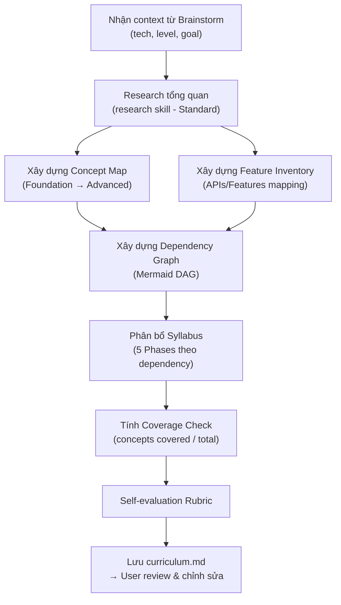
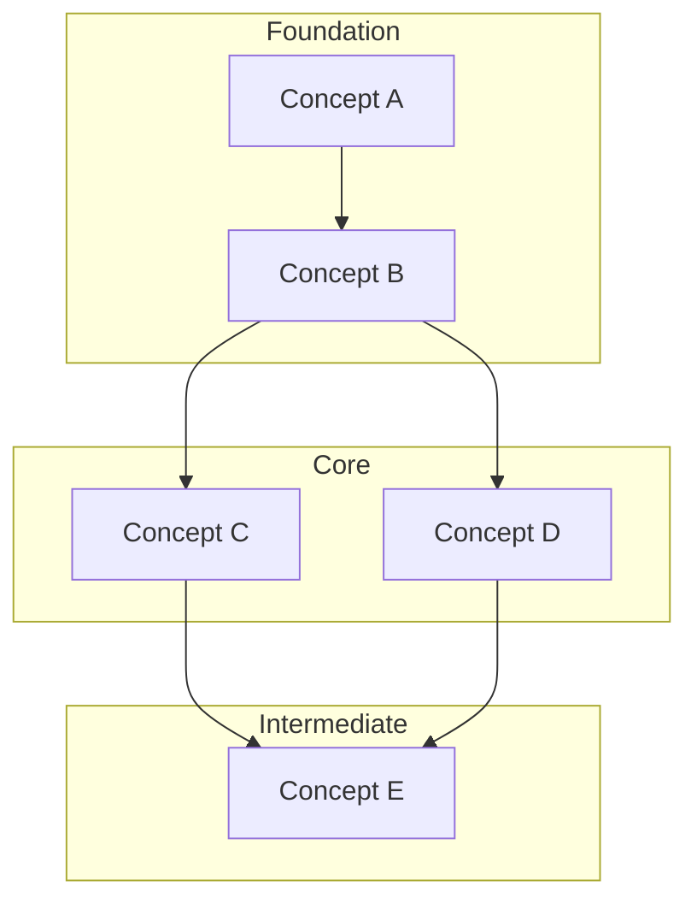

# Create Curriculum Skill

Skill xây dựng bản đồ học tập (Curriculum) và lộ trình (Syllabus) cho một công nghệ, dựa trên research từ nhiều nguồn. Output là file markdown để user review và chỉnh sửa trước khi chuyển sang bước thiết kế project.

## Quy trình



---

## Bước 1a: Local Docs Ingestion (Ưu tiên tuyệt đối)

**Mục tiêu:** Quét sạch 100% Core Concepts và Features từ Local Docs nếu user cung cấp.

- Nếu user cung cấp đường dẫn đến thư mục Local Docs (ví dụ: `sources/documentations/react.dev`), **BẮT BUỘC** thực hiện quét cạn thư mục này.
- Sử dụng các tool `list_dir`, `grep_search`, và `view_file` để tìm kiếm và đọc các file markdown trong thư mục `learn/`, `reference/`, hoặc `api/`.
- Phải vét cạn toàn bộ cấu trúc thư mục để đảm bảo **không sót bất kỳ feature/hook/API nào**. Local Docs là **Source of Truth tuyệt đối**.

## Bước 1b: External Research (Bổ trợ)

Sử dụng `research` skill (đọc `.agent/skills/research/SKILL.md`) ở mức **Standard (5-7 nguồn)** **CHỈ KHI**:
1. User không cung cấp Local Docs.
2. Cần tìm kiếm các "Real-world pitfalls", "Advanced Patterns", hoặc Community Roadmap mà Official Docs không nhắc tới. KHÔNG dùng web research để tìm Core Concepts nếu đã có Local Docs.

**Ưu tiên nguồn khi External Research:**

| Priority | Source Type | Ví dụ |
|----------|-----------|-------|
| 1 | Official Docs (Online) | react.dev, docs.docker.com |
| 2 | Roadmap cộng đồng | roadmap.sh |
| 3 | Bài viết chuyên sâu | Blog kỹ thuật, conference talks |

**Quy tắc:**
- Ghi lại URL cụ thể của mỗi section trong docs hoặc nguồn online đã reference.
- Mọi concept phải trace về nguồn research.

---

## Bước 1b: Xác định Prerequisites & Learner Profile

Trước khi build Concept Map, ghi rõ vào output:

**Entry Requirements (bắt buộc):**
- **Must know:** Liệt kê cụ thể languages/concepts phải biết trước (VD: "JS ES6+: closures, Promises, async/await, destructuring")
- **Minimum exposure:** Mức tối thiểu đã tiếp xúc với tech này (VD: "Đã build ≥1 app với [feature cơ bản] mà không cần lookup liên tục")
- **Tooling:** Runtime version, package manager, IDE cần thiết

**Learner Profile** — chọn 1:
- `Beginner` — Chưa dùng tech này bao giờ
- `Career-switcher` — Có background tech khác, đang chuyển stack
- `Experienced-shifting` — Đã dùng tech này, muốn master internals/advanced

> Lưu ý: **Cùng tech, khác profile = khác tier assignment trong Concept Map.** VD: React beginner → useState là Foundation. React experienced → useState là prerequisite, không cần đưa vào curriculum.

---

## Bước 2: Xây dựng Concept Map

Phân loại TOÀN BỘ concepts vào 4 tier:

| Tier | Đặc điểm | Bloom's Level |
|------|----------|---------------|
| **Foundation** | Hiểu mới dùng được tech. Không biết = không làm gì được | Remember, Understand |
| **Core** | Tính năng chính. Dự án thực tế nào cũng cần | Apply |
| **Intermediate** | Xử lý phức tạp. Cần khi project scale lên | Apply, Analyze |
| **Advanced** | Optimization, edge cases, patterns nâng cao | Evaluate, Create |

**Quy tắc phân tier:**
- Concept là prerequisite của nhiều concept khác → tier thấp hơn
- Concept chỉ dùng trong tình huống đặc biệt → tier cao hơn
- Khi không chắc chắn: đặt ở tier thấp hơn (an toàn hơn cho người học)

**Format output:** Theo bảng trong template `references/curriculum-template.md`

---

## Bước 3: Xây dựng Feature Inventory

Liệt kê TOÀN BỘ APIs/Features/Methods chính của tech:

- Mỗi feature PHẢI map được về ít nhất 1 concept trong Concept Map
- Ghi rõ: tên feature, thuộc concept nào, section nào trong docs, mức quan trọng (Must-know / Nice-to-know)

**Mức quan trọng:**
- **Must-know**: Dự án thực tế nào cũng dùng
- **Nice-to-know**: Hữu ích nhưng có thể thay thế hoặc bỏ qua ban đầu

---

## Bước 4: Xây dựng Dependency Graph

Tạo Mermaid flowchart thể hiện:
- Concept nào là prerequisite của concept nào
- Không được có circular dependency (DAG hợp lệ)
- Group theo tier để dễ đọc



**Quy tắc:**
- Mỗi concept xuất hiện đúng 1 lần trong graph
- Arrows chỉ đi từ tier thấp → tier cao (hoặc cùng tier)
- Nếu 2 concepts cùng tier phụ thuộc nhau → xem xét gộp hoặc tách lại tier

---

## Bước 5: Phân bổ Syllabus (5 Phases)

Dựa trên Dependency Graph, phân bổ concepts vào 5 Phases:

| Phase | Nội dung | Tier nguồn |
|-------|---------|------------|
| **Phase 0: Foundation** | Setup môi trường + Mental Model + Hello World có chú thích | Foundation |
| **Phase 1: Core Basics** | Tính năng cốt lõi đầu tiên | Core (phần 1) |
| **Phase 2: Core Advanced** | Mở rộng + xử lý phức tạp hơn | Core (phần 2) + Intermediate (phần 1) |
| **Phase 3: Integration** | Kết hợp nhiều concepts, real-world patterns | Intermediate (phần 2) |
| **Phase 4: Polish & Advanced** | Optimization, patterns nâng cao, edge cases | Advanced |

**Quy tắc phân bổ:**
- Mỗi concept chỉ thuộc đúng 1 Phase — không trùng lặp
- Phase sau KHÔNG dùng concept chưa được giới thiệu ở Phase trước hoặc cùng Phase
- Mỗi Phase có **Learning Objectives** dùng Bloom's verbs: *hiểu, giải thích, tự tay làm, phân biệt, thiết kế, đánh giá*
- Tối đa 5 Learning Objectives mỗi Phase
- **Mỗi Phase KHÔNG quá 6 concepts.** Nếu vượt → tách thành 2 phases với tên rõ ràng (VD: "Phase 1a" và "Phase 1b")
- **Mỗi Phase CÓ đúng 1 Hands-on Deliverable** — mô tả cụ thể artifact người học tạo ra:
  - Format: `Build a [artifact] that [does Y] using [specific features from this phase]`
  - Deliverable phải verify được — không được mơ hồ như "practice the concepts"
  - Ví dụ tốt: `Build a useFormState custom hook that validates email/password and persists to localStorage`
  - Ví dụ xấu: `Practice custom hooks`

---

## Bước 6: Coverage Check

Tính toán và ghi vào output:

```
Total concepts trong official docs: X
Total concepts trong curriculum: Y
Coverage: Y/X = Z%
```

- **Target: ≥90% coverage**
- Nếu < 90%: quay lại Bước 2, bổ sung concepts bị thiếu
- Concepts bị bỏ qua (nếu có) phải ghi rõ lý do

---

## Bước 7: Lưu output

Lưu curriculum theo template `references/curriculum-template.md`.

**Quy tắc lưu file:**
- Lưu vào thư mục làm việc hiện tại hoặc thư mục user chỉ định
- Tên file: `curriculum-[tech-name].md` (VD: `curriculum-react.md`)
- Thông báo user: "Curriculum đã được lưu tại [path]. Vui lòng review và chỉnh sửa nếu cần. Khi nào OK, chúng ta sẽ tiếp tục bước thiết kế project."

---

## Quy tắc bắt buộc

1. TOÀN BỘ concepts trong official docs phải xuất hiện trong Concept Map (target ≥90%)
2. Mỗi concept được gán vào đúng 1 Phase — không trùng lặp
3. Dependency Graph phải là DAG hợp lệ — không circular
4. Feature Inventory phải map ngược được về Concept Map
5. Learning Objectives dùng động từ hành động (Bloom's Taxonomy)
6. Ghi rõ URL/section cụ thể trong docs cho mỗi concept
7. KHÔNG tự bịa concepts — mọi concept phải trace về nguồn research

---

## Self-Evaluation Rubric

Trước khi xuất output, tự đối chiếu:

| Tiêu chí | Điểm tối đa |
|---|---|
| Concept Map cover ≥90% official docs concepts | 20 |
| Feature Inventory đầy đủ, map đúng concept | 15 |
| Dependency Graph logic hợp lệ (DAG, không circular) | 15 |
| Prerequisites & entry bar cụ thể, đo lường được | 15 |
| Syllabus: Mỗi Phase ≤6 concepts, có Hands-on Deliverable | 15 |
| Learning Objectives dùng đúng Bloom's verbs (action verbs, đo lường được) | 10 |
| Sources có URL cụ thể và credibility tier | 10 |
| **TỔNG** | **100** |

> Nếu tổng điểm < 80 → Chỉnh sửa trước khi lưu output.
