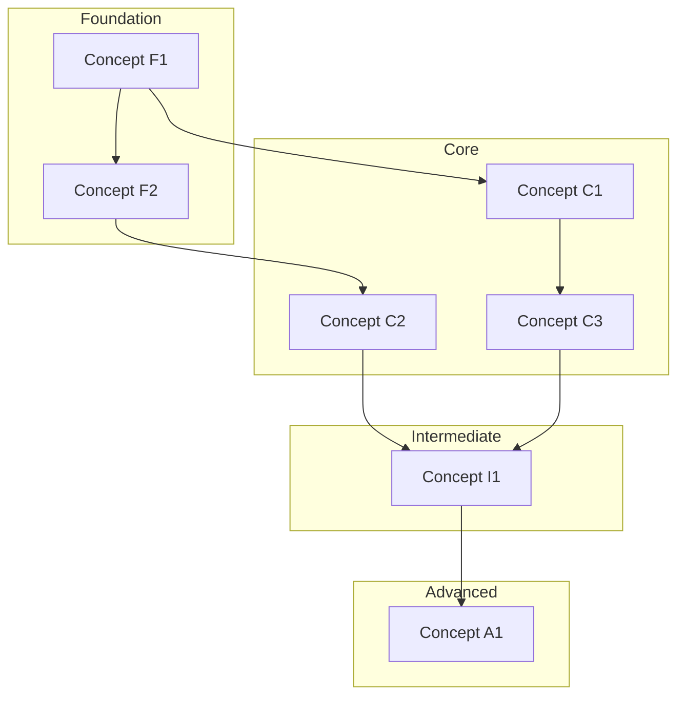

# Curriculum: [Tech Name]

## Metadata

| Field | Value |
|-------|-------|
| **Tech** | [Technology name] |
| **Level** | [Complete beginner / Has related foundation / Switching from similar tech] |
| **Goal** | [Learner's goal] |
| **Domain** | [Application domain, if specified] |
| **Created** | [YYYY-MM-DD] |

## Prerequisites & Learner Profile

**Entry Requirements:**
- **Must know:** [JS closures, Promises, async/await, etc.]
- **Minimum exposure:** [Built ≥1 app using tech basics without help]
- **Tooling:** [Node.js ≥20, npm/yarn, VS Code recommended]

**Learner Profile:** [Beginner / Career-switcher / Experienced shifting stacks]

### Research Sources

| # | Source | URL | Type | Credibility Tier |
|---|--------|-----|------|-----------------|
| 1 | [Source name] | [URL] | Official Docs | Tier 1 |
| 2 | [Source name] | [URL] | Community | Tier 2 |

---

## 1. Concept Map

### Foundation

| # | Concept | Docs Keyword | One-line Description | Prerequisite | Docs Section/URL |
|---|---------|-------------|---------------------|-------------|-----------------|
| F1 | [Concept] | [keyword to search in docs] | [Brief explanation] | None | [Specific section] |

### Core

| # | Concept | Docs Keyword | One-line Description | Prerequisite | Docs Section/URL |
|---|---------|-------------|---------------------|-------------|-----------------|
| C1 | [Concept] | [keyword] | [Brief explanation] | F1, F2 | [Section] |

### Intermediate

| # | Concept | Docs Keyword | One-line Description | Prerequisite | Docs Section/URL |
|---|---------|-------------|---------------------|-------------|-----------------|
| I1 | [Concept] | [keyword] | [Brief explanation] | C1, C3 | [Section] |

### Advanced

| # | Concept | Docs Keyword | One-line Description | Prerequisite | Docs Section/URL |
|---|---------|-------------|---------------------|-------------|-----------------|
| A1 | [Concept] | [keyword] | [Brief explanation] | I1, I2 | [Section] |

---

## 2. Feature Inventory

| # | Feature/API | Belongs to Concept | Docs Section | Importance |
|---|------------|-------------------|-------------|-----------|
| 1 | [feature/API/method name] | [Concept ID: F1, C2...] | [Section in docs] | Must-know |
| 2 | [feature name] | [Concept ID] | [Section] | Nice-to-know |

---

## 3. Dependency Graph

---

## 4. Syllabus

### Phase 0: Foundation

- **Concept count:** [N] / 6 max
- **Concepts:** [F1, F2, ...]
- **Features:** [feature list from Feature Inventory]
- **Learning Objectives:**
  - [Bloom verb] [specific measurable outcome]
- **Hands-on Deliverable:**
  Build a [artifact] that [demonstrates specific concepts from this phase]

---

### Phase 1: Core Basics

- **Concept count:** [N] / 6 max
- **Concepts:** [C1, C2, ...]
- **Features:** [feature list]
- **Prerequisites:** Phase 0
- **Learning Objectives:**
  - [Bloom verb] [specific measurable outcome]
- **Hands-on Deliverable:**
  Build a [artifact] that [demonstrates specific concepts from this phase]

---

### Phase 2: Core Advanced

- **Concept count:** [N] / 6 max
- **Concepts:** [C3, I1 (part 1), ...]
- **Features:** [feature list]
- **Prerequisites:** Phase 1
- **Learning Objectives:**
  - [Bloom verb] [specific measurable outcome]
- **Hands-on Deliverable:**
  Build a [artifact] that [demonstrates specific concepts from this phase]

---

### Phase 3: Integration

- **Concept count:** [N] / 6 max
- **Concepts:** [I2, I3, ...]
- **Features:** [feature list]
- **Prerequisites:** Phase 2
- **Learning Objectives:**
  - [Bloom verb] [specific measurable outcome]
- **Hands-on Deliverable:**
  Build a [artifact] that [demonstrates specific concepts from this phase]

---

### Phase 4: Polish & Advanced

- **Concept count:** [N] / 6 max
- **Concepts:** [A1, A2, ...]
- **Features:** [feature list]
- **Prerequisites:** Phase 3
- **Learning Objectives:**
  - [Bloom verb] [specific measurable outcome]
- **Hands-on Deliverable:**
  Build a [artifact] that [demonstrates specific concepts from this phase]

---

## 5. Coverage Check

| Metric | Value |
|--------|-------|
| Total concepts in official docs | X |
| Total concepts in curriculum | Y |
| **Coverage** | **Y/X = Z%** |

### Concepts excluded (if any)

| Concept | Reason for exclusion |
|---------|---------------------|
| [Concept] | [Reason: too niche, deprecated, out of scope...] |

---

*Made by Anh Tu - Share to be share*
