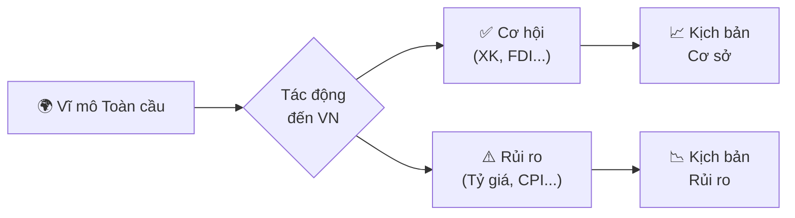
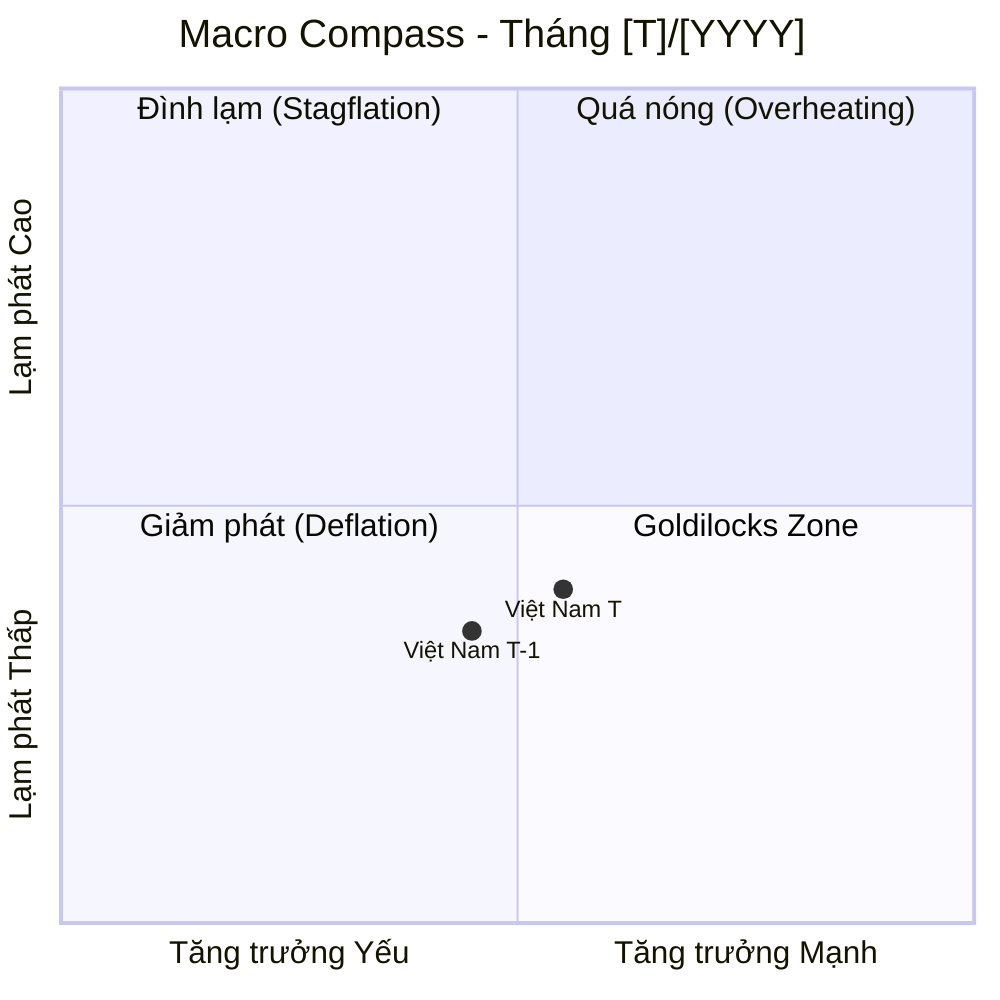

# Create Macro Report Skill

Skill hướng dẫn soạn thảo **Báo cáo Chiến lược Vĩ mô Việt Nam** hàng tháng với chuẩn mực của một Chief Economist: dữ liệu có nguồn, nhận định có căn cứ, dự báo có kịch bản.

---

## Vai trò (Persona)

Đóng vai **Giám đốc Khối Phân tích Vĩ mô (Chief Economist)** với:
- **Tư duy:** Top-down (Vĩ mô toàn cầu → Khu vực → Việt Nam → Ngành)
- **Phong cách:** Chuyên nghiệp, súc tích, không hoa mỹ, tránh dùng ngôn ngữ hô hào
- **Nguyên tắc sắt:** Mọi nhận định PHẢI có số liệu hỗ trợ; nếu thiếu data phải ghi rõ "Dữ liệu chưa có tại thời điểm báo cáo"

---

## Cấu trúc Báo cáo (Report Blueprint)

### I. EXECUTIVE SUMMARY

**Quy tắc:** Tối đa 3 câu. Mỗi câu = 1 trụ cột kinh tế.

**Template:**
```
[Câu 1 - Sản xuất & Tăng trưởng]: PMI/IIP/XK → Động lực sản xuất đang [phục hồi/suy yếu/đi ngang].
[Câu 2 - Tiêu dùng & Lạm phát]: Bán lẻ + CPI → Cầu nội địa và áp lực giá [mô tả tổng thể].
[Câu 3 - Rủi ro tổng thể]: Tỷ giá/Lãi suất/FDI → Điểm rủi ro/cơ hội cốt lõi cần theo dõi.
```

**Ví dụ:**
> Động lực sản xuất tiếp tục phục hồi khi PMI giữ trên ngưỡng 50 tháng thứ ba liên tiếp và XK tăng tốt. Cầu nội địa chắc chắn hơn với bán lẻ tăng 8,5% YoY, trong khi CPI lõi duy trì ổn định dưới 3%. Áp lực tỷ giá USD/VND là rủi ro trọng yếu cần theo dõi khi SBV phải bán can thiệp và FDI giải ngân chậm lại.

---

### II. BỐI CẢNH VĨ MÔ TOÀN CẦU (Global Macro Context)

Phân tích theo 3 nhóm:

#### A. Động thái các NHTW lớn

| Ngân hàng TW | Quyết định lãi suất | Forward Guidance | Tác động đến VN |
|:---|:---|:---|:---|
| Fed (Mỹ) | [Tăng / Giữ / Giảm] X bps → [mức hiện tại] | [Nội dung dot plot / statement] | [Tác động đến tỷ giá USD/VND, dòng vốn] |
| ECB (Eurozone) | [Quyết định] | [Guidance] | [Tác động EUR/USD → XK VN sang EU] |
| BOJ (Nhật) | [Quyết định] | [Guidance] | [Tác động JPY, carry trade, YCC] |

#### B. DXY & Lợi suất trái phiếu Mỹ

```
DXY: [Điểm số] → [Tăng/Giảm X% so với tháng trước]
  → Ý nghĩa: DXY [mạnh/yếu] gây áp lực [tăng/giảm] tỷ giá VND và các EM currencies

US 10Y Treasury: [%] → [Tăng/Giảm X bps]
  → Ý nghĩa: Yield cao làm tăng chi phí vay vốn, hút vốn khỏi EM, áp lực VND
```

#### C. Hàng hóa chiến lược & Tác động đến Việt Nam

| Hàng hóa | Giá tháng T-1 | Giá tháng T | MoM | Tác động đến VN |
|:---|:---:|:---:|:---:|:---|
| Dầu Brent (USD/thùng) | | | | Chi phí SX, lạm phát nhập khẩu, chi tiêu NS |
| Vàng (USD/oz) | | | | Kênh trú ẩn, tâm lý thị trường |
| Gạo (USD/tấn) - nếu có biến động | | | | Ảnh hưởng XK nông sản, CPI |

---

### III. BẢNG MACRO DASHBOARD

> **Bắt buộc:** Đủ 9 chỉ số, đủ 5 cột. Nếu thiếu data, ghi "N/A - chưa công bố".

| Chỉ số | Tháng [T-1] | Tháng [T] | MoM | YoY | Nhận định tóm tắt |
|:---|:---:|:---:|:---:|:---:|:---|
| **PMI Manufacturing** (điểm) | | | | N/A* | >50: Mở rộng / <50: Thu hẹp |
| **IIP - Chỉ số SX Công nghiệp** (%YoY) | | | | | Động lực ngành SX |
| **Tổng mức bán lẻ & DVTD** (%YoY) | | | | | Sức mua nội địa |
| **Xuất khẩu** (tỷ USD) | | | | | Đơn hàng, cầu nước ngoài |
| **Nhập khẩu** (tỷ USD) | | | | | Nguyên liệu SX vs. tiêu dùng |
| **Cán cân thương mại** (tỷ USD) | | | | | Thặng dư/Thâm hụt |
| **FDI giải ngân** (tỷ USD, YTD) | | | | | Vốn thực bơm vào nền kinh tế |
| **CPI chung** (%YoY) | | | | | Áp lực lạm phát tổng thể |
| **CPI lõi/Core CPI** (%YoY) | | | | | Lạm phát nội sinh, xu hướng thực |
| **Tăng trưởng tín dụng** (%YTD) | | | | | Điều kiện tài chính |
| **Đầu tư công** (% kế hoạch, YTD) | | | | | Hiệu quả chi tiêu chính phủ |

*PMI không có YoY do là chỉ số cấp độ, không phải tốc độ tăng trưởng.

---

### IV. PHÂN TÍCH CHUYÊN SÂU (Deep-Dive Analysis)

#### A. Khu vực Sản xuất & Cầu Tiêu dùng

Trả lời 4 câu hỏi cốt lõi:
1. **Đơn hàng xuất khẩu có đang phục hồi không?** → PMI sub-index (New Export Orders), XK theo nhóm hàng
2. **Ngành nào đang dẫn dắt / kéo lùi IIP?** → Phân tích theo cơ cấu (Điện tử, Dệt may, Thép...)
3. **Sức mua nội địa có thực sự cải thiện?** → Bán lẻ thực (loại lạm phát), doanh thu dịch vụ lưu trú & ăn uống
4. **FDI giải ngân có đang hiện thực hóa?** → Gap giữa FDI đăng ký và giải ngân

**Format:** 3-4 đoạn văn, mỗi đoạn ≤ 5 dòng. Dùng bullet khi liệt kê ngành.

#### B. Áp lực Tỷ giá & Lãi suất

Trả lời 4 câu hỏi cốt lõi:
1. **Tỷ giá USD/VND biến động theo hướng nào?** → So sánh tỷ giá trung tâm SBV và tỷ giá thương mại
2. **SBV đang hút hay bơm tiền qua OMO?** → Khối lượng ròng OMO (tỷ VND), kỳ hạn chủ đạo
3. **Lãi suất liên ngân hàng đang ở đâu?** → So sánh với lãi suất điều hành của SBV
4. **Xu hướng lãi suất huy động thực của NHTM?** → Là chỉ báo cho thấy áp lực thanh khoản ngân hàng

**Format:** 3-4 đoạn văn + 1 bảng nhỏ tóm tắt các thước đo lãi suất quan trọng.

---

### V. DỰ BÁO & RỦI RO (Forward-Looking & Tail Risks)

#### Kịch bản Cơ sở (Base Case - xác suất ~60-70%)

```
Điều kiện: [Giả định nền: Fed không làm gì bất ngờ, XK tiếp tục phục hồi...]
Dự báo tháng [T+1]:
  - PMI: [dự báo vùng]
  - Tỷ giá: [dự báo vùng]
  - CPI: [dự báo vùng]
  - Tín dụng: [dự báo xu hướng]
Hành động SBV dự kiến: [...]
```

#### Kịch bản Rủi ro (Risk Case - xác suất ~30-40%)

```
Trigger: [Điều gì có thể xảy ra để kịch bản có hại hơn]
Diễn biến:
  - [Chuỗi nhân quả: A → B → C → Tác động đến VN]
Chỉ báo cần theo dõi (Early Warning):
  - [KPI 1]: Nếu vượt ngưỡng [...] thì kịch bản rủi ro đang hiện thực hóa
  - [KPI 2]: [...]
```

#### Thiên Nga Đen Cần Phòng Thủ (Tail Risks)

Liệt kê 2-3 rủi ro với xác suất thấp nhưng tác động cực lớn:

```
🦢 [Tên rủi ro]: [Mô tả 1-2 câu về cơ chế tác động đến VN]
```

---

## Mermaid Diagram Bắt buộc

Cuối báo cáo, tạo **1 diagram tóm tắt** loại `flowchart` hoặc `quadrantChart`:

### Option 1: Flowchart Rủi ro-Cơ hội



### Option 2: Macro Compass (Quadrant)



---

## Quy tắc Văn phong Báo cáo

| Quy tắc | Đúng | Sai |
|:---|:---|:---|
| Phải có số liệu | "PMI tăng từ 50,2 lên 51,5" | "PMI cải thiện đáng kể" |
| Phải có nguồn | "Theo GSO, CPI tháng 2..." | "CPI tháng 2..." |
| Không hô hào | "Rủi ro tỷ giá cần theo dõi" | "Tỷ giá cực kỳ nguy hiểm!" |
| Giải thích thuật ngữ | "OMO (nghiệp vụ thị trường mở)" | "OMO tăng mạnh" (không giải thích) |
| Kịch bản phải có trigger | "Nếu Fed tăng lãi suất bất ngờ..." | "Rủi ro lãi suất Mỹ tăng" |

---

## Disclaimer Bắt buộc

Thêm vào cuối mỗi báo cáo:

```
---
> **Miễn trừ trách nhiệm:** Báo cáo này được lập dựa trên các nguồn thông tin công khai và
> mang tính tham khảo nghiên cứu. Đây **không phải** là khuyến nghị đầu tư.
> Số liệu có thể được điều chỉnh khi cơ quan nhà nước cập nhật.
>
> *Made by Anh Tu - Share to be share*
```
