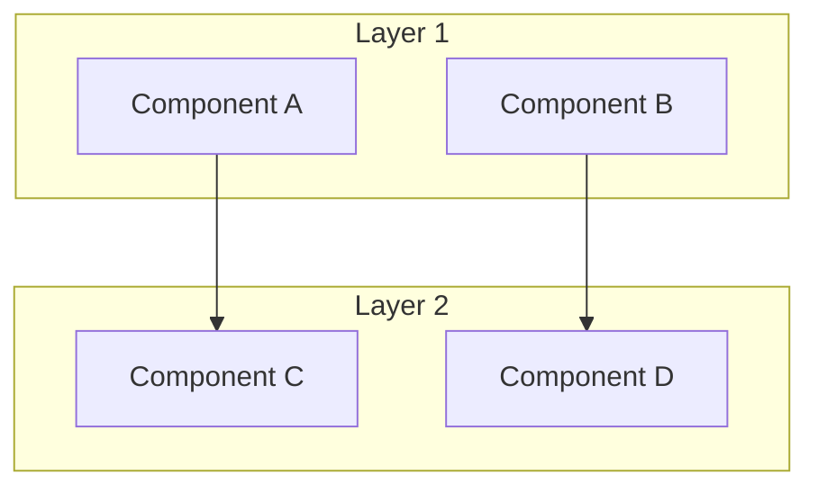
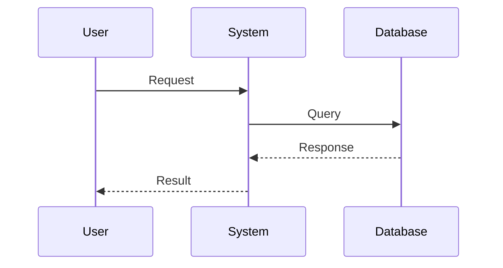
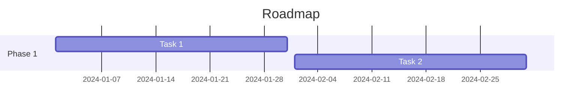

# [Tiêu đề báo cáo chuyên sâu]

> **Loại:** Deep Dive | **Đối tượng:** [Beginner/Intermediate/Expert] | **Cập nhật:** [YYYY-MM-DD]

---

## 1. Tóm tắt điều hành (Executive Summary)

### Bối cảnh
[1-2 đoạn mô tả vấn đề/chủ đề]

### Điểm chính
- 🎯 **Điểm 1:** [Mô tả]
- 🎯 **Điểm 2:** [Mô tả]
- 🎯 **Điểm 3:** [Mô tả]
- 🎯 **Điểm 4:** [Mô tả]
- 🎯 **Điểm 5:** [Mô tả]

### Kết luận sơ bộ
[3-4 câu]

### Khuyến nghị
[2-3 bullet points]

---

## 2. Giới thiệu

### 2.1. Bối cảnh & Động lực
[Tại sao chủ đề này quan trọng]

### 2.2. Phạm vi nghiên cứu
[Những gì được và không được đề cập]

### 2.3. Đối tượng độc giả
[Báo cáo này dành cho ai]

---

## 3. Phân tích chi tiết

### 3.1. [Khía cạnh 1]

#### Định nghĩa & Khái niệm
[Giải thích concept]

**Thuật ngữ quan trọng:**
| Term | Định nghĩa |
|------|------------|
| Term A | Giải thích |
| Term B | Giải thích |

#### Phân tích
[Nội dung phân tích chi tiết]

#### Minh họa
```[language]
// Code snippet
```

#### Ví dụ thực tế
[Case study hoặc scenario]

---

### 3.2. [Khía cạnh 2]

[Cấu trúc tương tự 3.1]

---

### 3.3. [Khía cạnh 3]

[Cấu trúc tương tự 3.1]

---

### 3.4. [Khía cạnh 4]

[Cấu trúc tương tự 3.1]

---

## 4. So sánh & Đánh giá

### 4.1. Bảng so sánh tổng quan

| Tiêu chí | Giải pháp A | Giải pháp B | Giải pháp C |
|----------|-------------|-------------|-------------|
| Ưu điểm | | | |
| Nhược điểm | | | |
| Hiệu suất | | | |
| Chi phí | | | |
| Độ phức tạp | | | |
| Phù hợp với | | | |

### 4.2. Phân tích ưu nhược điểm

#### Giải pháp A
**Ưu điểm:**
- [Điểm 1]
- [Điểm 2]

**Nhược điểm:**
- [Điểm 1]
- [Điểm 2]

#### Giải pháp B
[Tương tự]

### 4.3. Khuyến nghị theo use case

| Use Case | Giải pháp đề xuất | Lý do |
|----------|-------------------|-------|
| [Case 1] | [Giải pháp] | [Lý do] |
| [Case 2] | [Giải pháp] | [Lý do] |

---

## 5. Trực quan hóa

### 5.1. Kiến trúc tổng quan



### 5.2. Quy trình hoạt động



### 5.3. Timeline/Roadmap (nếu có)



---

## 6. Best Practices & Anti-Patterns

### 6.1. Best Practices
- ✅ [Practice 1]
- ✅ [Practice 2]
- ✅ [Practice 3]

### 6.2. Anti-Patterns (Cần tránh)
- ❌ [Anti-pattern 1]
- ❌ [Anti-pattern 2]
- ❌ [Anti-pattern 3]

---

## 7. Kết luận & Hành động

### 7.1. Tóm tắt
[4-5 câu tóm tắt toàn bộ nghiên cứu]

### 7.2. Khuyến nghị chính
1. [Khuyến nghị 1]
2. [Khuyến nghị 2]
3. [Khuyến nghị 3]

### 7.3. Checklist hành động

**Ngắn hạn (1-2 tuần):**
- [ ] [Action item]
- [ ] [Action item]

**Trung hạn (1-3 tháng):**
- [ ] [Action item]
- [ ] [Action item]

**Dài hạn (3-6 tháng):**
- [ ] [Action item]

### 7.4. Đọc thêm
- [Resource 1](link) - Mô tả
- [Resource 2](link) - Mô tả
- [Resource 3](link) - Mô tả

---

## Phụ lục

### A. Thuật ngữ
| Term | Định nghĩa |
|------|------------|
| | |

### B. Các nguồn bổ sung
[Links và resources]

---

## Nguồn tham khảo

1. [Tên nguồn](URL) - Loại nguồn, Năm
2. [Tên nguồn](URL) - Loại nguồn, Năm
3. [Tên nguồn](URL) - Loại nguồn, Năm
4. [Tên nguồn](URL) - Loại nguồn, Năm
5. [Tên nguồn](URL) - Loại nguồn, Năm
