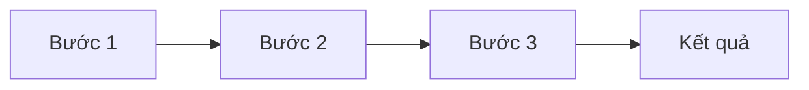

# [Tiêu đề báo cáo]

> **Loại:** Standard | **Đối tượng:** [Beginner/Intermediate/Expert] | **Cập nhật:** [YYYY-MM-DD]

## 1. Tóm tắt điều hành (Executive Summary)

- 🎯 **Điểm chính 1:** [Mô tả]
- 🎯 **Điểm chính 2:** [Mô tả]
- 🎯 **Điểm chính 3:** [Mô tả]
- 🎯 **Điểm chính 4:** [Mô tả]

**Kết luận sơ bộ:** [2-3 câu]

---

## 2. Phân tích chi tiết

### 2.1. [Khía cạnh 1]

**Định nghĩa:** [Giải thích concept]

**Thuật ngữ quan trọng:**
- **Term A:** Giải thích
- **Term B:** Giải thích

**Minh họa:**
```[language]
// Code snippet
```

### 2.2. [Khía cạnh 2]

[Nội dung phân tích]

### 2.3. [Khía cạnh 3]

[Nội dung phân tích]

---

## 3. So sánh & Đánh giá

| Tiêu chí | Giải pháp A | Giải pháp B |
|----------|-------------|-------------|
| Ưu điểm | | |
| Nhược điểm | | |
| Phù hợp với | | |
| Chi phí/Effort | | |

---

## 4. Trực quan hóa



---

## 5. Kết luận & Hành động

### Tóm tắt
[3-4 câu tóm tắt kết quả nghiên cứu]

### Checklist hành động
- [ ] Bước 1: [Hành động cụ thể]
- [ ] Bước 2: [Hành động cụ thể]
- [ ] Bước 3: [Hành động cụ thể]

### Đọc thêm
- [Resource 1](link) - Mô tả
- [Resource 2](link) - Mô tả

---

## Nguồn tham khảo

1. [Tên nguồn](URL) - Loại nguồn, Năm
2. [Tên nguồn](URL) - Loại nguồn, Năm
3. [Tên nguồn](URL) - Loại nguồn, Năm
