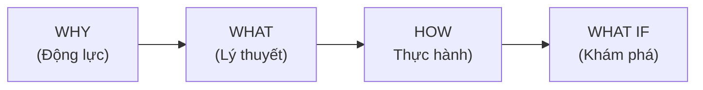

# Create Tech Lecture Skill

Skill hỗ trợ giảng viên CNTT tạo bài viết kỹ thuật đi thẳng vào trọng tâm, tinh gọn và dễ hiểu, áp dụng hệ thống **4MAT** để phục vụ đủ 4 kiểu người học.

## QUAN TRỌNG: Các Quy Tắc Không Thể Bỏ Qua (NON-NEGOTIABLE RULES)

Trước khi viết BẤT KỲ nội dung nào, LLM PHẢI đảm bảo:

### Về Độ Sâu Kỹ Thuật (Anti-Summarization Bias)
- [ ] **KHÔNG LƯỢC DỊCH QUÁ ĐÀ (No over-summarization).** Mọi phương pháp, use-case, edge-case, và chiến lược xử lý nâng cao xuất hiện trong tài liệu gốc (source) PHẢI được đề cập và phân tích chi tiết. Không được tự ý cắt xén để bài viết ngắn lại.
- [ ] Bài dài tối thiểu 1500 từ. Nếu bài viết ngắn hơn, tức là bạn đã mắc lỗi "Summarization Bias" (cắt xén nội dung kỹ thuật).

### Về Trực Quan Hóa (Visuals & Media Loss Prevention)
- [ ] **GIỮ NGUYÊN MEDIA GỐC:** Mọi hình ảnh (images/gifs/diagrams) có sẵn trong tài liệu gốc PHẢI được trích xuất URL và nhúng trực tiếp vào bài viết (sử dụng cú pháp ``). Tuyệt đối không được bỏ sót bất kỳ hình ảnh nào.
- [ ] Mỗi bài CÓ ÍT NHẤT 1 Mermaid diagram tự vẽ (dùng để diễn giải thêm).

### Về Cấu Trúc
- [ ] Cấu trúc section bắt buộc theo thứ tự: Agenda → Glossary → WHY → WHAT → HOW → Discussion Questions → References.

### Về Code
- [ ] Mọi import path PHẢI được verify từ source docs — KHÔNG được viết từ trí nhớ.
- [ ] Mọi biến/schema được dùng PHẢI được define trong cùng bài hoặc section trước đó.
- [ ] Không được có internal contradiction (VD: comment trong code mâu thuẫn với callout).

### Về Văn Phong
- [ ] KHÔNG có emoji trong output (Tuyệt đối không dùng các icon như ✅, ❌, 📖, 🚀...).
- [ ] Thuật ngữ lần đầu xuất hiện PHẢI có Inline Translation: `Term (*Nghĩa tiếng Việt*)`.
- [ ] Phần WHAT PHẢI có Definition Anatomy (giải phẫu từng từ trong định nghĩa).

---

## Phần 1: Agenda & Learning Outcomes (BẮT BUỘC)

**Mỗi bài viết PHẢI bắt đầu bằng khối Agenda.** Đây là "hợp đồng học tập" giữa người viết và người đọc, giúp người học biết trước họ sẽ đạt được gì.

### Template Agenda

```markdown
## Agenda

**Thời gian đọc ước tính:** ~X phút

### Learning outcome:
- **Hiểu** được [khái niệm cốt lõi A] là gì và tại sao nó tồn tại
- **Giải thích** được [khái niệm B] bằng ngôn ngữ đơn giản cho người khác
- **Tự tay** làm được [task thực hành C] từ đầu
- **Phân biệt** được khi nào dùng [X] và khi nào không nên dùng [X]

```

### Quy tắc viết Learning Outcomes

- Dùng **động từ hành động** (theo Bloom's Taxonomy): *hiểu, giải thích, tự tay làm, phân biệt, áp dụng, thiết kế*
- **Tối đa 4-5 outcomes** — nhiều hơn sẽ gây choáng ngợp
- Outcomes phải **đo lường được** — tránh viết mơ hồ như "hiểu sâu về X"

### Template Thuật ngữ & Từ vựng (Glossary & Vocabulary)

**Bắt buộc nếu bài viết có >3 thuật ngữ chuyên ngành hoặc nhiều từ vựng tiếng Anh khó (B1+).** Đặt ngay sau Agenda để trang bị trước cho người học về từ vựng, giúp họ vừa hiểu kỹ thuật vừa học thêm tiếng Anh.

```markdown
## Glossary & Vocabulary

**1. Technical Terms (Thuật ngữ kỹ thuật):**
| Term | Vietnamese Meaning & Quick Explain |
| :--- | :--- |
| **Term A** | Nghĩa tiếng Việt + Giải thích chi tiết bản chất. |

**2. Vocabulary Support (Từ vựng học thuật/B1+):**
| Word | Meaning in Context (Nghĩa trong ngữ cảnh) |
| :--- | :--- |
| **Seamlessly (adv)** | Một cách mượt mà, không gián đoạn. |
| **Overhead (n)** | Chi phí phát sinh (về tài nguyên/thời gian). |
```

---

## Phần 2: Quy trình 4MAT System

4MAT phục vụ 4 kiểu người học khác nhau trong cùng một bài viết.



### WHY — Vấn đề kỹ thuật

**Mục tiêu:** Nêu bật bài toán cốt lõi. Tài liệu chuyên nghiệp không dùng câu hỏi tu từ hay dẫn dắt cảm xúc.

**Quy tắc viết:**

- **Problem Statement:** Liệt kê các nỗi đau (pain points) kỹ thuật dưới dạng số thứ tự hoặc bullet points.
- **Solution:** Trình bày ngắn gọn cách công nghệ này giải quyết vấn đề.
- **CẤM:** Không dùng "Bạn đã bao giờ...", "Chắc hẳn bạn đang...". Đi thẳng vào: "Thực trạng kỹ thuật hiện nay..." hoặc "Vấn đề phát sinh khi..."

---

### WHAT — Nó là cái gì?

**Mục tiêu:** Đưa ra định nghĩa kỹ thuật chính xác và trực quan hóa kiến trúc/luồng hoạt động.

Đi thẳng vào trọng tâm kỹ thuật kết hợp với minh họa sơ đồ. Dành cho người học muốn nắm bắt bản chất cốt lõi ngay lập tức thay vì đọc văn xuôi dài dòng.

**Phải bao gồm:**

1. **Định nghĩa kỹ thuật:** Đưa ra khái niệm chính xác, súc tích ngay từ đầu.
2. **Trực quan hóa (Visual First):** LUÔN sử dụng sơ đồ Mermaid (Architecture/Flow) để minh họa cơ chế hoạt động, thay cho lời văn thuyết minh. LUÔN tái sử dụng ảnh từ nguồn tài liệu gốc nếu có.
3. **Definition Anatomy (Giải phẫu định nghĩa):** Sau khi đưa ra định nghĩa chính, hãy thực hiện "mổ xẻ" từng từ khóa quan trọng để người học hiểu rõ bản chất cấu thành thay vì chỉ dịch nghĩa đơn thuần.

**Ví dụ Definition Anatomy Đầy Đủ:**
Định nghĩa gốc: "A Tool is a callable function with well-defined inputs and outputs."

Giải phẫu:
- **callable** (*có thể gọi được*): nghĩa là nó là một function — có thể thực thi khi cần.
- **well-defined** (*được định nghĩa rõ ràng*): có schema cụ thể, không mơ hồ.
- **inputs and outputs** (*đầu vào và đầu ra*): LLM biết chính xác phải truyền gì và nhận lại gì.

---

### HOW — Làm nó như thế nào?
**Mục tiêu:** Người đọc hình dung và thực hành được ngay lập tức với ví dụ tinh gọn.

Tập trung vào core logic kỹ thuật. Triển khai theo module.

**Phải bao gồm:**
- **Code ngắn gọn nhưng trọn vẹn (Concise but Complete):** Tinh lược boilerplate không liên quan, CHỈ giữ lại phần logic cốt lõi. Tuy nhiên, TUYỆT ĐỐI không được lược bỏ code khiến cho ví dụ mất đi tính trọn vẹn (không thể chạy được) hoặc làm rơi rớt bản chất vấn đề.
- **Code có chú thích WHY** (Tại sao viết thế này) thay vì WHAT (Đoạn này làm gì).
- **Tên file rõ ràng** ở đầu mỗi snippet.
- **Output mong đợi** để người đọc tự kiểm tra.

---

## Phần 3: Kết thúc bài — Câu hỏi thảo luận

** Thường là câu hỏi sâu sắc, được đúc rút và trả lời sau khi đã hiểu rõ các khái niệm trong bài
** Đưa các Pitfalls thành các câu hỏi thảo luận mở
** Dẫn chứng các usecase hoặc best practice đã thành công trên thực tế (có dẫn chứng nguồn)
----------------------------------------------------------------------------------------------------------

## Phần 4: Quy tắc Code & Văn phong

### Quy tắc Code

**File Naming:**

```javascript
// filename: src/services/auth.service.ts
export class AuthService { ... }
```

**Comment WHY, not WHAT:**

```python
# Sai: Khai báo biến x
x = 10

# Đúng: Giới hạn retry để tránh vòng lặp vô tận khi API không phản hồi
MAX_RETRIES = 10
```

**Concise Examples (Tinh gọn nhưng giữ bản chất):**

- Tập trung vào bản chất (Core logic). Lược bỏ các phần thiết lập môi trường dài dòng nếu chúng không đóng góp vào việc giải thích khái niệm (ví dụ: `console.log` thừa, hàm helper không liên quan).
- **Không lan man nhưng không hời hợt.** Ví dụ phải đủ để chạy và minh họa trọn vẹn ý tưởng.

```go
// ... (các import statements đã được rút gọn lại)
func main() {
    // Khởi tạo router bằng Gin framework (Trọng tâm)
    router := gin.Default()
    router.GET("/ping", pingHandler)
}
```

### Văn phong bắt buộc

- **Direct & Visual First:** Sử dụng tiếng anh đơn giản, dễ hiểu. Tận dụng tối đa sơ đồ (Mermaid) và hình ảnh lấy từ tài liệu gốc.
- **Bullet Points:** Ưu tiên gạch đầu dòng ngắn gọn để trình bày ý tứ thay vì viết đoạn văn.
- **Chiến lược thuật ngữ & Hỗ trợ ngôn ngữ (Vocabulary Support):** Vì bài viết bằng tiếng Anh nhưng hướng tới người học muốn dễ hiểu và trau dồi ngoại ngữ:
  1. **Glossary & Vocabulary:** Cung cấp bảng từ vựng B1+ và thuật ngữ chuyên ngành ở đầu bài.
  2. **Inline Translation:** Lần đầu tiên xuất hiện thuật ngữ hoặc từ khó, hãy kèm nghĩa tiếng Việt trong ngoặc đơn. Ví dụ: `Scalability (*Khả năng mở rộng*)`. Lần thứ 2 trở đi chỉ viết `Scalability`.
  3. **Definition Anatomy:** Ở phần WHAT, khi "giải phẫu" định nghĩa, hãy dịch sát nghĩa từng từ cấu thành sang tiếng Việt.
  4. **Consistency:** Khi đã giải thích 1 lần, các lần sau giữ nguyên từ tiếng Anh.
- **Quy tắc Heading & Emoji:**
  1. **Tuyệt đối KHÔNG dùng emoji** trong toàn bộ bài viết.
  2. **Đánh số Heading:** Sử dụng hệ thống số thứ tự (1., 1.1., 1.2., 2., ...) cho các mục để tăng tính học thuật.
- **Xóa dấu vết AI (AI-free Signature):**
  1. **Cấm từ ngữ sáo rỗng:** "Tuyệt vời", "mạnh mẽ", "trong bài viết này".
  2. **Cấm kiểu kết bài AI:** Không dùng "Tóm lại là...", "Hi vọng bài viết này giúp ích...". Kết bài bằng Discussion Questions.
  3. **Tư duy phản biện:** Luôn trình bày các giới hạn (limitations) và đánh đổi (trade-offs).

---

## Quy Trình Bắt Buộc Trước Khi Viết

1. Đọc lại source docs: Verify tên class, import path, **TRÍCH XUẤT MỌI ĐƯỜNG LINK HÌNH ẢNH (Image URLs)**.
2. Xác định bài thuộc loại nào: Concept / Tutorial / Architecture.
3. Chống Summarization Bias: Liệt kê mọi chiến lược nâng cao trong tài liệu gốc. Bắt buộc phải đưa tất cả vào bài.
4. Phác thảo Mermaid diagram TRƯỚC khi viết text.
5. Chạy pre-write check:
   - Đã quét hết URL ảnh gốc chưa?
   - Có vô tình lược bỏ phần nâng cao nào không?

---

## Self-evaluation Rubric (Thang điểm tự đánh giá)

Trước khi coi là hoàn thành, tự đối chiếu với bảng sau:

| Tiêu chí | Điểm tối đa |
|---|---|
| Mọi ảnh từ bản gốc đã được nhúng + Có Mermaid Diagram | 20 |
| Bài dài > 1500 từ, KHÔNG bị "Summarization Bias" | 20 |
| Glossary đầy đủ (Technical Terms + Vocabulary) | 10 |
| Inline Translation ở lần đầu xuất hiện | 10 |
| Definition Anatomy trong section WHAT | 10 |
| Trade-off / Limitations được nêu rõ | 10 |
| Không có emoji | 10 |
| Code tinh gọn (không lan man) nhưng ĐỦ để chạy | 10 |
| **TỔNG** | **100** |

> Nếu tổng điểm < 80 -> Chỉnh sửa trước khi xuất bài.
