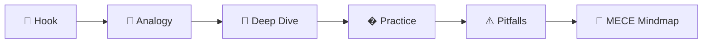
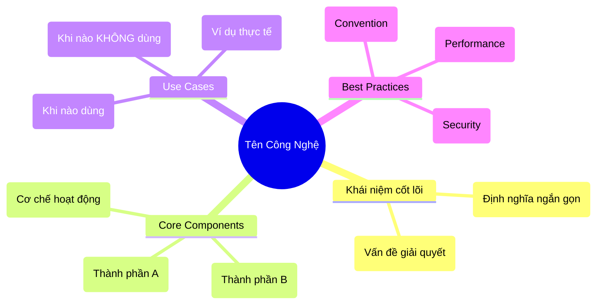

# Create Tech Lecture Skill

Skill hỗ trợ giảng viên CNTT tạo bài viết kỹ thuật chuyên sâu nhưng dễ hiểu.

## Quy trình tư duy sư phạm (Pedagogical Flow)



1. **Hook (Thu hút):** Bắt đầu bằng vấn đề thực tế hoặc câu hỏi gợi mở
2. **Analogy (Ẩn dụ):** Giải thích concept bằng hình ảnh đời thường TRƯỚC KHI đi vào kỹ thuật
3. **Deep Dive & Visual:** Phân tích kiến trúc, code, luồng dữ liệu (kết hợp Mermaid Flowchart/Sequence)
4. **Practice (Thực hành):** Code mẫu với chú thích "Why"
5. **Pitfalls (Cảnh báo):** Lỗi thường gặp + Best Practices
6. **MECE Mindmap (Tổng hợp):** Sơ đồ tư duy tóm tắt toàn bộ kiến thức để review

## Phân loại bài viết

| Loại | Mục tiêu | Template | Khi nào dùng |
|------|----------|----------|--------------|
| **Concept Explained** | Giải thích khái niệm | [concept.md](templates/concept.md) | "Docker là gì?", "OAuth hoạt động thế nào?" |
| **Tutorial / Guide** | Hướng dẫn làm | [tutorial.md](templates/tutorial.md) | "Build API với Go", "Setup CI/CD" |
| **Architecture Review** | So sánh/Phân tích | [architecture.md](templates/architecture.md) | "Microservices vs Monolith", "Chọn database" |

## Quy tắc trình bày Code

### File Naming
```javascript
// ✅ filename: src/services/auth.service.ts
export class AuthService { ... }
```

### Comment WHY, not WHAT
```python
# ❌ Sai: Khai báo biến x
x = 10

# ✅ Đúng: Giới hạn retry để tránh vòng lặp vô tận khi API không phản hồi
MAX_RETRIES = 10
```

### Snippet thay vì Full Code
```go
// ... (các import statements)

func main() {
    // 👇 Đây là phần quan trọng cần giải thích
    router := gin.Default()
    router.GET("/ping", pingHandler)
    
    // ... (phần còn lại)
}
```

## Văn phong bắt buộc

- **Analogy First:** Mọi concept mới PHẢI có ẩn dụ đời sống
- **Giải thích thuật ngữ** ngay lần đầu xuất hiện
- **Paragraph ngắn:** Tối đa 4-5 dòng/đoạn
- **Sử dụng emoji** để đánh dấu mục quan trọng (⚠️, ✅, ❌, 💡)
- **Trade-off rõ ràng:** Luôn chỉ ra đánh đổi của giải pháp

## Mermaid Diagram Types

| Loại nội dung | Mermaid Type |
|---------------|--------------|
| Quy trình, luồng | `flowchart` |
| Tương tác runtime | `sequenceDiagram` |
| Cấu trúc class/module | `classDiagram` |
| Entity relationships | `erDiagram` |
| Timeline/Roadmap | `gantt` |
| Mindmap (Review) | `mindmap` |

## Quy tắc Mindmap (MECE Integration)

Cuối mỗi bài viết, **BẮT BUỘC** tạo một sơ đồ tư duy bằng Mermaid để tổng hợp kiến thức.
Mindmap phải tuân thủ nguyên tắc **MECE** (Mutually Exclusive Collectively Exhaustive - Không trùng lặp, Đủ ý) với 4 nhánh chính cố định:



**Lưu ý cho Mindmap:**
1. Dùng từ khóa ngắn gọn (**Keywords only**).
2. Không viết câu dài dòng.
3. Đảm bảo các nhánh con của "Core Components" không bị lẫn sang "Use Cases".
