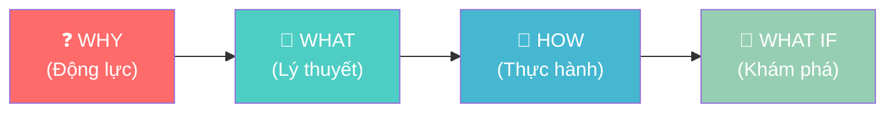
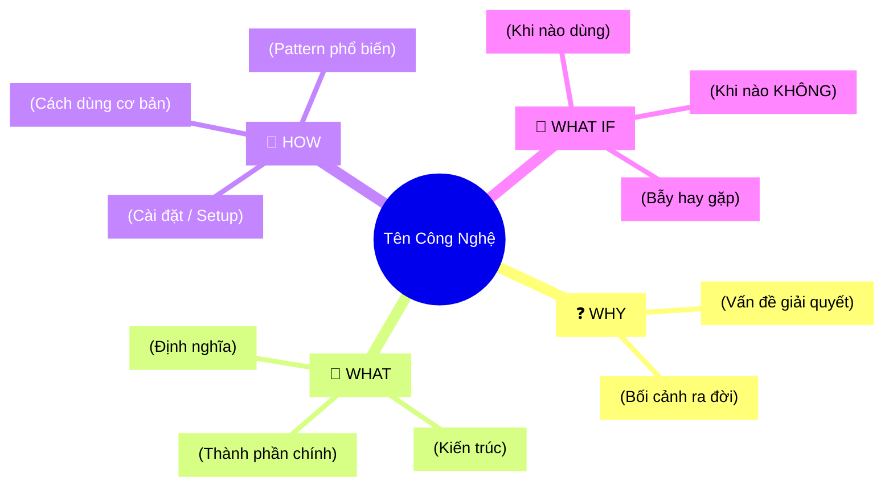

# Create Tech Lecture Skill

Skill hỗ trợ giảng viên CNTT tạo bài viết kỹ thuật chuyên sâu có độ dài trung bình và dễ hiểu, áp dụng hệ thống **4MAT** để phục vụ đầy đủ 4 kiểu người học.

## Phần 1: Agenda & Learning Outcomes (BẮT BUỘC)

**Mỗi bài viết PHẢI bắt đầu bằng khối Agenda.** Đây là "hợp đồng học tập" giữa người viết và người đọc, giúp người học biết trước họ sẽ đạt được gì.

### Template Agenda

```markdown
## 📋 Agenda

**Thời gian đọc ước tính:** ~X phút

### Sau bài này, bạn sẽ:
- ✅ **Hiểu** được [khái niệm cốt lõi A] là gì và tại sao nó tồn tại
- ✅ **Giải thích** được [khái niệm B] bằng ngôn ngữ đơn giản cho người khác
- ✅ **Tự tay** làm được [task thực hành C] từ đầu
- ✅ **Phân biệt** được khi nào dùng [X] và khi nào không nên dùng [X]

### Yêu cầu đầu vào (Prerequisites):
- 🔹 Biết cơ bản về [kiến thức A]
- 🔹 Đã từng [hành động B] ít nhất một lần
```

### Quy tắc viết Learning Outcomes
- Dùng **động từ hành động** (theo Bloom's Taxonomy): *hiểu, giải thích, tự tay làm, phân biệt, áp dụng, thiết kế*
- **Tối đa 4-5 outcomes** — nhiều hơn sẽ gây choáng ngợp
- Outcomes phải **đo lường được** — tránh viết mơ hồ như "hiểu sâu về X"

---

## Phần 2: Quy trình 4MAT System

4MAT phục vụ 4 kiểu người học khác nhau trong cùng một bài viết.



### 🔴 WHY — Tại sao tôi phải học cái này?
**Mục tiêu:** Tạo động lực học tập bằng cách kết nối với thực tế.

Tương đương bước **Hook** trong quy trình cũ. Dành cho người học cần *lý do* trước khi hành động.

**Phải bao gồm:**
- Vấn đề thực tế mà người đọc đã/sẽ gặp ("Bạn đã bao giờ...?")
- Con số hoặc dữ kiện gây ấn tượng (nếu có)
- Mối liên hệ với công việc hàng ngày hoặc career path của Junior/Intern

**Ví dụ:**
```markdown
## ❓ Tại sao cần Docker?

Bạn đã bao giờ code chạy ngon trên máy mình nhưng lên production thì... báo lỗi? 
Đây là vấn đề kinh điển mà 7/10 junior developer gặp phải trong 3 tháng đầu đi làm.

Docker sinh ra để giải quyết chính xác bài toán đó...
```

---

### 🟢 WHAT — Nó là cái gì?
**Mục tiêu:** Xây dựng mental model vững chắc trước khi đi vào kỹ thuật.

Tương đương bước **Analogy + Deep Dive** trong quy trình cũ. Dành cho người học thích *lý thuyết và hiểu bản chất*.

**Phải bao gồm:**
1. **Analogy (Ẩn dụ đời thường):** Giải thích concept bằng hình ảnh quen thuộc TRƯỚC KHI dùng thuật ngữ kỹ thuật
2. **Định nghĩa chính xác:** Sau khi có ẩn dụ, mới đưa ra định nghĩa kỹ thuật
3. **Kiến trúc/Sơ đồ:** Mermaid diagram phù hợp (dùng skill `mermaid-expert` để kiểm tra)
4. **Giải thích thuật ngữ:** Giữ nguyên tiếng Anh, giải thích ngay lần đầu xuất hiện

**Ví dụ:**
```markdown
## 📖 Docker là gì?

**Hãy tưởng tượng** Docker như một chiếc hộp vận chuyển tiêu chuẩn (container) trong logistics.
Dù hàng hóa bên trong là gì — quần áo, điện tử, hay thực phẩm — chiếc hộp đó luôn có cùng
kích thước, cùng giao diện, và có thể xếp lên bất kỳ con tàu nào.

**Về mặt kỹ thuật:** Docker là nền tảng containerization cho phép đóng gói ứng dụng cùng
toàn bộ dependencies (thư viện phụ thuộc) vào một đơn vị độc lập gọi là *container*...
```

---

### 🔵 HOW — Làm nó như thế nào?
**Mục tiêu:** Người đọc tự tay làm được sau khi đọc xong phần này.

Tương đương bước **Practice** trong quy trình cũ. Dành cho người học thực hành.

**Phải bao gồm:**
- **Code có chú thích WHY** (không phải WHAT)
- **Tên file rõ ràng** ở đầu mỗi snippet
- **Dùng snippet thay vì full code** — chỉ highlight phần quan trọng
- **Thứ tự từng bước** nếu là tutorial
- **Output mong đợi** để người đọc tự kiểm tra

**Ví dụ:**
```markdown
## 🔨 Tạo Dockerfile đầu tiên

### Bước 1: Tạo file cấu hình

```dockerfile
# filename: Dockerfile

# Dùng Node 20 LTS vì đây là phiên bản ổn định nhất hiện tại
FROM node:20-alpine

WORKDIR /app

# Copy package.json TRƯỚC khi copy source code
# → Docker cache layer này, giúp rebuild nhanh hơn khi chỉ đổi code
COPY package*.json ./
RUN npm ci --only=production

COPY . .
EXPOSE 3000

CMD ["node", "server.js"]
```
```

---

### 🟡 WHAT IF — Chuyện gì xảy ra nếu...?
**Mục tiêu:** Mở rộng tư duy, kích thích khám phá và ứng dụng thực tế.

Tương đương bước **Usecase + Pitfalls** trong quy trình cũ. Dành cho người học thích *khám phá và tư duy phản biện*.

**Phải bao gồm:**
- **Khi nào DÙNG vs KHÔNG DÙNG** — Trade-off rõ ràng
- **Common Pitfalls (Bẫy hay gặp)** — Lỗi điển hình mà Junior hay mắc
- **"What if tôi không dùng X?"** — Phương án thay thế
- **Ví dụ thực tế** — Công ty nào dùng, bài toán nào phù hợp

**Ví dụ:**
```markdown
## 🚀 Docker — Khi nào dùng, khi nào không?

| ✅ NÊN dùng | ❌ KHÔNG nên dùng |
|-------------|------------------|
| Team > 2 người, cần môi trường nhất quán | Script chạy 1 lần, không cần isolate |
| Microservices với nhiều services | Ứng dụng cần access trực tiếp phần cứng |
| CI/CD pipeline | Prototype cá nhân đơn giản |

### ⚠️ Pitfalls hay gặp

**1. Chạy process với quyền root trong container**
Đây là lỗ hổng bảo mật nghiêm trọng. Luôn thêm `USER node` trước `CMD`.

**2. Không dùng `.dockerignore`**
Sẽ copy cả `node_modules` (hàng GB) vào image → build chậm kinh khủng.
```

---

## Phần 3: Kết thúc bài — MECE Mindmap (BẮT BUỘC)

Cuối mỗi bài viết, **BẮT BUỘC** tạo sơ đồ tư duy Mermaid tổng hợp kiến thức theo nguyên tắc **MECE** (Mutually Exclusive, Collectively Exhaustive).

4 nhánh chính cố định khớp với 4 pha của 4MAT:



**Lưu ý:**
- Dùng từ khóa ngắn gọn (**Keywords only**), không viết câu dài
- **Sử dụng skill `mermaid-expert`** để kiểm tra cú pháp trước khi xuất ra

---

## Phần 4: Phân loại bài viết

| Loại | Mục tiêu | Khi nào dùng |
|------|----------|--------------|
| **Concept Explained** | Giải thích khái niệm | "Docker là gì?", "OAuth hoạt động thế nào?" |
| **Tutorial / Guide** | Hướng dẫn làm | "Build API với Go", "Setup CI/CD" |
| **Architecture Review** | So sánh/Phân tích | "Microservices vs Monolith", "Chọn database" |

---

## Phần 5: Quy tắc Code & Văn phong

### Quy tắc Code

**File Naming:**
```javascript
// ✅ filename: src/services/auth.service.ts
export class AuthService { ... }
```

**Comment WHY, not WHAT:**
```python
# ❌ Sai: Khai báo biến x
x = 10

# ✅ Đúng: Giới hạn retry để tránh vòng lặp vô tận khi API không phản hồi
MAX_RETRIES = 10
```

**Snippet thay vì Full Code:**
```go
// ... (các import statements)

func main() {
    // 👇 Đây là phần quan trọng cần giải thích
    router := gin.Default()
    router.GET("/ping", pingHandler)
    
    // ... (phần còn lại)
}
```

### Văn phong bắt buộc

- **Analogy First:** Giải thích bằng ẩn dụ đời thường TRƯỚC KHI đi vào kỹ thuật
- **Giải thích thuật ngữ:** Giữ nguyên tiếng Anh, giải thích ngay lần đầu xuất hiện
- **Paragraph ngắn:** Tối đa 4-5 dòng/đoạn
- **Dùng emoji** để đánh dấu mục quan trọng (⚠️, ✅, ❌, 💡)
- **Trade-off rõ ràng:** Luôn chỉ ra đánh đổi của giải pháp

---

## Checklist trước khi xuất bài

- [ ] Có **Agenda** với Learning Outcomes rõ ràng (dùng động từ hành động)?
- [ ] Phần **WHY** tạo được động lực, kết nối với vấn đề thực tế?
- [ ] Phần **WHAT** có ẩn dụ đời thường trước khi dùng thuật ngữ kỹ thuật?
- [ ] Phần **HOW** có code snippet với chú thích WHY và tên file rõ ràng?
- [ ] Phần **WHAT IF** có bảng so sánh và ít nhất 2 pitfalls?
- [ ] Có **MECE Mindmap** ở cuối bài?
- [ ] Mermaid syntax đã được kiểm tra bằng skill `mermaid-expert`?
