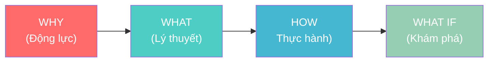
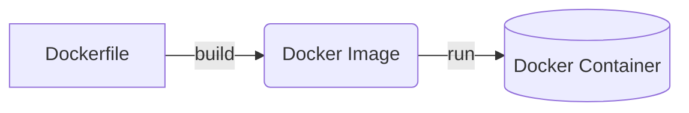

# Create Tech Lecture Skill

Skill hỗ trợ giảng viên CNTT tạo bài viết kỹ thuật đi thẳng vào trọng tâm, tinh gọn và dễ hiểu, áp dụng hệ thống **4MAT** để phục vụ đủ 4 kiểu người học.

## QUAN TRỌNG: Các Quy Tắc Không Thể Bỏ Qua (NON-NEGOTIABLE RULES)

Trước khi viết BẤT KỲ nội dung nào, LLM PHẢI đảm bảo:

### Về Cấu Trúc
- [ ] Mỗi bài CÓ ÍT NHẤT 1 Mermaid diagram — nếu không có, bài KHÔNG ĐẠT.
- [ ] Bài dài tối thiểu 800 từ — ưu tiên target 1500-2500 từ.
- [ ] Cấu trúc section bắt buộc theo thứ tự: Agenda → Glossary → WHY → WHAT → HOW → Discussion Questions → References.

### Về Code
- [ ] Mọi import path PHẢI được verify từ source docs — KHÔNG được viết từ trí nhớ.
- [ ] Mọi biến/schema được dùng PHẢI được define trong cùng bài hoặc section trước đó.
- [ ] Không được có internal contradiction (VD: comment trong code mâu thuẫn với callout).

### Về Văn Phong
- [ ] KHÔNG có emoji trong output (Tuyệt đối không dùng các icon như ✅, ❌, 📖, 🚀...).
- [ ] Thuật ngữ lần đầu xuất hiện PHẢI có Inline Translation: `Term (*Nghĩa tiếng Việt*)`.
- [ ] Phần WHAT PHẢI có Definition Anatomy (giải phẫu từng từ trong định nghĩa).

---

## Phần 1: Agenda & Learning Outcomes (BẮT BUỘC)

**Mỗi bài viết PHẢI bắt đầu bằng khối Agenda.** Đây là "hợp đồng học tập" giữa người viết và người đọc, giúp người học biết trước họ sẽ đạt được gì.

### Template Agenda

```markdown
## Agenda

**Thời gian đọc ước tính:** ~X phút

### Learning outcome:
- **Hiểu** được [khái niệm cốt lõi A] là gì và tại sao nó tồn tại
- **Giải thích** được [khái niệm B] bằng ngôn ngữ đơn giản cho người khác
- **Tự tay** làm được [task thực hành C] từ đầu
- **Phân biệt** được khi nào dùng [X] và khi nào không nên dùng [X]

```

### Quy tắc viết Learning Outcomes

- Dùng **động từ hành động** (theo Bloom's Taxonomy): *hiểu, giải thích, tự tay làm, phân biệt, áp dụng, thiết kế*
- **Tối đa 4-5 outcomes** — nhiều hơn sẽ gây choáng ngợp
- Outcomes phải **đo lường được** — tránh viết mơ hồ như "hiểu sâu về X"

### Template Thuật ngữ & Từ vựng (Glossary & Vocabulary)

**Bắt buộc nếu bài viết có >3 thuật ngữ chuyên ngành hoặc nhiều từ vựng tiếng Anh khó (B1+).** Đặt ngay sau Agenda để trang bị trước cho người học về từ vựng, giúp họ vừa hiểu kỹ thuật vừa học thêm tiếng Anh.

```markdown
## Glossary & Vocabulary

**1. Technical Terms (Thuật ngữ kỹ thuật):**
| Term | Vietnamese Meaning & Quick Explain |
| :--- | :--- |
| **Term A** | Nghĩa tiếng Việt + Giải thích chi tiết bản chất. |

**2. Vocabulary Support (Từ vựng học thuật/B1+):**
| Word | Meaning in Context (Nghĩa trong ngữ cảnh) |
| :--- | :--- |
| **Seamlessly (adv)** | Một cách mượt mà, không gián đoạn. |
| **Overhead (n)** | Chi phí phát sinh (về tài nguyên/thời gian). |
```

---

## Phần 2: Quy trình 4MAT System

4MAT phục vụ 4 kiểu người học khác nhau trong cùng một bài viết.



### WHY — Vấn đề kỹ thuật

**Mục tiêu:** Nêu bật bài toán cốt lõi. Tài liệu chuyên nghiệp không dùng câu hỏi tu từ hay dẫn dắt cảm xúc.

**Quy tắc viết:**

- **Problem Statement:** Liệt kê các nỗi đau (pain points) kỹ thuật dưới dạng số thứ tự hoặc bullet points.
- **Solution:** Trình bày ngắn gọn cách công nghệ này giải quyết vấn đề.
- **CẤM:** Không dùng "Bạn đã bao giờ...", "Chắc hẳn bạn đang...". Đi thẳng vào: "Thực trạng kỹ thuật hiện nay..." hoặc "Vấn đề phát sinh khi..."

**Ví dụ:**

```markdown
## Vấn đề & Giải pháp của Docker

**Vấn đề (Problem Statement):**
- Môi trường phát triển không đồng nhất (chạy trên máy Dev nhưng lỗi khi release Production).
- Xung đột version thư viện khi chạy nhiều project trên cùng một server máy chủ.

**Giải pháp (Solution):**
Docker cung cấp nền tảng **containerization**, giúp định nghĩa và đóng gói ứng dụng cùng mọi dependencies vào một container độc lập. Nhanh gọn và đảm bảo môi trường nhất quán tuyệt đối ở mọi nơi cài đặt.
```

---

### WHAT — Nó là cái gì?

**Mục tiêu:** Đưa ra định nghĩa kỹ thuật chính xác và trực quan hóa kiến trúc/luồng hoạt động.

Đi thẳng vào trọng tâm kỹ thuật kết hợp với minh họa sơ đồ. Dành cho người học muốn nắm bắt bản chất cốt lõi ngay lập tức thay vì đọc văn xuôi dài dòng.

**Phải bao gồm:**

1. **Định nghĩa kỹ thuật:** Đưa ra khái niệm chính xác, súc tích ngay từ đầu.
2. **Trực quan hóa (Visual First):** LUÔN sử dụng sơ đồ Mermaid (Architecture/Flow) để minh họa cơ chế hoạt động, thay cho lời văn thuyết minh.
3. **Definition Anatomy (Giải phẫu định nghĩa):** Sau khi đưa ra định nghĩa chính, hãy thực hiện "mổ xẻ" từng từ khóa quan trọng để người học hiểu rõ bản chất cấu thành thay vì chỉ dịch nghĩa đơn thuần.
   *(Lưu ý: Hạn chế tối đa việc lạm dụng ẩn dụ. Chỉ dùng 1-2 câu "ví như" nếu concept thực sự quá trừu tượng).*

**Ví dụ Definition Anatomy Đầy Đủ:**
Định nghĩa gốc: "A Tool is a callable function with well-defined inputs and outputs."

Giải phẫu:
- **callable** (*có thể gọi được*): nghĩa là nó là một function — có thể thực thi khi cần.
- **well-defined** (*được định nghĩa rõ ràng*): có schema cụ thể, không mơ hồ.
- **inputs and outputs** (*đầu vào và đầu ra*): LLM biết chính xác phải truyền gì và nhận lại gì.

**Ví dụ:**

```markdown
## Docker hoạt động như thế nào?

**Định nghĩa:** Docker là một nền tảng tạo, chạy và quản lý ứng dụng bên trong các Container (môi trường cô lập) dựa trên nhân Linux.

**Giải phẫu định nghĩa (Definition Anatomy):**
- **Container** (*Thùng chứa*): Gói phần mềm chứa mã nguồn và tất cả dependencies.
- **Cô lập** (*Isolated*): Không ảnh hưởng đến hệ điều hành chủ hay các container khác.

**Kiến trúc cốt lõi:**


- **Image:** Template hệ thống chứa ứng dụng và thư viện liên quan.
- **Container:** Một instance thực thể đang chạy được sinh ra từ Image.

```

---

### HOW — Làm nó như thế nào?
**Mục tiêu:** Người đọc hình dung và thực hành được ngay lập tức với ví dụ tinh gọn.

Tập trung vào core logic kỹ thuật. Triển khai theo module.

**Phải bao gồm:**
- **Code ngắn gọn, trực diện (Concise Examples):** Tinh lược mọi boilerplate không liên quan (như import thừa, cấu hình không trọng tâm), chỉ lấy phần cốt lõi.
- **Code có chú thích WHY** (Tại sao viết thế này) thay vì WHAT (Đoạn này làm gì).
- **Tên file rõ ràng** ở đầu mỗi snippet.
- **Output mong đợi** để người đọc tự kiểm tra.

**Ví dụ:**
```markdown
## Tạo Dockerfile đầu tiên

### Bước 1: Tạo file cấu hình

```dockerfile
# filename: Dockerfile

# Dùng Node 20 LTS vì đây là phiên bản ổn định nhất
FROM node:20-alpine

WORKDIR /app

# Copy package.json TRƯỚC khi copy source code
# -> Tận dụng Docker cache layer, giúp rebuild siêu nhanh nếu chỉ thay đổi mã nguồn
COPY package*.json ./
RUN npm ci --only=production

COPY . .
EXPOSE 3000

CMD ["node", "server.js"]
```

---

## Phần 3: Kết thúc bài — Câu hỏi thảo luận

** Thường là câu hỏi sâu sắc, được đúc rút và trả lời sau khi đã hiểu rõ các khái niệm trong bài
** Đưa các Pitfalls thành các câu hỏi thảo luận mở
** Dẫn chứng các usecase hoặc best practice đã thành công trên thực tế (có dẫn chứng nguồn)
----------------------------------------------------------------------------------------------------------

## Phần 4: Quy tắc Code & Văn phong

### Quy tắc Code

**File Naming:**

```javascript
// filename: src/services/auth.service.ts
export class AuthService { ... }
```

**Comment WHY, not WHAT:**

```python
# Sai: Khai báo biến x
x = 10

# Đúng: Giới hạn retry để tránh vòng lặp vô tận khi API không phản hồi
MAX_RETRIES = 10
```

**Concise Examples (Tinh gọn tối đa code):**

```go
// ... (các import statements đã được rút gọn lại)
func main() {
    // Khởi tạo router bằng Gin framework (Trọng tâm)
    router := gin.Default()
    router.GET("/ping", pingHandler)
}
```

### Văn phong bắt buộc

- **Direct & Visual First:** Sử dụng tiếng anh đơn giản, dễ hiểu. Đi thẳng vào định nghĩa kỹ thuật, tận dụng tối đa sơ đồ (Mermaid) minh họa kiến trúc thay cho văn xuôi giải thích dài dòng.
- **Bullet Points:** Ưu tiên gạch đầu dòng ngắn gọn để trình bày ý tứ thay vì viết đoạn văn (paragraph) quá tràng giang đại hải.
- **Chiến lược thuật ngữ & Hỗ trợ ngôn ngữ (Vocabulary Support):** Vì bài viết bằng tiếng Anh nhưng hướng tới người học muốn dễ hiểu và trau dồi ngoại ngữ:
  1. **Glossary & Vocabulary:** Cung cấp bảng từ vựng B1+ và thuật ngữ chuyên ngành ở đầu bài.
  2. **Inline Translation:** Lần đầu tiên xuất hiện thuật ngữ hoặc từ khó, hãy kèm nghĩa tiếng Việt trong ngoặc đơn. Ví dụ: `Scalability (*Khả năng mở rộng*)`. Lần thứ 2 trở đi chỉ viết `Scalability`.
  3. **Vocabulary Box:** Trước những đoạn văn tiếng Anh dài hoặc phức tạp, có thể dùng Callout Docusaurus `:::info Vocabulary Note` để giải thích nhanh các từ vựng sẽ xuất hiện.
  4. **Definition Anatomy:** Ở phần WHAT, khi "giải phẫu" định nghĩa, hãy dịch sát nghĩa từng từ cấu thành sang tiếng Việt để người học nắm rõ gốc gác từ vựng.
  5. **Consistency:** Khi đã giải thích 1 lần, các lần sau giữ nguyên từ tiếng Anh để người học quen mắt và tăng phản xạ đọc.
- **Ưu tiên hình ảnh và sơ đồ** để minh họa kiến trúc và luồng hoạt động thay vì văn xuôi giải thích dài dòng.
- **Quy tắc Heading & Emoji:**
  1. **Tuyệt đối KHÔNG dùng emoji** trong toàn bộ bài viết (kể cả trong heading, list hay callout).
  2. **Đánh số Heading:** Sử dụng hệ thống số thứ tự (1., 1.1., 1.2., 2., ...) cho các mục để tăng tính học thuật và dễ trích dẫn.
- **Xóa dấu vết AI (AI-free Signature):**
  1. **Cấm từ ngữ sáo rỗng:** "Tuyệt vời", "mạnh mẽ", "đáng kinh ngạc", "thú vị", "hãy cùng tìm hiểu", "trong bài viết này".
  2. **Cấm kiểu kết bài AI:** Không dùng "Tóm lại là...", "Hi vọng bài viết này giúp ích...", "Chúc bạn học tốt". Kết bài bằng bảng so sánh, Discussion Questions hoặc References.
  3. **Tư duy phản biện:** Luôn trình bày các giới hạn (limitations) và đánh đổi (trade-offs) thay vì chỉ khen ngợi công nghệ.

---

## Quy Trình Bắt Buộc Trước Khi Viết

1. Đọc lại source docs: Verify tên class, function, import path từ tài liệu gốc.
2. Xác định bài thuộc loại nào: Concept / Tutorial / Architecture -> Chọn template tương ứng.
3. Phác thảo Mermaid diagram TRƯỚC khi viết text — diagram quyết định cấu trúc bài.
4. List ra tối đa 5 Learning Outcomes theo Bloom's Taxonomy.
5. Chạy pre-write check:
   - Tôi đã có ít nhất 1 Mermaid diagram chưa? (Nếu chưa -> Dừng lại, vẽ diagram trước)
   - Tất cả import paths trong code đã được verify từ source chưa?

---

## Self-evaluation Rubric (Thang điểm tự đánh giá)

Trước khi coi là hoàn thành, tự đối chiếu với bảng sau:

| Tiêu chí | Điểm tối đa |
|---|---|
| Có ít nhất 1 Mermaid diagram chính xác | 20 |
| Glossary đầy đủ (Technical Terms + Vocabulary) | 10 |
| Inline Translation ở lần đầu xuất hiện | 10 |
| Definition Anatomy trong section WHAT | 15 |
| Trade-off / Limitations được nêu rõ | 15 |
| Không có emoji | 10 |
| Code không có internal contradiction | 10 |
| Word count >= 800 từ | 10 |
| **TỔNG** | **100** |

> Nếu tổng điểm < 80 -> Chỉnh sửa trước khi xuất bài.
