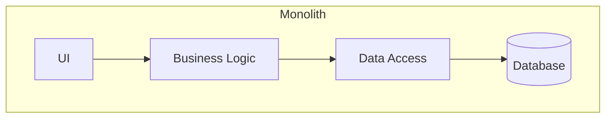
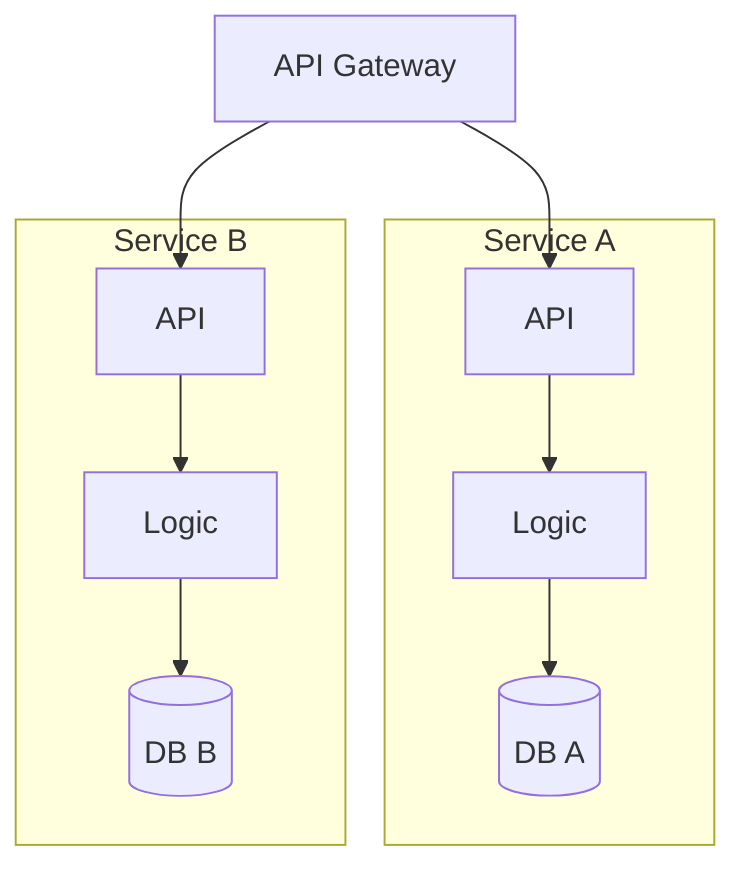
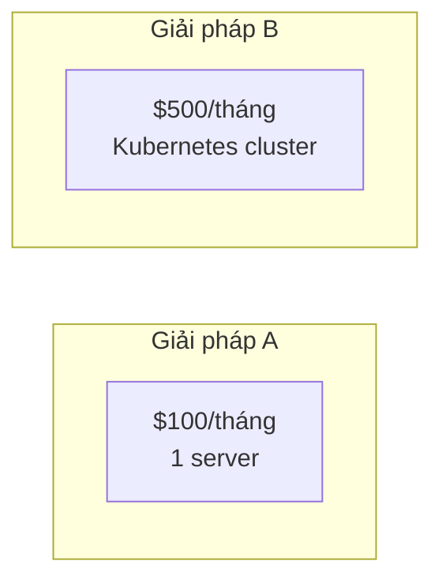
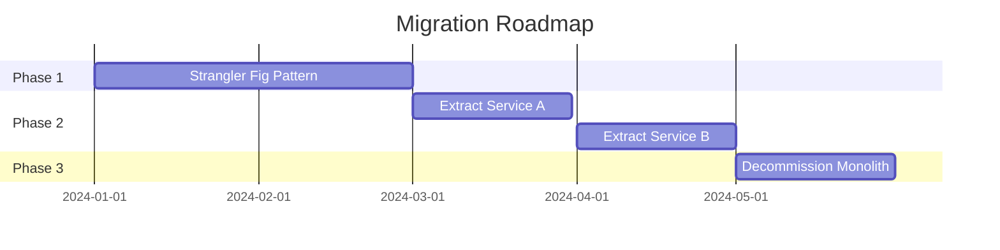

# [Architecture Review: So sánh/Phân tích hệ thống]

> **Cấp độ:** [Intermediate/Advanced]  
> **Đối tượng:** [Developers, Tech Leads, Architects]  
> **Mục tiêu:** Hiểu trade-off và biết khi nào chọn [Giải pháp A] vs [Giải pháp B].

---

## 1. Bối cảnh & Vấn đề (Context) 🎯

### Tình huống thực tế

[Mô tả tình huống mà team/công ty gặp phải dẫn đến việc cần quyết định kiến trúc này]

*Ví dụ: "Khi hệ thống scale lên 10 triệu users, monolith trở nên bottleneck. Team đang cân nhắc chuyển sang microservices..."*

### Câu hỏi cần trả lời

- Khi nào nên chọn [Giải pháp A]?
- [Giải pháp B] có những trade-off gì?
- Những yếu tố nào ảnh hưởng đến quyết định?

---

## 2. Tổng quan các giải pháp 📊

### Giải pháp A: [Tên]

> **Ẩn dụ:** [So sánh với đời sống]
> 
> *Ví dụ: "Monolith giống như một căn nhà - tất cả phòng đều dưới một mái nhà, dễ quản lý nhưng khó mở rộng."*



**Đặc điểm chính:**
- [Đặc điểm 1]
- [Đặc điểm 2]
- [Đặc điểm 3]

---

### Giải pháp B: [Tên]

> **Ẩn dụ:** [So sánh với đời sống]
> 
> *Ví dụ: "Microservices giống như một khu chung cư - mỗi căn hộ độc lập, dễ mở rộng nhưng cần quản lý phức tạp hơn."*



**Đặc điểm chính:**
- [Đặc điểm 1]
- [Đặc điểm 2]
- [Đặc điểm 3]

---

## 3. Bảng so sánh Trade-off ⚖️

| Tiêu chí | Giải pháp A | Giải pháp B |
|----------|-------------|-------------|
| **Độ phức tạp ban đầu** | ✅ Thấp | ⚠️ Cao |
| **Khả năng scale** | ⚠️ Hạn chế | ✅ Linh hoạt |
| **Chi phí vận hành** | ✅ Thấp | ⚠️ Cao |
| **Tốc độ phát triển (giai đoạn đầu)** | ✅ Nhanh | ⚠️ Chậm |
| **Tốc độ phát triển (scale)** | ⚠️ Chậm dần | ✅ Ổn định |
| **Team size phù hợp** | 1-5 người | 5+ người |
| **Debugging** | ✅ Dễ | ⚠️ Phức tạp |
| **Deployment** | ✅ Đơn giản | ⚠️ Cần CI/CD mature |

---

## 4. Phân tích chi tiết 🔬

### 4.1. [Khía cạnh 1: Performance]

**Giải pháp A:**
- [Phân tích chi tiết]
- [Benchmark/Số liệu nếu có]

**Giải pháp B:**
- [Phân tích chi tiết]
- [Benchmark/Số liệu nếu có]

---

### 4.2. [Khía cạnh 2: Developer Experience]

**Giải pháp A:**
```bash
# Deploy đơn giản
git push origin main
# Done! 🎉
```

**Giải pháp B:**
```bash
# Deploy phức tạp hơn
docker build -t service-a .
kubectl apply -f k8s/
# Cần cấu hình nhiều bước
```

---

### 4.3. [Khía cạnh 3: Cost]



---

## 5. Decision Framework 📋

### Chọn Giải pháp A khi:
- ✅ Team nhỏ (< 5 người)
- ✅ MVP / Startup giai đoạn đầu
- ✅ Không chắc chắn về product-market fit
- ✅ Budget hạn chế

### Chọn Giải pháp B khi:
- ✅ Team lớn (> 5 người) với nhiều squad
- ✅ Cần scale độc lập từng component
- ✅ Có DevOps/SRE team
- ✅ Traffic không đồng đều giữa các feature

---

## 6. Migration Path 🛤️

### Từ A → B



**Key Steps:**
1. **Strangler Fig:** Wrap monolith với API Gateway
2. **Extract:** Tách dần từng bounded context
3. **Decommission:** Tắt monolith khi đã migrate hết

---

## 7. Tổng kết & Khuyến nghị 🎯

### Kết luận

| Tình huống | Khuyến nghị |
|------------|-------------|
| Startup MVP | **Giải pháp A** - Ship nhanh, iterate |
| Scale-up (10M+ users) | **Giải pháp B** - Đầu tư dài hạn |
| Team nhỏ, product stable | **Giải pháp A** - Đơn giản là tốt nhất |

### Sai lầm thường gặp

- ❌ **Premature optimization:** Chọn B quá sớm khi chưa cần
- ❌ **Ignoring team capability:** Chọn B khi team chưa có kinh nghiệm DevOps
- ❌ **All-or-nothing:** Không biết về migration patterns (strangler fig)

---

## Tài liệu tham khảo

- [Martin Fowler - Microservices](link) - Định nghĩa gốc
- [Sam Newman - Building Microservices](link) - Sách kinh điển
- [Case Study: Company X](link) - Kinh nghiệm thực tế
