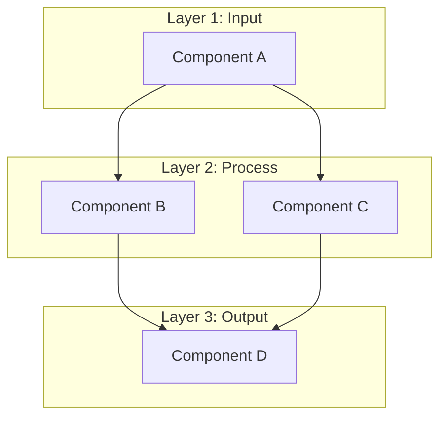
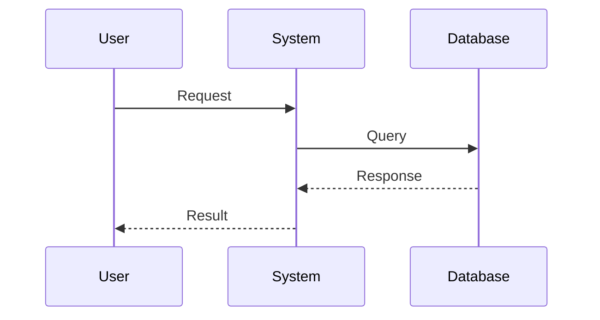

# [Tên Concept: Hấp dẫn & Chứa từ khóa chính]

> **Cấp độ:** [Beginner/Intermediate/Advanced]
> **Yêu cầu:** [Kiến thức cần có trước]
> **Mục tiêu:** Sau bài này, bạn sẽ hiểu được [concept] và biết khi nào nên sử dụng.

---

## 1. Đặt vấn đề (The "Why")

**Vấn đề (Problem Statement):**
- [Pain point 1 của kiến trúc hiện tại hoặc cách làm truyền thống]
- [Pain point 2]

**Giải pháp (Solution):**
[Concept] giải quyết vấn đề trên bằng cách [Mô tả ngắn gọn cơ chế lõi].

---

## 2. Giải thích khái niệm (The "What")

### Tư duy ẩn dụ

> **Ẩn dụ:** [So sánh concept với đời sống hàng ngày - Chỉ dùng 1-2 câu]
> 
> *Ví dụ: "Docker Container giống như một hộp đồ ăn takeaway - bạn mang đi đâu cũng được, mở ra là ăn được ngay, không cần biết nhà bếp họ dùng bếp gì."*

### Định nghĩa kỹ thuật

**[Term chính]** là [định nghĩa ngắn gọn, 1-2 câu].

**Giải phẫu định nghĩa (Definition Anatomy):**
- **[Từ khóa 1]** (*Dịch nghĩa*): Giải thích bản chất.
- **[Từ khóa 2]** (*Dịch nghĩa*): Giải thích bản chất.

---

## 3. Phân tích kỹ thuật (The "How")

### Kiến trúc tổng quan



### Luồng hoạt động



### Giải thích chi tiết

1. **Bước 1:** [Mô tả]
2. **Bước 2:** [Mô tả]
3. **Bước 3:** [Mô tả]

---

## 4. Code minh họa (Show me the code)

```javascript
// filename: src/example.js

// Phần này minh họa [concept chính]
function exampleFunction() {
    // Lý do chọn cách này: [giải thích WHY thay vì WHAT]
    const result = doSomething();
    
    return result;
}
```

---

## 5. Lỗi thường gặp (Common Pitfalls)

### Anti-pattern: [Tên lỗi]
```javascript
// Sai: [Lý do]
badCode();
```

### Best Practice: [Giải pháp đúng]
```javascript
// Đúng: [Lý do]
goodCode();
```

---

## 6. Discussion Questions

1. **[Câu hỏi 1]:** [Khơi gợi tư duy phản biện về trade-off]
2. **[Câu hỏi 2]:** [Câu hỏi tình huống ứng dụng]
3. **[Câu hỏi 3]:** [So sánh với một công nghệ khác]

---

## Tài liệu tham khảo

- [Official Docs](link) - Tài liệu chính thức
- [GitHub Repo](link) - Source code tham khảo
- [Blog/Article](link) - Bài viết liên quan
