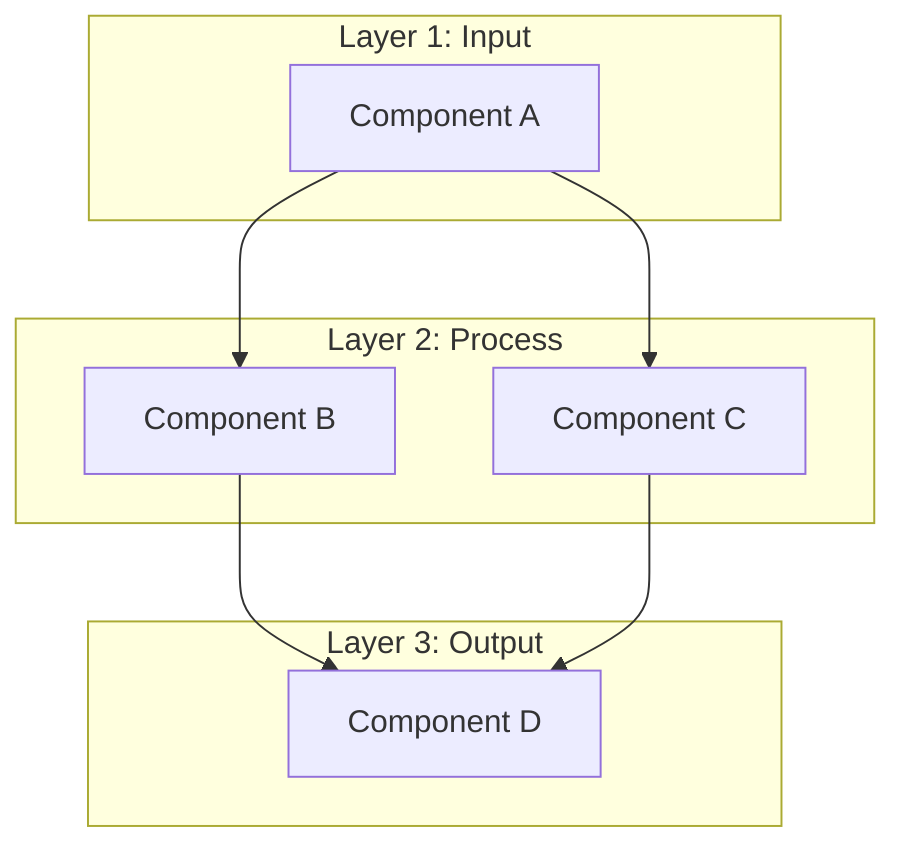
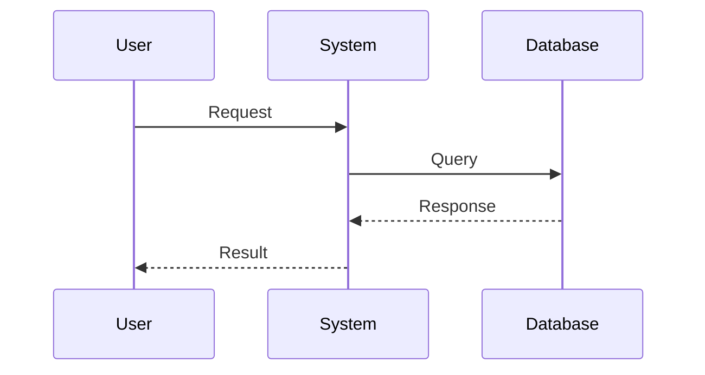

# [Tên Concept: Hấp dẫn & Chứa từ khóa chính]

> **Cấp độ:** [Beginner/Intermediate/Advanced]
> **Yêu cầu:** [Kiến thức cần có trước]
> **Mục tiêu:** Sau bài này, bạn sẽ hiểu được [concept] và biết khi nào nên sử dụng.

---

## 1. Đặt vấn đề (The "Why") 🎣

[Bắt đầu bằng một tình huống thực tế mà độc giả gặp phải]

*Ví dụ: "Bạn đã bao giờ deploy code lên server và tự hỏi: 'Sao trên máy mình chạy được mà lên production lại lỗi?' Đây chính là lúc Docker ra đời để giải quyết..."*

---

## 2. Giải thích khái niệm (The "What") 💡

### Tư duy ẩn dụ

> **Ẩn dụ:** [So sánh concept với đời sống hàng ngày]
> 
> *Ví dụ: "Docker Container giống như một hộp đồ ăn takeaway - bạn mang đi đâu cũng được, mở ra là ăn được ngay, không cần biết nhà bếp họ dùng bếp gì."*

### Định nghĩa kỹ thuật

**[Term chính]** là [định nghĩa ngắn gọn, 1-2 câu].

**Thuật ngữ liên quan:**
| Term | Giải thích |
|------|------------|
| [Term A] | [Giải thích ngắn] |
| [Term B] | [Giải thích ngắn] |

---

## 3. Phân tích kỹ thuật (The "How") 🔬

### Kiến trúc tổng quan



### Luồng hoạt động



### Giải thích chi tiết

1. **Bước 1:** [Mô tả]
2. **Bước 2:** [Mô tả]
3. **Bước 3:** [Mô tả]

---

## 4. Code minh họa (Show me the code) 💻

```javascript
// filename: src/example.js

// 👇 Phần này minh họa [concept chính]
function exampleFunction() {
    // Lý do chọn cách này: [giải thích WHY]
    const result = doSomething();
    
    return result;
}
```

---

## 5. Lỗi thường gặp (Common Pitfalls) ⚠️

### ❌ Anti-pattern: [Tên lỗi]
```javascript
// 🚫 Sai: [Lý do]
badCode();
```

### ✅ Best Practice: [Giải pháp đúng]
```javascript
// ✅ Đúng: [Lý do]
goodCode();
```

---

## 6. Tổng kết & Thử thách 🎯

### 3 điểm cốt lõi
1. **[Điểm 1]:** [Tóm tắt]
2. **[Điểm 2]:** [Tóm tắt]
3. **[Điểm 3]:** [Tóm tắt]

### Bài tập nhỏ
> 💪 **Thử thách:** [Gợi ý người đọc tự thực hành hoặc mở rộng]

---

## Tài liệu tham khảo

- [Official Docs](link) - Tài liệu chính thức
- [GitHub Repo](link) - Source code tham khảo
- [Blog/Article](link) - Bài viết liên quan
