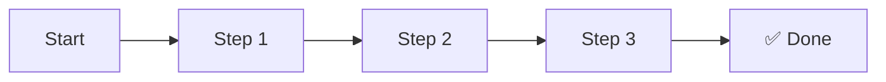

# [Tutorial: Hướng dẫn làm gì đó cụ thể]

> **Cấp độ:** [Beginner/Intermediate/Advanced]  
> **Thời gian:** [Ước tính: 15 phút / 30 phút / 1 giờ]  
> **Yêu cầu:** [Kiến thức, phần mềm cần cài đặt sẵn]  
> **Mục tiêu:** Sau bài này, bạn sẽ làm được [kết quả cụ thể].

---

## 1. Tổng quan (What we'll build) 🎯

[Mô tả ngắn sản phẩm cuối cùng + screenshot/demo nếu có]



---

## 2. Chuẩn bị (Prerequisites) 📋

### Cài đặt cần thiết

| Công cụ | Version | Kiểm tra |
|---------|---------|----------|
| [Tool A] | >= x.x | `tool --version` |
| [Tool B] | >= x.x | `tool --version` |

### Kiểm tra môi trường

```bash
# Chạy các lệnh sau để xác nhận môi trường đã sẵn sàng
node --version  # >= 18.0
npm --version   # >= 9.0
```

---

## 3. Các bước thực hiện 🚀

### Bước 1: [Tên bước]

**Mục tiêu:** [Kết quả sau bước này]

```bash
# Tạo project mới
mkdir my-project && cd my-project
npm init -y
```

**Giải thích:**
- `mkdir my-project`: Tạo thư mục dự án
- `npm init -y`: Khởi tạo package.json với giá trị mặc định

---

### Bước 2: [Tên bước]

**Mục tiêu:** [Kết quả sau bước này]

```javascript
// filename: src/index.js

// 👇 Đây là phần cốt lõi của bước này
const express = require('express');
const app = express();

// Lý do dùng port 3000: đây là convention phổ biến cho dev server
const PORT = 3000;

app.listen(PORT, () => {
    console.log(`Server running on port ${PORT}`);
});
```

**Checkpoint:** Chạy `npm start` và truy cập `http://localhost:3000` để kiểm tra.

---

### Bước 3: [Tên bước]

**Mục tiêu:** [Kết quả sau bước này]

```javascript
// filename: src/routes/user.js

// ... (imports)

// 👇 Route handler cho user
router.get('/users', async (req, res) => {
    // ...
});

// ... (phần còn lại)
```

---

## 4. Full Code 📦

<details>
<summary>👉 Click để xem toàn bộ code</summary>

```javascript
// filename: src/index.js
// Full source code here...
```

</details>

---

## 5. Edge Cases & Xử lý lỗi ⚠️

### Lỗi thường gặp

| Lỗi | Nguyên nhân | Giải pháp |
|-----|-------------|-----------|
| `Error: EADDRINUSE` | Port đã bị chiếm | Đổi PORT hoặc kill process |
| `Module not found` | Chưa cài dependencies | Chạy `npm install` |

### Xử lý edge case

```javascript
// ✅ Luôn validate input
if (!req.body.email) {
    return res.status(400).json({ error: 'Email is required' });
}
```

---

## 6. Mở rộng (What's next?) 🔮

Sau khi hoàn thành tutorial này, bạn có thể:

- [ ] Thêm authentication (JWT)
- [ ] Kết nối database (PostgreSQL/MongoDB)
- [ ] Deploy lên cloud (Vercel/Railway)

---

## 7. Tổng kết 🎯

### Những gì đã làm được
1. ✅ [Thành quả 1]
2. ✅ [Thành quả 2]
3. ✅ [Thành quả 3]

### Bài tập thực hành
> 💪 **Thử thách:** [Gợi ý mở rộng dựa trên những gì đã học]

---

## Tài liệu tham khảo

- [Official Docs](link) - Tài liệu chính thức
- [GitHub Repo](link) - Source code hoàn chỉnh
- [Video Tutorial](link) - Hướng dẫn video (nếu có)
