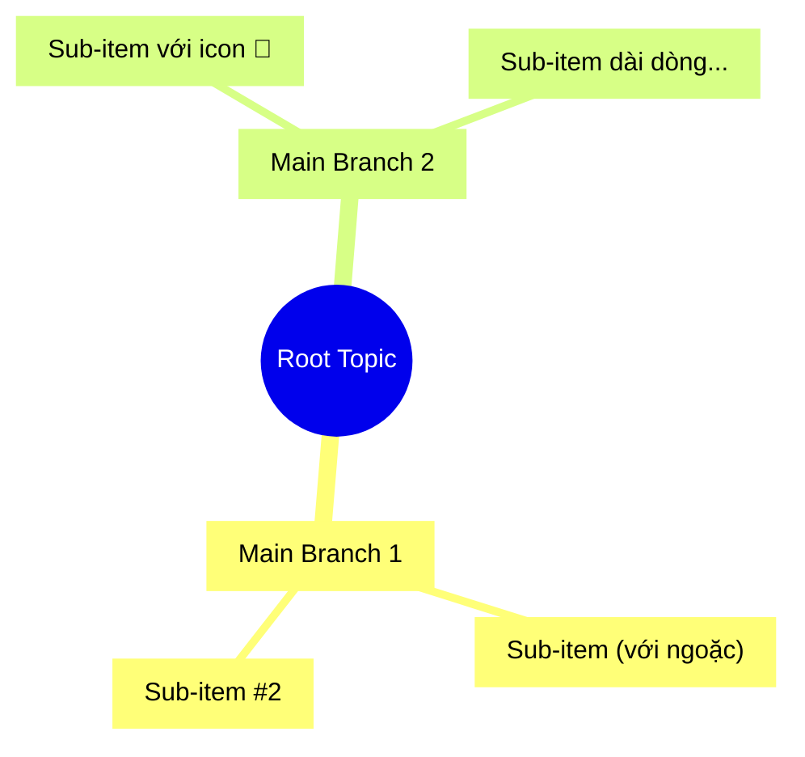
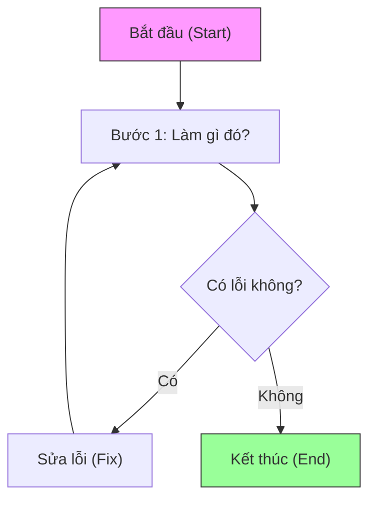
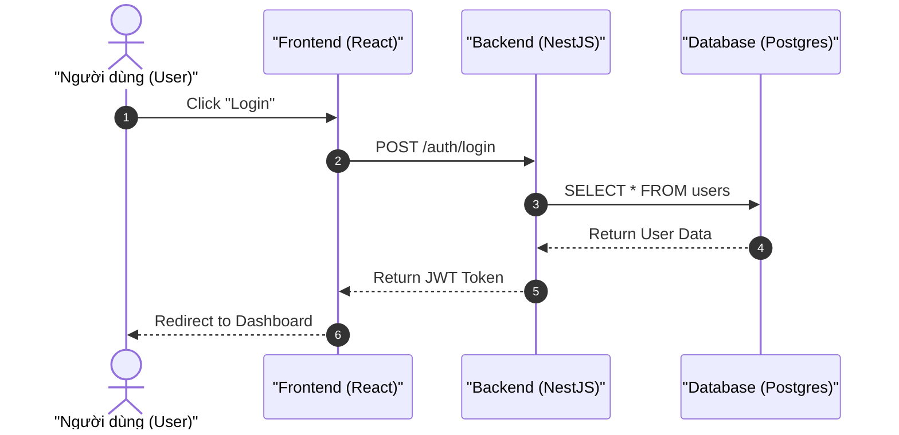
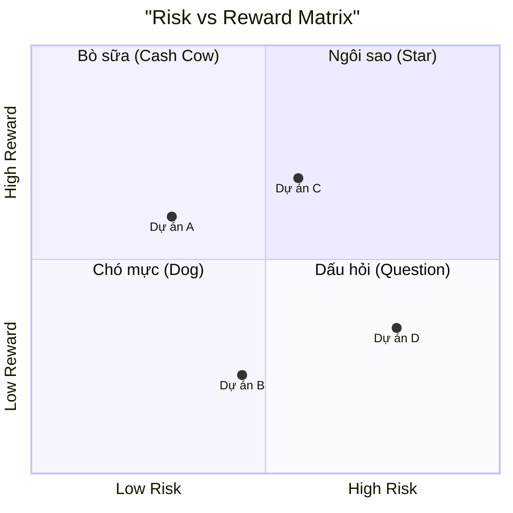
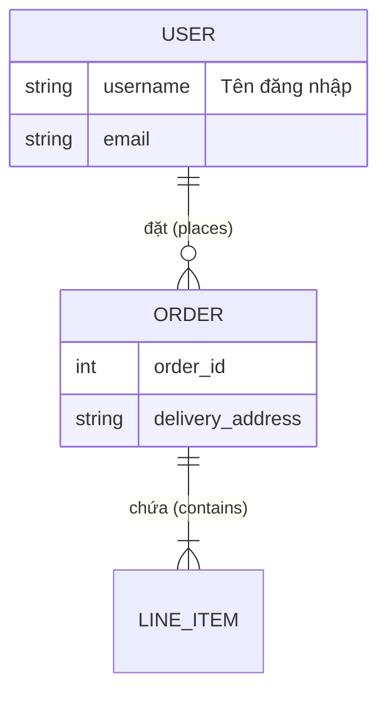

# Mermaid Expert Skill

Skill này tập hợp các Best Practices để đảm bảo Mermaid diagrams luôn render thành công trên Docusaurus và các nền tảng khác.

## 🛡️ The "Anti-Break" Golden Rules (Quy tắc Vàng)

Để tránh 99% lỗi "Parse error", hãy tuân thủ 3 quy tắc sau:

### Rule #1: ALWAYS Quote Labels (Luôn dùng ngoặc kép)
Không bao giờ viết text trần. Luôn bao quanh label bằng dấu ngoặc kép `""`.
*   ❌ Sai: `A[Hello World]`
*   ✅ Đúng: `A["Hello World"]`

### Rule #2: ALWAYS Use Explicit IDs (Luôn có ID rõ ràng)
Đừng để Mermaid tự sinh ID hoặc dùng text làm ID. Hãy đặt ID ngắn gọn, không dấu, alphanumeric.
*   ❌ Sai: `(Khái niệm)`
*   ✅ Đúng: `concept["(Khái niệm)"]`

### Rule #3: Escape Special Characters (Xử lý ký tự đặc biệt)
Các ký tự `()`, `[]`, `{}`, `"`, `#` rất dễ gây lỗi parser nếu không được xử lý.
*   **Trong Label:** Dùng ngoặc kép bao quanh là đủ an toàn cho `()`, `[]`.
*   **Dấu ngoặc kép trong label:** Dùng HTML entity `#quot;`. Ví dụ: `id["Nói: #quot;Hello#quot;"]`
*   **Icon/Emoji:** Hỗ trợ tốt trong ngoặc kép. `id["🚀 Keep moving"]`

---

## 🏗️ Robust Templates (Mẫu An Toàn)

Copy và điền vào các mẫu này để đảm bảo không lỗi.

### 1. Mindmap (Sơ đồ tư duy)
**Lưu ý:** Mindmap rất nhạy cảm với dấu ngoặc đơn `()`. Bắt buộc dùng `id["Label"]`.

### 2. Flowchart (Lưu đồ)
Dùng `graph TD` (trên xuống) hoặc `graph LR` (trái sang).

### 3. Sequence Diagram (Biểu đồ tuần tự)
Sử dụng `participant as` để tách biệt ID và Label.

### 4. Quadrant Chart (Biểu đồ 4 góc)
**Cảnh báo:** Quadrant Chart hiện tại **KHÔNG** hỗ trợ tốt dấu ngoặc kép trong text trục (axis labels). Hãy dùng từ đơn giản cho trục.

### 5. ER Diagram (Sơ đồ thực thể)
Dùng `||--o{` cho quan hệ. Text mô tả quan hệ phải có dấu ngoặc kép.

---

## 🔧 Troubleshooting Guide (Sửa Lỗi)

### Lỗi 1: `Expecting 'SQE', 'DOUBLECIRCLEEND'... got 'PS'`
*   **Nguyên nhân:** Thường do Mindmap hoặc Graph có chứa dấu `(` `)` `[` `]` mà không được bao trong ngoặc kép.
*   **Cách sửa:** Tìm chỗ text bị trần, bọc lại bằng `id["Text"]`.
    *   Sai: `(Khái niệm)`
    *   Đúng: `def["(Khái niệm)"]`

### Lỗi 2: `Parse error on line X` (Chung chung)
*   **Nguyên nhân:**
    1.  Dùng từ khóa trùng (ví dụ `end`, `subgraph` làm ID).
    2.  Thiếu dấu ngoặc đóng/mở.
    3.  Syntax sai (ví dụ `-->` trong Mindmap).
*   **Cách sửa:**
    1.  Kiểm tra dòng X.
    2.  Đổi ID sang tên khác (ví dụ `endNode` thay vì `end`).
    3.  Đảm bảo cú pháp đúng loại diagram (Mindmap không dùng mũi tên).

### Lỗi 3: Text bị cắt hoặc hiển thị sai
*   **Nguyên nhân:** Dùng ký tự lạ hoặc conflict HTML.
*   **Cách sửa:** Dùng HTML Entity hoặc bỏ bớt ký tự đặc biệt.
