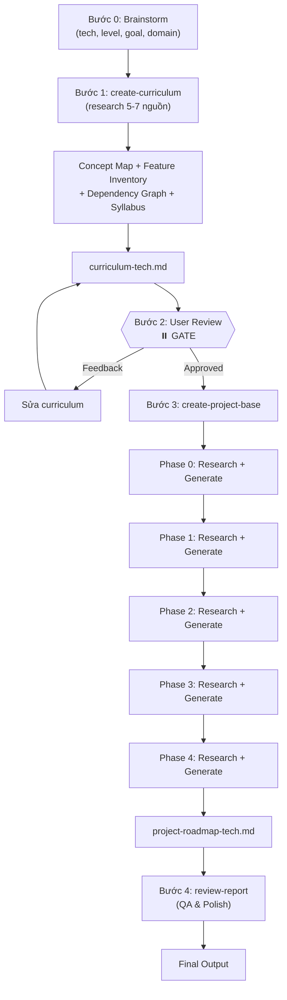

# Workflow: Create Road Map — Progressive Project Learning

Quy trình xây dựng lộ trình học công nghệ mới thông qua project thực tế, kết hợp 3 skills: research, create-curriculum, create-project-base.

**Triết lý:** "Documentation-Driven Learning" — người học vừa build project vừa đọc đúng phần docs cần thiết. Curriculum đi trước, Project đi sau.

---

## Bước 0: Brainstorm cùng User

Hỏi người dùng tối đa 4 câu, **từng câu một** (one question per message):

```
Câu 1 (Bắt buộc): "Bạn muốn học công nghệ/ngôn ngữ nào?"

Câu 2 (Bắt buộc): "Level hiện tại của bạn với tech này?"
  → Hoàn toàn mới (chưa biết gì)
  → Có nền tảng liên quan (VD: biết JS rồi, muốn học React)
  → Chuyển từ tech tương tự (VD: biết Vue, muốn học React)

Câu 3 (Bắt buộc): "Mục tiêu cuối cùng của bạn?"
  → Hiểu core concepts để phỏng vấn
  → Build được project thực tế cho portfolio
  → Chuyển đổi tech stack trong dự án hiện tại

Câu 4 (Optional): "Có lĩnh vực ứng dụng cụ thể không?"
  → VD: Web app, CLI tool, API backend, DevOps pipeline...
```

**Quy tắc brainstorm:**
- Nếu user đã cung cấp đủ info trong prompt đầu tiên → skip câu đã có
- Sau khi thu thập đủ → tóm tắt lại context trước khi chuyển bước tiếp

---

## Bước 1: Xây dựng Curriculum (create-curriculum skill)

// turbo
1. Sử dụng `create-curriculum` skill:
   - Đọc SKILL.md: `.agent/skills/create-curriculum/SKILL.md`
   - Input: Context từ Bước 0 (tech, level, goal, domain)
   - Thực hiện research tổng quan (Standard: 5-7 nguồn)
   - Xây dựng: Concept Map + Feature Inventory + Dependency Graph + Syllabus

2. Output: File `curriculum-[tech-name].md` theo template

---

## Bước 2: User Review Curriculum ⏸️ GATE

**DỪNG LẠI TẠI ĐÂY. Đây là điểm dừng bắt buộc.**

1. Lưu file curriculum vào thư mục làm việc
2. Thông báo user:

> "Curriculum đã được lưu tại `[path]`. Vui lòng review và chỉnh sửa nếu cần:
> - Kiểm tra Concept Map có đủ concepts bạn cần không
> - Kiểm tra thứ tự Syllabus có hợp lý không
> - Thêm/bớt concepts nếu cần
>
> Khi nào OK, reply để tôi tiếp tục tạo Project Roadmap."

3. **Chờ user respond:**
   - Nếu user **approve**: Tiếp tục Bước 3
   - Nếu user **có feedback**: Sửa curriculum theo feedback → lưu lại → hỏi review lại
   - **KHÔNG được tự ý bỏ qua bước này**

---

## Bước 3: Tạo Project Roadmap (create-project-base skill)

// turbo
1. Sử dụng `create-project-base` skill:
   - Đọc SKILL.md: `.agent/skills/create-project-base/SKILL.md`
   - Input: File curriculum đã approved từ Bước 2
   - Chọn project phù hợp (theo Selection Criteria)
   - Loop mỗi Phase (0 → 4):
     - Research riêng concepts/features của Phase (≥3 nguồn/phase)
     - Generate: Requirements + Acceptance Criteria + Pseudo Code + Pitfalls + Docs Guide

2. Output: File `project-roadmap-[tech-name].md`

---

## Bước 4: Review Output (review-report skill)

// turbo
1. Sử dụng `review-report` skill:
   - Đọc SKILL.md: `.agent/skills/review-report/SKILL.md`
   - Chạy Content Checklist
   - Chạy Format Checklist
   - Verify: pseudo code không biến thành code hoàn chỉnh
   - Verify: mỗi Phase có research sources riêng

2. Output: Final reviewed version

---

## Quick Reference

| Bước | Skill/Action | Output | Gate? |
|------|-------------|--------|-------|
| 0 | Brainstorm | Tech + Level + Goal + Domain | No |
| 1 | create-curriculum | `curriculum-[tech].md` | No |
| 2 | User Review | Curriculum approved/edited | **YES ⏸️** |
| 3 | create-project-base | `project-roadmap-[tech].md` | No |
| 4 | review-report | Final QA'd version | No |

---

## Data Flow


