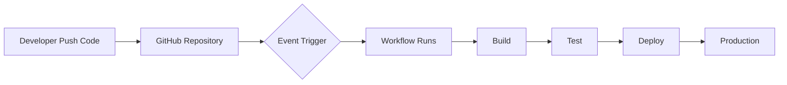
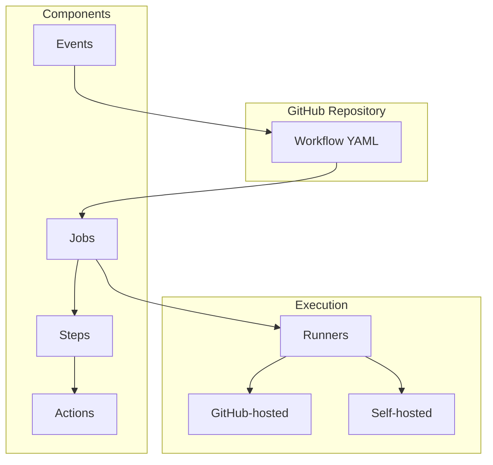

# GitHub Actions: Hướng Dẫn Toàn Diện Cho Người Mới Bắt Đầu

**GitHub Actions** là nền tảng CI/CD (Continuous Integration/Continuous Delivery) được tích hợp trực tiếp vào GitHub, cho phép bạn tự động hóa toàn bộ quy trình phát triển phần mềm từ build, test đến deploy. Bài viết này sẽ giúp bạn hiểu rõ về GitHub Actions từ khái niệm cơ bản đến các best practices.

<!--truncate-->

## 1. Khái Niệm Cơ Bản

### GitHub Actions là gì?

GitHub Actions là một công cụ tự động hóa mạnh mẽ giúp bạn:

- **Tự động hóa quy trình CI/CD**: Build, test và deploy code tự động
- **Phản hồi sự kiện**: Chạy workflow khi có push, pull request, issue mới
- **Tích hợp đa nền tảng**: Hỗ trợ Linux, Windows và macOS
- **Tái sử dụng**: Sử dụng actions có sẵn từ Marketplace



### Lợi ích của GitHub Actions

| Lợi ích | Mô tả |
|---------|-------|
| **Tích hợp sẵn** | Không cần công cụ bên ngoài, mọi thứ trong GitHub |
| **Miễn phí cho public repos** | Unlimited minutes cho open source |
| **Dễ cấu hình** | Sử dụng YAML syntax đơn giản |
| **Marketplace phong phú** | Hàng nghìn actions có sẵn |
| **Matrix builds** | Test trên nhiều OS/version cùng lúc |

---

## 2. Core Components - Các Thành Phần Chính

GitHub Actions bao gồm 6 thành phần cốt lõi:

### 2.1. Workflows

**Workflow** là một quy trình tự động được cấu hình bằng file YAML, chứa một hoặc nhiều jobs.

```yaml
# .github/workflows/ci.yml
name: CI Pipeline
on: [push, pull_request]
jobs:
  build:
    runs-on: ubuntu-latest
    steps:
      - uses: actions/checkout@v4
      - name: Run tests
        run: npm test
```

**Đặc điểm:**
- Được lưu trong thư mục `.github/workflows/`
- Có extension `.yml` hoặc `.yaml`
- Một repository có thể có nhiều workflows

### 2.2. Events

**Event** là sự kiện trong repository kích hoạt workflow chạy.

```yaml
on:
  push:
    branches: [main, develop]
  pull_request:
    types: [opened, synchronize]
  schedule:
    - cron: '0 0 * * *'  # Chạy hàng ngày lúc 00:00
  workflow_dispatch:  # Cho phép chạy thủ công
```

**Các event phổ biến:**
- `push` - Khi push code lên repository
- `pull_request` - Khi tạo/cập nhật PR
- `schedule` - Chạy theo lịch (cron)
- `release` - Khi tạo release mới
- `issues` - Khi có thay đổi về issues

### 2.3. Jobs

**Job** là tập hợp các steps chạy trên cùng một runner.

```yaml
jobs:
  build:
    runs-on: ubuntu-latest
    steps:
      - uses: actions/checkout@v4
      - run: npm install
      - run: npm run build
      
  test:
    needs: build  # Chạy sau khi build hoàn thành
    runs-on: ubuntu-latest
    steps:
      - uses: actions/checkout@v4
      - run: npm test
```

**Đặc điểm:**
- Jobs mặc định chạy **song song** (parallel)
- Dùng `needs` để tạo dependencies giữa các jobs
- Có thể dùng **matrix** để chạy job trên nhiều môi trường

### 2.4. Steps

**Step** là một tác vụ đơn lẻ trong job, có thể là shell command hoặc action.

```yaml
steps:
  - name: Checkout code
    uses: actions/checkout@v4
    
  - name: Setup Node.js
    uses: actions/setup-node@v4
    with:
      node-version: '20'
      
  - name: Install dependencies
    run: npm ci
    
  - name: Run linting
    run: npm run lint
```

### 2.5. Actions

**Action** là unit code tái sử dụng thực hiện một tác vụ cụ thể.

```yaml
- uses: actions/checkout@v4           # Official GitHub action
- uses: docker/build-push-action@v5   # Third-party action
- uses: ./.github/actions/my-action   # Local custom action
```

**Nguồn Actions:**
- **GitHub Marketplace** - Hàng nghìn actions có sẵn
- **Official actions** - Từ organization `actions/`
- **Custom actions** - Tự tạo cho project

### 2.6. Runners

**Runner** là server thực thi workflows.

| Loại | Mô tả | Khi nào dùng |
|------|-------|--------------|
| **GitHub-hosted** | VM được GitHub cung cấp | Hầu hết trường hợp |
| **Self-hosted** | Server của bạn | Cần hardware đặc biệt |

**GitHub-hosted runners có sẵn:**
- `ubuntu-latest` (Ubuntu 22.04)
- `windows-latest` (Windows Server 2022)
- `macos-latest` (macOS 14)



---

## 3. Các Bước Triển Khai

### Bước 1: Tạo thư mục workflows

```bash
mkdir -p .github/workflows
```

### Bước 2: Tạo file workflow

Tạo file `.github/workflows/ci.yml`:

```yaml
name: CI

on:
  push:
    branches: [main]
  pull_request:
    branches: [main]

jobs:
  build-and-test:
    runs-on: ubuntu-latest
    
    steps:
      - name: Checkout repository
        uses: actions/checkout@v4
        
      - name: Setup Node.js
        uses: actions/setup-node@v4
        with:
          node-version: '20'
          cache: 'npm'
          
      - name: Install dependencies
        run: npm ci
        
      - name: Run linting
        run: npm run lint
        
      - name: Run tests
        run: npm test
        
      - name: Build
        run: npm run build
```

### Bước 3: Commit và Push

```bash
git add .github/workflows/ci.yml
git commit -m "ci: add CI workflow"
git push origin main
```

### Bước 4: Kiểm tra kết quả

1. Vào tab **Actions** trong GitHub repository
2. Xem workflow run và logs
3. Kiểm tra trạng thái (✓ passed hoặc ✗ failed)

### Bước 5: Thêm workflow cho Deployment

```yaml
# .github/workflows/deploy.yml
name: Deploy

on:
  push:
    branches: [main]

jobs:
  deploy:
    runs-on: ubuntu-latest
    environment: production
    
    steps:
      - uses: actions/checkout@v4
      
      - name: Setup Node.js
        uses: actions/setup-node@v4
        with:
          node-version: '20'
          
      - name: Install and Build
        run: |
          npm ci
          npm run build
          
      - name: Deploy to Production
        env:
          DEPLOY_TOKEN: ${{ secrets.DEPLOY_TOKEN }}
        run: |
          # Your deployment script here
          echo "Deploying to production..."
```

---

## 4. Use Cases Thực Tế

### 4.1. CI cho Pull Requests

Tự động chạy tests khi có PR mới:

```yaml
name: PR Check

on:
  pull_request:
    types: [opened, synchronize, reopened]

jobs:
  test:
    runs-on: ubuntu-latest
    steps:
      - uses: actions/checkout@v4
      - uses: actions/setup-node@v4
        with:
          node-version: '20'
      - run: npm ci
      - run: npm test -- --coverage
      
  lint:
    runs-on: ubuntu-latest
    steps:
      - uses: actions/checkout@v4
      - uses: actions/setup-node@v4
        with:
          node-version: '20'
      - run: npm ci
      - run: npm run lint
```

### 4.2. Matrix Testing

Test trên nhiều Node.js versions và OS:

```yaml
jobs:
  test:
    runs-on: ${{ matrix.os }}
    strategy:
      matrix:
        os: [ubuntu-latest, windows-latest, macos-latest]
        node-version: [18, 20, 22]
        
    steps:
      - uses: actions/checkout@v4
      - uses: actions/setup-node@v4
        with:
          node-version: ${{ matrix.node-version }}
      - run: npm ci
      - run: npm test
```

### 4.3. Docker Build & Push

Build và push Docker image lên registry:

```yaml
name: Docker

on:
  push:
    tags: ['v*']

jobs:
  docker:
    runs-on: ubuntu-latest
    steps:
      - uses: actions/checkout@v4
      
      - name: Login to Docker Hub
        uses: docker/login-action@v3
        with:
          username: ${{ secrets.DOCKER_USERNAME }}
          password: ${{ secrets.DOCKER_PASSWORD }}
          
      - name: Build and Push
        uses: docker/build-push-action@v5
        with:
          push: true
          tags: myapp:${{ github.ref_name }}
```

### 4.4. Scheduled Jobs

Chạy tác vụ định kỳ:

```yaml
name: Daily Tasks

on:
  schedule:
    - cron: '0 6 * * *'  # 6:00 AM UTC hàng ngày

jobs:
  cleanup:
    runs-on: ubuntu-latest
    steps:
      - uses: actions/checkout@v4
      - name: Run cleanup script
        run: ./scripts/cleanup.sh
        
  report:
    runs-on: ubuntu-latest
    steps:
      - name: Generate daily report
        run: |
          echo "Generating report for $(date)"
          # Your report logic here
```

### 4.5. Auto-labeling Issues

Tự động gán label cho issues:

```yaml
name: Label Issues

on:
  issues:
    types: [opened]

jobs:
  label:
    runs-on: ubuntu-latest
    steps:
      - uses: actions/github-script@v7
        with:
          script: |
            const issue = context.payload.issue;
            const labels = [];
            
            if (issue.title.toLowerCase().includes('bug')) {
              labels.push('bug');
            }
            if (issue.title.toLowerCase().includes('feature')) {
              labels.push('enhancement');
            }
            
            if (labels.length > 0) {
              await github.rest.issues.addLabels({
                owner: context.repo.owner,
                repo: context.repo.repo,
                issue_number: issue.number,
                labels: labels
              });
            }
```

---

## 5. Best Practices

### 5.1. Bảo Mật

#### Sử dụng Secrets đúng cách

```yaml
# ✅ Đúng: Sử dụng GitHub Secrets
env:
  API_KEY: ${{ secrets.API_KEY }}

# ❌ Sai: Hardcode credentials
env:
  API_KEY: "abc123xyz"
```

#### Pin version cụ thể

```yaml
# ✅ Đúng: Pin SHA hoặc version cụ thể
- uses: actions/checkout@b4ffde65f46336ab88eb53be808477a3936bae11  # v4.1.1

# ⚠️ Tạm chấp nhận: Dùng major version
- uses: actions/checkout@v4

# ❌ Nguy hiểm: Dùng @latest hoặc @main
- uses: some/action@latest
```

#### Giới hạn permissions

```yaml
permissions:
  contents: read      # Chỉ đọc code
  pull-requests: write  # Có thể comment PR
  issues: none        # Không truy cập issues
```

### 5.2. Tối Ưu Hiệu Suất

#### Cache dependencies

```yaml
- name: Cache node modules
  uses: actions/cache@v4
  with:
    path: ~/.npm
    key: ${{ runner.os }}-node-${{ hashFiles('**/package-lock.json') }}
    restore-keys: |
      ${{ runner.os }}-node-
```

#### Sử dụng concurrency

```yaml
concurrency:
  group: ${{ github.workflow }}-${{ github.ref }}
  cancel-in-progress: true  # Hủy job cũ khi có commit mới
```

#### Chạy jobs song song

```yaml
jobs:
  lint:
    runs-on: ubuntu-latest
    steps:
      - run: npm run lint
      
  test:
    runs-on: ubuntu-latest
    steps:
      - run: npm test
      
  build:
    needs: [lint, test]  # Chỉ chạy khi cả 2 hoàn thành
    runs-on: ubuntu-latest
    steps:
      - run: npm run build
```

### 5.3. Maintainability

#### Tách workflows theo mục đích

```
.github/workflows/
├── ci.yml          # Tests và linting
├── deploy.yml      # Deployment
├── release.yml     # Release management
└── maintenance.yml # Scheduled tasks
```

#### Sử dụng Reusable Workflows

```yaml
# .github/workflows/reusable-test.yml
name: Reusable Test Workflow
on:
  workflow_call:
    inputs:
      node-version:
        required: true
        type: string

jobs:
  test:
    runs-on: ubuntu-latest
    steps:
      - uses: actions/checkout@v4
      - uses: actions/setup-node@v4
        with:
          node-version: ${{ inputs.node-version }}
      - run: npm ci && npm test
```

```yaml
# .github/workflows/ci.yml
name: CI
on: [push]

jobs:
  call-test:
    uses: ./.github/workflows/reusable-test.yml
    with:
      node-version: '20'
```

#### Đặt timeout cho jobs

```yaml
jobs:
  build:
    runs-on: ubuntu-latest
    timeout-minutes: 30  # Tối đa 30 phút
    steps:
      - run: npm run build
```

### 5.4. Monitoring & Debugging

#### Thêm logs có ý nghĩa

```yaml
- name: Debug information
  run: |
    echo "Branch: ${{ github.ref }}"
    echo "Commit: ${{ github.sha }}"
    echo "Actor: ${{ github.actor }}"
```

#### Sử dụng Status Badges

Thêm vào README.md:

```markdown

```

---

## Checklist Triển Khai GitHub Actions

Sử dụng checklist này khi thiết lập GitHub Actions:

- [ ] Tạo thư mục `.github/workflows/`
- [ ] Định nghĩa events kích hoạt workflow
- [ ] Cấu hình jobs và steps
- [ ] Sử dụng secrets cho sensitive data
- [ ] Pin actions versions
- [ ] Thiết lập caching
- [ ] Giới hạn permissions
- [ ] Thêm status badges vào README
- [ ] Test workflow trên branch riêng trước

---

## Kết Luận

GitHub Actions là công cụ mạnh mẽ để tự động hóa quy trình phát triển phần mềm. Với việc hiểu rõ các core components và áp dụng best practices, bạn có thể xây dựng CI/CD pipeline hiệu quả, bảo mật và dễ bảo trì.

**Tài liệu tham khảo:**
- [GitHub Actions Documentation](https://docs.github.com/en/actions)
- [GitHub Actions Marketplace](https://github.com/marketplace?type=actions)
- [Workflow Syntax Reference](https://docs.github.com/en/actions/reference/workflow-syntax-for-github-actions)
