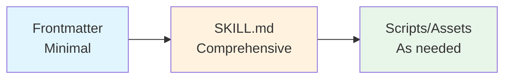

AI Agent Skills là một bước tiến quan trọng trong việc mở rộng khả năng của Large Language Models (LLM). Thay vì training lại model hay viết code phức tạp, Skills cho phép **inject domain-specific instructions** vào context của LLM - biến AI đa năng thành chuyên gia trong từng lĩnh vực cụ thể.

<!--truncate-->

## 1. Skills là gì? Không phải Code, mà là Prompt!

Điểm đặc biệt đầu tiên cần hiểu: **Skills KHÔNG phải executable code**. Không có Python, JavaScript, hay HTTP server nào chạy phía sau. Skills là:

- **Specialized prompt templates** - inject domain-specific instructions vào conversation context
- **Context modifiers** - thay đổi cách LLM xử lý request tiếp theo
- **Meta-tool architecture** - một tool đặc biệt quản lý tất cả các skills


### Skill vs Tool: Khác biệt căn bản

| Đặc điểm | Tool (Read, Write, Bash) | Skill |
|----------|-------------------------|-------|
| Bản chất | Execute actions | Inject prompts |
| Kết quả | Return data | Prepare Claude |
| Scope | Single operation | Modify entire approach |
| Ví dụ | Đọc file, chạy lệnh | Trở thành PDF specialist |

## 2. Cấu trúc SKILL.md - Trái tim của mọi Skill

Mỗi skill được định nghĩa trong file `SKILL.md` với 2 phần chính:

### Frontmatter (YAML) - Configuration

```yaml
---
name: skill-creator
description: Guide for creating effective skills. This skill should be used 
  when users want to create a new skill that extends Claude's capabilities.
allowed-tools: "Read,Write,Bash,Glob,Grep,Edit"
license: Complete terms in LICENSE.txt
---
```

**Các field quan trọng:**

- **`name`** (Required): Tên skill, dùng làm command để invoke
- **`description`** (Required): Mô tả để Claude quyết định khi nào invoke skill
- **`allowed-tools`** (Optional): Quyền sử dụng tools khi skill active
- **`license`** (Optional): Thông tin license

### Markdown Content - Instructions cho Claude

Phần nội dung chứa instructions chi tiết:

```markdown
# Skill Name

## Purpose
Giải thích mục đích của skill

## Process
1. Bước 1: Thực hiện gì
2. Bước 2: Tiếp tục với gì
3. Bước 3: Hoàn thành

## Examples
[Các ví dụ minh họa]
```

## 3. Skill Discovery - LLM Reasoning, Không phải Algorithm

Điểm đặc biệt của Claude Skills: **Không có algorithm routing** hay intent classification. Quy trình:

1. System format tất cả available skills thành text description
2. Embed vào `Skill tool` prompt
3. Claude **đọc và reasoning** để match user intent với skill description
4. Nếu match, Claude invoke `Skill` tool với `command: "skill-name"`

```
User: "Giúp tôi tạo một skill mới"
        ↓
Claude reads: "skill-creator: Create well-structured, reusable skills..."
        ↓
Claude recognizes match
        ↓
Invoke: Skill(command: "skill-creator")
```

> **Key Insight**: Selection hoàn toàn dựa vào LLM reasoning - không có regex, keyword matching, hay ML-based intent detection. Decision xảy ra trong Claude's forward pass.

## 4. Common Skill Patterns

### Pattern 1: Script Automation

Offload complex operations sang Python/Bash scripts:

```markdown
Run scripts/analyzer.py on target directory:
`python {baseDir}/scripts/analyzer.py --path "$USER_PATH"`

Parse the generated report.json and present findings.
```

### Pattern 2: Read - Process - Write

Simple file transformation:

```markdown
## Processing Workflow
1. Read input file using Read tool
2. Parse content according to format
3. Transform data following specifications
4. Write output using Write tool
5. Report completion with summary
```

### Pattern 3: Search - Analyze - Report

Codebase analysis pattern:

```markdown
## Analysis Process
1. Use Grep to find relevant code patterns
2. Read each matched file
3. Analyze for vulnerabilities
4. Generate structured report
```

### Pattern 4: Wizard-Style Multi-Step

Complex processes với user confirmation:

```markdown
### Step 1: Initial Setup
1. Ask user for project type
2. Validate prerequisites
Wait for user confirmation before proceeding.

### Step 2: Configuration
1. Present options
2. Generate config
Wait for confirmation...
```

## 5. Internal Architecture: Two-Message Pattern

Khi skill execute, system inject **2 messages** vào conversation:

### Message 1: User-visible metadata

```typescript
// isMeta: false → VISIBLE to user
{
  content: `<command-message>The "pdf" skill is loading</command-message>
            <command-name>pdf</command-name>`,
  isMeta: false  // Shows in UI
}
```

### Message 2: Hidden instructions

```typescript
// isMeta: true → HIDDEN from user, sent to API
{
  content: `[Full SKILL.md content - có thể hàng nghìn từ]`,
  isMeta: true  // Hidden from UI
}
```

```mermaid
flowchart TB
    subgraph "Skill Execution"
        A[Skill Invoked] --> B[Message 1: Metadata]
        A --> C[Message 2: Instructions]
        B -->|isMeta: false| D[User sees: <br/>"pdf skill is loading"]
        C -->|isMeta: true| E[Claude receives: <br/>Full instructions]
    end
```

**Tại sao cần 2 messages?**

- Single message với `isMeta: false`: User thấy ngàn dòng instructions → UI unusable
- Single message với `isMeta: true`: User không biết skill nào đang chạy → No transparency

Two-message pattern giải quyết cả hai vấn đề!

## 6. Progressive Disclosure - Nguyên tắc thiết kế quan trọng

Skills follow nguyên tắc **Progressive Disclosure**:

1. **Level 1 - Frontmatter**: Minimal info (name, description)
2. **Level 2 - SKILL.md loaded**: Comprehensive instructions
3. **Level 3 - Runtime**: Load scripts, assets, references khi cần



## 7. Key Takeaways

1. **Skills = Prompt Templates** - Không phải executable code
2. **Skill Tool là Meta-Tool** - Quản lý tất cả individual skills
3. **Conversation Context Injection** - Via `isMeta: true` messages
4. **Execution Context Modification** - Thay đổi tool permissions, model selection
5. **LLM-based Selection** - Không có algorithmic matching
6. **Scoped Permissions** - Tools được phép chỉ trong skill execution
7. **Two-Message Pattern** - Transparency + Clean UI

> **The Elegant Design**: Bằng cách treat specialized knowledge như prompts thay vì executable code, Skills đạt được **flexibility, safety, và composability** khó có được với traditional function calling.

## Nguồn tham khảo

- [Claude Agent Skills: A First Principles Deep Dive](https://leehanchung.github.io/blogs/2025/10/26/claude-skills-deep-dive/) - Han Lee
- [Introducing Agent Skills](https://www.anthropic.com/news/skills) - Anthropic
- [Equipping Agents for the Real World](https://www.anthropic.com/engineering/equipping-agents-for-the-real-world-with-agent-skills) - Anthropic Engineering
- [Claude Code Documentation](https://docs.claude.com/en/docs/claude-code/overview)
- [Skill Creator Skill](https://github.com/anthropics/skills/tree/main/skill-creator) - GitHub
