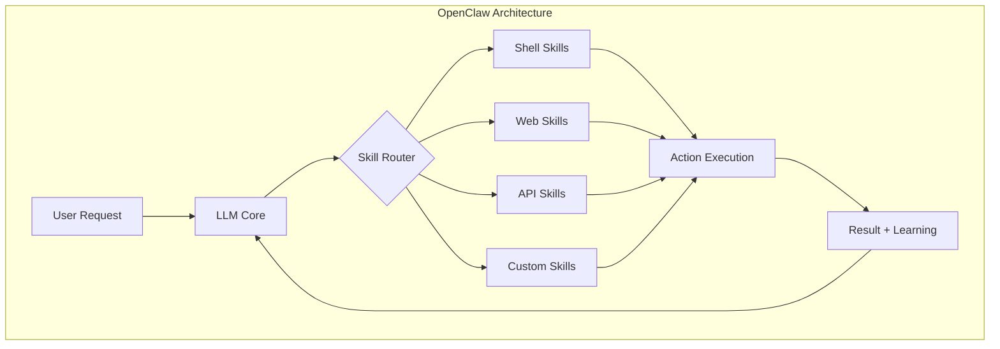
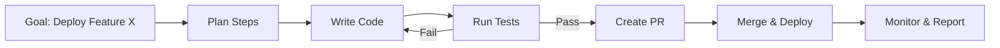
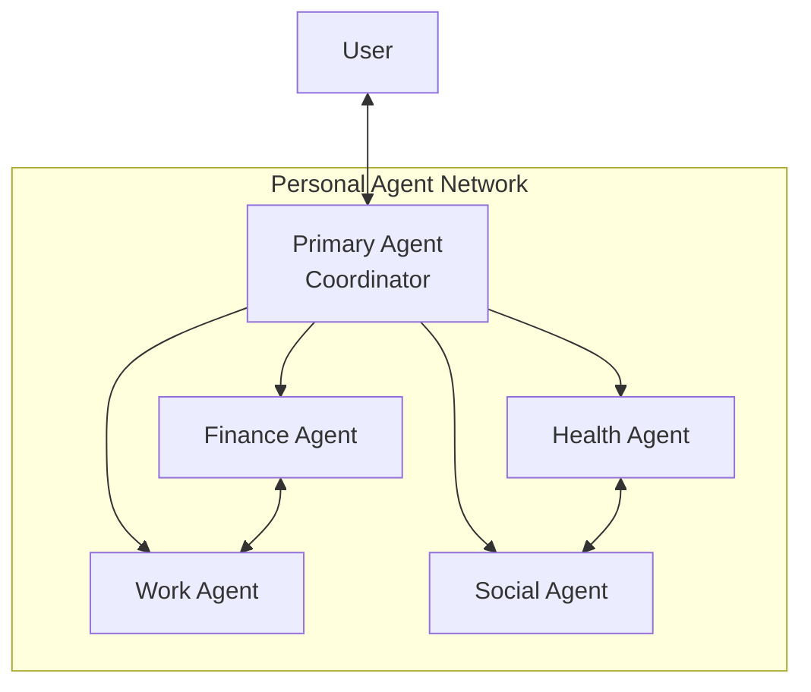
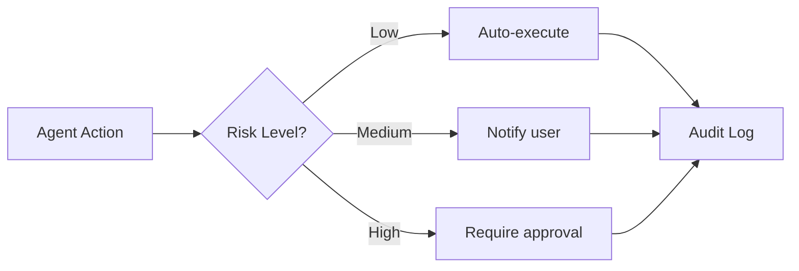
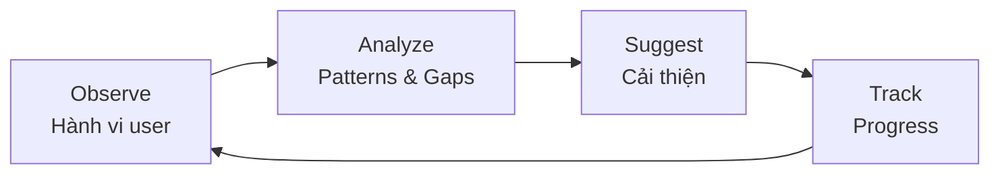
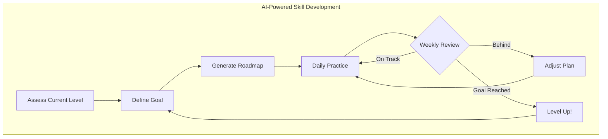
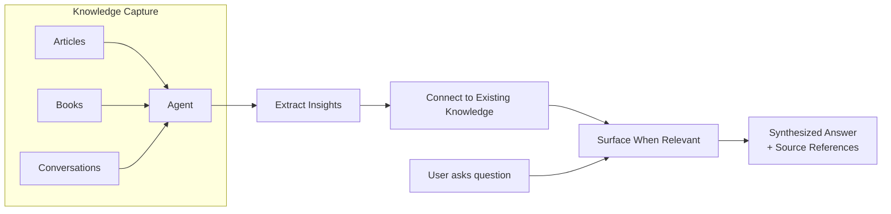

Chúng ta đang chứng kiến sự chuyển đổi lớn trong cách con người tương tác với AI. Từ chatbot đơn giản trả lời câu hỏi, AI đang tiến hóa thành **Personal Agent** - trợ lý cá nhân có khả năng **hành động tự chủ** thay vì chỉ phản hồi. OpenClaw là một trong những dự án tiên phong cho xu hướng này.

<!--truncate-->

## 1. OpenClaw là gì?

**OpenClaw** là trợ lý AI cá nhân mã nguồn mở, được mô tả như "Claude with hands" - không chỉ trả lời câu hỏi mà còn **thực sự hành động** trên hệ thống của bạn.

### Điểm đặc biệt của OpenClaw

| Tính năng | Mô tả |
|-----------|-------|
| **Task Automation** | Quản lý email, lịch, check-in chuyến bay, gửi tin nhắn |
| **System Interaction** | Chạy terminal commands, scripts, browse web, đọc/ghi files |
| **Persistent Memory** | Nhớ thói quen, học dần, proactively gợi ý |
| **Multi-Platform** | Tích hợp WhatsApp, Telegram, Discord, iMessage, Slack |
| **Self-Building Skills** | Tự viết scripts để hoàn thành task mới |

```bash
# Cài đặt OpenClaw
curl -fsSL https://openclaw.ai/install.sh | bash

# Hoặc qua npm
npm install -g openclaw@latest
openclaw onboard --install-daemon
```

### Kiến trúc AgentSkills

OpenClaw sử dụng hệ thống **100+ AgentSkills** preconfigured cho các tác vụ:
- Shell command execution
- File system management  
- Web automation
- API integration

Người dùng cũng có thể phát triển **custom skills** riêng.



## 2. Lộ Trình Personal Agent: Từ Gần đến Xa

Dựa trên xu hướng phát triển hiện tại, đây là **roadmap** của personal AI agent:

### 🔵 Phase 1: Reactive Assistant (2025)

**Đặc điểm:**
- Phản hồi theo yêu cầu trực tiếp
- Một lệnh → Một hành động
- Không có memory dài hạn hạn

**Ví dụ:** ChatGPT, Claude, Gemini dạng chat thuần

```
User: "Tóm tắt email này"
AI: [Tóm tắt ngay]
→ Kết thúc
```

---

### 🟢 Phase 2: Proactive Assistant (2026 - Hiện tại)

**Đặc điểm:**
- Persistent memory across sessions
- Học thói quen, anticipate needs
- Tích hợp multi-platform (messaging apps)
- **OpenClaw đang ở phase này**

**Ví dụ thực tế:**
```
6:00 AM: "Chào buổi sáng! Hôm nay bạn có 3 cuộc họp. 
Chuyến bay VN123 delay 30 phút. Đã reschedule taxi."
→ Không cần user yêu cầu
```

**Công nghệ cần:**
- Long-term memory systems
- Cross-platform integration
- Background daemon/service

---

### 🟡 Phase 3: Autonomous Specialist (2026-2027)

**Đặc điểm:**
- Autonomous decision-making trong scope được định nghĩa
- Multi-step planning và execution
- Self-error correction
- Domain-specific expertise

**Use cases:**
- **Finance Agent:** Tự rebalance portfolio, spot anomalies
- **Health Agent:** Track metrics, suggest lifestyle changes
- **Dev Agent:** Code review, bug fixing, deployment



**Challenges:**
- Trust và verification
- Rollback mechanisms
- Clear boundaries cho autonomous actions

---

### 🟠 Phase 4: Collaborative Agent Network (2027-2028)

**Đặc điểm:**
- Nhiều agents chuyên biệt collaborate
- Agent-to-agent communication
- Shared context và knowledge
- Hierarchical delegation

**Kiến trúc:**



**Scenario:**
```
User: "Tổ chức trip Đà Nẵng tuần sau"

→ Work Agent: Check calendar conflicts, request PTO
→ Finance Agent: Budget analysis, book flights/hotel
→ Social Agent: Notify friends, coordinate schedules
→ Health Agent: Pack medication reminders
→ Primary Agent: Consolidate và confirm với user
```

---

### 🔴 Phase 5: Digital Twin (2029+)

**Đặc điểm:**
- **Fully representative** của user trong digital world
- Có thể act on behalf trong hầu hết contexts
- Deep personality modeling
- Adaptive learning từ every interaction

**Capabilities:**
- Attend meetings đại diện cho user
- Respond emails theo writing style của user
- Make decisions within defined parameters
- Continuous self-improvement

> ⚠️ **Ethical Considerations:** Digital Twin đặt ra câu hỏi lớn về identity, consent, và accountability.

## 3. Các Thách Thức Cần Giải Quyết

### Security & Privacy

| Concern | Mitigation |
|---------|------------|
| Deep system access | Sandboxing, principle of least privilege |
| Credential storage | Secure vaults, hardware keys |
| Data sovereignty | Local-first, self-hosted options |

### Trust & Verification



### Ethical Considerations

1. **Accountability:** Ai chịu trách nhiệm khi agent gây lỗi?
2. **Deepfakes & Impersonation:** Agent có thể bị lợi dụng không?
3. **Job Displacement:** Tác động đến lao động?
4. **Digital Identity:** Khi nào agent = user?

## 4. Bắt Đầu với OpenClaw

### Quick Start

```bash
# 1. Install
curl -fsSL https://openclaw.ai/install.sh | bash

# 2. Onboard wizard sẽ guide qua:
#    - Model config (Claude, GPT, local models)
#    - Channel setup (Telegram, WhatsApp, Discord)
#    - Permission settings

# 3. Connect messaging platforms
#    - Telegram: Tạo bot qua @BotFather
#    - Discord: Create application + bot token
```

### Best Practices

1. **Run as non-privileged user** - Minimize attack surface
2. **Isolate working directory** - Sandbox file operations  
3. **Be explicit with instructions** - Clear boundaries
4. **Test new capabilities carefully** - Start với low-risk tasks
5. **Monitor audit logs** - Review agent actions định kỳ

## 5. Continuous Self-Improvement: AI Giúp Bạn Phát Triển Bản Thân

Một trong những tiềm năng lớn nhất của Personal Agent là khả năng **hỗ trợ người dùng tự cải thiện liên tục**. Không chỉ làm thay công việc, AI có thể trở thành **coach cá nhân** giúp bạn phát triển mỗi ngày.

### 5.1. Learning Loop - Vòng Lặp Học Tập

Personal Agent có thể thiết lập **feedback loop** liên tục:



**Ứng dụng thực tế:**

| Lĩnh vực | Agent hỗ trợ như thế nào |
|----------|--------------------------|
| **Học ngoại ngữ** | Phân tích errors từ conversations, gợi ý từ vựng cần review, spaced repetition tự động |
| **Viết lách** | Nhận xét về writing style, so sánh với previous versions, gợi ý cải thiện |
| **Coding** | Track code quality metrics, identify repeated mistakes, suggest learning resources |
| **Communication** | Phân tích email responses, feedback về tone và clarity |

### 5.2. Habit Formation - Xây Dựng Thói Quen

Agent có thể đóng vai trò **accountability partner**:

```
Day 1: "Bạn muốn đọc sách 30 phút/ngày. Bắt đầu nhé!"

Day 7: "Tuyệt vời! 6/7 ngày hoàn thành. Streak đang tốt 🔥"

Day 14: "Nhận thấy bạn thường bỏ qua vào Thứ 4. 
Có thể do họp nhiều? Thử đọc sáng sớm hơn?"

Day 30: "Thói quen 30 ngày hình thành! 
Trung bình bạn đọc 45 phút - vượt mục tiêu 50%"
```

**Key features:**
- **Smart reminders** - Nhắc đúng timing dựa trên pattern của user
- **Adaptive goals** - Điều chỉnh mục tiêu theo performance thực tế
- **Pattern recognition** - Phát hiện obstacles và đề xuất solutions
- **Celebration & rewards** - Gamification để duy trì motivation

### 5.3. Skill Development Roadmap

Personal Agent có thể tạo **personalized learning paths**:



**Ví dụ: Học Machine Learning từ zero**

```
Week 1-2: Python Fundamentals
├── Day 1-3: Basic syntax (Agent gợi ý exercises)
├── Day 4-5: NumPy/Pandas (Agent review code bạn viết)
└── Day 6-7: Mini project (Agent đánh giá và feedback)

Week 3-4: Statistics & Math
├── Agent điều chỉnh pace dựa trên progress Week 1-2
├── Gợi ý video/articles phù hợp learning style
└── Quiz hàng ngày để reinforce knowledge

Week 5-8: ML Algorithms
├── Hands-on projects với real datasets
├── Agent review implementations, so sánh với best practices
└── Track understanding level qua Q&A sessions
```

### 5.4. Reflection & Self-Awareness

Agent hỗ trợ **structured reflection**:

**Daily Check-in:**
```
Morning: "3 priorities hôm nay là gì?"
Evening: "Bạn đã complete 2/3 priorities. 
         Priority #3 bị block vì gì? Cần reschedule không?"
```

**Weekly Review:**
```
"Tuần này bạn:
✅ Completed 15 tasks (↑20% vs tuần trước)
📊 Focus time: 25 hours (Peak: Thứ 3-4)
⚠️ 3 meetings could have been emails
💡 Pattern: Productive nhất từ 9-11 AM

Recommendations:
1. Block 9-11 AM cho deep work
2. Batch meetings vào chiều
3. Review meeting necessity trước khi accept"
```

### 5.5. Personal Knowledge Management

Agent như một **second brain** luôn học cùng bạn:



**Ứng dụng:**
- **Auto-summarize** articles bạn đọc, extract key points
- **Connect dots** giữa các concepts khác nhau
- **Resurface** knowledge cũ khi relevant đến task hiện tại
- **Knowledge gaps detection** - Phát hiện và gợi ý lấp đầy

### 5.6. Implementation Ideas với OpenClaw

Để bắt đầu continuous self-improvement với OpenClaw:

```bash
# 1. Setup daily check-in skill
openclaw skill add personal-growth

# 2. Configure learning preferences
openclaw config set learning.style "visual,hands-on"
openclaw config set learning.pace "moderate"

# 3. Enable habit tracking
openclaw habit add "read-30min" --frequency "daily" --reminder "7:00 AM"
openclaw habit add "exercise" --frequency "3x-week" --flexible

# 4. Connect knowledge sources
openclaw connect notion --workspace "Personal"
openclaw connect pocket --sync-articles
```

**Custom Skill Example - Weekly Review:**

```markdown
# SKILL.md
---
name: weekly-review
description: Generate personalized weekly productivity and growth review
allowed-tools: "Read, Write, Calendar, Tasks"
---

## Process
1. Pull all completed tasks from past 7 days
2. Analyze time spent per project/category
3. Compare with previous weeks for trends
4. Identify wins, challenges, and patterns
5. Generate actionable recommendations
6. Schedule follow-up items for next week

## Output Format
- Executive summary (3-5 bullet points)
- Detailed breakdown with charts
- Action items for improvement
```

> 💡 **Pro Tip:** Start small với 1-2 habits hoặc learning goals. Để agent observe patterns trong 2-3 tuần trước khi optimize.

## 6. Kết Luận

Chúng ta đang ở **giai đoạn đầu** của cuộc cách mạng Personal Agent:

| Timeline | Phase | Key Feature |
|----------|-------|-------------|
| 2024 | Reactive | Trả lời câu hỏi |
| **2025-Now** | **Proactive** | **Learn & anticipate (OpenClaw)** |
| 2026-2027 | Autonomous | Self-planning trong scope |
| 2028 | Collaborative | Multi-agent network |
| 2029+ | Digital Twin | Full representation |

**OpenClaw** đánh dấu bước chuyển quan trọng từ AI "chỉ nói" sang AI "có thể làm". Dù còn nhiều thách thức về security và ethics, tiềm năng của personal agent là rất lớn.

> **Key Insight:** Tương lai không phải là AI thay thế con người, mà là **AI amplify khả năng của từng cá nhân** - mỗi người sẽ có một "digital self" làm việc không ngừng nghỉ.

## Nguồn Tham Khảo

- [OpenClaw Official](https://openclaw.ai) - Documentation và installation
- [OpenClaw GitHub](https://github.com/openclaw/openclaw) - Source code
- [AI Agents 2025 Trends](https://www.forbes.com/sites/technology/) - Forbes Technology
- [Autonomous Agents: The Next Wave](https://www.mckinsey.com/capabilities/mckinsey-digital/) - McKinsey Digital
- [The Future of Personal AI](https://www.ibm.com/think/) - IBM Research
