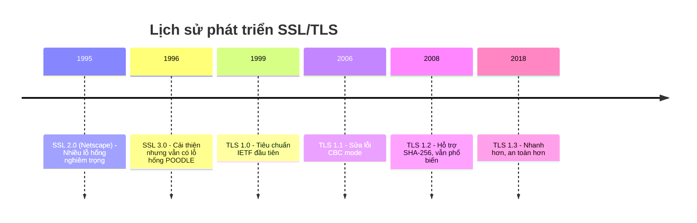
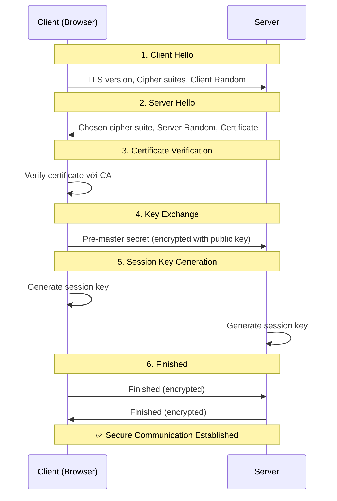
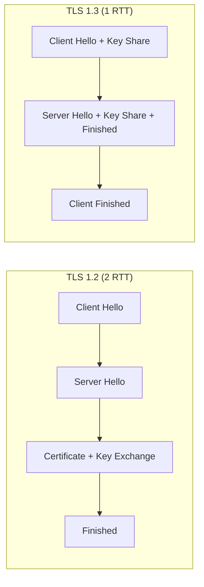
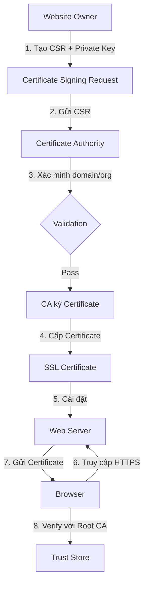
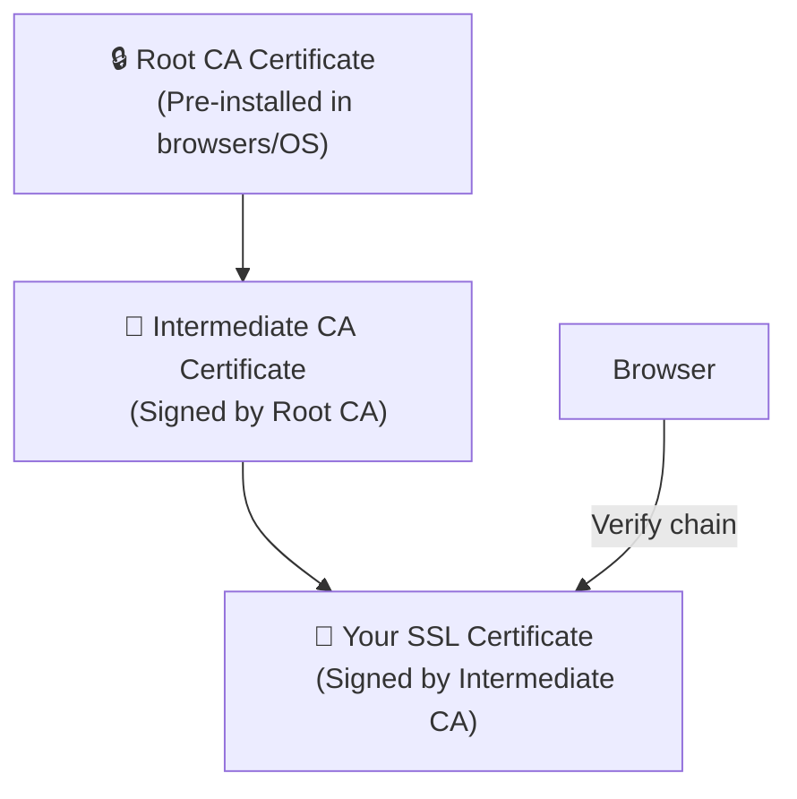
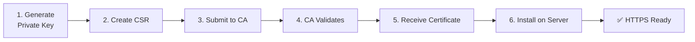

# SSL/TLS và HTTPS: Hướng Dẫn Toàn Diện Về Bảo Mật Web

Trong thời đại số hóa, bảo mật thông tin trên internet là vấn đề quan trọng hàng đầu. **SSL/TLS** và **HTTPS** là những công nghệ nền tảng đảm bảo dữ liệu được truyền tải an toàn giữa người dùng và server. Bài viết này sẽ giúp bạn hiểu sâu về các khái niệm này từ nguyên lý đến thực hành.

<!--truncate-->

## 1. Khái Niệm Cơ Bản

### SSL và TLS là gì?

**SSL (Secure Sockets Layer)** và **TLS (Transport Layer Security)** là các giao thức mã hóa đảm bảo giao tiếp an toàn qua mạng internet.

- **SSL**: Phiên bản gốc, được phát triển bởi Netscape vào những năm 1990
- **TLS**: Phiên bản cải tiến và an toàn hơn, thay thế SSL

> [!NOTE]
> Mặc dù SSL đã không còn được sử dụng, thuật ngữ "SSL" vẫn thường được dùng để chỉ cả SSL lẫn TLS trong thực tế.

### HTTPS là gì?

**HTTPS (Hypertext Transfer Protocol Secure)** là phiên bản bảo mật của HTTP, sử dụng TLS để mã hóa dữ liệu.

```
HTTP  → Dữ liệu truyền dạng plaintext (không mã hóa)
HTTPS → Dữ liệu được mã hóa bởi TLS
```

### Ba Trụ Cột Bảo Mật

| Trụ cột | Mô tả | Ví dụ |
|---------|-------|-------|
| **Mã hóa (Encryption)** | Dữ liệu không thể đọc được nếu bị chặn | Mật khẩu không bị lộ khi đăng nhập |
| **Xác thực (Authentication)** | Xác minh danh tính server | Đảm bảo đúng website ngân hàng |
| **Toàn vẹn (Integrity)** | Dữ liệu không bị thay đổi trong quá trình truyền | Số tiền giao dịch không bị sửa |

---

## 2. Lịch Sử Phát Triển

### Timeline SSL/TLS



### So Sánh Các Phiên Bản

| Phiên bản | Năm | Trạng thái | Ghi chú |
|-----------|-----|------------|---------|
| SSL 2.0 | 1995 | ❌ Deprecated | Nhiều lỗ hổng, tấn công MitM |
| SSL 3.0 | 1996 | ❌ Deprecated | Lỗ hổng POODLE |
| TLS 1.0 | 1999 | ⚠️ Lỗi thời | Lỗ hổng BEAST, không nên dùng |
| TLS 1.1 | 2006 | ⚠️ Lỗi thời | Browser đã loại bỏ hỗ trợ |
| TLS 1.2 | 2008 | ✅ An toàn | Phổ biến nhất hiện nay |
| TLS 1.3 | 2018 | ✅ Khuyến nghị | Nhanh nhất, an toàn nhất |

> [!IMPORTANT]
> Tính đến 2024, **TLS 1.2** và **TLS 1.3** là hai phiên bản duy nhất nên được sử dụng. Các trình duyệt chính đã loại bỏ hỗ trợ TLS 1.0 và 1.1.

---

## 3. TLS Handshake - Quá Trình Bắt Tay

TLS Handshake là quá trình thiết lập kết nối an toàn giữa client và server. Đây là bước quan trọng nhất trong việc đảm bảo bảo mật.

### Sơ Đồ Handshake



### Chi Tiết Từng Bước

#### Bước 1: Client Hello
Client gửi yêu cầu kết nối với thông tin:
- Phiên bản TLS hỗ trợ (TLS 1.2, TLS 1.3)
- Danh sách cipher suites
- **Client Random**: chuỗi bytes ngẫu nhiên

#### Bước 2: Server Hello
Server phản hồi với:
- Phiên bản TLS được chọn
- Cipher suite được chọn
- **Server Random**: chuỗi bytes ngẫu nhiên
- **SSL Certificate**: chứa public key

#### Bước 3: Certificate Verification
Client xác minh certificate:
- Kiểm tra chữ ký của CA
- Kiểm tra thời hạn hiệu lực
- Kiểm tra domain name khớp

#### Bước 4: Key Exchange
Client tạo **pre-master secret**, mã hóa bằng public key của server và gửi đi.

#### Bước 5: Session Key Generation
Cả hai bên dùng công thức:
```
Session Key = PRF(Pre-master Secret, Client Random, Server Random)
```

#### Bước 6: Finished
Hai bên gửi message "Finished" được mã hóa để xác nhận handshake thành công.

### So Sánh TLS 1.2 vs TLS 1.3 Handshake

| Đặc điểm | TLS 1.2 | TLS 1.3 |
|----------|---------|---------|
| **Round trips** | 2 RTT | 1 RTT (hoặc 0-RTT resumption) |
| **Key exchange** | RSA hoặc ECDHE | Chỉ ECDHE (bắt buộc Forward Secrecy) |
| **Cipher suites** | Nhiều lựa chọn | Chỉ AEAD ciphers |
| **Handshake encryption** | Một phần | Hầu hết được mã hóa |



---

## 4. Các Loại SSL/TLS Certificates

Certificates được phân loại theo **mức độ xác minh** của Certificate Authority (CA).

### Domain Validated (DV)

**Mức xác minh**: Chỉ xác minh quyền sở hữu domain

```yaml
Thời gian cấp: Vài phút đến vài giờ
Chi phí: Miễn phí (Let's Encrypt) hoặc thấp
Phù hợp: Blog, website cá nhân
```

**Quy trình xác minh:**
1. CA gửi email đến admin@domain.com
2. Hoặc yêu cầu đặt file xác minh trên server
3. Xác minh DNS record

### Organization Validated (OV)

**Mức xác minh**: Xác minh domain + thông tin tổ chức

```yaml
Thời gian cấp: 1-3 ngày
Chi phí: Trung bình
Phù hợp: Doanh nghiệp, corporate sites
```

**Quy trình xác minh:**
1. Xác minh domain ownership
2. Kiểm tra thông tin doanh nghiệp (tên, địa chỉ, điện thoại)
3. Xác minh qua cơ sở dữ liệu chính phủ

### Extended Validation (EV)

**Mức xác minh**: Xác minh nghiêm ngặt nhất

```yaml
Thời gian cấp: 1-5 ngày
Chi phí: Cao nhất
Phù hợp: Ngân hàng, e-commerce, tài chính
```

**Đặc điểm:**
- Hiển thị tên tổ chức trong browser (một số browser)
- Xác minh tồn tại pháp lý, vật lý, hoạt động
- Tuân thủ CA/Browser Forum guidelines

### So Sánh Các Loại Certificate

| Loại | Xác minh | Thời gian | Chi phí | Phù hợp |
|------|----------|-----------|---------|---------|
| **DV** | Domain only | Phút/giờ | Thấp/Miễn phí | Blog, sites nhỏ |
| **OV** | Domain + Org | 1-3 ngày | Trung bình | Doanh nghiệp |
| **EV** | Toàn diện | 1-5 ngày | Cao | Ngân hàng, Fintech |

### Wildcard và Multi-Domain

| Loại | Mô tả | Ví dụ |
|------|-------|-------|
| **Single Domain** | 1 domain | example.com |
| **Wildcard** | 1 domain + subdomains | *.example.com |
| **Multi-Domain (SAN)** | Nhiều domains | example.com, example.org |

---

## 5. Certificate Authority (CA)

### CA Hoạt Động Như Thế Nào?



### Certificate Chain of Trust



### Các CA Phổ Biến

| CA | Miễn phí | Ghi chú |
|----|----------|---------|
| **Let's Encrypt** | ✅ | Tự động, phổ biến nhất |
| **DigiCert** | ❌ | Enterprise, EV certificates |
| **Sectigo** | ❌ | Đa dạng sản phẩm |
| **GlobalSign** | ❌ | Enterprise solutions |
| **Cloudflare** | ✅ (qua CDN) | Tích hợp với CDN |

---

## 6. Các Lỗ Hổng Bảo Mật Phổ Biến

### Bảng Tổng Hợp Vulnerabilities

| Vulnerability | Ảnh hưởng | Phiên bản | Mô tả |
|---------------|-----------|-----------|-------|
| **POODLE** | SSL 3.0 | 2014 | Tấn công CBC mode padding |
| **BEAST** | TLS 1.0 | 2011 | Khai thác IV có thể đoán được |
| **CRIME** | TLS 1.0 | 2012 | Khai thác TLS compression |
| **Heartbleed** | OpenSSL | 2014 | Memory leak trong OpenSSL |
| **FREAK** | SSL/TLS | 2015 | Downgrade attack |
| **Logjam** | DHE | 2015 | Weak Diffie-Hellman |
| **DROWN** | SSLv2 | 2016 | Cross-protocol attack |

### Chi Tiết Một Số Lỗ Hổng

#### POODLE (Padding Oracle On Downgraded Legacy Encryption)
```
Mục tiêu: SSL 3.0
Kiểu tấn công: Man-in-the-middle
Giải pháp: Disable SSL 3.0 hoàn toàn
```

#### Heartbleed
```
Mục tiêu: OpenSSL 1.0.1 - 1.0.1f
Kiểu tấn công: Memory disclosure
Hậu quả: Lộ private keys, session data
Giải pháp: Update OpenSSL, revoke old certificates
```

> [!CAUTION]
> Nếu server của bạn vẫn hỗ trợ SSL 3.0, TLS 1.0, hoặc TLS 1.1, hãy tắt ngay lập tức! Các phiên bản này có nhiều lỗ hổng bảo mật nghiêm trọng.

---

## 7. Best Practices cho Web Developers

### 7.1. Sử Dụng TLS 1.3

TLS 1.3 mang lại:
- **Faster handshake**: 1-RTT thay vì 2-RTT
- **Forward Secrecy bắt buộc**: ECDHE required
- **Loại bỏ cipher yếu**: Chỉ AEAD ciphers

### 7.2. Cấu Hình HSTS

**HTTP Strict Transport Security** buộc browser chỉ kết nối qua HTTPS.

```
Strict-Transport-Security: max-age=31536000; includeSubDomains; preload
```

| Parameter | Mô tả |
|-----------|-------|
| `max-age` | Thời gian cache (seconds) |
| `includeSubDomains` | Áp dụng cho subdomains |
| `preload` | Đăng ký vào HSTS preload list |

### 7.3. Cipher Suites Khuyến Nghị

**TLS 1.3 (Khuyến nghị):**
```
TLS_AES_256_GCM_SHA384
TLS_CHACHA20_POLY1305_SHA256
TLS_AES_128_GCM_SHA256
```

**TLS 1.2 (Fallback):**
```
ECDHE-ECDSA-AES256-GCM-SHA384
ECDHE-RSA-AES256-GCM-SHA384
ECDHE-ECDSA-AES128-GCM-SHA256
```

### 7.4. Security Headers Quan Trọng

```nginx
# Nginx configuration
add_header X-Content-Type-Options nosniff;
add_header X-Frame-Options DENY;
add_header X-XSS-Protection "1; mode=block";
add_header Content-Security-Policy "default-src 'self'";
add_header Referrer-Policy "strict-origin-when-cross-origin";
```

---

## 8. Hướng Dẫn Cài Đặt HTTPS

### 8.1. Nguyên Lý Hoạt Động



### 8.2. Sử Dụng Let's Encrypt (Miễn Phí)

#### Cài đặt Certbot

```bash
# Ubuntu/Debian
sudo apt update
sudo apt install certbot

# Với Nginx
sudo apt install python3-certbot-nginx

# Với Apache
sudo apt install python3-certbot-apache
```

#### Cấp Certificate Tự Động

```bash
# Nginx - tự động cấu hình
sudo certbot --nginx -d example.com -d www.example.com

# Apache - tự động cấu hình
sudo certbot --apache -d example.com -d www.example.com

# Chỉ cấp cert (manual config)
sudo certbot certonly --webroot -w /var/www/html -d example.com
```

#### Auto-Renewal

```bash
# Test renewal
sudo certbot renew --dry-run

# Certbot tự động thêm cron job để renew
# Kiểm tra timer
sudo systemctl status certbot.timer
```

### 8.3. Cấu Hình Nginx với HTTPS

```nginx
# /etc/nginx/sites-available/example.com

# Redirect HTTP to HTTPS
server {
    listen 80;
    listen [::]:80;
    server_name example.com www.example.com;
    return 301 https://$server_name$request_uri;
}

# HTTPS server
server {
    listen 443 ssl http2;
    listen [::]:443 ssl http2;
    server_name example.com www.example.com;

    # SSL Certificate
    ssl_certificate /etc/letsencrypt/live/example.com/fullchain.pem;
    ssl_certificate_key /etc/letsencrypt/live/example.com/privkey.pem;

    # SSL Configuration
    ssl_protocols TLSv1.2 TLSv1.3;
    ssl_ciphers ECDHE-ECDSA-AES128-GCM-SHA256:ECDHE-RSA-AES128-GCM-SHA256:ECDHE-ECDSA-AES256-GCM-SHA384:ECDHE-RSA-AES256-GCM-SHA384;
    ssl_prefer_server_ciphers off;

    # HSTS
    add_header Strict-Transport-Security "max-age=31536000; includeSubDomains" always;

    # OCSP Stapling
    ssl_stapling on;
    ssl_stapling_verify on;
    ssl_trusted_certificate /etc/letsencrypt/live/example.com/chain.pem;
    resolver 8.8.8.8 8.8.4.4 valid=300s;

    # Root và location
    root /var/www/example.com;
    index index.html;

    location / {
        try_files $uri $uri/ =404;
    }
}
```

### 8.4. Cấu Hình Apache với HTTPS

```apache
# /etc/apache2/sites-available/example.com-ssl.conf

<VirtualHost *:80>
    ServerName example.com
    ServerAlias www.example.com
    Redirect permanent / https://example.com/
</VirtualHost>

<VirtualHost *:443>
    ServerName example.com
    ServerAlias www.example.com
    DocumentRoot /var/www/example.com

    # SSL Configuration
    SSLEngine on
    SSLCertificateFile /etc/letsencrypt/live/example.com/cert.pem
    SSLCertificateKeyFile /etc/letsencrypt/live/example.com/privkey.pem
    SSLCertificateChainFile /etc/letsencrypt/live/example.com/chain.pem

    # Modern SSL Config
    SSLProtocol all -SSLv2 -SSLv3 -TLSv1 -TLSv1.1
    SSLCipherSuite ECDHE-ECDSA-AES128-GCM-SHA256:ECDHE-RSA-AES128-GCM-SHA256:ECDHE-ECDSA-AES256-GCM-SHA384:ECDHE-RSA-AES256-GCM-SHA384
    SSLHonorCipherOrder off

    # HSTS Header
    Header always set Strict-Transport-Security "max-age=31536000; includeSubDomains"

    # OCSP Stapling
    SSLUseStapling On
    SSLStaplingCache "shmcb:logs/ssl_stapling(32768)"
</VirtualHost>
```

**Enable modules và site:**
```bash
sudo a2enmod ssl headers
sudo a2ensite example.com-ssl.conf
sudo systemctl reload apache2
```

### 8.5. Kiểm Tra Sau Cài Đặt

#### Sử dụng SSL Labs

Truy cập [SSL Labs Server Test](https://www.ssllabs.com/ssltest/) để kiểm tra cấu hình SSL của bạn.

**Mục tiêu:**
- Score: A hoặc A+
- Không có warning về protocols/ciphers yếu

#### Command Line Testing

```bash
# Check certificate
openssl s_client -connect example.com:443 -servername example.com

# Check TLS version
openssl s_client -connect example.com:443 -tls1_3

# Check expiry
echo | openssl s_client -connect example.com:443 2>/dev/null | openssl x509 -noout -dates
```

---

## Checklist Triển Khai HTTPS

- [ ] Chọn loại certificate phù hợp (DV/OV/EV)
- [ ] Cài đặt Certbot hoặc công cụ ACME
- [ ] Cấp SSL certificate
- [ ] Cấu hình web server (Nginx/Apache)
- [ ] Redirect HTTP → HTTPS
- [ ] Enable HSTS header
- [ ] Disable SSL 3.0, TLS 1.0, TLS 1.1
- [ ] Cấu hình cipher suites mạnh
- [ ] Setup auto-renewal
- [ ] Test với SSL Labs (target: A+)
- [ ] Monitor certificate expiry

---

## Kết Luận

SSL/TLS và HTTPS là nền tảng quan trọng của bảo mật web hiện đại. Với việc hiểu rõ nguyên lý hoạt động, quá trình handshake, và các best practices, bạn có thể:

1. **Bảo vệ người dùng** khỏi các cuộc tấn công man-in-the-middle
2. **Xây dựng niềm tin** với certificates và HTTPS
3. **Tuân thủ tiêu chuẩn** bảo mật như PCI DSS
4. **Cải thiện SEO** vì Google ưu tiên HTTPS

**Tài liệu tham khảo:**
- [Mozilla SSL Configuration Generator](https://ssl-config.mozilla.org/)
- [Let's Encrypt Documentation](https://letsencrypt.org/docs/)
- [SSL Labs Server Test](https://www.ssllabs.com/ssltest/)
- [Cloudflare TLS Guide](https://www.cloudflare.com/learning/ssl/)
