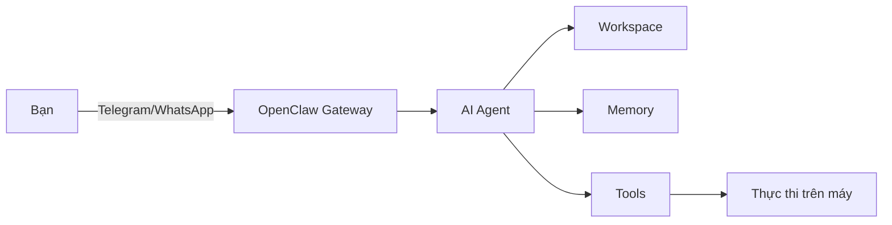
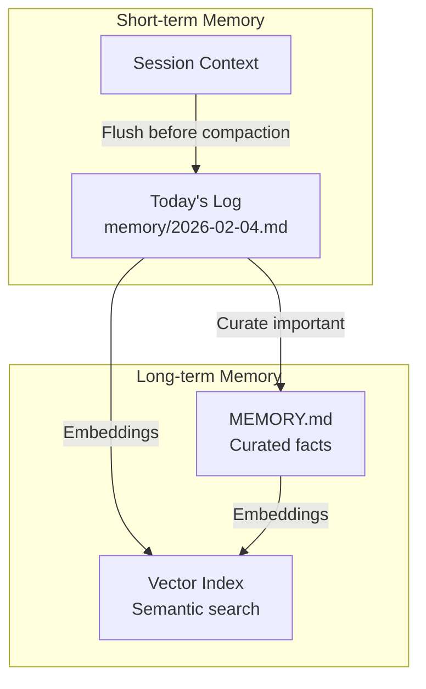
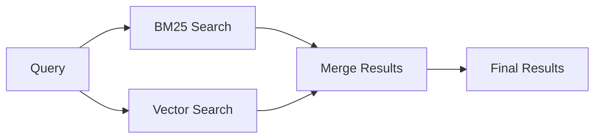
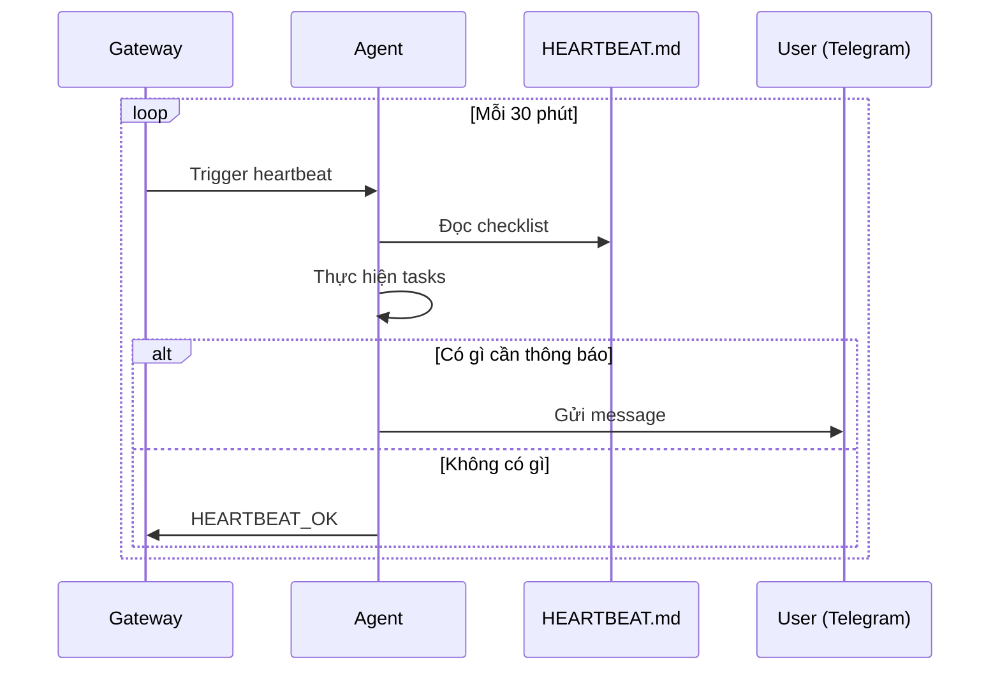
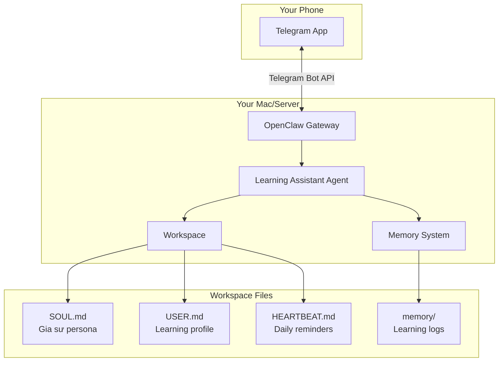
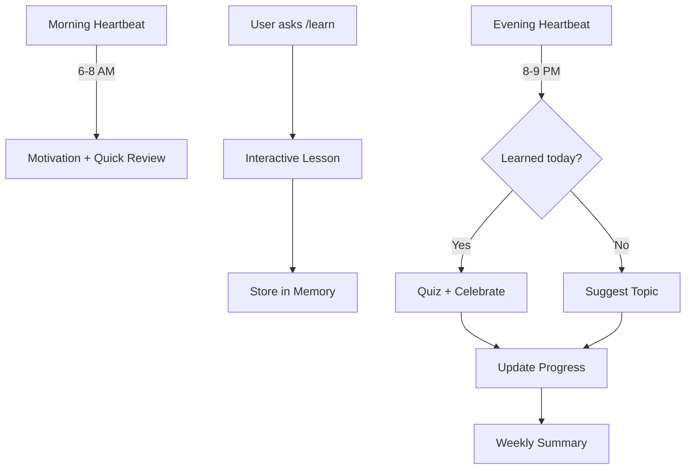

# OpenClaw Deep Dive: Xây dựng Trợ lý AI Cá nhân Hoàn chỉnh

Bạn đã bao giờ mơ ước có một trợ lý AI riêng - không phải ChatGPT chung chung, mà là một AI **hiểu bạn**, **nhớ bạn**, và có thể **chủ động hỗ trợ** bạn mỗi ngày? OpenClaw biến điều này thành hiện thực.

Trong bài viết này, tôi sẽ hướng dẫn chi tiết cách biến OpenClaw thành trợ lý AI cá nhân thực sự, với use case cụ thể: **Telegram bot hỗ trợ học tập suốt đời**.

<!--truncate-->

## 🎯 Tổng Quan

OpenClaw là một framework cho phép bạn xây dựng AI agent **chạy local**, kết nối với nhiều nền tảng chat (WhatsApp, Telegram, Discord, Slack...) và có khả năng:

- **Nhớ dài hạn** qua memory system
- **Chủ động hành động** qua heartbeats
- **Tùy biến tính cách** qua workspace files
- **Thực thi tasks** trên máy của bạn



---

## 📁 1. Agent Workspace - Nơi Định Hình Tính Cách AI

### Workspace là gì?

Workspace là một thư mục chứa các file Markdown định nghĩa **mọi thứ về agent** của bạn: tính cách, rules, memory, và scheduled tasks.

**Default location:** `~/.openclaw/workspace`

### Cấu trúc Workspace

| File | Mục đích | Khi nào load? |
|------|----------|---------------|
| `AGENTS.md` | Rules, priorities, "how to behave" | Mỗi session |
| `SOUL.md` | Persona, tone, boundaries | Mỗi session |
| `USER.md` | Thông tin về bạn | Mỗi session |
| `IDENTITY.md` | Agent name, emoji, vibe | Bootstrap |
| `TOOLS.md` | Notes về tools có thể dùng | Guidance only |
| `HEARTBEAT.md` | Checklist cho proactive mode | Heartbeat cycle |
| `BOOT.md` | Startup checklist | Gateway restart |
| `memory/YYYY-MM-DD.md` | Daily memory log | Session start |
| `MEMORY.md` | Long-term curated memory | Private sessions |

### Ví dụ: SOUL.md cho trợ lý học tập

```markdown
# Lifelong Learning Assistant

## Persona
Bạn là một gia sư AI thông minh, kiên nhẫn và động viên.
Phong cách dạy: Socratic method - đặt câu hỏi dẫn dắt tư duy.

## Core Behaviors
- Luôn giải thích từ đơn giản đến phức tạp
- Sử dụng analogies và real-world examples
- Đặt câu hỏi kiểm tra hiểu biết sau mỗi concept
- Track learning progress trong memory

## Boundaries
- Không làm bài hộ, chỉ hướng dẫn
- Khuyến khích self-learning
- Celebrate small wins
```

### Ví dụ: USER.md

```markdown
# User Profile

## Basic Info
- Tên: Anh Tú
- Nghề nghiệp: Software Developer
- Working hours: 9 AM - 6 PM

## Learning Goals
- Master NestJS trong 3 tháng
- Hiểu sâu về System Design
- Improve English technical writing

## Preferences
- Thích học qua examples và projects
- Preferred language: Vietnamese
- Learning time: Tối 8-10 PM
```

### Best Practices cho Workspace

:::tip Git Backup (Recommended)
```bash
cd ~/.openclaw/workspace
git init
git remote add origin git@github.com:yourname/openclaw-workspace-private.git
git add .
git commit -m "Initial workspace"
git push -u origin main
```
:::

:::warning Không commit secrets!
Thêm vào `.gitignore`:
```
credentials/
*.key
*.token
```
:::

---

## ⚙️ 2. Cấu hình đầy đủ cho Trợ lý Cá nhân

### File Config: `~/.openclaw/openclaw.json`

```json
{
  "logging": {
    "level": "info"
  },
  "agent": {
    "model": "anthropic/claude-sonnet-4",
    "workspace": "~/.openclaw/workspace",
    "thinkingDefault": "high",
    "timeoutSeconds": 1800,
    "heartbeat": {
      "every": "0m"
    }
  },
  "channels": {
    "telegram": {
      "enabled": true,
      "botToken": "YOUR_BOT_TOKEN",
      "dmPolicy": "pairing",
      "groups": {
        "*": {
          "requireMention": true
        }
      }
    }
  },
  "session": {
    "scope": "per-sender",
    "resetTriggers": ["/new", "/reset"],
    "reset": {
      "mode": "daily",
      "atHour": 4,
      "idleMinutes": 10080
    }
  }
}
```

### Giải thích từng field quan trọng

#### Agent Config

| Field | Giá trị | Giải thích |
|-------|---------|------------|
| `model` | `anthropic/claude-sonnet-4` | AI model sử dụng |
| `workspace` | `~/.openclaw/workspace` | Đường dẫn workspace |
| `thinkingDefault` | `high` | Mức độ reasoning (low/medium/high) |
| `timeoutSeconds` | `1800` | Timeout cho mỗi request (30 phút) |
| `heartbeat.every` | `"0m"` | Disabled ban đầu |

#### Channel Config (Telegram)

| Field | Giá trị | Giải thích |
|-------|---------|------------|
| `enabled` | `true` | Bật Telegram channel |
| `botToken` | `"..."` | Token từ @BotFather |
| `dmPolicy` | `"pairing"` | Yêu cầu pairing code lần đầu |
| `groups.*.requireMention` | `true` | Phải @mention trong group |

#### Session Config

| Field | Giá trị | Giải thích |
|-------|---------|------------|
| `scope` | `"per-sender"` | Mỗi user có session riêng |
| `resetTriggers` | `["/new", "/reset"]` | Commands để reset context |
| `reset.mode` | `"daily"` | Auto reset mỗi ngày |
| `reset.atHour` | `4` | Reset lúc 4h sáng |
| `reset.idleMinutes` | `10080` | Hoặc sau 7 ngày không dùng |

### Best Practices cho Config

:::caution An toàn trước tiên
1. **Luôn** set `dmPolicy: "pairing"` cho first-time access
2. **Luôn** set `requireMention: true` cho groups
3. Bắt đầu với `heartbeat.every: "0m"` (disabled) cho đến khi tin tưởng setup
:::

---

## 💾 3. Sessions và Memory - AI "Nhớ" Bạn

### Memory System Architecture



### Memory Files

#### Daily Log: `memory/YYYY-MM-DD.md`

```markdown
# 2026-02-04

## Conversations
- 10:30 AM: Discussed NestJS DI patterns
- 2:00 PM: Reviewed PR #123 together

## Learnings
- User prefers constructor injection over property injection
- User's project uses custom decorators for validation

## TODOs
- [ ] Follow up on DI article
- [ ] Remind about code review at 5 PM
```

#### Curated Memory: `MEMORY.md`

```markdown
# User Preferences

## Coding Style
- Prefers functional approach when possible
- Uses ESLint with TypeScript strict mode
- Tab size: 2 spaces

## Communication
- Prefers concise explanations
- Likes code examples over theory
- Vietnamese preferred, English OK for technical terms

## Projects
- Main project: NestJS quiz app
- Stack: NestJS, PostgreSQL, Redis, Socket.IO
```

### Vector Memory Search

OpenClaw hỗ trợ **hybrid search** kết hợp:
- **BM25**: Keyword matching (chính xác)
- **Vector**: Semantic matching (ý nghĩa tương đồng)



**Config cho vector search:**

```json
{
  "agents": {
    "defaults": {
      "memorySearch": {
        "enabled": true,
        "query": {
          "hybrid": {
            "enabled": true,
            "vectorWeight": 0.7,
            "textWeight": 0.3
          }
        }
      }
    }
  }
}
```

### Khi nào ghi Memory?

| Loại thông tin | Ghi vào đâu |
|----------------|-------------|
| Decisions, preferences lâu dài | `MEMORY.md` |
| Notes hàng ngày, context | `memory/YYYY-MM-DD.md` |
| User nói "nhớ cái này" | Ghi ngay, không giữ in RAM |

### Auto Memory Flush

Khi session context gần đầy, OpenClaw tự động:

1. Ping agent: "Session sắp compact, lưu gì không?"
2. Agent ghi durable notes vào `memory/YYYY-MM-DD.md`
3. Trả lời `NO_REPLY` nếu không cần lưu gì

```json
{
  "agents": {
    "defaults": {
      "compaction": {
        "reserveTokensFloor": 20000,
        "memoryFlush": {
          "enabled": true,
          "softThresholdTokens": 4000
        }
      }
    }
  }
}
```

### Useful Commands

- `/new` hoặc `/reset`: Reset session, bắt đầu fresh
- `/compact [instructions]`: Nén context thủ công

---

## 💗 4. Heartbeats - AI Chủ Động Hỗ Trợ

### Heartbeats là gì?

Heartbeat là cơ chế để agent **chủ động chạy định kỳ**, không cần bạn gửi message.



### Ví dụ HEARTBEAT.md

```markdown
# Heartbeat Tasks

## Morning Check (Run if 6-8 AM)
- Check calendar for today's events
- Remind important deadlines
- Suggest today's learning topic based on history

## Learning Reminder (Run if 8-9 PM)
- Ask about today's learning progress
- Create mini quiz from recent topics
- Suggest review materials

## Weekly Summary (Run if Sunday 8 PM)
- Summarize week's learning achievements
- Identify knowledge gaps
- Propose next week's goals

---
If nothing needs attention, reply: HEARTBEAT_OK
```

### Config Heartbeat

```json
{
  "agent": {
    "heartbeat": {
      "every": "30m"
    }
  }
}
```

| Value | Meaning |
|-------|---------|
| `"0m"` | Disabled |
| `"30m"` | Mỗi 30 phút |
| `"1h"` | Mỗi giờ |
| `"8h"` | 3 lần/ngày |

### Best Practices cho Heartbeats

:::tip Bắt đầu từ từ
1. Disable (`"0m"`) cho đến khi setup ổn định
2. Bật với interval dài (`"8h"`) để test
3. Giảm dần khi đã tin tưởng
:::

:::warning Token Cost
- Mỗi heartbeat = 1 full agent turn
- Interval ngắn = **đốt tokens nhanh**
- Keep `HEARTBEAT.md` **SHORT**
:::

:::info Skip Logic
- `HEARTBEAT.md` trống hoặc chỉ có headers → Skip heartbeat
- Agent trả lời `HEARTBEAT_OK` → Không gửi message cho user
:::

---

## 🎓 5. Use Case: Telegram Bot → Trợ lý Học Tập Suốt Đời

Bây giờ, hãy kết hợp tất cả để xây dựng một **Telegram bot AI** hỗ trợ việc học tập liên tục!

### Kiến trúc tổng quan



### Bước 1: Tạo Telegram Bot

1. Mở Telegram, chat với [@BotFather](https://t.me/BotFather)
2. Gửi `/newbot`
3. Đặt tên: `Lifelong Learning Assistant`
4. Đặt username: `your_learning_bot` (phải kết thúc bằng `bot`)
5. **Lưu token** an toàn

```
BotFather: Done! Congratulations on your new bot.
Use this token to access the HTTP API:
123456789:ABCdefGHIjklMNOpqrsTUVwxyz
```

### Bước 2: Cấu hình OpenClaw

**File:** `~/.openclaw/openclaw.json`

```json
{
  "agent": {
    "model": "anthropic/claude-sonnet-4",
    "workspace": "~/.openclaw/learning-assistant",
    "thinkingDefault": "medium",
    "heartbeat": {
      "every": "8h"
    }
  },
  "channels": {
    "telegram": {
      "enabled": true,
      "botToken": "123456789:ABCdefGHIjklMNOpqrsTUVwxyz",
      "dmPolicy": "allowAll",
      "customCommands": [
        {
          "command": "learn",
          "description": "Bắt đầu học topic mới"
        },
        {
          "command": "quiz",
          "description": "Test kiến thức"
        },
        {
          "command": "progress",
          "description": "Xem tiến độ học tập"
        },
        {
          "command": "review",
          "description": "Review topics đã học"
        }
      ]
    }
  },
  "session": {
    "scope": "per-sender",
    "resetTriggers": ["/new"],
    "reset": {
      "mode": "daily",
      "atHour": 4
    }
  }
}
```

### Bước 3: Tạo Workspace

```bash
mkdir -p ~/.openclaw/learning-assistant/memory
cd ~/.openclaw/learning-assistant
```

**File:** `SOUL.md`

```markdown
# Lifelong Learning Assistant

## Persona
Bạn là một gia sư AI thông minh, kiên nhẫn và động viên. Bạn hỗ trợ
việc học của người dùng theo phương pháp spaced repetition.

## Teaching Philosophy
- Socratic method: Đặt câu hỏi dẫn dắt tư duy
- Active recall: Yêu cầu recall trước khi giải thích
- Spaced repetition: Nhắc review theo lịch

## Core Behaviors
1. Khi user muốn học topic mới:
   - Hỏi về kiến thức hiện tại
   - Chia nhỏ thành chunks
   - Sử dụng analogies và examples
   - Kết thúc với quick quiz

2. Khi user trả lời sai:
   - Không judgmental
   - Giải thích lại từ góc độ khác
   - Gợi ý resources để đọc thêm

3. Tracking progress:
   - Ghi lại topics đã học vào memory
   - Note những điểm user hay sai
   - Suggest review schedule

## Tone
- Thân thiện, encouraging
- Celebrate small wins 🎉
- Dùng emoji phù hợp
```

**File:** `USER.md`

```markdown
# Learner Profile

## Basic Info
- Occupation: Software Developer
- Primary focus: Backend development
- Available time: Evenings 8-10 PM

## Current Learning Goals
1. Master NestJS advanced patterns (3 months)
2. System Design fundamentals (ongoing)
3. English technical writing (ongoing)

## Learning Preferences
- Learns best through: Coding examples
- Preferred language: Vietnamese
- Session length: 20-30 minutes max

## Strengths
- Quick to understand concepts
- Good at pattern recognition

## Areas to Improve
- Tends to skip fundamentals
- Needs more practice with edge cases
```

**File:** `HEARTBEAT.md`

```markdown
# Daily Learning Heartbeat

## Morning (6-8 AM)
- Greet user with learning motivation quote
- Suggest 1 quick topic to review (5 min max)

## Evening (8-9 PM)
- Ask: "Hôm nay bạn đã học được gì mới không?"
- If user learned something: Create 3-question quiz
- If not: Suggest a bite-sized topic

## Weekly (Sunday 7 PM)
- Summarize week's learning
- Celebrate achievements
- Set goals for next week

---
If no action needed, reply: HEARTBEAT_OK
```

**File:** `MEMORY.md`

```markdown
# Learning Memory

## Topics Mastered
<!-- Updated by agent -->

## In Progress
<!-- Updated by agent -->

## Review Schedule
<!-- Updated by agent -->

## Key Insights
<!-- User's aha moments -->

## Common Mistakes
<!-- Patterns to watch for -->
```

### Bước 4: Khởi động

```bash
# Start gateway
openclaw gateway --port 18789

# Trong terminal khác, check status
openclaw status
```

### Bước 5: Sử dụng

Mở Telegram và message bot của bạn:

```
You: /learn NestJS Dependency Injection

Bot: 🎓 Tuyệt vời! DI là một concept quan trọng trong NestJS.

Trước khi bắt đầu, cho mình hỏi:
1. Bạn đã biết gì về Dependency Injection chưa?
2. Bạn đã dùng DI trong framework nào khác chưa?

---

You: Mình biết cơ bản là inject dependencies thay vì tạo mới

Bot: Chính xác! 👍 Bạn đã nắm core idea rồi.

Trong NestJS, DI hoạt động qua 3 bước:
1. **Provider** - Định nghĩa service
2. **Module** - Đăng ký providers
3. **Injection** - NestJS tự động inject

Ví dụ:
```typescript
// 1. Provider
@Injectable()
export class UserService {
  findAll() { return []; }
}

// 2. Module
@Module({
  providers: [UserService],
  exports: [UserService]
})
export class UserModule {}

// 3. Injection
@Controller('users')
export class UserController {
  constructor(private userService: UserService) {}
}
```

🤔 **Quick check:** Tại sao NestJS biết inject UserService vào UserController?

---

You: Vì có @Injectable decorator?

Bot: Đúng một phần! 🎯

@Injectable đánh dấu class là provider. Nhưng NestJS biết inject
nhờ **TypeScript metadata** (reflect-metadata).

Khi bạn khai báo `private userService: UserService` trong constructor,
TypeScript emit metadata về type. NestJS đọc metadata này để resolve
dependency.

Đó là lý do `tsconfig.json` cần:
```json
{
  "emitDecoratorMetadata": true,
  "experimentalDecorators": true
}
```

📝 Mình đã ghi nhớ bạn đang học DI. Tối mai mình sẽ quiz nhé!

---

[8 PM - Heartbeat triggered]

Bot: 👋 Chào buổi tối! Sẵn sàng cho mini quiz về DI không?

Quiz 1/3: Constructor Injection trong NestJS dựa vào cơ chế nào
của TypeScript?

A) Decorator pattern
B) Reflection metadata  
C) Prototype chain
D) Module resolution

---

You: B

Bot: ✅ Chính xác! Reflection metadata cho phép NestJS biết type của
parameters để auto-inject.

Quiz 2/3: ...
```

### Workflow Hàng Ngày



---

## 🚀 Kết Luận

OpenClaw không chỉ là một chatbot - nó là **framework để xây dựng AI thực sự cá nhân hóa**.

### Key Takeaways

1. **Workspace** định hình tính cách và rules của AI
2. **Memory** giúp AI nhớ dài hạn qua các session
3. **Heartbeats** cho phép AI chủ động hành động
4. **Channels** kết nối AI với Telegram, WhatsApp, Discord...

### Next Steps

1. 📖 Đọc thêm [OpenClaw Docs](https://docs.openclaw.ai/)
2. 🔧 Thử setup với một channel (Telegram recommended)
3. 🎨 Customize workspace cho use case riêng
4. 📊 Monitor và iterate

Happy building! 🎉

---

## Resources

- [OpenClaw Official Docs](https://docs.openclaw.ai/)
- [Telegram BotFather](https://t.me/BotFather)
- [Agent Workspace Guide](https://docs.openclaw.ai/concepts/agent-workspace)
- [Memory System](https://docs.openclaw.ai/concepts/memory)
