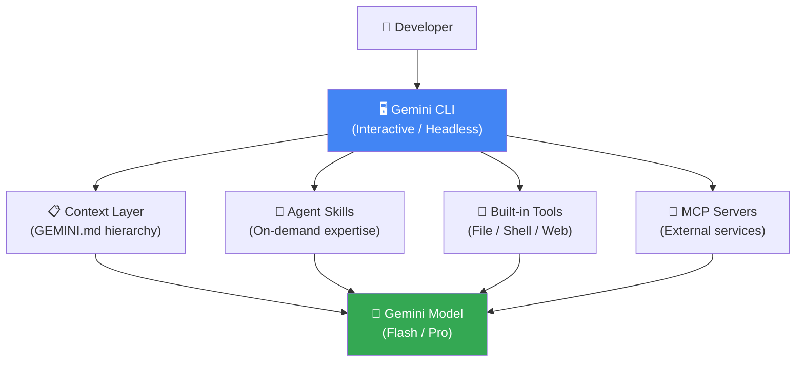
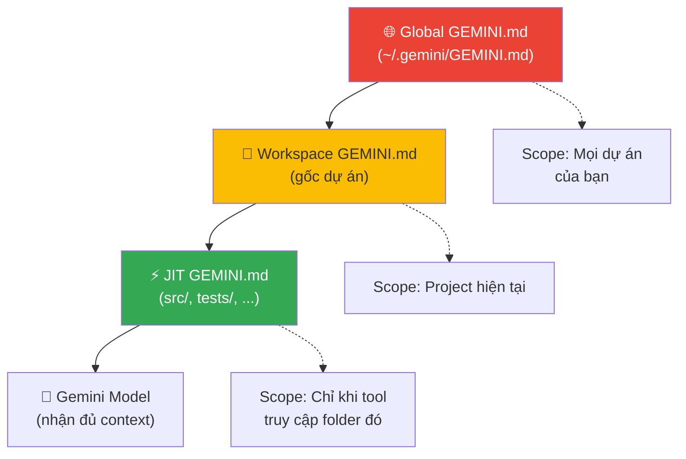
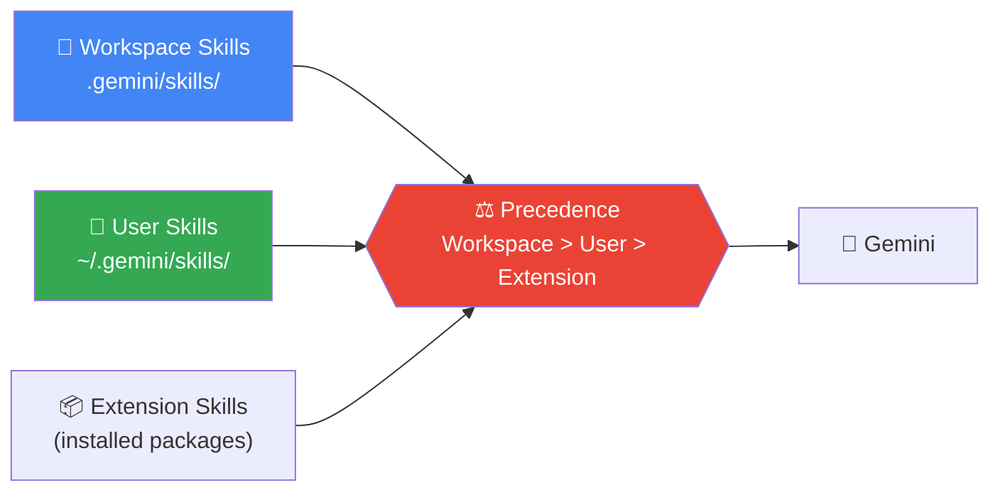
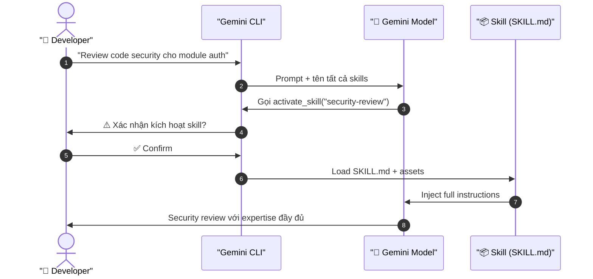
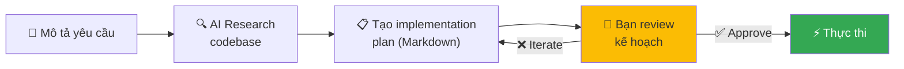
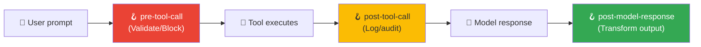
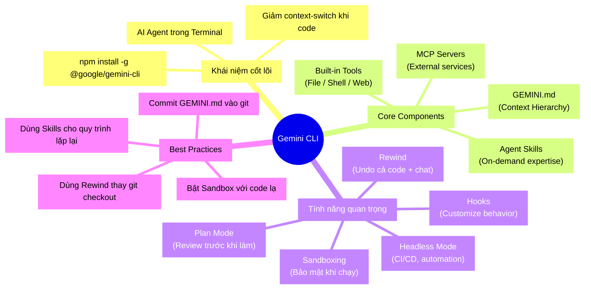

import Tabs from '@theme/Tabs';
import TabItem from '@theme/TabItem';

Bạn đang code và cần giải thích một đoạn code phức tạp. Bạn phải mở trình duyệt, copy code, dán vào ChatGPT... mất 3-4 bước trước khi nhận được câu trả lời. **Gemini CLI** sinh ra để giải quyết đúng cái sự phiền phức đó.

<!-- truncate -->

## 🤔 Tại sao cần AI Agent ngay trong Terminal?

> **Ẩn dụ:** Hãy tưởng tượng bạn là một đầu bếp trong nhà hàng. ChatGPT/Claude là một đầu bếp khác ở... nhà bếp công cộng 5 phút đi bộ. Mỗi lần cần hỏi, bạn phải đi bộ tới đó, chờ, rồi quay về. **Gemini CLI** giống như có một đầu bếp phụ đứng ngay cạnh bạn trong cùng nhà bếp — không cần di chuyển, không cần context-switch.

Workflow của developer thực tế:

```bash
# Không có Gemini CLI → Friction cao
code → copy → mở browser → dán vào AI → đọc → copy lại → về terminal

# Có Gemini CLI → Friction = 0
gemini "Giải thích đoạn regex này: ^([a-zA-Z0-9._%-]+)@..."
```

---

## 📦 Gemini CLI là gì?

**Gemini CLI** (`@google/gemini-cli`) là một AI-powered command-line interface do Google phát triển, cho phép bạn tương tác với các mô hình Gemini ngay trong terminal. Nó không chỉ là một chat interface — đây là một **AI Agent** có khả năng:

- 📂 **Đọc và chỉnh sửa file** trong dự án của bạn
- 🖥️ **Thực thi shell commands** thay bạn (có xác nhận)
- 🌐 **Tìm kiếm và fetch nội dung web** theo yêu cầu
- 🔌 **Kết nối với external services** qua MCP protocol
- 🧠 **Ghi nhớ context** xuyên suốt dự án

### Cài đặt nhanh

```bash
# Cài đặt global qua npm
npm install -g @google/gemini-cli

# Khởi động
gemini
```

---

## 🔐 Authentication: 3 Cách Kết Nối

Gemini CLI hỗ trợ 3 phương thức xác thực tùy theo nhu cầu:

| Phương thức | Phù hợp với | Free Tier |
|-------------|-------------|-----------|
| **Login with Google** ✅ | Developer cá nhân | ✅ Có |
| **Gemini API Key** | App tự động hóa | Theo quota |
| **Vertex AI** | Enterprise, Google Cloud | Theo GCP billing |

**Cách đơn giản nhất** (khuyến nghị cho personal use):

```bash
gemini
# → Chọn "1. Login with Google"
# → Đăng nhập Google account
# → Done! 🎉
```

💡 **Free tier rất hào phóng:** Với Google personal account, bạn có quota miễn phí đáng kể để dùng hàng ngày mà không tốn tiền.

---

## 🏗️ Kiến trúc Core: Những thành phần cần nắm vững

Để dùng Gemini CLI hiệu quả, bạn cần hiểu 4 thành phần cốt lõi:



### 1. 📋 GEMINI.md — Bộ nhớ dài hạn của dự án

`GEMINI.md` là file Markdown đặc biệt — giống như **"readme nói chuyện với AI"** của dự án:

```
~/.gemini/GEMINI.md          ← Global: áp dụng cho mọi dự án
~/my-project/GEMINI.md       ← Workspace: context của dự án cụ thể
~/my-project/src/GEMINI.md   ← JIT: chỉ load khi AI vào thư mục này
```

**Cơ chế hoạt động (Hierarchy):**



**Ví dụ thực tế** — File `GEMINI.md` trong dự án NestJS:

```markdown
# Project Context: E-commerce API

## Tech Stack
- Runtime: Node.js 20, NestJS 10
- Database: PostgreSQL 16 với TypeORM
- Auth: JWT với refresh token pattern

## Coding Conventions
- Luôn dùng async/await, không dùng Promise chain
- Mọi service method phải có JSDoc comment
- Error handling theo pattern: throw custom exception

## Architecture Notes
- Repository pattern cho data access layer
- DTOs cho validation tất cả input
```

➡️ Từ giờ, mọi câu hỏi bạn hỏi Gemini đều được trả lời **trong context** của NestJS + PostgreSQL + conventions trên.

---

### 2. 🧠 Agent Skills — Chuyên gia theo yêu cầu

**Agent Skills** là các "gói kiến thức chuyên biệt" mà Gemini sẽ tự động kích hoạt khi cần.

> **Ẩn dụ:** Bạn có một đội ngũ chuyên gia. Bình thường họ không ở đây (để không chiếm chỗ). Khi bạn cần review bảo mật, chuyên gia security mới được gọi vào. Khi cần deploy lên cloud, chuyên gia DevOps mới xuất hiện. Đây là **Progressive Disclosure** — chỉ load context khi cần.

**Cấu trúc Skill:**

```
.gemini/skills/
└── my-skill/
    ├── SKILL.md        ← Tên + mô tả (luôn được load)
    ├── instructions.md ← Chi tiết hướng dẫn (chỉ load khi activate)
    └── templates/      ← Templates, examples, scripts
```

**3 tầng discovery:**



**Skill activation flow:**



---

### 3. 🔌 MCP Servers — Cầu nối với thế giới bên ngoài

**Model Context Protocol (MCP)** là tiêu chuẩn mở để AI kết nối với các dịch vụ bên ngoài.

> **Ẩn dụ:** MCP giống như **USB-C** cho AI tools. Thay vì mỗi AI tool phải tích hợp riêng với Slack, GitHub, Database... bạn chỉ cần một "cổng chuẩn" (MCP) và bất kỳ service nào hỗ trợ MCP đều hoạt động được ngay.

```bash
# Cấu hình MCP server trong settings.json
# ~/.gemini/settings.json

{
  "mcpServers": {
    "github": {
      "command": "npx",
      "args": ["-y", "@modelcontextprotocol/server-github"],
      "env": {
        "GITHUB_PERSONAL_ACCESS_TOKEN": "${GITHUB_TOKEN}"
      }
    },
    "postgres": {
      "command": "npx",
      "args": ["-y", "@modelcontextprotocol/server-postgres"],
      "env": {
        "POSTGRES_CONNECTION_STRING": "${DB_URL}"
      }
    }
  }
}
```

Sau khi cấu hình, Gemini CLI có thể:

```bash
# Hỏi trực tiếp về GitHub repo
gemini "List các open PR trong repo của tôi và tóm tắt chúng"

# Query database bằng ngôn ngữ tự nhiên
gemini "Có bao nhiêu user đăng ký trong tháng này?"
```

---

## ⭐ Tất cả Tính Năng Quan Trọng

### 🎯 Plan Mode (Experimental) — Lên kế hoạch trước khi làm

**Plan Mode** ngăn AI thực hiện bất kỳ thay đổi nào cho đến khi bạn xem xét và phê duyệt kế hoạch:



```bash
# Bật Plan Mode
/settings → Plan → true

# Hoặc trong settings.json
{
  "experimental": {
    "plan": true
  }
}

# Trong session, exit Plan Mode
Shift+Tab   # Cycle qua các modes
```

⚠️ **Trade-off:** Plan Mode an toàn hơn nhưng chậm hơn. Dùng khi làm thay đổi lớn/quan trọng; bỏ qua cho task nhỏ.

---

### ⏪ Rewind — "Ctrl+Z" cho AI

Một trong những tính năng "thần thánh" nhất: **Rewind** cho phép bạn quay lui thời gian của cả conversation lẫn file changes.

```bash
# Kích hoạt
/rewind
# Hoặc: nhấn Esc hai lần

# Sẽ hiện ra danh sách tương tác, chọn điểm muốn rewind về
# Sau đó chọn:
# 1. Rewind conversation AND revert code → Hoàn toàn undo
# 2. Rewind conversation only → Giữ file changes
# 3. Revert code only → Giữ chat history
```

💡 **Use case thực tế:** AI vừa refactor một function, nhưng kết quả không như ý. Thay vì `git checkout` thủ công, dùng `/rewind` để hoàn tác cả code lẫn conversation.

---

### 🔒 Sandboxing — Chạy an toàn trong hộp cát

Khi AI thực thi shell commands, **Sandboxing** tạo ra một lớp bảo vệ:

| Platform | Phương thức | Mô tả |
|----------|-------------|-------|
| macOS | **macOS Seatbelt** | Giới hạn filesystem access |
| Linux/macOS | **Docker/Podman** | Container-based isolation |
| Linux | **gVisor (runsc)** | Kernel-level sandboxing |
| Linux | **LXC/LXD** | Lightweight containers (experimental) |

```bash
# Bật sandbox (Docker)
{
  "sandbox": true,
  "sandboxImage": "gemini-sandbox:latest"
}
```

**Bảo vệ bạn khỏi:**
- ❌ AI vô tình xóa file ngoài project directory
- ❌ Shell script truy cập dữ liệu nhạy cảm
- ✅ Đảm bảo reproducible environment

---

### 🪝 Hooks — Tùy chỉnh hành vi

**Hooks** cho phép bạn inject logic vào các điểm quan trọng trong agent loop:



Use cases:
- **Security scanning**: Block tool calls với patterns nguy hiểm
- **Audit logging**: Ghi lại mọi tool execution vào log file
- **Context injection**: Tự động thêm git history vào mỗi prompt
- **Tool filtering**: Chỉ cho phép một số tool cụ thể

---

### 🤖 Headless Mode — Automation & Scripting

Gemini CLI không chỉ là interactive tool — nó còn có thể chạy trong **non-interactive (headless) mode**:

```bash
# Single query, không cần interactive
gemini "Kiểm tra file config.json có lỗi syntax không"

# Pipe vào/ra
cat error.log | gemini "Tóm tắt các lỗi này"

# Trong CI/CD script
gemini --output-format json "Review PR này và liệt kê potential issues"
```

💡 **Trade-off:** Headless mode tiện cho automation nhưng thiếu interactivity để clarify yêu cầu phức tạp.

---

### 🧩 Extensions — Mở rộng khả năng

**Extensions** là các package npm đóng gói tools, skills, và MCP servers:

```bash
# Cài extension (ví dụ)
gemini extension install @google/gemini-cli-ext-cloud

# Extension có thể cung cấp:
# - Pre-built Skills (cloud deployment, security review...)
# - MCP server configurations
# - Custom tools
```

---

### 📊 Token Caching & Model Routing

**Token Caching:** Tự động cache context (GEMINI.md, skills) để tránh gửi lại mỗi lần → **tiết kiệm chi phí** và **giảm latency**.

**Model Routing:** Tự động fallback sang model nhẹ hơn khi model chính quá tải:

```bash
# Xem current model và usage
/stats model

# Chọn model thủ công
/model gemini-2.0-flash-exp
```

---

## ⚠️ Pitfalls & Best Practices

### ❌ Lỗi thường gặp

**1. Không dùng GEMINI.md** → AI thiếu context, trả lời generic

```markdown
# ✅ Luôn tạo GEMINI.md ở root project với:
- Tech stack
- Coding conventions
- Architecture decisions
- Files quan trọng cần biết
```

**2. Quên Sandboxing khi chạy code lạ**

```bash
# ✅ Bật sandbox trước khi để AI chạy untrusted code
# Trong settings.json: "sandbox": true
```

**3. Dùng Plan Mode cho task nhỏ** → Overhead không cần thiết

**4. Không kiểm soát MCP server permissions** → Security risk

```json
// ✅ Luôn set environment variables đúng cách
// KHÔNG hardcode credentials trong settings.json
{
  "env": {
    "API_KEY": "${MY_SECRET_KEY}"  // Dùng variable expansion
  }
}
```

### ✅ Best Practices

| Practice | Lý do |
|----------|-------|
| Commit `GEMINI.md` vào git | Chia sẻ context với team |
| Dùng Skills cho workflows phức tạp | Tái sử dụng, chia sẻ expertise |
| Bật Sandbox trong môi trường production | An toàn |
| Dùng `/rewind` thay vì `git checkout` | Nhanh hơn, quản lý cả conversation |
| Config Hooks cho audit log | Traceability, compliance |

---

## 🧩 Mindmap Tổng Hợp



---

## 🚀 Quick Start: 5 phút để bắt đầu

```bash
# Bước 1: Cài đặt
npm install -g @google/gemini-cli

# Bước 2: Khởi động và xác thực
gemini
# → Chọn "Login with Google"

# Bước 3: Tạo GEMINI.md cho project của bạn
cat > GEMINI.md << 'EOF'
# Project: [Tên dự án]
## Tech Stack: [Technologies]
## Key Conventions: [Coding standards]
EOF

# Bước 4: Thử ngay
gemini "Giải thích codebase này và tìm các code smell"

# Bước 5: Check usage
/stats model
```

---

Gemini CLI không phải là "thêm một AI tool nữa" — đây là **AI được tích hợp trực tiếp vào workflow** của developer. Với GEMINI.md làm bộ nhớ dài hạn, Skills làm chuyên gia theo yêu cầu, MCP làm cầu nối dịch vụ, và Plan Mode làm safety net — đây là bộ công cụ đáng để mọi developer thử ngay.

---

*Made by Anh Tu - Share to be share*
