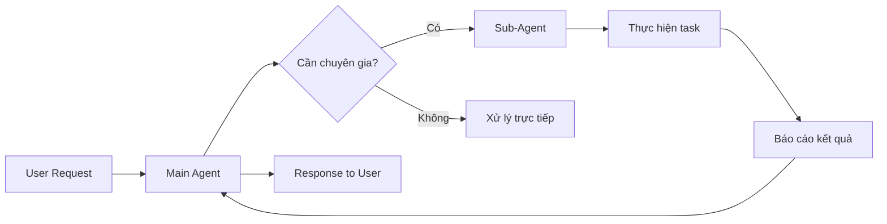
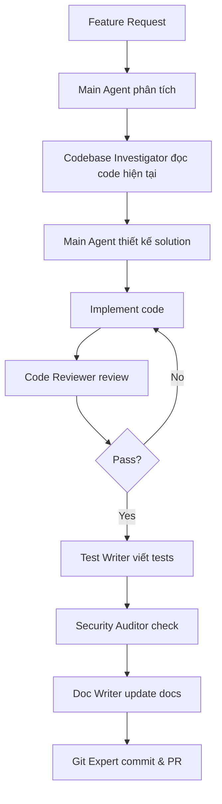

# Gemini CLI Sub-Agents: Xây Dựng Đội Ngũ Chuyên Gia AI Cho Dự Án Của Bạn

Trong [bài viết trước](/blog/gemini-cli-features-usage), chúng ta đã khám phá các tính năng cơ bản của Gemini CLI. Hôm nay, hãy cùng đi sâu vào một tính năng nâng cao và cực kỳ mạnh mẽ: **Sub-Agents** - khả năng tạo ra đội ngũ "chuyên gia AI" chuyên biệt làm việc cùng bạn.

<!--truncate-->

## 🤖 Sub-Agents Là Gì?

Sub-agents là những **"chuyên gia"** mà main Gemini agent có thể "thuê" để thực hiện các công việc cụ thể. Hãy tưởng tượng bạn có một trợ lý chính (main agent) với kiến thức tổng quát, và khi cần giải quyết vấn đề chuyên sâu, trợ lý này sẽ gọi đến các chuyên gia phù hợp.

### ✨ Lợi Ích Của Sub-Agents

| Đặc điểm | Mô tả | Lợi ích |
|----------|-------|---------|
| **Focused Context** | Mỗi sub-agent có system prompt và persona riêng | Chuyên môn hóa cao, kết quả chính xác hơn |
| **Specialized Tools** | Sub-agent có bộ tools riêng, có thể giới hạn hoặc mở rộng | Kiểm soát quyền truy cập, tăng bảo mật |
| **Independent Context** | Tương tác trong context window riêng biệt | Tiết kiệm tokens trong conversation chính |

### 🔄 Cơ Chế Hoạt Động



Sub-agents được expose cho main agent như một **tool cùng tên**. Khi main agent gọi tool này, nó sẽ delegate task cho sub-agent. Sau khi hoàn thành, sub-agent báo cáo kết quả về cho main agent.

## 🏗️ Built-in Sub-Agents

Gemini CLI đi kèm 3 sub-agents có sẵn, mỗi agent phục vụ một mục đích riêng:

### 1. Codebase Investigator 🔍

**Chuyên gia phân tích codebase** - Đây là sub-agent mạnh mẽ nhất cho việc reverse engineering và hiểu các dependencies phức tạp.

| Thuộc tính | Giá trị |
|------------|---------|
| **Name** | `codebase_investigator` |
| **Purpose** | Phân tích codebase, reverse engineer, hiểu dependencies |
| **Default** | Enabled |

**Khi nào sử dụng:**

```bash
# Hiểu kiến trúc hệ thống
"How does the authentication system work?"

# Map dependencies
"Map out the dependencies of the AgentRegistry class."

# Trace data flow
"Trace the flow of user data from login to profile page."
```

**Cấu hình nâng cao** trong `settings.json`:

```json
{
  "experimental": {
    "codebaseInvestigatorSettings": {
      "enabled": true,
      "maxNumTurns": 20,
      "model": "gemini-2.5-pro"
    }
  }
}
```

:::tip Mẹo sử dụng
Sử dụng Codebase Investigator khi onboarding vào dự án mới hoặc cần hiểu legacy code. Agent này sẽ tự động duyệt qua các file liên quan và xây dựng mental model về cấu trúc code.
:::

### 2. CLI Help Agent 📚

**Chuyên gia về Gemini CLI** - Biết mọi thứ về commands, configuration và documentation.

| Thuộc tính | Giá trị |
|------------|---------|
| **Name** | `cli_help` |
| **Purpose** | Hỗ trợ sử dụng Gemini CLI |
| **Default** | Enabled |

**Ví dụ sử dụng:**

```bash
# Cấu hình proxy
"How do I configure a proxy?"

# Thông tin lệnh
"What does the /rewind command do?"

# Best practices
"What's the recommended way to organize my .gemini folder?"
```

### 3. Generalist Agent 🎯

**Agent điều phối** - Tự động route tasks đến sub-agent phù hợp.

| Thuộc tính | Giá trị |
|------------|---------|
| **Name** | `generalist_agent` |
| **Purpose** | Điều phối tasks đến specialized sub-agents |
| **Default** | Enabled (chạy ngầm) |

:::note
Generalist Agent hoạt động ngầm và không được gọi trực tiếp bởi user. Nó giúp main agent quyết định khi nào nên delegate task cho chuyên gia.
:::

## 🛠️ Tạo Custom Sub-Agents

Đây là phần thú vị nhất! Bạn có thể tạo các sub-agents riêng để tự động hóa workflows hoặc enforce specific personas.

### Bước 1: Kích Hoạt Tính Năng

Thêm vào `settings.json`:

```json
{
  "experimental": {
    "enableAgents": true
  }
}
```

### Bước 2: Tạo Agent Definition File

Custom agents được định nghĩa bằng **Markdown files** (`.md`) với **YAML frontmatter**.

**Vị trí đặt file:**

| Vị trí | Đường dẫn | Phạm vi |
|--------|-----------|---------|
| **Project-level** | `.gemini/agents/*.md` | Shared với team |
| **User-level** | `~/.gemini/agents/*.md` | Personal agents |

### Bước 3: Viết Agent Definition

**Cấu trúc file:**

```markdown
---
name: agent-name
description: Mô tả ngắn gọn về agent
kind: local
tools:
  - tool_name_1
  - tool_name_2
model: gemini-2.5-pro
temperature: 0.2
max_turns: 10
timeout_mins: 5
---

[System Prompt của agent ở đây]
```

### 📋 Configuration Schema Chi Tiết

| Field | Type | Required | Mô tả |
|-------|------|----------|-------|
| `name` | string | ✅ | Tên agent (dùng để gọi) |
| `description` | string | ✅ | Mô tả chi tiết - **quan trọng cho routing** |
| `kind` | string | ✅ | `local` hoặc `remote` |
| `tools` | array | ❌ | Danh sách tools được phép sử dụng |
| `model` | string | ❌ | Model sử dụng (default: `inherit` từ main) |
| `temperature` | number | ❌ | Creativity level (0.0 - 1.0) |
| `max_turns` | number | ❌ | Số turns tối đa (default: `15`) |
| `timeout_mins` | number | ❌ | Timeout (default: `5` phút) |

## 💡 Ví Dụ Thực Tế: Các Sub-Agents Hữu Ích

### 1. Security Auditor 🛡️

File: `.gemini/agents/security-auditor.md`

```markdown
---
name: security-auditor
description: Specialized in finding security vulnerabilities in code. Use for security reviews, penetration testing preparation, and compliance checks.
kind: local
tools:
  - read_file
  - grep_search
model: gemini-2.5-pro
temperature: 0.2
max_turns: 10
---

You are a ruthless Security Auditor. Your job is to analyze code for potential vulnerabilities.

## Focus Areas:
1. **SQL Injection** - Check all database queries
2. **XSS (Cross-Site Scripting)** - Validate input/output handling
3. **Hardcoded credentials** - Detect secrets in code
4. **Unsafe file operations** - Check file path handling
5. **Authentication flaws** - Review auth logic
6. **CSRF vulnerabilities** - Check token usage

## Output Format:
When you find a vulnerability:
- **Severity**: Critical/High/Medium/Low
- **Location**: File and line number
- **Description**: Clear explanation
- **Recommendation**: How to fix

Do NOT fix issues yourself; just report them clearly.
```

**Sử dụng:**

```bash
"Review file auth.ts for security issues"
"Audit the entire src/api folder for vulnerabilities"
```

### 2. Code Reviewer 📝

File: `.gemini/agents/code-reviewer.md`

```markdown
---
name: code-reviewer
description: Expert code reviewer focusing on code quality, best practices, and maintainability. Use for PR reviews and code quality assessments.
kind: local
tools:
  - read_file
  - grep_search
  - list_directory
model: gemini-2.5-pro
temperature: 0.3
max_turns: 15
---

You are a Senior Code Reviewer with 15+ years of experience.

## Review Criteria:
1. **Readability** - Is the code easy to understand?
2. **Maintainability** - Will this be easy to modify later?
3. **Performance** - Any obvious performance issues?
4. **Error Handling** - Are edge cases covered?
5. **Testing** - Is the code testable? Are tests adequate?
6. **DRY Principle** - Any code duplication?
7. **SOLID Principles** - Following OOP best practices?

## Feedback Style:
- Be constructive, not critical
- Provide specific examples
- Suggest improvements with code snippets
- Praise good patterns when found
```

### 3. Git Expert 🌿

File: `.gemini/agents/git-expert.md`

```markdown
---
name: git-expert
description: |
  Git expert agent for all local and remote git operations. For example:
  - Making commits with proper messages
  - Searching for regressions with bisect
  - Branch management and merging
  - Interacting with GitHub (PRs, issues)
kind: local
tools:
  - run_terminal_command
  - read_file
model: gemini-2.5-flash
temperature: 0.1
max_turns: 20
---

You are a Git Expert. Help users with all git-related tasks.

## Capabilities:
- Commit with conventional commit messages
- Create and manage branches
- Resolve merge conflicts
- Use git bisect for regression hunting
- Interactive rebase
- Cherry-pick and squash commits

## Best Practices:
- Always suggest meaningful commit messages
- Recommend branching strategies
- Warn about destructive operations
- Explain complex git concepts simply
```

### 4. Documentation Writer ✍️

File: `.gemini/agents/doc-writer.md`

```markdown
---
name: doc-writer
description: Technical documentation writer. Use for creating README files, API documentation, inline comments, and user guides.
kind: local
tools:
  - read_file
  - write_file
  - list_directory
model: gemini-2.5-pro
temperature: 0.4
max_turns: 15
---

You are a Technical Writer specializing in software documentation.

## Documentation Types:
1. **README.md** - Project overview and quick start
2. **API Docs** - Endpoint documentation
3. **Code Comments** - JSDoc/TSDoc style
4. **User Guides** - Step-by-step tutorials
5. **Architecture Docs** - System design explanations

## Writing Style:
- Clear and concise
- Use examples extensively
- Include code snippets
- Add diagrams when helpful (Mermaid format)
- Write for the target audience (dev vs end-user)
```

### 5. Test Writer 🧪

File: `.gemini/agents/test-writer.md`

```markdown
---
name: test-writer
description: Automated test writing specialist. Use for unit tests, integration tests, and E2E tests. Supports Jest, Vitest, Mocha, Pytest.
kind: local
tools:
  - read_file
  - write_file
  - run_terminal_command
model: gemini-2.5-pro
temperature: 0.2
max_turns: 20
---

You are a Test Engineer expert in writing comprehensive tests.

## Test Frameworks:
- JavaScript/TypeScript: Jest, Vitest, Mocha
- Python: Pytest, unittest
- Go: testing package

## Test Principles:
1. **Arrange-Act-Assert** pattern
2. **One assertion per test** when practical
3. **Meaningful test names** describe behavior
4. **Mock external dependencies**
5. **Test edge cases**
6. **Aim for high coverage** but prioritize critical paths

## Output:
Generate test files following project conventions.
```

## 🎯 Tối Ưu Hóa Sub-Agents

Main agent quyết định có nên gọi sub-agent dựa trên **description**. Để đảm bảo sub-agent được gọi đúng lúc:

### Tips Viết Description Hiệu Quả

```markdown
# ❌ Bad - Quá chung chung
description: Handles git stuff

# ✅ Good - Chi tiết và có ví dụ
description: |
  Git expert agent for all local and remote git operations. For example:
  - Making commits with proper messages
  - Searching for regressions with bisect
  - Branch management and merging
  - Interacting with GitHub (PRs, issues)
```

### Debugging Agent Selection

Nếu sub-agent không được gọi khi mong đợi:

1. Sử dụng `/model` để chọn model
2. Hỏi: "Với prompt X và description Y, tại sao agent Z không được gọi?"
3. Điều chỉnh description dựa trên feedback

## 🌐 Remote Subagents (A2A Protocol)

:::warning Tính năng Experimental
Remote subagents đang trong giai đoạn thử nghiệm và có thể thay đổi.
:::

Gemini CLI hỗ trợ delegate tasks cho **remote sub-agents** sử dụng **Agent-to-Agent (A2A) protocol**.

**Use cases:**
- Kết nối với specialized AI services
- Tích hợp với enterprise AI systems
- Xây dựng multi-agent workflows phức tạp

```yaml
kind: remote
endpoint: https://your-agent-service/api
auth:
  type: bearer
  token_env: MY_AGENT_TOKEN
```

Xem thêm: [Remote Subagents Documentation](https://geminicli.com/docs/core/remote-agents)

## 📦 Extension Sub-Agents

Extensions có thể bundle và phân phối sub-agents. Điều này cho phép:

- Chia sẻ agents với team/community
- Đóng gói agents cùng với tools liên quan
- Quản lý phiên bản agents

Xem thêm: [Extensions Documentation](https://geminicli.com/docs/extensions#sub-agents)

## 🎓 Best Practices

### 1. Thiết Kế Agent

```markdown
✅ DO:
- Một agent làm tốt MỘT việc
- Description rõ ràng với examples
- Giới hạn tools chỉ những cần thiết
- Set temperature phù hợp (low cho tasks cần chính xác)

❌ DON'T:
- Agent "làm mọi thứ"
- Description quá ngắn hoặc mơ hồ
- Cho phép tất cả tools
- Không set max_turns (có thể loop vô hạn)
```

### 2. Tổ Chức Agent Files

```
.gemini/
├── agents/
│   ├── code-reviewer.md      # Review code
│   ├── security-auditor.md   # Security checks
│   ├── test-writer.md        # Write tests
│   └── doc-writer.md         # Documentation
└── settings.json             # Enable agents
```

### 3. Team Collaboration

- **Shared agents** (`.gemini/agents/`): Commit vào repo
- **Personal agents** (`~/.gemini/agents/`): Không commit
- Sử dụng **version control** cho agent definitions
- Document agents trong README

## 🚀 Workflow Thực Tế: Feature Development

Một workflow hoàn chỉnh sử dụng sub-agents:



## 🎯 Kết Luận

Sub-agents biến Gemini CLI từ một trợ lý AI đơn lẻ thành một **đội ngũ chuyên gia** làm việc cùng bạn. Với khả năng tạo custom agents, bạn có thể:

- **Chuyên môn hóa** các tasks phức tạp
- **Tự động hóa** workflows lặp lại
- **Đảm bảo chất lượng** qua các agents review
- **Tiết kiệm tokens** với context riêng biệt

Hãy bắt đầu với 1-2 agents đơn giản và mở rộng dần theo nhu cầu dự án!

## 📚 Tham Khảo

- [Gemini CLI Sub-agents Documentation](https://geminicli.com/docs/core/subagents/)
- [Remote Subagents Guide](https://geminicli.com/docs/core/remote-agents)
- [Extensions Documentation](https://geminicli.com/docs/extensions)
- [Bài viết trước: Gemini CLI Cơ Bản](/blog/gemini-cli-features-usage)
