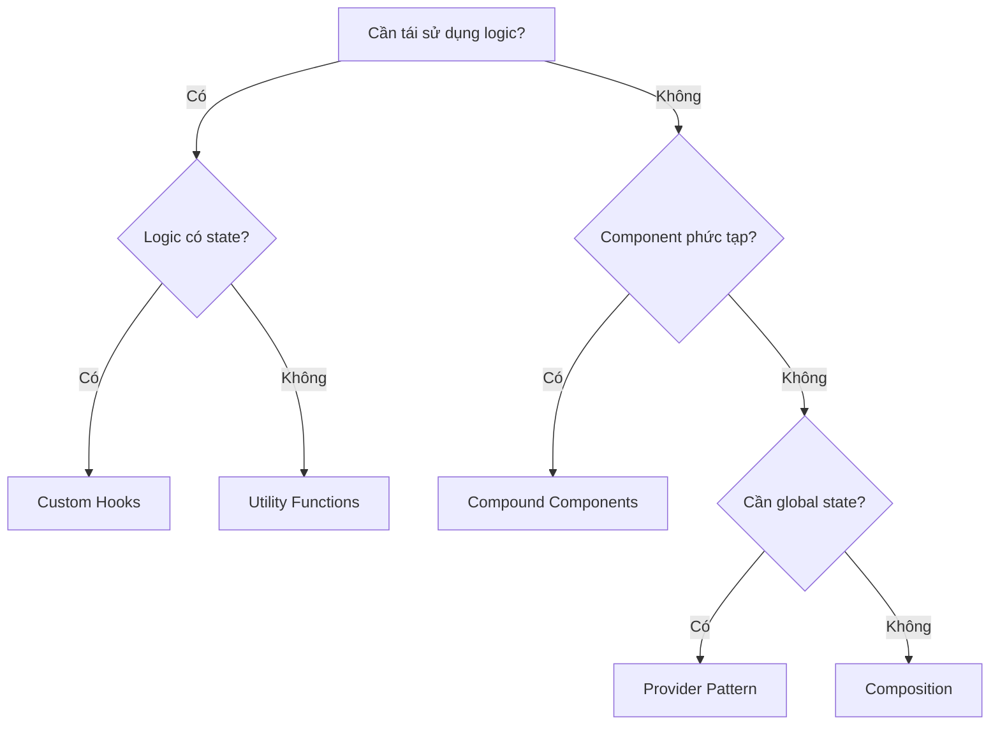
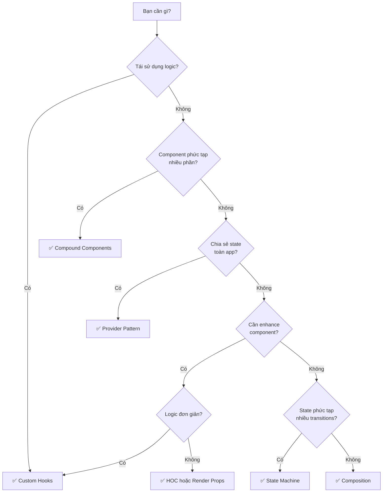

# Design Patterns for Frontend: Hướng dẫn toàn diện với ReactJS + TypeScript

> 💡 **Dành cho Intern/Junior Developer** - Bài viết sử dụng ẩn dụ đời thường để giải thích các khái niệm phức tạp.

Bạn đã bao giờ nhìn vào một codebase React và tự hỏi: "Tại sao code này lại clean và dễ hiểu đến vậy?" Câu trả lời thường nằm ở việc áp dụng đúng **Design Patterns**.

<!--truncate-->

## 🎯 Tại sao cần Design Patterns?

Hãy tưởng tượng bạn đang xây một ngôi nhà. Bạn có thể xây tùy ý, nhưng nếu theo những **bản vẽ đã được chứng minh hiệu quả** (blueprints), ngôi nhà sẽ:
- ✅ Vững chắc hơn
- ✅ Dễ sửa chữa hơn
- ✅ Người khác dễ hiểu cấu trúc hơn

**Design Patterns** chính là những "bản vẽ" cho code. Chúng là **giải pháp đã được kiểm chứng** cho các vấn đề thường gặp trong phát triển phần mềm.

---

## 📊 Tổng quan 8 Patterns quan trọng

| Pattern | Mục đích chính | Khi nào dùng? |
|---------|----------------|---------------|
| **Custom Hooks** | Tái sử dụng logic | Logic dùng lại ở nhiều component |
| **Compound Components** | API linh hoạt | Component phức tạp với nhiều phần |
| **Provider Pattern** | Chia sẻ state global | Theme, Auth, Language |
| **Composition** | Xây UI từ component nhỏ | Mọi lúc! (Core concept) |
| **Container/Presentational** | Tách logic và UI | Khi cần component thuần UI |
| **Higher-Order Components** | Thêm tính năng | Wrap component với logic chung |
| **Render Props** | Chia sẻ logic linh hoạt | Khi cần control cao |
| **State Machine** | Quản lý state phức tạp | Multi-step forms, modals |



---

## 1️⃣ Custom Hooks - "Công thức nấu ăn tái sử dụng"

### 🍳 Ẩn dụ đời thường

Hãy tưởng tượng bạn có một **công thức làm nước sốt** ngon. Thay vì viết lại công thức mỗi lần nấu món mới, bạn chỉ cần nói: "Dùng công thức nước sốt của tôi".

**Custom Hooks** hoạt động tương tự - đóng gói logic thành "công thức" để dùng lại ở nhiều component.

### 💻 Code Example

```typescript
// ✅ filename: src/hooks/useLocalStorage.ts
// Custom Hook: Lưu trữ state vào localStorage

import { useState, useEffect } from 'react';

// 👇 Generic type để hook có thể lưu bất kỳ kiểu dữ liệu nào
function useLocalStorage<T>(key: string, initialValue: T) {
  // Lấy giá trị từ localStorage hoặc dùng initialValue
  const [storedValue, setStoredValue] = useState<T>(() => {
    try {
      const item = window.localStorage.getItem(key);
      return item ? JSON.parse(item) : initialValue;
    } catch (error) {
      // Fallback nếu localStorage không khả dụng (SSR)
      return initialValue;
    }
  });

  // Sync với localStorage mỗi khi giá trị thay đổi
  useEffect(() => {
    window.localStorage.setItem(key, JSON.stringify(storedValue));
  }, [key, storedValue]);

  return [storedValue, setStoredValue] as const;
}

export default useLocalStorage;
```

```typescript
// ✅ filename: src/components/ThemeToggle.tsx
// Sử dụng Custom Hook

import useLocalStorage from '../hooks/useLocalStorage';

function ThemeToggle() {
  // 👇 Dùng như useState, nhưng tự động persist vào localStorage
  const [theme, setTheme] = useLocalStorage<'light' | 'dark'>('theme', 'light');

  return (
    <button onClick={() => setTheme(theme === 'light' ? 'dark' : 'light')}>
      Current: {theme}
    </button>
  );
}
```

### ⚖️ Trade-offs

| ✅ Ưu điểm | ❌ Nhược điểm |
|-----------|-------------|
| Code DRY, không lặp lại | Cần hiểu Rules of Hooks |
| Dễ test riêng biệt | Không dùng được trong class component |
| Composition tốt | Có thể bị lạm dụng (over-engineering) |

### 📌 Best Practices

1. **Naming**: Luôn bắt đầu bằng `use` (VD: `useAuth`, `useFetch`)
2. **Single Responsibility**: Mỗi hook làm một việc
3. **Return tuple hoặc object**: `[value, setValue]` hoặc `{ data, loading, error }`

---

## 2️⃣ Compound Components - "Bộ LEGO thông minh"

### 🧱 Ẩn dụ đời thường

Hãy nghĩ về một **bộ LEGO**. Bạn có các mảnh ghép (Button, List, Item) riêng biệt, nhưng chúng được thiết kế để **hoạt động cùng nhau** theo một cách nhất định. Bạn có thể sắp xếp lại theo ý muốn, nhưng chúng vẫn "hiểu" nhau.

### 💻 Code Example

```typescript
// ✅ filename: src/components/Accordion/index.tsx
// Compound Component: Accordion với Context

import React, { createContext, useContext, useState, ReactNode } from 'react';

// 1️⃣ Tạo Context để các component con chia sẻ state
interface AccordionContextType {
  activeIndex: number | null;
  setActiveIndex: (index: number | null) => void;
}

const AccordionContext = createContext<AccordionContextType | null>(null);

// 2️⃣ Custom hook để truy cập context an toàn
function useAccordion() {
  const context = useContext(AccordionContext);
  if (!context) {
    throw new Error('Accordion components must be used within <Accordion>');
  }
  return context;
}

// 3️⃣ Parent component - Quản lý state
interface AccordionProps {
  children: ReactNode;
}

function Accordion({ children }: AccordionProps) {
  const [activeIndex, setActiveIndex] = useState<number | null>(null);

  return (
    <AccordionContext.Provider value={{ activeIndex, setActiveIndex }}>
      <div className="accordion">{children}</div>
    </AccordionContext.Provider>
  );
}

// 4️⃣ Child components - Tiêu thụ context
interface ItemProps {
  index: number;
  title: string;
  children: ReactNode;
}

function AccordionItem({ index, title, children }: ItemProps) {
  const { activeIndex, setActiveIndex } = useAccordion();
  const isOpen = activeIndex === index;

  return (
    <div className="accordion-item">
      <button onClick={() => setActiveIndex(isOpen ? null : index)}>
        {title} {isOpen ? '▲' : '▼'}
      </button>
      {isOpen && <div className="accordion-content">{children}</div>}
    </div>
  );
}

// 5️⃣ Gắn sub-components vào parent (API đẹp)
Accordion.Item = AccordionItem;

export default Accordion;
```

```tsx
// ✅ filename: src/App.tsx
// Sử dụng Compound Component - API rất clean!

import Accordion from './components/Accordion';

function App() {
  return (
    <Accordion>
      <Accordion.Item index={0} title="Section 1">
        Nội dung section 1
      </Accordion.Item>
      <Accordion.Item index={1} title="Section 2">
        Nội dung section 2
      </Accordion.Item>
    </Accordion>
  );
}
```

### ⚖️ Trade-offs

| ✅ Ưu điểm | ❌ Nhược điểm |
|-----------|-------------|
| API linh hoạt, dễ customize | Phức tạp hơn component đơn giản |
| Tránh prop drilling | Cần TypeScript để type-safe |
| Người dùng có control cao | Có learning curve |

---

## 3️⃣ Provider Pattern - "Đài phát thanh cho cả nhà"

### 📻 Ẩn dụ đời thường

Hãy tưởng tượng một **đài phát thanh** trong nhà. Thay vì chạy đến từng phòng để thông báo "Bữa tối xong rồi!", bạn chỉ cần nói qua đài và **mọi phòng đều nghe được**.

**Provider Pattern** hoạt động tương tự - "phát sóng" state cho toàn bộ component tree.

### 💻 Code Example

```typescript
// ✅ filename: src/contexts/ThemeContext.tsx
// Provider Pattern: Theme system

import React, { createContext, useContext, useState, ReactNode } from 'react';

// 1️⃣ Định nghĩa types
type Theme = 'light' | 'dark';

interface ThemeContextType {
  theme: Theme;
  toggleTheme: () => void;
}

// 2️⃣ Tạo Context với giá trị mặc định
const ThemeContext = createContext<ThemeContextType | undefined>(undefined);

// 3️⃣ Provider component
interface ThemeProviderProps {
  children: ReactNode;
}

export function ThemeProvider({ children }: ThemeProviderProps) {
  const [theme, setTheme] = useState<Theme>('light');

  const toggleTheme = () => {
    setTheme(prev => (prev === 'light' ? 'dark' : 'light'));
  };

  return (
    <ThemeContext.Provider value={{ theme, toggleTheme }}>
      {children}
    </ThemeContext.Provider>
  );
}

// 4️⃣ Custom hook để tiêu thụ context
export function useTheme() {
  const context = useContext(ThemeContext);
  if (context === undefined) {
    throw new Error('useTheme must be used within a ThemeProvider');
  }
  return context;
}
```

```tsx
// ✅ filename: src/main.tsx
// Wrap app với Provider

import { ThemeProvider } from './contexts/ThemeContext';
import App from './App';

ReactDOM.render(
  <ThemeProvider>
    <App />
  </ThemeProvider>,
  document.getElementById('root')
);
```

```tsx
// ✅ filename: src/components/Header.tsx
// Sử dụng Theme ở bất kỳ đâu trong tree

import { useTheme } from '../contexts/ThemeContext';

function Header() {
  const { theme, toggleTheme } = useTheme();

  return (
    <header className={`header-${theme}`}>
      <button onClick={toggleTheme}>
        Switch to {theme === 'light' ? 'dark' : 'light'}
      </button>
    </header>
  );
}
```

### ⚠️ Cảnh báo quan trọng

> **Đừng bỏ tất cả vào một Context!** Mỗi khi context value thay đổi, TẤT CẢ component consume context đều re-render.

```typescript
// ❌ Sai: Một context khổng lồ
const AppContext = createContext({ theme, user, cart, notifications, ... });

// ✅ Đúng: Tách thành nhiều context nhỏ
const ThemeContext = createContext(...);
const AuthContext = createContext(...);
const CartContext = createContext(...);
```

---

## 4️⃣ Composition - "Xếp hình để tạo bức tranh"

### 🧩 Ẩn dụ đời thường

Giống như **xếp các mảnh puzzle** để tạo bức tranh hoàn chỉnh. Mỗi mảnh có hình dạng riêng, nhưng khi ghép lại, chúng tạo nên tổng thể có ý nghĩa.

### 💻 Code Example

```tsx
// ✅ filename: src/components/Card/index.tsx
// Composition: Xây dựng Card từ các phần nhỏ

import React, { ReactNode } from 'react';

// Các component nhỏ, đơn nhiệm
function CardHeader({ children }: { children: ReactNode }) {
  return <div className="card-header">{children}</div>;
}

function CardBody({ children }: { children: ReactNode }) {
  return <div className="card-body">{children}</div>;
}

function CardFooter({ children }: { children: ReactNode }) {
  return <div className="card-footer">{children}</div>;
}

// Component gốc
function Card({ children }: { children: ReactNode }) {
  return <div className="card">{children}</div>;
}

// Export tất cả
Card.Header = CardHeader;
Card.Body = CardBody;
Card.Footer = CardFooter;

export default Card;
```

```tsx
// ✅ filename: src/pages/Products.tsx
// Sử dụng - Linh hoạt sắp xếp các phần

import Card from '../components/Card';

// Card đầy đủ
function ProductCard() {
  return (
    <Card>
      <Card.Header>iPhone 15</Card.Header>
      <Card.Body>Mô tả sản phẩm...</Card.Body>
      <Card.Footer>
        <button>Mua ngay</button>
      </Card.Footer>
    </Card>
  );
}

// Card đơn giản - không cần Footer
function SimpleCard() {
  return (
    <Card>
      <Card.Header>Thông báo</Card.Header>
      <Card.Body>Nội dung thông báo</Card.Body>
    </Card>
  );
}
```

### 💡 Tại sao Composition > Inheritance?

React khuyến khích **Composition over Inheritance** vì:

1. **Linh hoạt hơn**: Thay đổi behavior bằng cách thay đổi props/children
2. **Tránh tightly coupled**: Component không phụ thuộc vào class cha
3. **Dễ hiểu hơn**: "Has-a" relationship rõ ràng hơn "Is-a"

---

## 5️⃣ Container/Presentational - "Đầu bếp và Phục vụ"

### 👨‍🍳 Ẩn dụ đời thường

Trong nhà hàng, **Đầu bếp** (Container) lo việc nấu nướng (logic, data), còn **Phục vụ** (Presentational) chỉ lo trình bày món ăn cho khách (UI).

### 💻 Code Example

```typescript
// ✅ filename: src/components/UserList/UserList.presenter.tsx
// Presentational: Chỉ lo render UI

interface User {
  id: number;
  name: string;
  email: string;
}

interface UserListPresenterProps {
  users: User[];
  isLoading: boolean;
  onDelete: (id: number) => void;
}

// 👇 Không có state, chỉ nhận props và render
export function UserListPresenter({ 
  users, 
  isLoading, 
  onDelete 
}: UserListPresenterProps) {
  if (isLoading) return <div>Loading...</div>;

  return (
    <ul>
      {users.map(user => (
        <li key={user.id}>
          {user.name} - {user.email}
          <button onClick={() => onDelete(user.id)}>Delete</button>
        </li>
      ))}
    </ul>
  );
}
```

```typescript
// ✅ filename: src/components/UserList/UserList.container.tsx
// Container: Quản lý logic và data

import { useState, useEffect } from 'react';
import { UserListPresenter } from './UserList.presenter';

export function UserListContainer() {
  const [users, setUsers] = useState([]);
  const [isLoading, setIsLoading] = useState(true);

  useEffect(() => {
    // Fetch data
    fetch('/api/users')
      .then(res => res.json())
      .then(data => {
        setUsers(data);
        setIsLoading(false);
      });
  }, []);

  const handleDelete = (id: number) => {
    setUsers(prev => prev.filter(user => user.id !== id));
  };

  // Truyền data và callbacks xuống Presenter
  return (
    <UserListPresenter 
      users={users} 
      isLoading={isLoading} 
      onDelete={handleDelete} 
    />
  );
}
```

### ⚖️ Trade-offs

| ✅ Ưu điểm | ❌ Nhược điểm |
|-----------|-------------|
| Tách biệt rõ ràng | Nhiều file hơn |
| Presenter dễ test | Có thể overkill cho app nhỏ |
| Reuse UI dễ dàng | Hooks có thể thay thế được |

> 💡 **Tip**: Với React Hooks, bạn có thể đạt được separation tương tự bằng Custom Hooks mà không cần tạo 2 component riêng biệt.

---

## 6️⃣ Higher-Order Components (HOC) - "Áo giáp cho Component"

### 🛡️ Ẩn dụ đời thường

HOC giống như việc **mặc áo giáp cho nhân vật game**. Nhân vật vẫn là chính họ, nhưng được "enhance" thêm khả năng phòng thủ.

### 💻 Code Example

```typescript
// ✅ filename: src/hocs/withAuth.tsx
// HOC: Bảo vệ route cần authentication

import React, { ComponentType } from 'react';
import { Navigate } from 'react-router-dom';
import { useAuth } from '../hooks/useAuth';

// 👇 Generic HOC - nhận component và trả về component mới
function withAuth<P extends object>(WrappedComponent: ComponentType<P>) {
  // Trả về component mới với tên dễ debug
  function WithAuthComponent(props: P) {
    const { isAuthenticated, isLoading } = useAuth();

    if (isLoading) {
      return <div>Checking authentication...</div>;
    }

    if (!isAuthenticated) {
      return <Navigate to="/login" replace />;
    }

    // Render component gốc với tất cả props
    return <WrappedComponent {...props} />;
  }

  // Đặt tên để dễ debug trong React DevTools
  WithAuthComponent.displayName = `withAuth(${
    WrappedComponent.displayName || WrappedComponent.name || 'Component'
  })`;

  return WithAuthComponent;
}

export default withAuth;
```

```tsx
// ✅ filename: src/pages/Dashboard.tsx
// Sử dụng HOC

import withAuth from '../hocs/withAuth';

function Dashboard() {
  return <div>Welcome to Dashboard!</div>;
}

// 👇 "Mặc áo giáp" cho Dashboard
export default withAuth(Dashboard);
```

### ⚠️ Khi nào KHÔNG nên dùng HOC?

1. **Logic đơn giản**: Dùng Custom Hooks thay thế
2. **Cần truyền ref**: HOC không forward ref tự động
3. **Nhiều HOC lồng nhau**: Gây "wrapper hell"

```tsx
// ❌ Wrapper Hell - Khó debug
export default withAuth(withTheme(withLogger(MyComponent)));

// ✅ Prefer Hooks
function MyComponent() {
  const auth = useAuth();
  const theme = useTheme();
  useLogger();
  // ...
}
```

---

## 7️⃣ Render Props - "Cho mượn bút vẽ"

### 🎨 Ẩn dụ đời thường

Thay vì tự vẽ tranh, bạn **cho người khác mượn bút và màu**, để họ vẽ theo ý muốn của họ.

### 💻 Code Example

```typescript
// ✅ filename: src/components/MouseTracker.tsx
// Render Props: Theo dõi vị trí chuột

import { useState, useEffect, ReactNode } from 'react';

interface MousePosition {
  x: number;
  y: number;
}

interface MouseTrackerProps {
  // 👇 Render prop - function nhận data và trả về JSX
  render: (position: MousePosition) => ReactNode;
}

function MouseTracker({ render }: MouseTrackerProps) {
  const [position, setPosition] = useState<MousePosition>({ x: 0, y: 0 });

  useEffect(() => {
    const handleMouseMove = (e: MouseEvent) => {
      setPosition({ x: e.clientX, y: e.clientY });
    };

    window.addEventListener('mousemove', handleMouseMove);
    return () => window.removeEventListener('mousemove', handleMouseMove);
  }, []);

  // Gọi render prop với data
  return <>{render(position)}</>;
}

export default MouseTracker;
```

```tsx
// ✅ filename: src/App.tsx
// Sử dụng - Người dùng quyết định cách render

import MouseTracker from './components/MouseTracker';

function App() {
  return (
    <MouseTracker
      render={({ x, y }) => (
        <div>
          <h1>Mouse Position</h1>
          <p>X: {x}, Y: {y}</p>
        </div>
      )}
    />
  );
}
```

### 💡 Variant: Children as Function

```tsx
// Cách viết khác - dùng children thay vì prop
<MouseTracker>
  {({ x, y }) => <p>Position: {x}, {y}</p>}
</MouseTracker>
```

---

## 8️⃣ State Machine (Bonus) - "Máy bán nước tự động"

### 🥤 Ẩn dụ đời thường

Máy bán nước có các **trạng thái rõ ràng**: Idle → Chọn đồ → Thanh toán → Xuất hàng. Máy **chỉ có thể chuyển** từ trạng thái này sang trạng thái khác theo **quy tắc định sẵn**.

### 💻 Code Example (với XState)

```typescript
// ✅ filename: src/machines/checkoutMachine.ts
// State Machine: Checkout flow

import { createMachine, assign } from 'xstate';

interface CheckoutContext {
  items: string[];
  error: string | null;
}

type CheckoutEvent =
  | { type: 'PROCEED' }
  | { type: 'BACK' }
  | { type: 'CONFIRM' }
  | { type: 'ERROR'; message: string };

const checkoutMachine = createMachine<CheckoutContext, CheckoutEvent>({
  id: 'checkout',
  initial: 'cart',
  context: {
    items: [],
    error: null,
  },
  states: {
    cart: {
      on: { PROCEED: 'shipping' },
    },
    shipping: {
      on: {
        PROCEED: 'payment',
        BACK: 'cart',
      },
    },
    payment: {
      on: {
        CONFIRM: 'processing',
        BACK: 'shipping',
      },
    },
    processing: {
      invoke: {
        src: 'processPayment',
        onDone: 'success',
        onError: {
          target: 'payment',
          actions: assign({
            error: (_, event) => event.data.message,
          }),
        },
      },
    },
    success: {
      type: 'final',
    },
  },
});

export default checkoutMachine;
```

```tsx
// ✅ filename: src/components/Checkout.tsx
// Sử dụng với useMachine hook

import { useMachine } from '@xstate/react';
import checkoutMachine from '../machines/checkoutMachine';

function Checkout() {
  const [state, send] = useMachine(checkoutMachine);

  return (
    <div>
      <h2>Current Step: {state.value}</h2>

      {state.matches('cart') && (
        <button onClick={() => send('PROCEED')}>Continue to Shipping</button>
      )}

      {state.matches('shipping') && (
        <>
          <button onClick={() => send('BACK')}>Back</button>
          <button onClick={() => send('PROCEED')}>Continue to Payment</button>
        </>
      )}

      {state.matches('payment') && (
        <>
          <button onClick={() => send('BACK')}>Back</button>
          <button onClick={() => send('CONFIRM')}>Pay Now</button>
        </>
      )}

      {state.matches('success') && <p>🎉 Order placed successfully!</p>}
    </div>
  );
}
```

### ⚖️ Khi nào dùng State Machine?

| ✅ Phù hợp | ❌ Không cần thiết |
|-----------|-------------------|
| Multi-step wizards/forms | Toggle button đơn giản |
| Complex async flows | Loading states cơ bản |
| Game logic | CRUD đơn giản |
| Cần visualize flow | Prototype nhanh |

---

## 🎯 Khi nào dùng Pattern nào?



---

## 📝 Tổng kết Best Practices

1. **Start Simple**: Luôn bắt đầu với Composition và Custom Hooks
2. **Avoid Over-Engineering**: Không phải mọi component đều cần pattern phức tạp
3. **TypeScript is Your Friend**: Type-safe patterns dễ maintain hơn
4. **Document Your Patterns**: Team cần hiểu pattern bạn đang dùng
5. **Measure Performance**: Re-renders có thể phát sinh từ Context

---

## 🚀 Action Items cho bạn

1. **Tuần này**: Refactor 1 component để dùng Custom Hooks
2. **Tuần sau**: Thử build Accordion với Compound Components
3. **Tháng này**: Setup Theme Provider cho project

---

> Made by Anh Tu - Share to be shared

## 📚 Tham khảo

- [patterns.dev](https://patterns.dev) - Design Patterns cho JavaScript/React
- [react.dev](https://react.dev) - Official React Documentation
- [XState Docs](https://xstate.js.org) - State Machine library

