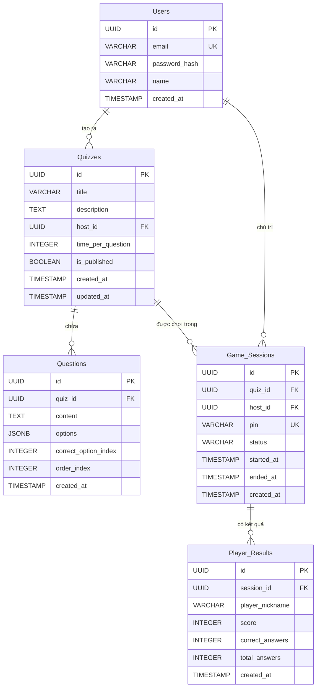

# 🗄️ PHÂN TÍCH VÀ THIẾT KẾ CƠ SỞ DỮ LIỆU — HỆ THỐNG QUIZ REAL-TIME

## Bước 1: Xác định Thực thể (Entities) và Thuộc tính (Attributes)

> **Ẩn dụ đời sống:** Bước này giống như liệt kê "nhân vật" trong một bộ phim và thông tin cá nhân của từng người. Mỗi "nhân vật" là một thực thể, mỗi "thông tin" là một thuộc tính.

Dựa trên phân tích yêu cầu nghiệp vụ, hệ thống Quiz Real-time cần quản lý **5 thực thể chính**:

<!--truncate-->

### 1.1. Thực thể: `Users` (Người dùng)

> Nghiệp vụ: Người dùng đăng ký tài khoản để tạo và quản lý quiz (vai trò Host/Giáo viên).

| Thuộc tính | Mô tả | Khóa | Bắt buộc |
|------------|-------|------|----------|
| `id` | Mã định danh duy nhất | 🔑 PK | ✅ |
| `email` | Email đăng nhập (unique) | UNIQUE | ✅ |
| `password_hash` | Mật khẩu đã mã hóa | — | ✅ |
| `name` | Tên hiển thị | — | ✅ |
| `created_at` | Thời gian tạo tài khoản | — | ✅ (auto) |

### 1.2. Thực thể: `Quizzes` (Bộ câu hỏi)

> Nghiệp vụ: Mỗi quiz do một User tạo ra, chứa nhiều câu hỏi và có cấu hình thời gian trả lời.

| Thuộc tính | Mô tả | Khóa | Bắt buộc |
|------------|-------|------|----------|
| `id` | Mã định danh duy nhất | 🔑 PK | ✅ |
| `title` | Tiêu đề bộ quiz | — | ✅ |
| `description` | Mô tả ngắn về bộ quiz | — | ❌ |
| `host_id` | Mã người tạo | 🔗 FK → Users | ✅ |
| `time_per_question` | Thời gian trả lời mỗi câu (giây) | — | ✅ (default: 20) |
| `is_published` | Trạng thái xuất bản | — | ✅ (default: false) |
| `created_at` | Thời gian tạo | — | ✅ (auto) |
| `updated_at` | Thời gian cập nhật cuối | — | ✅ (auto) |

### 1.3. Thực thể: `Questions` (Câu hỏi)

> Nghiệp vụ: Mỗi câu hỏi thuộc một quiz, có nội dung và các lựa chọn trả lời (text-only cho MVP).

| Thuộc tính | Mô tả | Khóa | Bắt buộc |
|------------|-------|------|----------|
| `id` | Mã định danh duy nhất | 🔑 PK | ✅ |
| `quiz_id` | Mã bộ quiz chứa câu hỏi | 🔗 FK → Quizzes | ✅ |
| `content` | Nội dung câu hỏi | — | ✅ |
| `options` | Danh sách đáp án (JSON array) | — | ✅ |
| `correct_option_index` | Chỉ số đáp án đúng (0-based) | — | ✅ |
| `order_index` | Thứ tự câu hỏi trong quiz | — | ✅ (default: 0) |
| `created_at` | Thời gian tạo | — | ✅ (auto) |

### 1.4. Thực thể: `Game_Sessions` (Phiên chơi)

> Nghiệp vụ: Mỗi lần Host bắt đầu một game từ quiz sẽ tạo một phiên chơi. Phiên chơi có mã PIN để Player tham gia.

| Thuộc tính | Mô tả | Khóa | Bắt buộc |
|------------|-------|------|----------|
| `id` | Mã định danh duy nhất | 🔑 PK | ✅ |
| `quiz_id` | Mã bộ quiz được chơi | 🔗 FK → Quizzes | ✅ |
| `host_id` | Mã người chủ phòng | 🔗 FK → Users | ✅ |
| `pin` | Mã PIN 6 số để join phòng | UNIQUE | ✅ |
| `status` | Trạng thái phiên | — | ✅ (default: 'waiting') |
| `started_at` | Thời gian bắt đầu game | — | ❌ |
| `ended_at` | Thời gian kết thúc game | — | ❌ |
| `created_at` | Thời gian tạo phiên | — | ✅ (auto) |

> **Giá trị `status`:** `'waiting'` → `'playing'` → `'finished'`

### 1.5. Thực thể: `Player_Results` (Kết quả người chơi)

> Nghiệp vụ: Lưu kết quả của từng Player trong mỗi phiên game. Player không cần tài khoản, chỉ cần nickname.

| Thuộc tính | Mô tả | Khóa | Bắt buộc |
|------------|-------|------|----------|
| `id` | Mã định danh duy nhất | 🔑 PK | ✅ |
| `session_id` | Mã phiên chơi | 🔗 FK → Game_Sessions | ✅ |
| `player_nickname` | Tên hiển thị của Player | — | ✅ |
| `score` | Tổng điểm | — | ✅ (default: 0) |
| `correct_answers` | Số câu trả lời đúng | — | ✅ (default: 0) |
| `total_answers` | Tổng số câu đã trả lời | — | ✅ (default: 0) |
| `created_at` | Thời gian tham gia | — | ✅ (auto) |

---

## Bước 2: Xác định Mối quan hệ (Relationships)

> **Ẩn dụ đời sống:** Nếu thực thể là "nhân vật" thì mối quan hệ là "cách họ tương tác với nhau". Ví dụ: Một giáo viên **tạo nhiều** bộ đề → quan hệ 1:N.

### 2.1. Bảng tổng hợp mối quan hệ

| # | Thực thể A | Mối quan hệ | Thực thể B | Ký hiệu | Ràng buộc nghiệp vụ |
|---|-----------|-------------|-----------|---------|---------------------|
| R1 | Users | tạo ra | Quizzes | **1 : N** | Một User tạo được nhiều Quiz. Mỗi Quiz chỉ thuộc về 1 User. |
| R2 | Quizzes | chứa | Questions | **1 : N** | Một Quiz có nhiều Question. Mỗi Question chỉ thuộc 1 Quiz. Xóa Quiz → xóa hết Questions (CASCADE). |
| R3 | Quizzes | được chơi trong | Game_Sessions | **1 : N** | Một Quiz có thể được chơi nhiều lần (nhiều phiên). Mỗi phiên chơi 1 Quiz duy nhất. |
| R4 | Users | chủ trì | Game_Sessions | **1 : N** | Một User có thể chủ trì nhiều phiên game. Mỗi phiên chỉ có 1 Host. |
| R5 | Game_Sessions | có kết quả | Player_Results | **1 : N** | Một phiên game có nhiều Player tham gia. Mỗi kết quả thuộc 1 phiên. |

### 2.2. Giải thích chi tiết ràng buộc

**R1 — Users ↔ Quizzes (1:N):**
- Khi xóa User → Quizzes của User đó cần xử lý (SET NULL hoặc CASCADE tùy chính sách)
- Trong hệ thống học tập, chọn **RESTRICT** (không cho xóa User nếu còn Quiz) để bảo toàn dữ liệu

**R2 — Quizzes ↔ Questions (1:N):**
- Khi xóa Quiz → Tất cả Questions phải bị xóa theo (**CASCADE**)
- Một câu hỏi không có nghĩa nếu tách khỏi Quiz

**R3 — Quizzes ↔ Game_Sessions (1:N):**
- Một bộ Quiz có thể được "mở phòng" chơi nhiều lần
- Mỗi phiên chơi là một instance độc lập

**R5 — Game_Sessions ↔ Player_Results (1:N):**
- Khi game kết thúc, kết quả được persist từ Redis vào PostgreSQL
- Xóa Game_Session → Xóa Player_Results (**CASCADE**)

---

## Bước 3: Sơ đồ ERD (Entity-Relationship Diagram)

> Sử dụng **Mermaid** để vẽ sơ đồ quan hệ thực thể.



---

## Bước 4: Chuẩn hóa dữ liệu (Normalization)

> **Ẩn dụ đời sống:** Chuẩn hóa giống như dọn phòng — bạn loại bỏ đồ trùng lặp, sắp xếp mỗi thứ vào đúng chỗ.

### 4.1. Dạng chuẩn 1NF (First Normal Form)

**Quy tắc:** Mỗi ô chỉ chứa giá trị nguyên tử (atomic), không có nhóm lặp.

| Kiểm tra | Kết quả | Giải thích |
|----------|---------|------------|
| Users | ✅ Đạt 1NF | Tất cả thuộc tính là nguyên tử |
| Quizzes | ✅ Đạt 1NF | Tất cả thuộc tính là nguyên tử |
| Questions | ⚠️ Cần xem xét | `options` là JSONB array |
| Game_Sessions | ✅ Đạt 1NF | Tất cả thuộc tính là nguyên tử |
| Player_Results | ✅ Đạt 1NF | Tất cả thuộc tính là nguyên tử |

**📌 Quyết định thiết kế cho `Questions.options`:**

```
Cách 1: Tách bảng Options riêng (chuẩn hóa triệt để)
   Questions 1:N Options (id, question_id, content, is_correct)
   → Ưu: Đúng chuẩn 1NF, dễ query từng option
   → Nhược: Thêm JOIN, phức tạp hơn cho MVP

Cách 2: Dùng JSONB array (pragmatic - CHỌN CÁCH NÀY)
   options: ["Đáp án A", "Đáp án B", "Đáp án C", "Đáp án D"]
   → Ưu: Đơn giản, lấy tất cả options 1 lần, đủ cho MVP
   → Nhược: Không chuẩn 1NF nghiêm ngặt, khó query từng option

✅ CHỌN Cách 2 vì: Số options cố định (4), luôn lấy hết, không cần query riêng.
   PostgreSQL JSONB hỗ trợ indexing nếu cần sau này.
```

> **🎓 Trade-off:** Trong thực tế, không phải lúc nào cũng cần chuẩn hóa tuyệt đối. JSONB column là một quyết định thiết kế hợp lý khi dữ liệu có cấu trúc đơn giản và luôn được đọc cùng nhau.

### 4.2. Dạng chuẩn 2NF (Second Normal Form)

**Quy tắc:** Đạt 1NF + mọi thuộc tính không khóa phụ thuộc hoàn toàn vào khóa chính (không phụ thuộc bộ phận).

| Bảng | Khóa chính | Kiểm tra | Kết quả |
|------|-----------|----------|---------|
| Users | `id` (đơn) | Tất cả thuộc tính phụ thuộc vào `id` | ✅ Đạt 2NF |
| Quizzes | `id` (đơn) | `title`, `host_id`, `time_per_question` đều phụ thuộc `id` | ✅ Đạt 2NF |
| Questions | `id` (đơn) | `content`, `options` đều phụ thuộc `id` | ✅ Đạt 2NF |
| Game_Sessions | `id` (đơn) | `pin`, `status` đều phụ thuộc `id` | ✅ Đạt 2NF |
| Player_Results | `id` (đơn) | `score`, `nickname` đều phụ thuộc `id` | ✅ Đạt 2NF |

> **Kết luận:** Vì tất cả bảng đều dùng khóa chính đơn (UUID `id`), không có khóa tổ hợp → **tự động đạt 2NF**.

### 4.3. Dạng chuẩn 3NF (Third Normal Form)

**Quy tắc:** Đạt 2NF + không có phụ thuộc bắc cầu (thuộc tính A → B → C thì A không nên chứa C).

| Bảng | Kiểm tra phụ thuộc bắc cầu | Kết quả |
|------|---------------------------|---------|
| Users | Không có: `email`, `name`, `password_hash` đều phụ thuộc trực tiếp `id` | ✅ Đạt 3NF |
| Quizzes | `host_id` → Users.`name`? **KHÔNG** — chúng ta không lưu `host_name` trong Quizzes | ✅ Đạt 3NF |
| Questions | `quiz_id` → Quizzes.`title`? **KHÔNG** — không lưu `quiz_title` trong Questions | ✅ Đạt 3NF |
| Game_Sessions | `host_id` + `quiz_id` là FK, không lưu dư thừa thông tin User hay Quiz | ✅ Đạt 3NF |
| Player_Results | `session_id` là FK, không lưu thêm `quiz_title` hay `pin` | ✅ Đạt 3NF |

> **Kết luận:** Thiết kế **đạt 3NF** — không có dữ liệu dư thừa, không có phụ thuộc bắc cầu.

---

## Bước 5: Thiết kế Mô hình Logic (Logical Data Model)

> Chuyển đổi ERD thành cấu trúc bảng chi tiết với PK, FK, và ràng buộc (Constraints).

### 5.1. Bảng `users`

| Cột | Khóa | Ràng buộc | Ghi chú |
|-----|------|-----------|---------|
| id | PK | NOT NULL, DEFAULT gen_random_uuid() | Khóa chính |
| email | UK | NOT NULL, UNIQUE | Đăng nhập, không trùng |
| password_hash | — | NOT NULL | Bcrypt hash |
| name | — | NOT NULL | Tên hiển thị |
| created_at | — | NOT NULL, DEFAULT NOW() | Tự động ghi |

### 5.2. Bảng `quizzes`

| Cột | Khóa | Ràng buộc | Ghi chú |
|-----|------|-----------|---------|
| id | PK | NOT NULL, DEFAULT gen_random_uuid() | Khóa chính |
| title | — | NOT NULL | Tiêu đề quiz |
| description | — | NULLABLE | Mô tả tùy chọn |
| host_id | FK → users(id) | NOT NULL, ON DELETE RESTRICT | Không cho xóa User nếu còn Quiz |
| `time_per_question` | — | NOT NULL, DEFAULT 20, CHECK (> 0 AND &lt;= 120) | 1-120 giây |
| is_published | — | NOT NULL, DEFAULT FALSE | Chỉ quiz đã publish mới chơi được |
| created_at | — | NOT NULL, DEFAULT NOW() | Tự động |
| updated_at | — | NOT NULL, DEFAULT NOW() | Auto update |

### 5.3. Bảng `questions`

| Cột | Khóa | Ràng buộc | Ghi chú |
|-----|------|-----------|---------|
| id | PK | NOT NULL, DEFAULT gen_random_uuid() | Khóa chính |
| quiz_id | FK → quizzes(id) | NOT NULL, ON DELETE CASCADE | Xóa Quiz → xóa Questions |
| content | — | NOT NULL | Nội dung câu hỏi |
| options | — | NOT NULL | JSONB array các đáp án |
| `correct_option_index` | — | NOT NULL, CHECK (>= 0 AND &lt;= 3) | Index đáp án đúng (0-3) |
| order_index | — | NOT NULL, DEFAULT 0 | Thứ tự hiển thị |
| created_at | — | NOT NULL, DEFAULT NOW() | Tự động |

### 5.4. Bảng `game_sessions`

| Cột | Khóa | Ràng buộc | Ghi chú |
|-----|------|-----------|---------|
| id | PK | NOT NULL, DEFAULT gen_random_uuid() | Khóa chính |
| quiz_id | FK → quizzes(id) | NOT NULL, ON DELETE RESTRICT | Không xóa Quiz đang có session |
| host_id | FK → users(id) | NOT NULL, ON DELETE RESTRICT | Người chủ trì |
| pin | UK | NOT NULL, UNIQUE | Mã 6 ký tự |
| status | — | NOT NULL, DEFAULT 'waiting', CHECK IN ('waiting','playing','finished') | State machine |
| started_at | — | NULLABLE | Set khi host start game |
| ended_at | — | NULLABLE | Set khi game kết thúc |
| created_at | — | NOT NULL, DEFAULT NOW() | Tự động |

### 5.5. Bảng `player_results`

| Cột | Khóa | Ràng buộc | Ghi chú |
|-----|------|-----------|---------|
| id | PK | NOT NULL, DEFAULT gen_random_uuid() | Khóa chính |
| session_id | FK → game_sessions(id) | NOT NULL, ON DELETE CASCADE | Xóa session → xóa results |
| player_nickname | — | NOT NULL | Tên người chơi (không cần tài khoản) |
| score | — | NOT NULL, DEFAULT 0, CHECK (>= 0) | Tổng điểm |
| correct_answers | — | NOT NULL, DEFAULT 0, CHECK (>= 0) | Số câu đúng |
| total_answers | — | NOT NULL, DEFAULT 0, CHECK (>= 0) | Số câu đã trả lời |
| created_at | — | NOT NULL, DEFAULT NOW() | Tự động |

---

## Bước 6: Thiết kế Mô hình Vật lý (Physical Data Model)

> Chỉ định kiểu dữ liệu cụ thể cho PostgreSQL và các chỉ mục (Index) cần thiết.

### 6.1. Kiểu dữ liệu chi tiết

| Bảng | Cột | Kiểu dữ liệu | Lý do chọn |
|------|-----|--------------|------------|
| **users** | id | `UUID` | Phân tán, không đoán được, chuẩn ngành |
| | email | `VARCHAR(255)` | Đủ dài cho email theo RFC 5321 |
| | password_hash | `VARCHAR(255)` | Bcrypt output ~60 ký tự, dư cho thuật toán khác |
| | name | `VARCHAR(100)` | Đủ cho tên hiển thị |
| | created_at | `TIMESTAMPTZ` | Timezone-aware, tránh bug múi giờ |
| **quizzes** | id | `UUID` | Nhất quán với Users |
| | title | `VARCHAR(255)` | Tiêu đề quiz |
| | description | `TEXT` | Không giới hạn độ dài |
| | host_id | `UUID` | FK, cùng kiểu với Users.id |
| | time_per_question | `SMALLINT` | 1-120 giây, tiết kiệm bộ nhớ (2 bytes vs 4 bytes INT) |
| | is_published | `BOOLEAN` | true/false |
| | created_at / updated_at | `TIMESTAMPTZ` | Timezone-aware |
| **questions** | id | `UUID` | Nhất quán |
| | quiz_id | `UUID` | FK |
| | content | `TEXT` | Câu hỏi có thể dài |
| | options | `JSONB` | Binary JSON, hỗ trợ indexing, nhanh hơn JSON |
| | correct_option_index | `SMALLINT` | 0-3, chỉ cần 2 bytes |
| | order_index | `SMALLINT` | Thứ tự, 2 bytes |
| **game_sessions** | id | `UUID` | Nhất quán |
| | pin | `VARCHAR(6)` | Mã PIN cố định 6 ký tự |
| | status | `VARCHAR(20)` | Enum-like, linh hoạt hơn ENUM type |
| | started_at / ended_at | `TIMESTAMPTZ` | Nullable |
| **player_results** | score | `INTEGER` | 4 bytes, đủ cho tổng điểm |
| | correct_answers / total_answers | `SMALLINT` | Thường &lt; 100 câu |

### 6.2. Chiến lược đánh Index

| # | Bảng | Cột/Index | Loại | Lý do |
|---|------|-----------|------|-------|
| I1 | users | `email` | UNIQUE B-tree | WHERE email = ? khi login, đảm bảo unique |
| I2 | quizzes | `host_id` | B-tree | WHERE host_id = ? khi lấy quiz của user |
| I3 | quizzes | `is_published` | Partial index (WHERE is_published = TRUE) | Chỉ index quiz đã publish, tiết kiệm space |
| I4 | questions | `quiz_id` | B-tree | WHERE quiz_id = ? khi load câu hỏi |
| I5 | questions | `(quiz_id, order_index)` | Composite B-tree | ORDER BY order_index khi hiển thị theo thứ tự |
| I6 | game_sessions | `pin` | UNIQUE B-tree | WHERE pin = ? khi Player join phòng |
| I7 | game_sessions | `status` | Partial index (WHERE status != 'finished') | Chỉ query phòng đang hoạt động |
| I8 | game_sessions | `host_id` | B-tree | WHERE host_id = ? lịch sử game của host |
| I9 | player_results | `session_id` | B-tree | WHERE session_id = ? khi lấy kết quả phiên |
| I10 | player_results | `(session_id, score DESC)` | Composite B-tree | Leaderboard: ORDER BY score DESC |

> **🎓 Trade-off của Index:**
> - ✅ **Ưu:** Tăng tốc độ đọc (SELECT) đáng kể
> - ❌ **Nhược:** Chậm ghi (INSERT/UPDATE) vì phải cập nhật index, tốn thêm dung lượng
> - **Nguyên tắc:** Chỉ đánh index cho cột thường xuyên xuất hiện trong WHERE, JOIN, ORDER BY

---

## Bước 7: Tạo mã SQL DDL (PostgreSQL)

> Script SQL hoàn chỉnh để khởi tạo database — chạy được trực tiếp trên PostgreSQL 15+.

```sql
-- ============================================================
-- HỆ THỐNG QUIZ REAL-TIME — SQL DDL (PostgreSQL 15+)
-- ============================================================
-- Thứ tự tạo bảng: theo thứ tự phụ thuộc FK
--   1. users        (không FK)
--   2. quizzes      (FK → users)
--   3. questions    (FK → quizzes)
--   4. game_sessions (FK → users, quizzes)
--   5. player_results (FK → game_sessions)
-- ============================================================

-- Bật extension UUID nếu chưa có
CREATE EXTENSION IF NOT EXISTS "pgcrypto";

-- ============================================================
-- 1. BẢNG USERS
-- ============================================================
CREATE TABLE users (
    id              UUID PRIMARY KEY DEFAULT gen_random_uuid(),
    email           VARCHAR(255) NOT NULL,
    password_hash   VARCHAR(255) NOT NULL,
    name            VARCHAR(100) NOT NULL,
    created_at      TIMESTAMPTZ  NOT NULL DEFAULT NOW(),

    -- Ràng buộc
    CONSTRAINT uq_users_email UNIQUE (email)
);

-- Index: Tìm user theo email khi login
-- (UNIQUE constraint tự tạo index, không cần tạo thêm)

COMMENT ON TABLE users IS 'Bảng người dùng - Host/Giáo viên tạo quiz';
COMMENT ON COLUMN users.password_hash IS 'Mật khẩu đã mã hóa bằng bcrypt';

-- ============================================================
-- 2. BẢNG QUIZZES
-- ============================================================
CREATE TABLE quizzes (
    id                  UUID PRIMARY KEY DEFAULT gen_random_uuid(),
    title               VARCHAR(255) NOT NULL,
    description         TEXT,
    host_id             UUID         NOT NULL,
    time_per_question   SMALLINT     NOT NULL DEFAULT 20,
    is_published        BOOLEAN      NOT NULL DEFAULT FALSE,
    created_at          TIMESTAMPTZ  NOT NULL DEFAULT NOW(),
    updated_at          TIMESTAMPTZ  NOT NULL DEFAULT NOW(),

    -- Ràng buộc
    CONSTRAINT fk_quizzes_host
        FOREIGN KEY (host_id) REFERENCES users(id)
        ON DELETE RESTRICT,
    CONSTRAINT chk_quizzes_time
        CHECK (time_per_question > 0 AND time_per_question <= 120)
);

-- Index: Lấy danh sách quiz theo host
CREATE INDEX idx_quizzes_host_id ON quizzes(host_id);

-- Index: Chỉ index quiz đã publish (partial index - tiết kiệm space)
CREATE INDEX idx_quizzes_published ON quizzes(is_published)
    WHERE is_published = TRUE;

COMMENT ON TABLE quizzes IS 'Bảng bộ câu hỏi quiz';
COMMENT ON COLUMN quizzes.time_per_question IS 'Thời gian trả lời mỗi câu (giây), từ 1-120';

-- ============================================================
-- 3. BẢNG QUESTIONS
-- ============================================================
CREATE TABLE questions (
    id                      UUID PRIMARY KEY DEFAULT gen_random_uuid(),
    quiz_id                 UUID     NOT NULL,
    content                 TEXT     NOT NULL,
    options                 JSONB    NOT NULL,
    correct_option_index    SMALLINT NOT NULL,
    order_index             SMALLINT NOT NULL DEFAULT 0,
    created_at              TIMESTAMPTZ NOT NULL DEFAULT NOW(),

    -- Ràng buộc
    CONSTRAINT fk_questions_quiz
        FOREIGN KEY (quiz_id) REFERENCES quizzes(id)
        ON DELETE CASCADE,
    CONSTRAINT chk_questions_correct_index
        CHECK (correct_option_index >= 0 AND correct_option_index <= 3),
    CONSTRAINT chk_questions_order
        CHECK (order_index >= 0)
);

-- Index: Load câu hỏi theo quiz, sắp xếp theo thứ tự
CREATE INDEX idx_questions_quiz_id ON questions(quiz_id);
CREATE INDEX idx_questions_quiz_order ON questions(quiz_id, order_index);

COMMENT ON TABLE questions IS 'Bảng câu hỏi - thuộc về 1 quiz';
COMMENT ON COLUMN questions.options IS 'Mảng JSON các đáp án, VD: ["A", "B", "C", "D"]';
COMMENT ON COLUMN questions.correct_option_index IS 'Chỉ số đáp án đúng (0-3)';

-- ============================================================
-- 4. BẢNG GAME_SESSIONS
-- ============================================================
CREATE TABLE game_sessions (
    id          UUID PRIMARY KEY DEFAULT gen_random_uuid(),
    quiz_id     UUID        NOT NULL,
    host_id     UUID        NOT NULL,
    pin         VARCHAR(6)  NOT NULL,
    status      VARCHAR(20) NOT NULL DEFAULT 'waiting',
    started_at  TIMESTAMPTZ,
    ended_at    TIMESTAMPTZ,
    created_at  TIMESTAMPTZ NOT NULL DEFAULT NOW(),

    -- Ràng buộc
    CONSTRAINT fk_sessions_quiz
        FOREIGN KEY (quiz_id) REFERENCES quizzes(id)
        ON DELETE RESTRICT,
    CONSTRAINT fk_sessions_host
        FOREIGN KEY (host_id) REFERENCES users(id)
        ON DELETE RESTRICT,
    CONSTRAINT uq_sessions_pin UNIQUE (pin),
    CONSTRAINT chk_sessions_status
        CHECK (status IN ('waiting', 'playing', 'finished'))
);

-- Index: Tìm phòng theo PIN khi Player join
-- (UNIQUE constraint tự tạo index)

-- Index: Chỉ query phòng đang hoạt động (partial index)
CREATE INDEX idx_sessions_active ON game_sessions(status)
    WHERE status IN ('waiting', 'playing');

-- Index: Lịch sử game của host
CREATE INDEX idx_sessions_host_id ON game_sessions(host_id);

COMMENT ON TABLE game_sessions IS 'Bảng phiên chơi game - mỗi lần Host mở phòng';
COMMENT ON COLUMN game_sessions.pin IS 'Mã PIN 6 ký tự để Player tham gia';
COMMENT ON COLUMN game_sessions.status IS 'Trạng thái: waiting → playing → finished';

-- ============================================================
-- 5. BẢNG PLAYER_RESULTS
-- ============================================================
CREATE TABLE player_results (
    id                UUID PRIMARY KEY DEFAULT gen_random_uuid(),
    session_id        UUID        NOT NULL,
    player_nickname   VARCHAR(50) NOT NULL,
    score             INTEGER     NOT NULL DEFAULT 0,
    correct_answers   SMALLINT    NOT NULL DEFAULT 0,
    total_answers     SMALLINT    NOT NULL DEFAULT 0,
    created_at        TIMESTAMPTZ NOT NULL DEFAULT NOW(),

    -- Ràng buộc
    CONSTRAINT fk_results_session
        FOREIGN KEY (session_id) REFERENCES game_sessions(id)
        ON DELETE CASCADE,
    CONSTRAINT chk_results_score
        CHECK (score >= 0),
    CONSTRAINT chk_results_correct
        CHECK (correct_answers >= 0),
    CONSTRAINT chk_results_total
        CHECK (total_answers >= 0),
    CONSTRAINT chk_results_answers
        CHECK (correct_answers <= total_answers)
);

-- Index: Lấy kết quả theo phiên game
CREATE INDEX idx_results_session_id ON player_results(session_id);

-- Index: Leaderboard - sắp xếp theo điểm giảm dần
CREATE INDEX idx_results_session_score ON player_results(session_id, score DESC);

COMMENT ON TABLE player_results IS 'Bảng kết quả - lưu trữ lâu dài sau khi game kết thúc';
COMMENT ON COLUMN player_results.player_nickname IS 'Tên hiển thị, Player không cần tài khoản';

-- ============================================================
-- TRIGGER: Tự động cập nhật updated_at cho bảng quizzes
-- ============================================================
CREATE OR REPLACE FUNCTION update_updated_at_column()
RETURNS TRIGGER AS $$
BEGIN
    NEW.updated_at = NOW();
    RETURN NEW;
END;
$$ LANGUAGE plpgsql;

CREATE TRIGGER trg_quizzes_updated_at
    BEFORE UPDATE ON quizzes
    FOR EACH ROW
    EXECUTE FUNCTION update_updated_at_column();

-- ============================================================
-- SEED DATA (Dữ liệu mẫu để test)
-- ============================================================
-- Tạo user mẫu (password: 'password123' đã hash bcrypt)
INSERT INTO users (id, email, password_hash, name) VALUES
    ('a0eebc99-9c0b-4ef8-bb6d-6bb9bd380a11', 'teacher@example.com',
     '$2b$10$example_hash_here', 'Thầy Nguyễn Văn A');

-- Tạo quiz mẫu
INSERT INTO quizzes (id, title, description, host_id, time_per_question, is_published) VALUES
    ('b0eebc99-9c0b-4ef8-bb6d-6bb9bd380a22', 'Kiến thức JavaScript cơ bản',
     'Bộ câu hỏi kiểm tra kiến thức JS cho sinh viên năm nhất',
     'a0eebc99-9c0b-4ef8-bb6d-6bb9bd380a11', 20, TRUE);

-- Tạo câu hỏi mẫu
INSERT INTO questions (quiz_id, content, options, correct_option_index, order_index) VALUES
    ('b0eebc99-9c0b-4ef8-bb6d-6bb9bd380a22',
     'JavaScript là ngôn ngữ lập trình kiểu gì?',
     '["Compiled", "Interpreted", "Assembly", "Machine Code"]'::jsonb,
     1, 1),
    ('b0eebc99-9c0b-4ef8-bb6d-6bb9bd380a22',
     'Từ khóa nào dùng để khai báo biến không thay đổi trong JS?',
     '["var", "let", "const", "static"]'::jsonb,
     2, 2),
    ('b0eebc99-9c0b-4ef8-bb6d-6bb9bd380a22',
     'console.log(typeof null) cho kết quả gì?',
     '["null", "undefined", "object", "string"]'::jsonb,
     2, 3);
```

---

## 📊 Tổng kết thiết kế

| Tiêu chí | Kết quả |
|----------|---------|
| Số bảng | 5 (users, quizzes, questions, game_sessions, player_results) |
| Chuẩn hóa | 3NF (ngoại trừ JSONB options — quyết định có chủ đích) |
| Số Index | 10 (bao gồm 2 partial index) |
| DBMS | PostgreSQL 15+ |
| Khóa chính | UUID (gen_random_uuid) |
| Trigger | 1 (auto update `updated_at`) |

> **🎓 Bài học rút ra:**
> 1. **Chuẩn hóa ≠ Chuẩn hóa tuyệt đối** — JSONB là trade-off hợp lý cho options
> 2. **Partial Index** giúp tiết kiệm bộ nhớ khi chỉ query một subset dữ liệu
> 3. **UUID vs Auto-increment** — UUID an toàn hơn cho API public (không đoán được ID)
> 4. **TIMESTAMPTZ > TIMESTAMP** — Luôn dùng timezone-aware để tránh bug múi giờ

---

*Made by Anh Tu - Share to be shared*