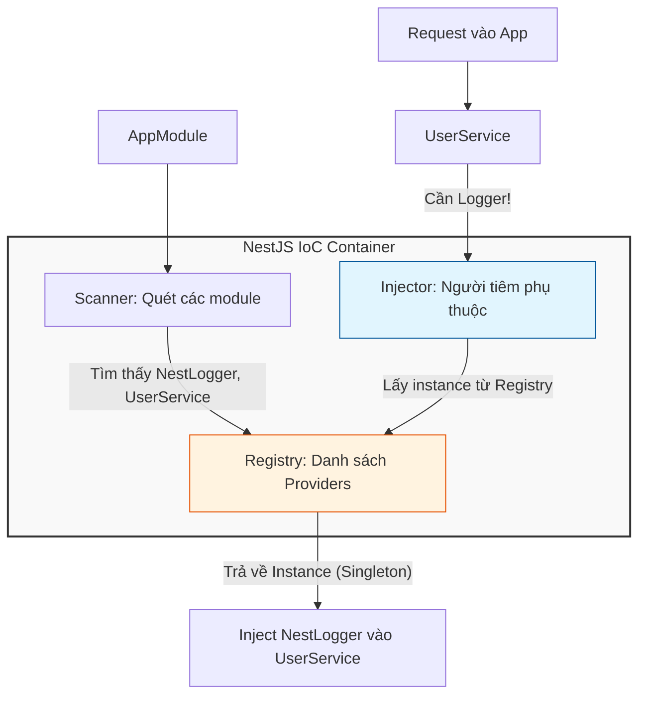

Bạn có bao giờ thắc mắc tại sao trong NestJS, chúng ta cứ phải thêm `@Injectable()` rồi khai báo trong `providers` của Module không? Tại sao không cứ `new Service()` cho nhanh? 🤔

Hôm nay, mình sẽ cùng bạn đi sâu vào hai khái niệm cốt lõi nhất của NestJS là **IoC (Inversion of Control)** và **DI (Dependency Injection)**. Đừng lo, không có định nghĩa sách vở khô khan đâu, chúng ta sẽ bắt đầu bằng một ly cà phê nhé! ☕

<!--truncate-->

## 1. Ẩn Dụ: Tự Pha Cà Phê vs. Đi Quán (Analogy) ☕

Hãy tưởng tượng bạn muốn uống một ly cà phê. Có hai cách để bạn có được nó:

### Cách 1: Tự làm tất cả (No IoC)
Bạn phải tự mình làm mọi thứ:
1.  Đi mua hạt cà phê.
2.  Mua máy xay, máy pha.
3.  Tự xay, tự pha nước nóng, tự lọc.

👉 **Vấn đề:** Bạn bị phụ thuộc chặt chẽ (**Tight Coupling**) vào mọi thứ. Nếu hết hạt Arabica và bạn muốn đổi sang Robusta, bạn phải đi mua lại từ đầu. Nếu máy pha hỏng, bạn nhịn uống. Bạn phải quản lý từng bước một.

### Cách 2: Đi quán cà phê (IoC - Inversion of Control)
Bạn bước vào quán và nói: *"Cho một ly Latte!"*.
1.  Bạn không quan tâm máy pha cà phê hiệu gì (Dependency).
2.  Bạn không quan tâm hạt cà phê lấy từ đâu.
3.  **Nhân viên pha chế (IoC Container)** sẽ tự tìm nguyên liệu, máy móc và mang ly cà phê ra cho bạn.

👉 **Lợi ích:** Bạn chỉ cần tập trung vào việc **thưởng thức** (Main Business Logic). Việc chuẩn bị công cụ, nguyên liệu đã có người khác lo. Đây chính là tư duy của **Inversion of Control**: Chuyển quyền kiểm soát việc khởi tạo dependencies từ tay bạn sang một bên thứ ba (Framework/Container).

---

## 2. Đi Từ Code "Thủ Công" Đến "Hiện Đại" 💻

Để hiểu rõ hơn, hãy nhìn vào code. Chúng ta sẽ xây dựng một tính năng `Log` đơn giản.

### Level 1: Tight Coupling (Code "Non tay") ❌

Đây là cách viết code bản năng nhất: Class này tự khởi tạo Class kia bên trong nó.

```typescript
// 1. Class Logger đơn giản
class ManualLogger {
    log(msg: string) { console.log(`[Manual]: ${msg}`); }
}

// 2. Service sử dụng Logger
class UserService {
    // ⚠️ VẤN ĐỀ LỚN: UserService tự tạo ra ManualLogger bằng từ khóa 'new'
    private logger = new ManualLogger(); 

    create() {
        this.logger.log("Đang tạo user mới...");
    }
}
```

**Tại sao cách này tệ?**
-   **Khó Test:** Bạn không thể thay thế `ManualLogger` bằng một `MockLogger` giả để test `UserService` được, vì nó đã bị "hàn chết" (hard-coded) bên trong.
-   **Khó Mở Rộng:** Nếu bạn muốn đổi sang ghi log vào File thay vì Console, bạn phải sửa code của `UserService`. Vi phạm nguyên tắc **Open/Closed** trong SOLID.

### Level 2: Manual Dependency Injection (Bán tự động) ⚠️

Chúng ta cải tiến bằng cách: **Không tự tạo, mà nhờ người khác đưa vào**.

```typescript
interface ILogger {
    log(msg: string): void;
}

class ConsoleLogger implements ILogger {
    log(msg: string) { console.log(`[Console]: ${msg}`); }
}

class UserService {
    // ✅ Cải tiến: Nhận dependency từ bên ngoài qua Constructor
    constructor(private logger: ILogger) {}

    create() {
        this.logger.log("Đang tạo user với DI thủ công...");
    }
}

// 😫 VẤN ĐỀ MỚI: Bạn phải tự tay lắp ráp (Wiring) mọi thứ
const myLogger = new ConsoleLogger();
const myService = new UserService(myLogger); // <--- Tự tiêm (Inject) thủ công
myService.create();
```
Cách này đã giải quyết được vấn đề Tight Coupling (nhờ Interface), nhưng lại đẻ ra vấn đề mới: **Dependency Hell**. Nếu `UserService` cần 10 dependencies, bạn sẽ phải khởi tạo 10 object rồi truyền vào. Code khởi tạo sẽ dài như sớ Táo Quân!

### Level 3: NestJS Dependency Injection (Tự động hóa hoàn toàn) ✅

Đây là lúc NestJS tỏa sáng. NestJS đóng vai trò là "Quán Cà Phê" (IoC Container). Nó sẽ tự động làm mọi việc cho bạn.

```typescript
import { Injectable, Module } from '@nestjs/common';

// BƯỚC 1: Đánh dấu class này là một "Provider" có thể được tiêm (Injectable)
@Injectable()
export class NestLogger {
    log(msg: string) { console.log(`[NestJS]: ${msg}`); }
}

// BƯỚC 2: Khai báo phụ thuộc trong Constructor
@Injectable()
export class UserService {
    // NestJS tò mò: "Anh cần gì?". UserService trả lời: "Tôi cần NestLogger"
    constructor(private readonly logger: NestLogger) {}

    create() {
        this.logger.log("Mọi thứ tự động thật tuyệt!");
    }
}

// BƯỚC 3: Đăng ký với "Tổ chức" (Module)
@Module({
    providers: [NestLogger, UserService], // <--- Khai báo cho Container biết
})
export class UserModule {}
```

Bạn thấy đấy, không hề có từ khóa `new` nào ở đây cả! NestJS đã âm thầm làm việc đó:
1.  Nó thấy `UserService` cần `NestLogger`.
2.  Nó tìm trong kho (`providers`) xem có `NestLogger` không.
3.  Nếu có, nó tạo instance `NestLogger` (nếu chưa có) và đưa cho `UserService`.

---

## 3. Kiến Trúc Bên Dưới: IoC Container Hoạt Động Thế Nào? 🔍

Hãy hình dung quy trình này qua sơ đồ dưới đây. Đây là những gì diễn ra khi bạn nhấn nút Start ứng dụng NestJS.



### Các khái niệm cốt lõi:
1.  **Provider**: Là các class có `@Injectable()`. Chúng cung cấp một dịch vụ, giá trị hoặc factory nào đó.
2.  **Token**: Là "tên định danh" để NestJS phân biệt các provider. Mặc định nó dùng tên class (ví dụ `NestLogger`), nhưng bạn có thể custom (ví dụ string `'CONNECTION_STRING'`).
3.  **Singleton (Mặc định)**: NestJS chỉ tạo **MỘT** instance của `NestLogger` và dùng chung cho toàn bộ ứng dụng. Điều này giúp tiết kiệm bộ nhớ cực kỳ hiệu quả.

---

## 4. Tổng Kết & Đánh Đổi (Trade-off) ⚖️

Không có công nghệ nào là hoàn hảo. Việc sử dụng DI Container của NestJS cũng có hai mặt:

| Lợi ích (Pros) 🟢 | Đánh đổi (Cons) 🔴 |
| :--- | :--- |
| **Loose Coupling:** Các module độc lập, dễ dàng thay thế, nâng cấp. | **"Magic":** Người mới sẽ thấy khó hiểu vì không biết object được tạo ra từ đâu. |
| **Testability:** Cực kỳ dễ để viết Unit Test (chỉ cần mock dependencies). | **Runtime Errors:** Nếu bạn quên khai báo provider, lỗi chỉ hiện ra khi chạy app (Runtime), không phải lúc code (Compile time). |
| **Clean Code:** Code tập trung vào business logic, không bị rác bởi code khởi tạo object. | **Learning Curve:** Cần thời gian để hiểu concepts (Provider, Scope, Module...). |

> [!TIP]
> **Lời khuyên:** Đừng lạm dụng DI cho mọi thứ. Chỉ inject những gì thực sự là "Dependency" (như Database Connection, Service, Config). Những object dữ liệu đơn giản (DTO, Entity) thì cứ dùng `new` bình thường nhé!

Hy vọng bài viết này giúp bạn "gỡ rối" được khái niệm IoC và DI. Nó không phải phép thuật, nó chỉ là một người quản gia tận tụy của NestJS mà thôi! 😉

---
Made by Anh Tu - Share to be share