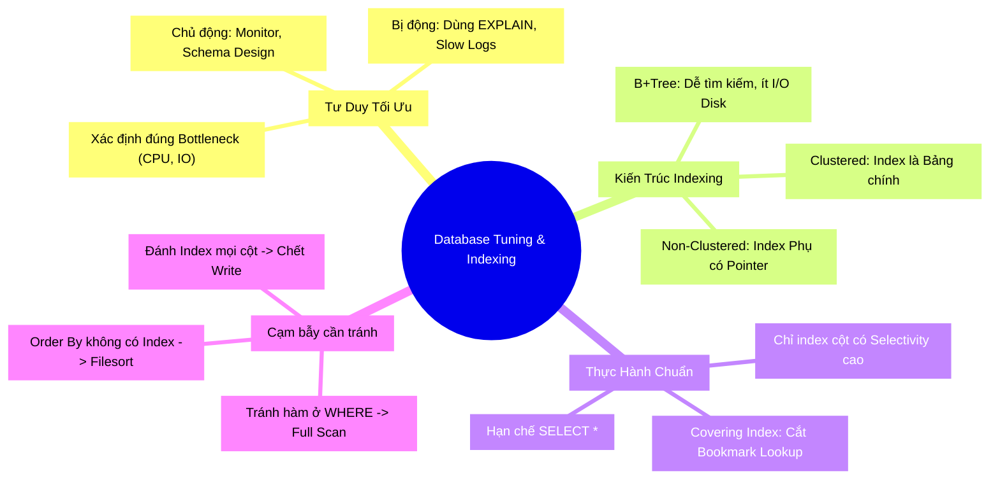

# Database Tuning Mindset & Nghệ Thuật Indexing: Đừng Để Database Của Bạn Thở Oxy!

Bạn có bao giờ được giao fix một con bug: *"Api `GET /users` dạo này chạy chậm quá, tận 5s mới load xong"*?

Giải pháp đầu tiên nảy ra trong đầu bạn là gì? Thêm RAM? Nâng cấp CPU? Hay lên StackOverflow search "Cách làm MySQL chạy nhanh hơn" và copy một dòng lệnh `CREATE INDEX` vô thưởng vô phạt? 🎣

Việc "chữa cháy" như vậy có thể giải quyết vấn đề tạm thời, nhưng hệ thống sẽ sớm sụp đổ lại khi dữ liệu phình to. Đó là lúc bạn cần đến **Database Tuning Mindset** (Tư duy Tối ưu hóa Database) và hiểu rõ bản chất "phép thuật" của **Indexing**.

Hãy cùng đi sâu vào tâm trí của một Senior DBA để xem họ tối ưu hóa như thế nào nhé!

---

## 1. Ẩn Dụ: Cuốn Từ Điển Bách Khoa Toàn Thư (Analogy First) 🔄

Hãy tưởng tượng bạn có một thư viện khổng lồ với 1 triệu cuốn sách không được sắp xếp (Tương đương Database không Tuning).

Sếp yêu cầu bạn: *"Tìm cho tôi cuốn sách Bí Mật Database!"*

- **Góc nhìn 1 (Full Table Scan):** Bạn đi từ kệ số 1, nhìn từng cuốn sách một cho đến cuốn thứ 999.999 mới thấy nó. Bạn mất 1 tháng. Sếp đuổi việc bạn.
- **Góc nhìn 2 (Dùng Index):** Sếp thông minh hơn, ông ấy thuê một ông cán bộ thư viện sừng sỏ. Ông này mất 1 tuần để viết ra một quyển **Sổ tra cứu (Index)**. Trong quyển sổ ghi: *"Chữ B nằm ở tầng 2, khu A. Chữ Bí nằm ở kệ số 5, hàng 3"*. 
Nhờ quyển sổ này, khi sếp hỏi, bạn mở đúng trang sổ, nhìn địa chỉ và đi thẳng đến kệ sách lấy trong vòng 5 phút!

Đó chính xác là cách Index hoạt động. Nhưng, quyển sổ tra cứu này cũng có giá của nó (Trade-off):
- Tốn thêm tiền mua giấy để ghi (Tốn dung lượng ổ đĩa).
- Mỗi khi mua sách mới, bạn không chỉ nhét sách lên kệ, mà phải chạy đi sửa lại quyển sổ tra cứu (Làm chậm thao tác `INSERT`, `UPDATE`, `DELETE`).

---

## 2. Database Tuning Mindset: Chủ Động vs Bị Động 🔬

Một kỹ sư giỏi không đợi Database bốc khói mới đi chữa cháy. Tư duy tuning được chia làm 2 giai đoạn:

### 2.1. Tuning Chủ Động (Proactive)
Bảo vệ sức khỏe hệ thống từ trong trứng nước:
- **Ngay từ lúc thiết kế Schema:** Kiểu dữ liệu đã chuẩn chưa? (Dùng `TINYINT` thay vì `INT` nếu chỉ lưu 0 và 1). Có cần Normalize (chuẩn hóa) hay Denormalize (khử chuẩn) không?
- **Theo dõi (Monitoring) liên tục:** Thiết lập các bảng dashboard đo lường CPU, RAM, Disk I/O.
- **Quy tắc vàng 80/20:** 20% câu query (thường là query tìm kiếm, thống kê) sẽ ngốn 80% tài nguyên hệ thống. Hãy nhắm vào chúng trước.

### 2.2. Tuning Bị Động (Reactive)
Khi có sự cố xảy ra (Firefighting):
1. **Tìm nút cổ chai (Bottleneck):** Đang nghẽn ở I/O ổ cứng, thiếu RAM, hay CPU chạy 100%?
2. **Truy vết tội phạm (Slow Query Log):** Bật log để xem câu lệnh SQL nào đang chạy lâu nhất.
3. **Phân tích tử thi (EXPLAIN):** Đọc kế hoạch thực thi để biết tại sao câu query lại đi vào lòng đất.

---

## 3. Deep Dive: Bản Chất Của Indexing 🔬

Để Tối ưu được, bạn phải hiểu được "Quyển sổ tra cứu" (Index) được tổ chức như thế nào.

### 3.1. Cấu Trúc B-Tree (Balanced Tree)
Hầu hết RDBMS (như MySQL InnoDB, PostgreSQL) dùng **B+Tree** (một biến thể của B-Tree) làm cấu trúc mặc định cho Index.

**Tại sao lại là B+Tree?**
Vì dữ liệu được lưu trên đĩa cứng (Disk). Disk quay chậm hơn RAM hàng vạn lần. B+Tree lùn và mập (nhiều nhánh con) giúp giảm số lần đọc ổ cứng (I/O operations). Với một B+Tree chỉ cao 3-4 tầng, nó có thể chứa hàng tỷ bản ghi, và bạn chỉ mất tối đa 4 lần chọc vào ổ cứng để lấy data.

### 3.2. Clustered Index (Chỉ mục cụm) vs Non-Clustered (Chỉ mục phụ)

Đây là 2 khái niệm khiến nhiều Intern/Junior lú lẫn nhất.

**Clustered Index (Chỉ mục Cụm): Bức tường gạch**
- Nó định hình cấu trúc vật lý thực sự của bảng.
- Dữ liệu thực sự (các cột khác) NẰM LUÔN ở tầng lá (leaf-node) của Index này.
- Thường sinh ra tự động khi bạn khai báo `PRIMARY KEY`.
- Mỗi bảng **CHỈ CÓ 1** Clustered Index.

**Non-Clustered Index/Secondary Index (Chỉ mục Phụ): Tờ giấy note**
- Là một cây B+Tree tách rời hoàn toàn với dữ liệu thực tế.
- Ở nhánh lá của nó KHÔNG chứa dữ liệu thực sự (không có cột Name, Age...), mà nó chứa **Địa chỉ (Con trỏ)** trỏ về cái Clustered Index ở trên.
- Bạn có thể tạo hàng tá Non-Clustered Index trên 1 bảng.

> ⚠️ **Hệ quả của sự chia ly (Bookmark Lookup):** Khi bạn tìm dữ liệu bằng Index phụ. Nó phải đi từ rễ đến lá của cây Index phụ, lấy được cái "con trỏ", sau đó nó lại phải xách con trỏ đó chạy ngược về cây Clustered Index để tìm lần thứ 2 mới ra data. Đây gọi là **Bookmark Lookup** (rất tốn kém nếu lấy ra nhiều dòng!).

### 3.3. Câu Chuyện Về Cardinality (Tính Chọn Lọc)
Cardinality là số lượng các giá trị DUY NHẤT trong một cột.
- Cột `Gender` (Giới tính) có giá trị: Nam, Nữ, Khác -> **Low Cardinality**.
- Cột `Citizen_ID` (CCCD) mỗi người một số -> **High Cardinality**.

> 💡 **Best Practice:** Chỉ nên đánh Index vào những cột có **High Cardinality**. Đừng đánh Index vào cột Giới Tính, vì khi đó Optimizer thấy quét Index xong vẫn phải trả về 50% số lượng records, nó thà dùng **Full Table Scan** (quét toàn bộ bảng luôn cho nhanh khỏi lằng nhằng).

---

## 4. Thực Hành: "Phép Thuật" Covering Index 💻

Covering Index là kĩ thuật tối thượng để tiêu diệt con quái vật **Bookmark Lookup** ở trên.

Giả sử bảng `Users` có các cột: `id (PK)`, `name`, `age`, `email`, `status`.

Bạn hay chạy câu:
```sql
-- ❌ Cách thường: Đánh index cho name. Nhưng vẫn dính Bookmark Lookup vì phải chạy ngược về bảng chính lấy `age`.
CREATE INDEX idx_name ON Users(name);

SELECT name, age FROM Users WHERE name = 'Anh Tu';
```

Bạn biến nó thành Covering Index bằng cách "nhét" luôn cột cần lấy vào cây Index (thường là Composite Index).

```sql
-- ✅ Cách đỉnh cao (Covering Index): Bao phủ luôn cột age vào tầng lá của Index name.
CREATE INDEX idx_name_age ON Users(name, age);

-- Lúc này, câu query dưới KHÔNG CẦN đụng vào Clustered Index (Bảng chính) nữa. Nó lấy luôn `name` và `age` từ Index phụ và trả về. Nhanh gấp vạn lần!
SELECT name, age FROM Users WHERE name = 'Anh Tu';
```

---

## 5. Cạm Bẫy Trí Mạng (Worst Practices) ⚠️

### 5.1. Bẫy 1: Full Table Scan Vô Hình
Dù bạn đã đánh Index, nhưng câu SQL viết ngu ngốc sẽ đánh mù mắt Optimizer.

```sql
-- ❌ Sai lầm: Hàm UPPER() làm vỡ cấu trúc sắp xếp của cây B-Tree. Index bị tê liệt -> Full Table Scan.
SELECT * FROM users WHERE UPPER(email) = 'TEST@GMAIL.COM';

-- ✅ Đúng: Ép email về chữ thường từ code Client, so sánh bằng hằng số.
SELECT * FROM users WHERE email = 'test@gmail.com';
```

### 5.2. Bẫy 2: Nạn Nhân Của Filesort
Filesort không có nghĩa là ghi ra File, mà nó nghĩa là "Sắp xếp không dùng Index" (phải hất data lên RAM hoặc Disk để sort tay). Rất chậm!

```sql
-- Có index trên `created_at` nhưng lại Order By cột khác không có Index
SELECT * FROM orders WHERE created_at > '2026-01-01' ORDER BY total_amount DESC;
```
> 💡 **Giải pháp:** Nếu tần suất dùng cao, hãy tạo Composite Index: `CREATE INDEX idx_created_amount ON orders(created_at, total_amount)`.

### 5.3. Bẫy 3: Hội Chứng "Nghiện Đánh Index" (Over-Indexing)
Đừng gặp cột nào trong `WHERE` cũng vã một lệnh `CREATE INDEX`.
- Nếu 1 `INSERT` tốn 10ms. Có 5 Indexes, nó sẽ tốn cỡ 50ms.
- Update/Delete cực kì chậm do phải cập nhật lại 5 cây B+Tree.
- Tốn dung lượng ổ đĩa một cách vô tội vạ.

---

## 6. Sơ Đồ Tư Duy Tổng Kết (MECE Mindmap) 🧩

Tổng hợp lại toàn bộ kiến thức bằng Mindmap MECE để bạn dễ nhớ:



Qua bài viết này, hy vọng bạn đã bỏ túi được **Tuning Mindset** chuẩn mực và không còn "gõ bừa" lệnh `CREATE INDEX` lúc 3h sáng nữa! 🚀

---

*Made by Anh Tu - Share to be share*
