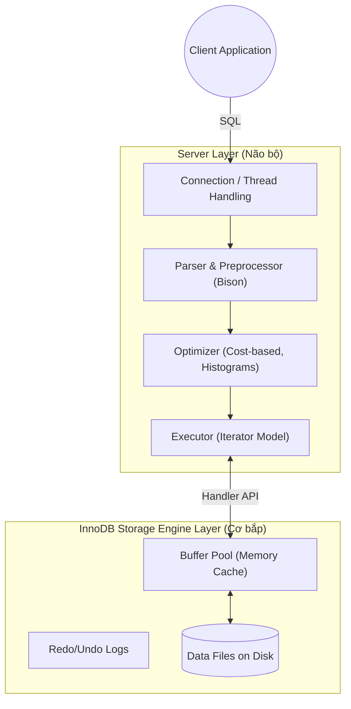
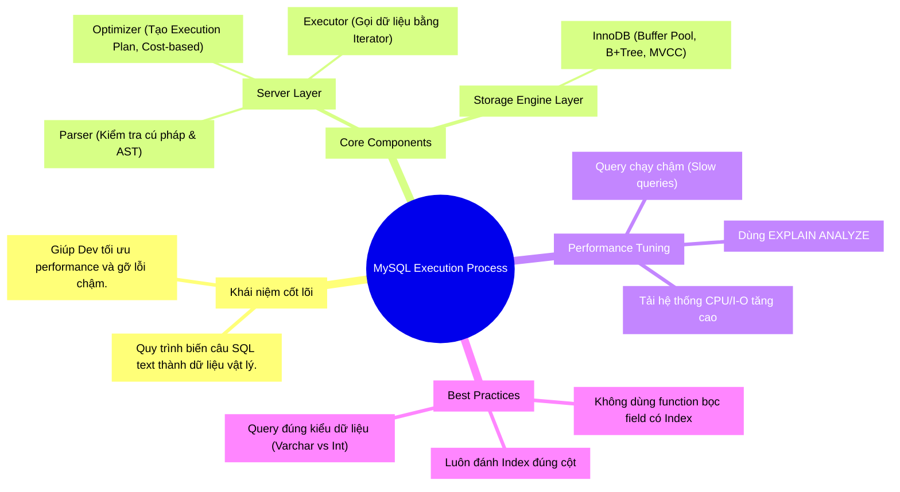

# Giải Phẫu MySQL 8.0: Tráng Sĩ Xử Lý Câu Lệnh SQL Của Bạn Thế Nào?

Khi bạn gõ lệnh `SELECT * FROM users WHERE age > 18;` và nhấn Enter, MySQL dường như biến phép màu thành hiện thực khi trả về dữ liệu nhanh như chớp. 🎣 Nhưng đằng sau 0.01 giây đó là cả một bộ máy khổng lồ đang hoạt động hết công suất. 

Đặc biệt từ phiên bản MySQL 8.0, Oracle đã đập đi xây lại rất nhiều thứ (như bỏ đi Query Cache, thêm Iterator Executor, nâng cấp Optimizer). Việc hiểu rõ luồng đi này không chỉ giúp bạn "chém gió" khi phỏng vấn, mà còn là nền tảng tối thượng để bạn **tối ưu hóa (optimize) truy vấn**.

Hãy cùng "giải phẫu" MySQL nhé!

---

## 1. Ẩn Dụ: Fabrik MySQL - Nhà Máy Sản Xuất Dữ Liệu 🔄

Hãy tưởng tượng MySQL của bạn là một **Nhà máy sản xuất siêu khổng lồ**.

Khi bạn (Khách hàng) gửi một đơn hàng (SQL Query) đến:

1. **Connection Handler (Bác bảo vệ & Lễ tân):** Chặn bạn ở cổng xem bạn có thẻ nhân viên không (Xác thực User/Password). Nếu có, cấp cho bạn một luồng giao tiếp riêng (Thread).
2. **Parser (Kỹ sư kiểm duyệt bản vẽ):** Đọc đơn hàng của bạn. Nếu bạn viết sai chính tả ("SEELCT" thay vì "SELECT"), bản vẽ bị xé bỏ ngay lập tức (Syntax Error). Nếu đúng, nó vẽ lại thành một sơ đồ cây (Abstract Syntax Tree).
3. **Optimizer (Sếp Quản đốc):** Nhìn sơ đồ cây và tính toán con đường sản xuất rẻ nhất, nhanh nhất. Lấy hàng từ kho A hay kho B? Dùng xe lu hay xe cẩu? (Phân tích Cost-based, chọn Index).
4. **Executor (Trưởng chuyền sản xuất):** Cầm tờ kế hoạch (Execution Plan) của Sếp Quản đốc, ra lệnh cho các phân xưởng hoạt động. Từ MySQL 8.0, ông này làm việc theo kiểu "Iterator" (gọi từng dòng dữ liệu lên một, rảnh tay thì gọi tiếp).
5. **Storage Engine (Thủ kho InnoDB):** Người thực sự đi vào trong kho lạnh (Disk/Memory), tìm đúng hộp chứa đồ (Index/Data Pages), bê ra đưa cho Trưởng chuyền. Trưởng chuyền gom đủ lại rồi giao cho bạn.

Giờ thì chúng ta hãy đi sâu vào kỹ thuật thực sự nhé! 🔬

---

## 2. Kiến Trúc Hai Tầng Đặc Trưng Của MySQL

Kiến trúc MySQL luôn tự hào về sự phân tách rạch ròi giữa 2 tầng: **Server Layer** (Não bộ) và **Storage Engine Layer** (Cơ bắp).



> ⚠️ **Lưu ý cực lớn:** Kể từ MySQL 8.0, tính năng **Query Cache đã bị xóa sổ hoàn toàn**. Lý do là vì ở các hệ thống đa nhân (multi-core) hiện đại, việc duy trì cơ chế khóa (locking) của Query Cache làm hệ thống bị nghẽn cổ chai.

---

## 3. Deep Dive: Từ SQL String Đến Dữ Liệu Raw 🔬

### Bước 1: Parsing (Kiểm tra và Bẻ gãy)
Chuỗi SQL của bạn chỉ là text vô tri. MySQL 8.0 sử dụng công cụ mạnh mẽ là **Bison** để viết lại bộ Parser.
- Nó kiểm tra từ vựng (Lexical analysis) và ngữ pháp (Syntax analysis).
- Kết quả tạo ra một **Abstract Syntax Tree (AST)**.
- Tiếp theo, Preprocessor (Bộ tiền xử lý) sẽ kiểm tra xem cột `age` hay bảng `users` có thực sự tồn tại trong DB không.

### Bước 2: Optimizer (Trái tim của hiệu năng)
Đây là nơi phép màu thực sự diễn ra. Cùng một kết quả SQL, có tới hàng trăm con đường để đi. Optimizer sử dụng **Cost-Based Optimization (CBO)** để tự hỏi: "Cách nào ít tốn chi phí I/O và CPU nhất?".

Trong MySQL 8.0, Optimizer có những vũ khí mới:
- **Histograms:** Nếu một cột không có Index, Optimizer vẫn có thể biết phân phối dữ liệu thế nào nhờ Histograms để chọn plan chuẩn.
- **Join Order:** Xác định xem nối bảng nhỏ trước hay bảng to trước.

> 💡 **Trade-off:** Việc Optimizer suy nghĩ cũng tốn thời gian. Đôi khi với query quá phức tạp, Optimizer tốn 5s để nghĩ ra cách giải tốn 1s, tổng cộng 6s. Trong khi bạn có thể ép Optimizer dùng Index bằng `FORCE INDEX`.

### Bước 3: Executor (Mô hình Iterator)
Trong MySQL 8.0, Executor được cấu trúc lại thành mô hình vòng lặp (Iterator-based). Executor bắt đầu gọi hàm `Read()` liên tục xuống tầng Storage Engine. Nó lọc từ từ (Filter) những records không thỏa mãn `WHERE` trước khi ném lên RAM.

### Bước 4: InnoDB Storage Engine (Kẻ gánh tạ)
Khi Executor yêu cầu dữ liệu, InnoDB không lao ra ổ cứng (Disk) đọc ngay lập tức vì Disk rất chậm.
1. InnoDB tìm trong **Buffer Pool** (bộ nhớ RAM) xem trang dữ liệu (Data Page) đó có sẵn không. Nếu có (Cache Hit), trả về liền.
2. Nếu không, nó phải đọc từ Disk lên Buffer Pool rồi mới đưa cho Executor.
3. InnoDB tổ chức dữ liệu theo **Clustered Index**. Nghĩa là dữ liệu thực sự nằm ở trên nhánh lá (leaf-node) của cây B+Tree chứa Primary Key. Nếu query của bạn dùng Secondary Index (Index phụ), nó phải làm thêm một bước tra ngược lại Primary Key (gọi là **Bookmark lookup**).

---

## 4. Thực Hành: "Bắt Quả Tang" Optimizer Với EXPLAIN 💻

Bạn không thể tối ưu nếu không biết Optimizer nghĩ gì. Hãy dùng `EXPLAIN ANALYZE` (tính năng mới từ MySQL 8.0.18).

```sql
-- Dùng EXPLAIN ANALYZE để đo lường THỰC TẾ thay vì chỉ dự đoán (EXPLAIN thường)
EXPLAIN ANALYZE 
SELECT first_name, last_name 
FROM employees 
WHERE hire_date > '2020-01-01' 
ORDER BY salary DESC LIMIT 10;
```

**Output giả định:**
```text
-> Limit: 10 row(s)  (cost=100.00 rows=10) (actual time=50.2..50.3 rows=10 loops=1)
    -> Sort: employees.salary DESC, limit input to 10 row(s) per chunk  (cost=100.00 rows=5000) (actual time=50.2..50.2 rows=10 loops=1)
        -> Filter: (employees.hire_date > DATE'2020-01-01')  (cost=100.00 rows=5000) (actual time=0.1..45.5 rows=15000 loops=1)
            -> Table scan on employees  (cost=100.00 rows=100000) (actual time=0.05..30.1 rows=100000 loops=1)
```

**Phân tích (Đọc từ dưới lên):**
- **Table scan:** Optimizer đã chọn đọc toang cả bảng (Full Scan) 100.000 dòng mất 30ms.
- **Filter:** Bộ lọc xén bớt còn 15.000 dòng thõa mãn điều kiện.
- **Sort:** Tốn thêm thời gian để sắp xếp bằng RAM (Filesort).
❌ **Kết luận:** Lệch pha! Bạn cần đánh `INDEX(hire_date)` ngay lập tức.

---

## 5. Cạm Bẫy Phổ Biến (Pitfalls) ⚠️

### Tự ý che mắt Optimizer bằng Function
```sql
-- ❌ Sai lầm: Hàm YEAR() che mắt Optimizer, khiến MySQL phải quét toàn bộ bảng dù 'created_at' có Index.
SELECT * FROM invoices WHERE YEAR(created_at) = 2026;

-- ✅ Sửa lại: Trả trường có Index về dạng nguyên bản.
SELECT * FROM invoices WHERE created_at >= '2026-01-01' AND created_at < '2027-01-01';
```

### Sử dụng sai kiểu dữ liệu (Implicit Type Conversion)
```sql
-- Cột 'phone' là VARCHAR, nhưng bạn chèn số vào query.
-- ❌ Sai lầm: MySQL phải ép kiểu toàn bộ cột số, mất sạch tác dụng của Index.
SELECT * FROM users WHERE phone = 0987654321; 

-- ✅ Sửa lại: Dấu nháy đơn rất quan trọng!
SELECT * FROM users WHERE phone = '0987654321';
```

---

## 6. Sơ Đồ Tư Duy Tổng Kết (MECE Mindmap) 🧩

Để củng cố kiến thức, đây là Mindmap tuân thủ cấu trúc MECE về luồng MySQL Execution:



Bây giờ thì bạn đã tự tin biết được đằng sau Terminal đen ngòm kia, những anh kỹ sư, thủ kho của tập đoàn Fabrik MySQL đang làm việc vất vả ra sao rồi nhé! 🚀

---

*Made by Anh Tu - Share to be share*
