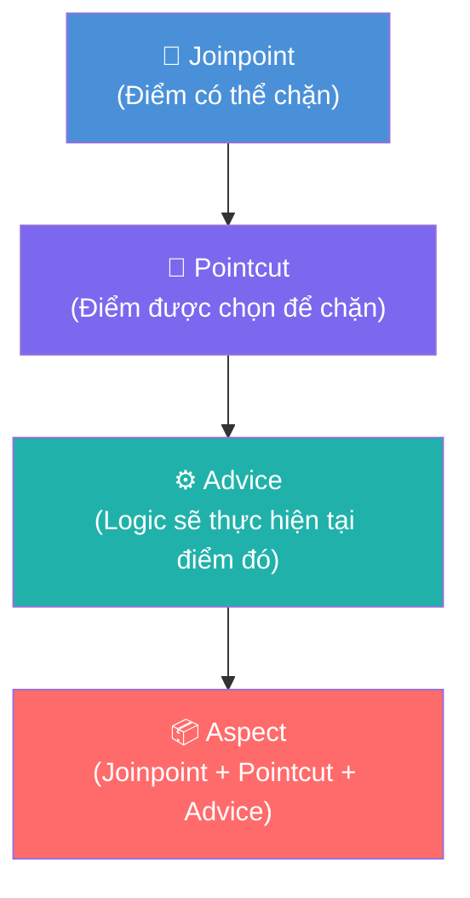
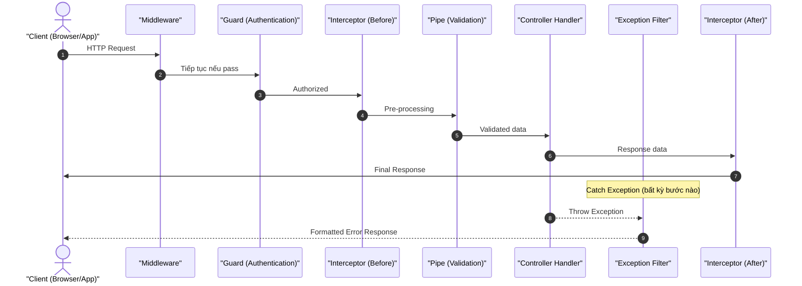
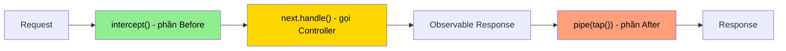
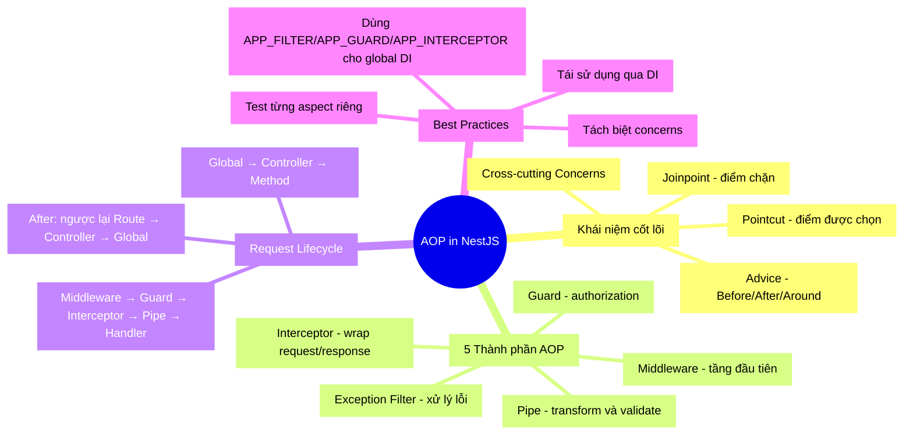

# AOP trong NestJS: Kiến trúc "Chặn Đứng" Cross-Cutting Concerns

## 🎣 Hook: Bạn đã bao giờ thấy code như thế này chưa?

```typescript
// filename: src/users/users.controller.ts
@Get(':id')
async getUser(@Param('id') id: string) {
  // Ghi log request
  console.log(`[${new Date().toISOString()}] GET /users/${id}`);

  // Kiểm tra token hợp lệ không?
  const token = this.request.headers['authorization'];
  if (!token || !this.authService.verify(token)) {
    throw new UnauthorizedException();
  }

  // Validate id có phải số không?
  if (isNaN(Number(id))) {
    throw new BadRequestException('id must be a number');
  }

  try {
    // Đây mới là phần THỰC SỰ quan trọng — chỉ 1 dòng!
    return await this.usersService.findOne(+id);
  } catch (error) {
    console.error(`[ERROR] GET /users/${id}:`, error.message);
    throw new InternalServerErrorException();
  }
}
```

💥 **Vấn đề thấy không?** Một route handler chỉ cần **1 dòng** business logic, nhưng bị bao quanh bởi hàng chục dòng *code phụ trợ* — logging, authentication, validation, error handling. Và tệ hơn, những đoạn code này bị **lặp lại** ở tất cả các routes khác.

Đây chính là vấn đề mà **AOP (Aspect-Oriented Programming)** ra đời để giải quyết. Và NestJS đã xây dựng toàn bộ kiến trúc dựa trên tư tưởng này.

---

## 🔄 Analogy: AOP như "Trạm Kiểm Soát" trên đường cao tốc

Hãy tưởng tượng bạn đang lái xe từ Hà Nội vào TP. Hồ Chí Minh trên đường cao tốc.

Dọc đường có nhiều **trạm kiểm soát**:
- 🛂 **Trạm kiểm tra giấy tờ** (Authentication/Guards) — xe vào hay không?
- 🔍 **Trạm cân tải trọng** (Validation/Pipes) — hàng hóa có đúng quy cách?
- 📹 **Camera ghi hình** (Logging/Interceptors) — ghi lại tất cả xe đi qua
- 🚑 **Đội cứu hộ** (Exception Filters) — xử lý khi có tai nạn

> **Điểm mấu chốt:** Các tài xế (business logic) không cần quan tâm đến những trạm này. Họ chỉ cần lái xe — các trạm tự động "wrap" xung quanh hành trình của họ.

Trong NestJS:
- **Xe trên đường** = HTTP Request
- **Hành trình** = Luồng xử lý Request → Response
- **Trạm kiểm soát** = Guards, Interceptors, Pipes, Filters
- **Điểm đến** = Controller method (business logic)

---

## 🔬 Deep Dive: AOP là gì?

### Khái niệm cốt lõi

**AOP (Aspect-Oriented Programming)** là một paradigm lập trình bổ sung cho OOP. Nếu OOP tổ chức code theo **đối tượng và lớp**, thì AOP tổ chức theo **khía cạnh (aspects)** — những logic cắt ngang (cross-cutting) nhiều tầng của ứng dụng.

**Cross-cutting concerns** là những logic *không thuộc về một module cụ thể*, nhưng lại cần xuất hiện ở mọi nơi:

| Cross-cutting Concern | Ví dụ cụ thể |
|---|---|
| Logging | Ghi log mọi request/response |
| Authentication | Kiểm tra token JWT |
| Authorization | Kiểm tra quyền RBAC |
| Validation | Parse & validate input data |
| Caching | Cache response từ database |
| Error Handling | Format lỗi thống nhất |
| Performance Monitoring | Đo thời gian xử lý |

### Bộ từ vựng AOP

Để hiểu AOP, bạn cần nắm 4 khái niệm:



| Khái niệm | Định nghĩa | Ví dụ trong NestJS |
|---|---|---|
| **Joinpoint** | Điểm trong quá trình thực thi có thể "chặn" được | Trước/sau khi controller method chạy |
| **Pointcut** | Tập hợp joinpoints được chọn | `@UseInterceptors(LoggingInterceptor)` |
| **Advice** | Logic được thực thi tại pointcut | Code trong `intercept()` method |
| **Aspect** | Gói gọn cả pointcut + advice | Class `LoggingInterceptor` |

**Các loại Advice:**

- **`Before`** — Chạy TRƯỚC joinpoint (ví dụ: validate input)
- **`After Returning`** — Chạy sau joinpoint khi **thành công** (ví dụ: log response)
- **`After Throwing`** — Chạy sau joinpoint khi **có exception** (ví dụ: error logging)
- **`Around`** — Bao quanh cả trước và sau, có thể *ngăn* joinpoint thực thi (ví dụ: caching)

---

## 🏗️ NestJS Hiện Thực Hóa AOP Như Thế Nào?

NestJS không dùng AOP framework thuần túy (như AspectJ của Java), nhưng nó **tái tạo** tinh thần AOP qua 5 thành phần đặc trưng: **Middleware, Guards, Interceptors, Pipes, Exception Filters**.

### Request Lifecycle — "Chuỗi Trạm Kiểm Soát"



**Thứ tự thực thi chính xác:**
```
Incoming Request
  ↓ Middleware (global → module-level)
  ↓ Guards (global → controller → route)
  ↓ Interceptors/Before (global → controller → route)
  ↓ Pipes (global → controller → route → parameter)
  ↓ Controller Method Handler
  ↑ Interceptors/After (route → controller → global)
  ↑ Exception Filters (nếu có lỗi: route → controller → global)
  ↑ Server Response
```

> 💡 **Lưu ý quan trọng:** Interceptors chạy **hai lần** — một lần trước và một lần sau controller. Exception Filters chỉ được kích hoạt khi có lỗi xảy ra.

---

## ⚙️ Chi Tiết Từng Thành Phần

### 1. Middleware — "Người Gác Cổng Đầu Tiên"

Middleware là tầng xử lý **đầu tiên**, trước cả guards. Nó gần giống với Express.js middleware — có access vào `req`, `res`, và `next()`.

**Khi nào dùng Middleware?**
- CORS headers
- Logging request thô (IP, user-agent)
- Rate limiting cơ bản
- Body parsing

```typescript
// filename: src/common/logger.middleware.ts
import { Injectable, NestMiddleware } from '@nestjs/common';
import { Request, Response, NextFunction } from 'express';

@Injectable()
export class LoggerMiddleware implements NestMiddleware {
  use(req: Request, res: Response, next: NextFunction) {
    const { method, originalUrl, ip } = req;
    const startTime = Date.now();

    // 👇 Chạy TRƯỚC khi request tiếp tục xuống stack
    console.log(`→ [${method}] ${originalUrl} from ${ip}`);

    // Lắng nghe khi response kết thúc để log sau
    res.on('finish', () => {
      const duration = Date.now() - startTime;
      // 👇 Chạy SAU khi response được gửi đi
      console.log(`← [${method}] ${originalUrl} ${res.statusCode} +${duration}ms`);
    });

    next(); // Chuyển quyền kiểm soát sang tầng tiếp theo
  }
}
```

```typescript
// filename: src/app.module.ts
@Module({ ... })
export class AppModule implements NestModule {
  configure(consumer: MiddlewareConsumer) {
    consumer
      .apply(LoggerMiddleware)
      .forRoutes('*'); // Áp dụng cho tất cả routes
  }
}
```

---

### 2. Guards — "Người Canh Gác Authorization"

Guards quyết định liệu request có được **phép tiếp tục** hay không. Chúng implement interface `CanActivate` và trả về `boolean`.

**⚠️ Phân biệt Middleware vs Guard:**
- **Middleware**: Không biết về route handler nào sẽ được gọi (`next()` chỉ gọi function tiếp theo)
- **Guard**: Có access vào `ExecutionContext`, biết chính xác route handler nào đang được gọi

```typescript
// filename: src/auth/jwt-auth.guard.ts
import { Injectable, CanActivate, ExecutionContext } from '@nestjs/common';
import { Reflector } from '@nestjs/core';
import { JwtService } from '@nestjs/jwt';

@Injectable()
export class JwtAuthGuard implements CanActivate {
  constructor(
    private readonly jwtService: JwtService,
    private readonly reflector: Reflector,
  ) {}

  canActivate(context: ExecutionContext): boolean {
    // Kiểm tra xem route có được đánh dấu @Public() không?
    // Nếu có, bỏ qua authentication — đây là pattern "opt-out"
    const isPublic = this.reflector.getAllAndOverride<boolean>('isPublic', [
      context.getHandler(), // Metadata ở level method
      context.getClass(),   // Metadata ở level controller
    ]);

    if (isPublic) return true; // Cho qua không cần kiểm tra

    // Lấy JWT từ Authorization header
    const request = context.switchToHttp().getRequest();
    const token = this.extractTokenFromHeader(request);

    if (!token) return false; // ❌ Không có token → từ chối

    try {
      // Verify token và gắn payload vào request để dùng sau
      const payload = this.jwtService.verify(token);
      request['user'] = payload; // ✅ Cho phép route handler access user info
      return true;
    } catch {
      return false; // ❌ Token không hợp lệ → từ chối
    }
  }

  private extractTokenFromHeader(request: Request): string | null {
    const [type, token] = (request.headers['authorization'] ?? '').split(' ');
    return type === 'Bearer' ? token : null;
  }
}
```

```typescript
// filename: src/auth/decorators/public.decorator.ts
import { SetMetadata } from '@nestjs/common';

// Custom decorator để đánh dấu route không cần auth
export const Public = () => SetMetadata('isPublic', true);

// Cách dùng trong controller:
@Get('health')
@Public() // Route này không cần JWT
healthCheck() {
  return { status: 'ok' };
}
```

---

### 3. Interceptors — "Người Bao Quanh Tất Cả"

Interceptors là thành phần **mạnh mẽ nhất** trong AOP toolkit của NestJS. Chúng có thể:
- **Thêm logic trước VÀ sau** route handler
- **Transform** cả request lẫn response
- **Override** hoàn toàn response (ví dụ caching)
- Làm việc với **RxJS Observables**



```typescript
// filename: src/common/interceptors/logging.interceptor.ts
import {
  Injectable, NestInterceptor, ExecutionContext, CallHandler, Logger
} from '@nestjs/common';
import { Observable } from 'rxjs';
import { tap, catchError } from 'rxjs/operators';

@Injectable()
export class LoggingInterceptor implements NestInterceptor {
  private readonly logger = new Logger(LoggingInterceptor.name);

  intercept(context: ExecutionContext, next: CallHandler): Observable<any> {
    const request = context.switchToHttp().getRequest();
    const { method, url } = request;
    const startTime = Date.now();

    // 👇 CODE NÀY CHẠY TRƯỚC KHI CONTROLLER ĐƯỢC GỌI (Before Advice)
    this.logger.log(`→ [${method}] ${url}`);

    return next.handle().pipe(
      // 👇 CODE NÀY CHẠY SAU KHI CONTROLLER TRẢ VỀ KẾT QUẢ (After Returning)
      tap((responseData) => {
        const duration = Date.now() - startTime;
        this.logger.log(`← [${method}] ${url} +${duration}ms`);
      }),

      // 👇 CODE NÀY CHẠY NẾU CÓ LỖI (After Throwing)
      catchError((error) => {
        const duration = Date.now() - startTime;
        this.logger.error(`✗ [${method}] ${url} +${duration}ms - ${error.message}`);
        throw error; // Re-throw để Exception Filter xử lý tiếp
      }),
    );
  }
}
```

**Ví dụ nâng cao: Cache Interceptor (Around Advice)**

```typescript
// filename: src/common/interceptors/cache.interceptor.ts
import {
  Injectable, NestInterceptor, ExecutionContext, CallHandler
} from '@nestjs/common';
import { Observable, of } from 'rxjs';
import { tap } from 'rxjs/operators';

@Injectable()
export class CacheInterceptor implements NestInterceptor {
  private cache = new Map<string, any>();

  intercept(context: ExecutionContext, next: CallHandler): Observable<any> {
    const request = context.switchToHttp().getRequest();
    const cacheKey = `${request.method}:${request.url}`;

    // Kiểm tra cache — nếu có, trả về NGAY mà KHÔNG gọi controller
    if (this.cache.has(cacheKey)) {
      console.log(`[Cache HIT] ${cacheKey}`);
      return of(this.cache.get(cacheKey)); // ✅ Đây là "Around Advice" - override hoàn toàn
    }

    // Không có trong cache → gọi controller và lưu kết quả
    return next.handle().pipe(
      tap((data) => {
        this.cache.set(cacheKey, data);
        console.log(`[Cache MISS → STORED] ${cacheKey}`);
      }),
    );
  }
}
```

---

### 4. Pipes — "Người Biến Đổi Và Gác Cổng Dữ Liệu"

Pipes xử lý **data transformation** và **data validation** cho input của route handler. Chúng chạy sau interceptors, ngay trước khi data được truyền vào controller method.

**Hai nhiệm vụ của Pipes:**
1. **Transform**: Chuyển đổi kiểu dữ liệu (string → number, unknown → DTO)
2. **Validate**: Từ chối data không hợp lệ

**Built-in Pipes của NestJS:**

```typescript
// filename: src/users/users.controller.ts
@Get(':id')
// ParseIntPipe: tự động chuyển '123' → 123, throw BadRequestException nếu không phải số
findOne(@Param('id', ParseIntPipe) id: number) {
  return this.usersService.findOne(id);
}

@Get('search')
// DefaultValuePipe: đặt giá trị mặc định nếu param không có trong request
search(
  @Query('page', new DefaultValuePipe(1), ParseIntPipe) page: number,
  @Query('limit', new DefaultValuePipe(10), ParseIntPipe) limit: number,
) {
  return this.usersService.search({ page, limit });
}
```

**Custom Validation Pipe với class-validator:**

```typescript
// filename: src/users/dto/create-user.dto.ts
import { IsEmail, IsString, MinLength, IsOptional } from 'class-validator';

export class CreateUserDto {
  @IsString()
  @MinLength(2)
  name: string;

  @IsEmail()
  email: string;

  @IsString()
  @MinLength(8)
  password: string;

  @IsOptional()
  @IsString()
  bio?: string;
}
```

```typescript
// filename: src/main.ts — Đăng ký global ValidationPipe
async function bootstrap() {
  const app = await NestFactory.create(AppModule);

  // ✅ Áp dụng cho toàn bộ ứng dụng
  app.useGlobalPipes(new ValidationPipe({
    whitelist: true,    // Loại bỏ các field không có trong DTO
    forbidNonWhitelisted: true, // Báo lỗi nếu có field lạ
    transform: true,    // Tự động transform primitive types
  }));

  await app.listen(3000);
}
```

```typescript
// filename: src/users/users.controller.ts
@Post()
// ValidationPipe tự động kiểm tra CreateUserDto theo các decorator @Is...
create(@Body() createUserDto: CreateUserDto) {
  return this.usersService.create(createUserDto);
}
```

---

### 5. Exception Filters — "Đội Cứu Hộ"

Exception Filters là tầng **catch exception** cuối cùng. Mọi lỗi không được xử lý sẽ chạy đến đây để được format thành response thống nhất.

```typescript
// filename: src/common/filters/http-exception.filter.ts
import {
  ExceptionFilter,
  Catch,
  ArgumentsHost,
  HttpException,
  HttpStatus,
  Logger,
} from '@nestjs/common';
import { Request, Response } from 'express';

// @Catch() không có argument → bắt MỌI loại exception
@Catch()
export class AllExceptionsFilter implements ExceptionFilter {
  private readonly logger = new Logger(AllExceptionsFilter.name);

  catch(exception: unknown, host: ArgumentsHost) {
    const ctx = host.switchToHttp();
    const response = ctx.getResponse<Response>();
    const request = ctx.getRequest<Request>();

    // Xác định status code
    const statusCode =
      exception instanceof HttpException
        ? exception.getStatus()
        : HttpStatus.INTERNAL_SERVER_ERROR; // Mặc định 500 cho lỗi không xác định

    // Xác định message
    const message =
      exception instanceof HttpException
        ? exception.getResponse()
        : 'Internal server error';

    // Log lỗi ra server (để debug)
    this.logger.error(
      `[${request.method}] ${request.url} - ${statusCode}`,
      exception instanceof Error ? exception.stack : String(exception),
    );

    // Trả về response thống nhất cho client
    response.status(statusCode).json({
      statusCode,
      message,
      path: request.url,
      timestamp: new Date().toISOString(),
    });
  }
}
```

```typescript
// filename: src/main.ts — Đăng ký global filter
app.useGlobalFilters(new AllExceptionsFilter());
```

---

## 🔗 Kết Hợp Tất Cả: Ví Dụ Thực Tế

Hãy xem một controller **sau khi apply AOP** trông như thế nào:

```typescript
// filename: src/users/users.controller.ts
@Controller('users')
@UseGuards(JwtAuthGuard)           // Guard: áp dụng cho cả controller
@UseInterceptors(LoggingInterceptor) // Interceptor: áp dụng cho cả controller
export class UsersController {
  constructor(private readonly usersService: UsersService) {}

  @Get(':id')
  // ParseIntPipe: validate và convert id
  findOne(@Param('id', ParseIntPipe) id: number) {
    // ✅ Chỉ còn 1 dòng business logic thực sự!
    return this.usersService.findOne(id);
  }

  @Post()
  // ValidationPipe: validate body theo DTO
  create(@Body() dto: CreateUserDto) {
    return this.usersService.create(dto);
  }

  @Get('public/health')
  @Public()                          // Decorator: override guard cho route này
  @UseInterceptors(CacheInterceptor) // Interceptor: chỉ cache route này
  healthCheck() {
    return { status: 'ok', timestamp: new Date() };
  }
}
```

**So sánh trước và sau AOP:**

| | Trước AOP | Sau AOP |
|---|---|---|
| Dòng code/route | ~20-30 dòng | 1-3 dòng |
| Business logic | Bị "chôn vùi" trong boilerplate | Rõ ràng, tập trung |
| Logging | Copy-paste ở mỗi method | 1 interceptor dùng mọi nơi |
| Authentication | Viết lặp lại ở từng controller | 1 guard, áp dụng global |
| Error handling | Try-catch khắp nơi | 1 exception filter |
| Testability | Khó test vì tight coupling | Dễ test từng "aspect" riêng |

---

## 📐 Scope Áp Dụng: Method, Controller, Global

Tất cả các thành phần AOP đều có thể áp dụng ở 3 cấp độ:

```typescript
// filename: src/main.ts — GLOBAL scope (mọi request)
app.useGlobalGuards(new JwtAuthGuard());
app.useGlobalInterceptors(new LoggingInterceptor());
app.useGlobalPipes(new ValidationPipe());
app.useGlobalFilters(new AllExceptionsFilter());

// filename: src/users/users.controller.ts — CONTROLLER scope
@Controller('users')
@UseGuards(RolesGuard)
@UseInterceptors(CacheInterceptor)
export class UsersController { ... }

// filename: src/users/users.controller.ts — METHOD scope (route cụ thể)
@Get(':id')
@UseGuards(OwnerGuard)     // Chỉ áp dụng cho GET /users/:id
@UseInterceptors(AuditInterceptor)
findOne(@Param('id', ParseIntPipe) id: number) { ... }
```

**Thứ tự ưu tiên khi có conflict:**
- Guards: Global → Controller → Route (tất cả phải pass)
- Interceptor (before): Global → Controller → Route
- Interceptor (after): Route → Controller → Global (ngược lại!)
- Exception Filter: Route → Controller → Global

---

## ⚠️ Pitfalls Thường Gặp

### ❌ Pitfall #1: Dùng Middleware cho Authorization

```typescript
// ❌ SAI: Middleware không có đủ context để authorize
@Middleware()
export class AuthMiddleware implements NestMiddleware {
  use(req, res, next) {
    // Không biết route handler nào đang được gọi
    // Không thể đọc metadata như @Public(), @Roles()
    if (!req.headers.authorization) {
      res.status(401).send('Unauthorized');
      return;
    }
    next();
  }
}

// ✅ ĐÚNG: Dùng Guard cho authorization
@Injectable()
export class JwtAuthGuard implements CanActivate {
  canActivate(context: ExecutionContext): boolean {
    // Có thể đọc custom metadata từ Reflector
    const isPublic = this.reflector.get('isPublic', context.getHandler());
    // ...
  }
}
```

### ❌ Pitfall #2: Quên `transform: true` trong ValidationPipe

```typescript
// ❌ SAI: Không có transform, id vẫn là string dù khai báo ParseIntPipe
@Get(':id')
findOne(@Param('id') id: number) {
  console.log(typeof id); // 'string' chứ không phải 'number'!
}

// ✅ ĐÚNG: Dùng ParseIntPipe hoặc bật transform trong ValidationPipe
@Get(':id')
findOne(@Param('id', ParseIntPipe) id: number) {
  console.log(typeof id); // 'number' ✓
}
```

### ❌ Pitfall #3: Quên Re-throw trong Interceptor

```typescript
// ❌ SAI: Eat exception — client không nhận được lỗi đúng
intercept(context, next) {
  return next.handle().pipe(
    catchError((err) => {
      console.error(err);
      return of({ error: 'Something went wrong' }); // Che mất lỗi thực sự
    }),
  );
}

// ✅ ĐÚNG: Log rồi re-throw để Exception Filter xử lý
intercept(context, next) {
  return next.handle().pipe(
    catchError((err) => {
      console.error(err);
      throw err; // Re-throw để filter bắt được
    }),
  );
}
```

### ❌ Pitfall #4: Dùng Global Filter nhưng quên dependency injection

```typescript
// ❌ SAI: Tạo instance thủ công → không có DI!
app.useGlobalFilters(new LoggingExceptionFilter());
// LoggingExceptionFilter không inject được Logger service

// ✅ ĐÚNG: Đăng ký qua module để có đầy đủ DI
@Module({
  providers: [
    {
      provide: APP_FILTER,
      useClass: LoggingExceptionFilter, // NestJS inject dependencies tự động
    },
  ],
})
export class AppModule {}
```

---

## 🧩 MECE Mindmap: Tổng Kết AOP trong NestJS



---

## 🎯 Kết Luận

AOP trong NestJS không phải là một tính năng riêng lẻ — nó là **triết lý thiết kế** được nhúng vào từng lớp của framework.

**Nhớ:**
- 📌 **Middleware** → Xử lý HTTP layer thô (logging, CORS)
- 📌 **Guards** → Authorization (có quyền không?)
- 📌 **Interceptors** → Wrap request/response (logging, caching, transform)
- 📌 **Pipes** → Validate và transform input data
- 📌 **Exception Filters** → Centralized error handling

Khi bạn thấy code controller sạch với chỉ **business logic thuần túy**, không bị rối bởi logging, auth, hay error handling — đó là lúc bạn đã áp dụng AOP thành công.

> *"Write once, apply everywhere."* — Đây là slogan của AOP, và NestJS đã làm được điều đó một cách tuyệt vời.

---

*Made by Anh Tu - Share to be share*
