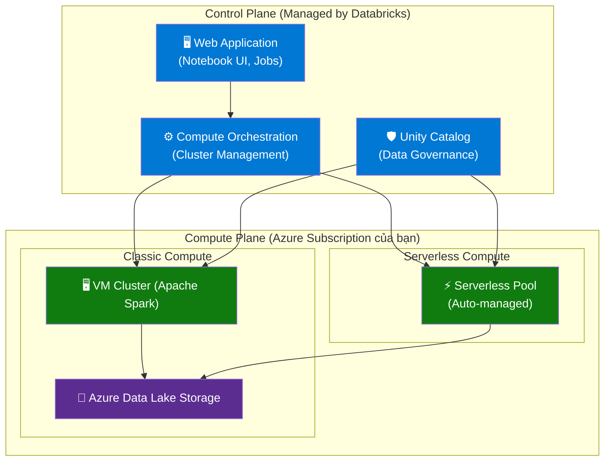
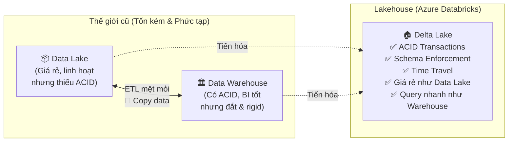
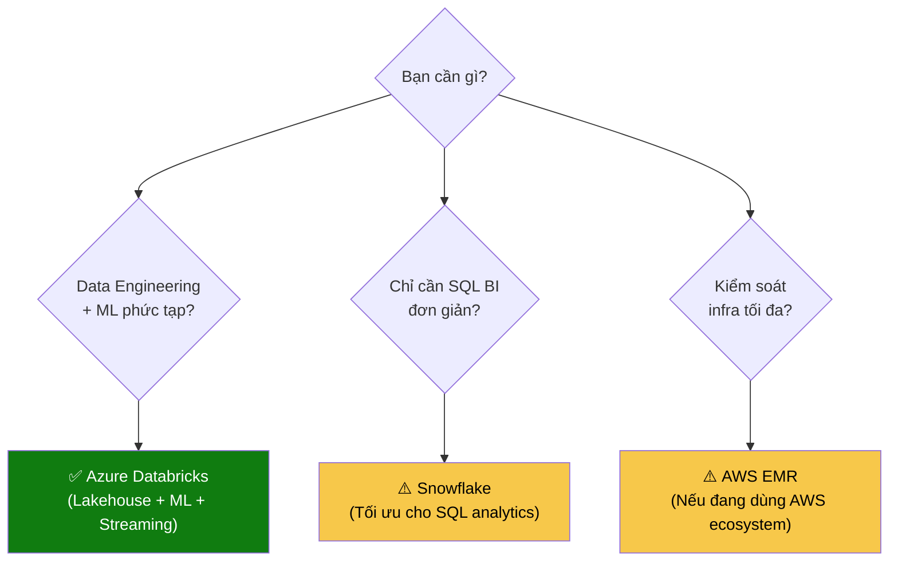
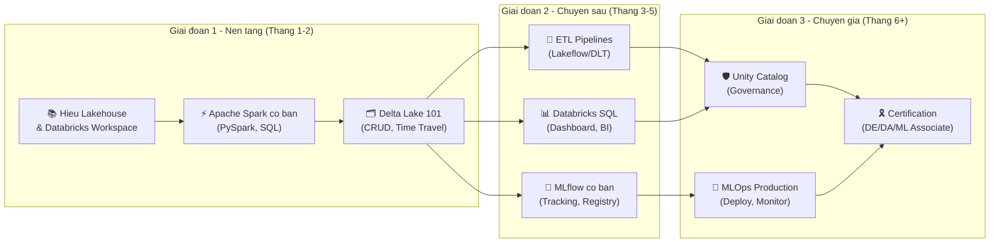
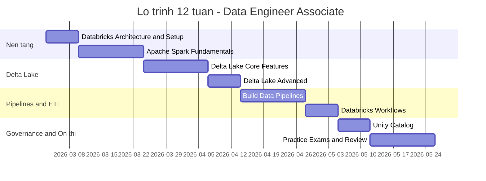
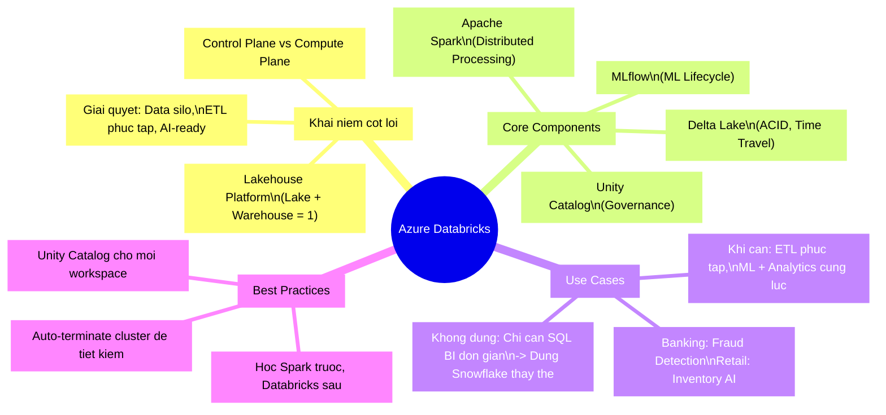

# Azure Databricks: "Con dao Swiss Army" của thế giới Big Data

> **Câu hỏi mở đầu:** Bạn đang quản lý một cửa hàng với hàng triệu giao dịch mỗi ngày. Dữ liệu đến từ khắp nơi — POS, website, app, logistics. Làm sao xử lý tất cả trong thời gian thực mà không bị "chết đứng"?

Đó chính xác là bài toán mà **Azure Databricks** được sinh ra để giải quyết.

<!--truncate-->

---

## 🔄 Ẩn dụ: Databricks như một "Nhà máy chế biến thông minh"

Hãy tưởng tượng bạn đang điều hành một **nhà máy chế biến thực phẩm**:

- **Nguyên liệu thô** = Dữ liệu thô từ mọi nguồn (log, giao dịch, cảm biến IoT...)
- **Băng chuyền sản xuất** = Apache Spark Engine — xử lý song song hàng nghìn luồng cùng lúc
- **Kho lạnh thông minh** = Delta Lake — lưu trữ có phiên bản, ACID, rollback được
- **Ban giám đốc** = Unity Catalog — kiểm soát ai được xem gì, audit trail đầy đủ
- **Dây chuyền AI** = MLflow + Notebooks — để tạo ra sản phẩm "thông minh" từ dữ liệu

Cả nhà máy này được thuê theo giờ trên **Azure Cloud**, không cần mua đất, không cần xây nhà xưởng.

---

## 🔬 Deep Dive: Kiến trúc Azure Databricks

### Control Plane vs Compute Plane



💡 **Trade-off quan trọng:**
- **Classic Compute**: Bạn kiểm soát network, data privacy tối đa → tốn công quản lý hơn
- **Serverless Compute**: Databricks quản lý hộ → dễ dùng, nhưng ít kiểm soát hơn

### Lakehouse Architecture: Tại sao nó khác biệt?

Trước khi có Lakehouse, các công ty phải duy trì **2 hệ thống riêng biệt**:



### Bộ 4 thành phần cốt lõi

| Thành phần | Vai trò | Ẩn dụ |
|:-----------|:--------|:------|
| **Apache Spark** | Xử lý dữ liệu song song | Xe tải chở hàng — càng nhiều xe, hàng đến càng nhanh |
| **Delta Lake** | Storage layer với ACID | Tủ hồ sơ có khóa số, lịch sử thay đổi |
| **MLflow** | ML lifecycle management | Nhật ký thí nghiệm của nhà khoa học |
| **Unity Catalog** | Data governance | Bảo vệ an ninh tòa nhà — ai vào phòng nào |

---

## 📊 So sánh: Khi nào dùng Databricks?



| Tiêu chí | Azure Databricks | Snowflake | AWS EMR |
|:---------|:----------------|:----------|:--------|
| **Điểm mạnh** | Unified Data + AI, Lakehouse | SQL DWH, dễ dùng | Kiểm soát sâu, giá rẻ |
| **Điểm yếu** | Đắt, cần expertise | Yếu với unstructured data | Phức tạp, quản lý thủ công |
| **Best for** | DE + DS + Analytics | BI + SQL queries | AWS users, big batch jobs |
| **Chi phí** | DBU + Azure cost | Credits model | Pay-per-second |

---

## 🏭 Use Case thực tế: Banking & Retail

### Case 1: Phát hiện gian lận giao dịch

Ngân hàng xử lý **hàng triệu giao dịch/ngày**. Trước đây mất 30-60 phút để phát hiện fraud. Với Databricks:

```python
# filename: fraud_detection_pipeline.py

# 💡 Tại sao dùng Structured Streaming?
# Vì chúng ta cần xử lý giao dịch REAL-TIME, không thể đợi batch
from pyspark.sql import SparkSession
from pyspark.sql.functions import col, window, count

spark = SparkSession.builder.appName("FraudDetection").getOrCreate()

# 👇 Đọc từ Kafka stream (dữ liệu giao dịch real-time)
transactions = (
    spark.readStream
    .format("kafka")
    .option("kafka.bootstrap.servers", "kafka-broker:9092")
    .option("subscribe", "bank-transactions")
    .load()
)

# 👇 Phát hiện bất thường: >5 giao dịch trong 1 phút từ 1 tài khoản
suspicious = (
    transactions
    .groupBy(
        col("account_id"),
        window(col("timestamp"), "1 minute")  # Cửa sổ thời gian 1 phút
    )
    .agg(count("*").alias("tx_count"))
    .filter(col("tx_count") > 5)  # Ngưỡng cảnh báo
)

# 👇 Ghi kết quả vào Delta Lake để audit & trigger alert
suspicious.writeStream.format("delta").outputMode("append").start("/data/fraud-alerts")
```

**Kết quả:** Từ 30-60 phút phát hiện fraud → xuống còn **dưới 1 phút**.

### Case 2: Tối ưu tồn kho ngành bán lẻ

```python
# filename: inventory_optimization.py

# 💡 Delta Lake Time Travel: Có thể "quay ngược thời gian" xem data cũ
# Rất hữu ích cho audit và so sánh dự báo vs thực tế

# Xem inventory data của 7 ngày trước
df_last_week = spark.read.format("delta") \
    .option("versionAsOf", 30) \
    .load("/data/inventory")

# So sánh với hiện tại để phát hiện xu hướng
df_current = spark.read.format("delta").load("/data/inventory")

# ... phân tích và dự báo ML
```

---

## 🎯 Kịch bản học tập chiến lược theo vai trò

### Lộ trình học theo 3 giai đoạn



### Theo vai trò cụ thể

**🔧 Data Engineer** (Xây dựng data pipeline):
1. PySpark DataFrames + Spark SQL
2. Delta Lake (ACID, Schema Evolution, Time Travel)
3. Databricks Workflows / Lakeflow Jobs
4. Unity Catalog (permissions, lineage)
5. → **Certification:** Databricks Certified Data Engineer Associate

**📊 Data Analyst** (Phân tích và báo cáo):
1. Databricks SQL Warehouse
2. Notebooks với SQL/Python
3. AI/BI Dashboards
4. Delta Lake queries
5. → **Certification:** Databricks Certified Data Analyst Associate

**🤖 Data Scientist / ML Engineer**:
1. PySpark MLlib cơ bản
2. MLflow (experiment tracking, model registry)
3. Feature Engineering trên Delta Lake
4. MLOps với Databricks Model Serving
5. → **Certification:** Databricks Certified Machine Learning Engineer Associate

---

## ⏱️ Timeline Study Plan thực tế

### Plan 12 tuần cho Data Engineer Associate



### Nguồn học miễn phí/giá rẻ (Ưu tiên)

| Nguồn | Loại | Chi phí | Best for |
|:------|:-----|:--------|:---------|
| **Databricks Academy** | Khóa học chính thức | Miễn phí cơ bản | Tất cả level |
| **Microsoft Learn** | Module nhỏ, có lab | Miễn phí | Beginner |
| **Databricks Community Edition** | Môi trường thực hành | Miễn phí | Practice |
| **DataCamp** | Có structured path | ~$25/tháng | Beginner-Intermediate |
| **Udemy** | Video dài | $10-15 (sale) | Tự học theo tốc độ riêng |

---

## ⚠️ Common Pitfalls — Lỗi thường gặp khi học Databricks

**1. Học lý thuyết quá nhiều, thiếu thực hành**

```
❌ Sai: Đọc docs, xem video → đã hiểu → bỏ qua thực hành
✅ Đúng: Mỗi concept → viết code ngay trong Community Edition
```

**2. Không hiểu Apache Spark trước khi học Databricks**

Databricks *là* Spark trên cloud. Nếu không hiểu RDD, DataFrame, lazy evaluation → bạn sẽ không biết tại sao code chậm.

**3. Bỏ qua Delta Lake**

> Delta Lake = **trái tim** của Databricks. Mọi best practice đều xoay quanh đây.

**4. Cluster không auto-terminate → "Cháy tiền"** 💸

```python
# ✅ Luôn set auto-terminate khi tạo cluster
# Trong UI: Cluster Settings → Auto Termination → 30 minutes
# Hoặc trong code:
cluster_config = {
    "autotermination_minutes": 30,  # Tắt sau 30 phút idle
    # ...
}
```

**5. Học certification-first, thay vì skill-first**

Certification chỉ là tờ giấy. Skills mới tạo ra giá trị. Hãy build project thực tế trước khi thi.

---

## 🧩 MECE Mindmap: Tổng quan Azure Databricks



---

## 🎓 Kết luận: Azure Databricks có đáng học không?

**Câu trả lời ngắn: Có — nếu bạn định theo con đường Data Engineering hoặc Data Science.**

Thị trường việc làm 2024-2025 cho thấy:
- Databricks nằm trong **top skills** của các JD Data Engineer tại Việt Nam và quốc tế
- Certified Databricks Engineer có mức lương cao hơn 20-30% so với không certified
- Microsoft và Databricks đang đầu tư mạnh vào ecosystem này (Fabric, Lakebase, Databricks One)

**Kịch bản chiến lược học:**

```
Tháng 1-2: Nền tảng (Spark, Delta Lake, Notebooks)
Tháng 3-4: Chuyên sâu theo role (DE/DA/DS)
Tháng 5-6: Build portfolio project thực tế
Tháng 6+: Luyện thi và lấy certification
```

> 💡 **Lời khuyên cuối:** Đừng học Databricks như học một công cụ. Hãy học nó như **học cách tư duy về data architecture**. Đó mới là thứ giúp bạn tiến xa trong sự nghiệp.

---

*Made by Anh Tu - Share to be shared*
