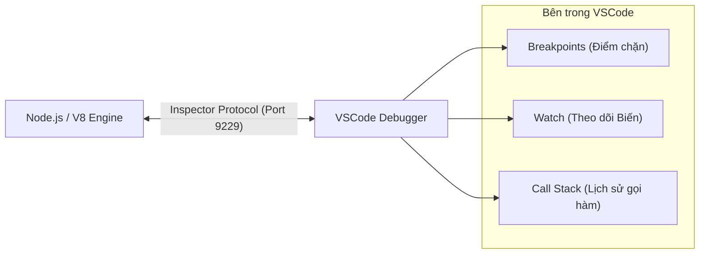
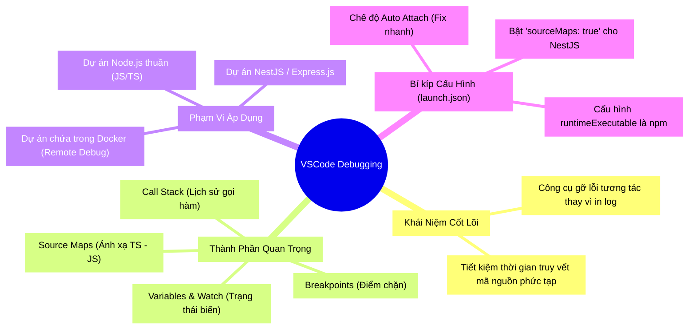

Bạn có bao giờ tự hỏi: *Tại sao chúng ta lại mất hàng giờ để chèn hàng chục dòng `console.log()` và F5 liên tục mỗi khi ứng dụng chạy sai?* 

Đó là cách làm thủ công và kém hiệu quả nhất! Trong khi đó, trình soạn thảo VSCode đã được trang bị sẵn một công cụ Debugger vô cùng mạnh mẽ, giúp bạn tiết kiệm đến 80% thời gian tìm lỗi. Bài viết này sẽ giúp bạn làm chủ vũ khí đó cho cả môi trường Node.js thuần và framework NestJS.

<!-- truncate -->

## 1. Ẩn dụ về Debugging (Analogy First)

Hãy tưởng tượng việc tìm một chiếc chìa khóa bị rơi trong một ngôi nhà siêu rộng vào ban đêm.

- Giải quyết bằng **`console.log()`** giống như bạn dùng tay soi **đèn pin** đi tới từng góc phòng. Bạn chỉ nhìn thấy sự vật khi ánh sáng chiếu qua. Nếu sơ ý lướt qua nhanh mà không thấy chìa khoá, bạn phải soi đi soi lại cả căn phòng.
- Giải quyết bằng **Debugger của VSCode** giống như việc ngôi nhà bạn có trang bị hệ thống **Camera an ninh cảm biến (Breakpoints)**. Khi có vật thể di chuyển lọt qua vùng camera (code chạy tới dòng breakpoint), thời gian sẽ tạm dừng. Lúc này bạn có thể thong thả đứng tại phòng xem xét tình hình, tua tới, tua lui, quan sát mọi ngóc ngách của căn nhà một cách rõ nét toàn cục.

## 2. Hệ thống Camera an ninh - Cơ chế hoạt động của Debugger (Deep Dive)

Động cơ V8 (bên dưới Node.js) hỗ trợ giao thức kết nối tên là **Inspector Protocol**. VSCode sẽ đóng vai trò như một bảng điều khiển màn hình, gắn (attach) trực tiếp vào quá trình chạy của Node.js qua giao thức này.



Khi bạn bật Debug trên VSCode, công cụ cung cấp 3 sức mạnh chính:
1. **Breakpoints (Điểm chặn):** Đặt "Bẫy thời gian" ở một dòng code. Code chạy đến đây sẽ đứng hình.
2. **Call Stack (Ngăn xếp gọi hàm):** Liệt kê lịch sử **Ai vừa gọi Ai?**. Giúp truy vết nguyên nhân sâu xa từ tầng Route => Service => Repository.
3. **Variables & Watch:** Nhìn xuyên thấu giá trị của toàn bộ biến trong bộ nhớ lúc code đang dừng tại Breakpoint, mà không cần in ra `console`.

---

## 3. Thực hành Debug trong dự án Node.js thuần (Practice)

### Cách Nhanh Nhất: Tính năng Auto Attach

Đây là cách "ăn liền" tuyệt vời của VSCode.
- Nhấn tổ hợp phím **`Cmd + Shift + P`** (Mac) hoặc **`Ctrl + Shift + P`** (Win).
- Gõ và chọn `Debug: Toggle Auto Attach`.
- Chọn chế độ **`Smart`** hoặc **`Always`**.

Lúc này, bất kỳ tiến trình Node.js nào bạn chạy từ terminal (ví dụ `node index.js`), VSCode sẽ lập tức gắn Debugger vào tự động. Một thao tác, đỡ nghìn lo âu!

### Cách Chuyên Nghiệp: Cấu hình `launch.json`

Với các dự án lớn, cấu hình tĩnh sẽ giúp các thành viên trong team làm việc đồng bộ hơn.

```json
// filename: .vscode/launch.json
{
  "version": "0.2.0",
  "configurations": [
    {
      "type": "node",
      "request": "launch",
      "name": "Launch Program Node.js",
      "skipFiles": [
        "<node_internals>/**"
      ],
      // 👇 Quan trọng: Trỏ trực tiếp file entry point của dự án để chạy ngay từ VSCode thay vì Terminal
      "program": "${workspaceFolder}/src/index.js",
      // 👇 Hiển thị kết quả trong Terminal chuẩn của VSCode (Integrated)
      "console": "integratedTerminal" 
    }
  ]
}
```

---

## 4. Thực hành Debug trong dự án NestJS (Practice)

NestJS thường được viết bằng ngôn ngữ **TypeScript**. Bạn không thể chạy trực tiếp TypeScript trên Node.js mà phải biên dịch nó ra tệp tin JavaScript (thường nằm ở thư mục `dist`). 

Vấn đề nảy sinh: **Khi gỡ lỗi, chúng ta đặt dấu Breakpoint ở file `.ts`, nhưng code thực thi lại là file `.js`. Làm sao VSCode hiểu được?**
👉 Cầu nối chính là khái niệm **`sourceMaps`**.

Cấu hình `launch.json` cho dự án NestJS (bỏ qua bước chạy tay `npm run start:debug` nhọc nhằn):

```json
// filename: .vscode/launch.json
{
  "version": "0.2.0",
  "configurations": [
    {
      "type": "node",
      "request": "launch",
      "name": "🚀 Launch & Debug NestJS",
      "cwd": "${workspaceFolder}/quizzi-nest",
      "runtimeExecutable": "npm",
      "runtimeArgs": [
        "run",
        "start:debug"
      ],
      "restart": true,
      "console": "integratedTerminal",
      "autoAttachChildProcesses": true
    },
    {
      "type": "node",
      "request": "attach",
      "name": "🔌 Attach to NestJS (Port 9229)",
      "address": "127.0.0.1",
      "port": 9229,
      "restart": true,
      "cwd": "${workspaceFolder}/quizzi-nest",
      "skipFiles": [
        "<node_internals>/**"
      ],
      "outFiles": [
        "${workspaceFolder}/**/*.js"
      ]
    }
  ]
}
```

Chỉ cần chọn "Debug NestJS Application" bên tab **Run and Debug** (`Cmd + Shift + D`) và bấm phím **F5**. Toàn bộ server sẽ khởi chạy và các Breakpoints trong file `.ts` của bạn đã sẵn sàng bắt dính lỗi.

---

## 5. Những Cạm Bẫy (Pitfalls) Cần Né Dù Trình Cao

⚠️ **Pitfall 1: Unbound Breakpoint (Điểm chặn hình vòng xám lờ mờ)**  
Bạn đặt dấu chấm đỏ (Breakpoint) nhưng khi chạy nó bị đổi thành vòng tròn viền xám rỗng bên trong và code không dừng lại ở đó.
* **Nguyên nhân:** VSCode không thể tìm được `sourceMaps` hoặc đường dẫn biên dịch bị sai khiến nó không biết file chạy thực tế ở đâu.
* **Cách fix:** Đảm bảo trong `tsconfig.json` cấu hình `"sourceMap": true` và trong file `launch.json` bật cờ `"sourceMaps": true`.

⚠️ **Pitfall 2: Báo lỗi "Port 9229 is already in use"**  
* **Nguyên nhân:** Cổng 9229 (Cổng giao tiếp mặc định của Node Debugger Protocol) đã bị một tiến trình Node.js khác hoặc tiến trình Debug cũ chưa rớt ("zombie process") chiếm dụng.
* **Cách fix:** Kill port sử dụng công cụ lệnh hoặc restart VSCode. Có thể khắc phục bằng cách cấu hình port tùy chỉnh trong thông số chạy `start:debug` của server.

---

## 6. Tổng kết (MECE Mindmap)

Dưới đây là sơ đồ chuẩn hoá giúp bạn review lại toàn bộ mảng kiến thức Debugging trên Node.js và NestJS.



> ***Made by Anh Tu - Share to be share***
