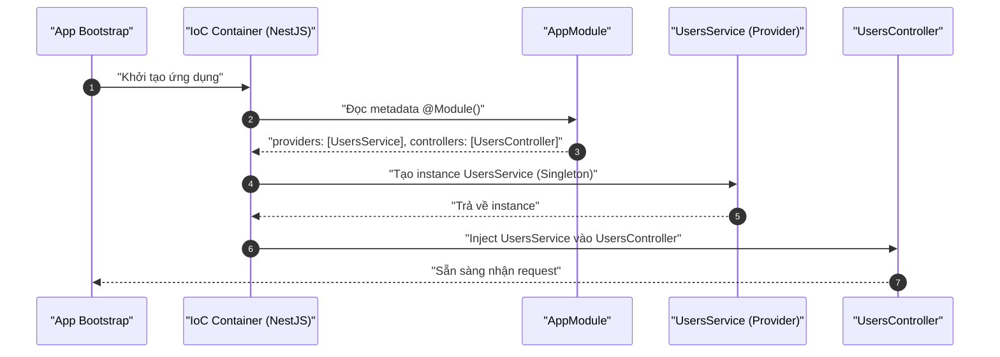
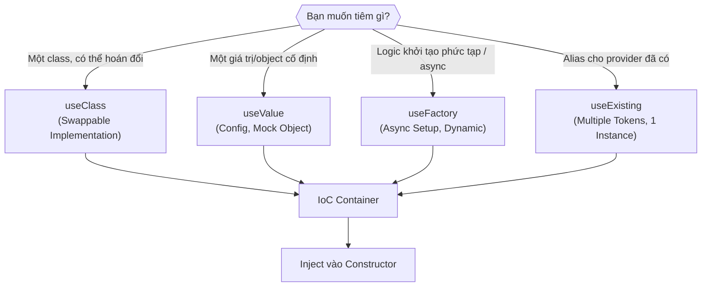
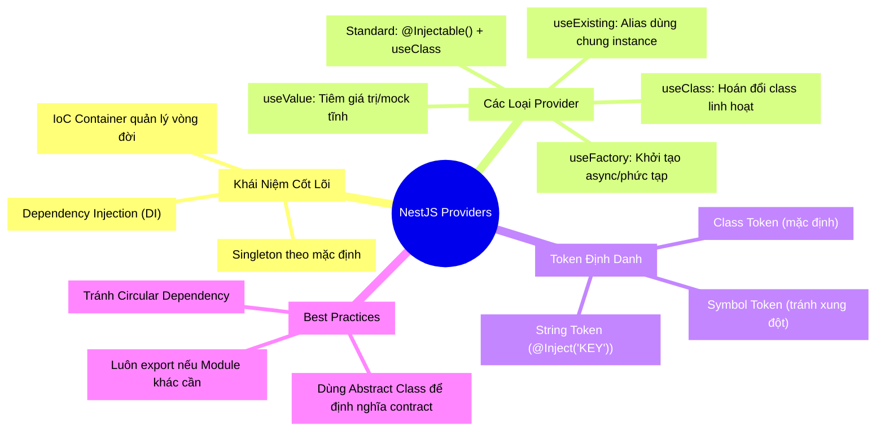

Tại sao khi xây một tòa nhà cao tầng, người ta không đúc từng viên gạch tại chỗ rồi dán lên? Vì như vậy quá chậm, lãng phí và không thể bảo trì. Thay vào đó, mọi thứ đều được **tiền chế (prefabricated)** — sản xuất sẵn ở nhà máy, vận chuyển đến công trường và lắp ráp vào đúng nơi cần. **Provider trong NestJS** hoạt động theo triết lý y hệt như vậy.

<!-- truncate -->

## 1. Ẩn dụ: Nhà Máy và Công Trường (Analogy First)

Hãy hình dung ứng dụng NestJS của bạn là một **tòa cao ốc đang xây**:

- **Module** = các **tầng** của tòa nhà. Mỗi tầng tự quản lý không gian của mình.
- **Controller** = **Lễ tân** tại mỗi tầng. Họ nhận yêu cầu từ khách hàng (HTTP request) và chuyển tiếp cho đúng bộ phận.
- **Provider (Service/Repository/...)** = các **bộ phận chuyên môn** (Kỹ thuật điện, Kỹ thuật cơ khí...). Họ là người thực sự làm ra sản phẩm.

Câu hỏi then chốt: **Lễ tân lấy "chuyên gia" từ đâu?** Họ không tự đi tìm hay tự đào tạo. Họ chỉ cần *yêu cầu*, và **IoC Container** (Trung tâm Điều phối Nhân sự) của NestJS sẽ tự động đưa đúng người đến đúng chỗ. Đây chính là **Dependency Injection (DI)**.

## 2. Cơ chế hoạt động của IoC Container (Deep Dive)

Khi NestJS khởi động, nó quét toàn bộ các `@Module()` và xây dựng một bản đồ phụ thuộc. Khi một class cần một dependency, Container tra bản đồ và cung cấp instance tương ứng — đã được tạo sẵn (Singleton theo mặc định).



> 💡 **Singleton mặc định:** NestJS chỉ tạo **một instance duy nhất** cho mỗi Provider trong phạm vi một Module và tái sử dụng nó. Đây là behavior mặc định và phù hợp với 90% trường hợp.

---

## 3. Provider Tiêu Chuẩn (Standard Provider)

Đây là dạng phổ biến nhất. Bạn chỉ cần thêm `@Injectable()` vào class và đăng ký nó trong `providers` của module.

```typescript
// filename: src/users/users.service.ts
import { Injectable } from '@nestjs/common';

@Injectable() // 👈 Đánh dấu class này là một "Thành phần có thể tiêm vào"
export class UsersService {
  private readonly users = [{ id: 1, name: 'Anh Tu' }];

  findAll() {
    return this.users;
  }
}
```

```typescript
// filename: src/users/users.module.ts
import { Module } from '@nestjs/common';
import { UsersService } from './users.service';
import { UsersController } from './users.controller';

@Module({
  // 👇 Đăng ký với IoC Container để nó biết UsersService tồn tại
  providers: [UsersService],
  controllers: [UsersController],
})
export class UsersModule {}
```

Khi viết `providers: [UsersService]`, NestJS thực ra đang tự động mở rộng thành dạng đầy đủ:

```typescript
providers: [
  {
    provide: UsersService,   // 👈 Token (tên định danh)
    useClass: UsersService,  // 👈 Class thực tế để khởi tạo
  }
]
```

---

## 4. Custom Providers — Sức Mạnh Thực Sự

Đây là lúc mọi thứ trở nên thú vị. Khi `token` và `class` không còn cần phải giống nhau, bạn mở ra vô vàn khả năng.

### 4.1. `useClass` — Hoán đổi Implementation

**Bài toán:** Bạn muốn dùng `MockEmailService` khi test và `RealEmailService` khi production.

```typescript
// filename: src/email/email.module.ts
import { Module } from '@nestjs/common';
import { RealEmailService } from './real-email.service';
import { MockEmailService } from './mock-email.service';

const isProduction = process.env.NODE_ENV === 'production';

@Module({
  providers: [
    {
      provide: 'EMAIL_SERVICE', // 👈 Token là một string định danh tùy ý
      // 💡 Tuỳ theo môi trường, NestJS sẽ tạo ra class khác nhau
      useClass: isProduction ? RealEmailService : MockEmailService,
    },
  ],
  exports: ['EMAIL_SERVICE'],
})
export class EmailModule {}
```

```typescript
// Inject bằng @Inject() với string token
import { Inject, Injectable } from '@nestjs/common';

@Injectable()
export class NotificationService {
  constructor(
    @Inject('EMAIL_SERVICE') private readonly emailService: any,
  ) {}
}
```

### 4.2. `useValue` — Tiêm Giá Trị Tĩnh

**Bài toán:** Bạn muốn tiêm một config object, một mock object đã tạo sẵn, hoặc một constant.

```typescript
// filename: src/app.module.ts
const appConfig = {
  apiUrl: 'https://api.example.com',
  timeout: 5000,
};

@Module({
  providers: [
    {
      provide: 'APP_CONFIG', // Token
      useValue: appConfig,   // 💡 Tiêm thẳng giá trị, không cần khởi tạo class
    },
  ],
})
export class AppModule {}
```

> ✅ **Dùng khi nào?** Rất lý tưởng cho Unit Testing: thay vì mock cả một class phức tạp, bạn chỉ cần cung cấp một plain object có đúng các method cần thiết.

### 4.3. `useFactory` — Khởi Tạo Bất Đồng Bộ (Async Factory)

**Bài toán:** Provider của bạn cần kết quả từ một lời gọi async (ví dụ: đọc config từ database, thiết lập kết nối SDK), hoặc phụ thuộc vào provider khác để khởi tạo.

```typescript
// filename: src/database/database.module.ts
import { Module } from '@nestjs/common';
import { ConfigService } from '@nestjs/config';
import { createConnection } from 'typeorm';

@Module({
  providers: [
    {
      provide: 'DATABASE_CONNECTION',
      // 💡 inject: [] cho phép truyền các provider khác vào factory function
      inject: [ConfigService],
      useFactory: async (configService: ConfigService) => {
        // 👇 Có thể dùng async/await ở đây!
        const connection = await createConnection({
          type: 'postgres',
          host: configService.get('DB_HOST'),
          port: configService.get<number>('DB_PORT'),
        });
        return connection;
      },
    },
  ],
  exports: ['DATABASE_CONNECTION'],
})
export class DatabaseModule {}
```

### 4.4. `useExisting` — Alias cho Provider

**Bài toán:** Bạn muốn `CatsService` và `CatService` (hai cái tên) cùng trỏ về **một instance**.

```typescript
@Module({
  providers: [
    CatsService, // Provider gốc
    {
      provide: 'CAT_SERVICE',  // Token alias
      useExisting: CatsService, // 💡 Tái sử dụng instance đã có, không tạo mới
    },
  ],
})
export class AppModule {}
```

> ⚠️ **Khác với `useClass`:** `useClass` tạo instance **mới**. `useExisting` trỏ tới instance **đã tồn tại**.

---

## 5. Sơ Đồ So Sánh 4 Chiến Thuật Custom Provider



---

## 6. Những Cạm Bẫy Hay Gặp (Pitfalls)

⚠️ **Pitfall 1: Circular Dependency (Phụ thuộc vòng tròn)**
`ServiceA` cần `ServiceB`, `ServiceB` lại cần `ServiceA`. NestJS sẽ báo lỗi không thể giải quyết dependency.
* **Cách fix:** Dùng `forwardRef()` hoặc tái cấu trúc lại kiến trúc để thoát khỏi vòng lặp (khuyến nghị).

```typescript
// Giải pháp tạm thời khi không thể refactor ngay
constructor(@Inject(forwardRef(() => ServiceB)) private serviceB: ServiceB) {}
```

⚠️ **Pitfall 2: Provider không được export ra ngoài Module**
Bạn dùng `UsersService` bên trong `OrdersModule` nhưng quên `exports: [UsersService]` trong `UsersModule`.
* **Cách fix:** Luôn thêm provider vào mảng `exports` nếu module khác cần dùng.

⚠️ **Pitfall 3: Nhầm lẫn giữa `useClass` và `useExisting`**
* `useClass` → Tạo instance **mới** cho mỗi token.
* `useExisting` → Tái sử dụng instance **cũ** đã được đăng ký.
Dùng sai sẽ khiến bạn có 2 instance riêng biệt khi chỉ muốn 1.

---

## 7. Tổng Kết (MECE Mindmap)



> ***Made by Anh Tu - Share to be share***
