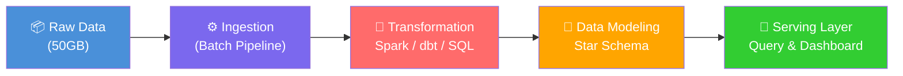
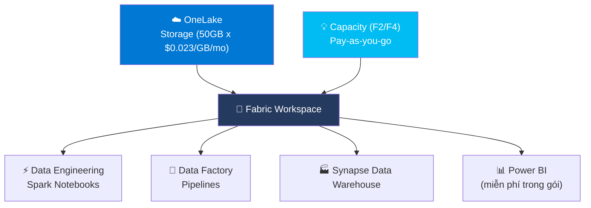
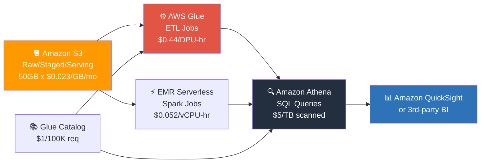
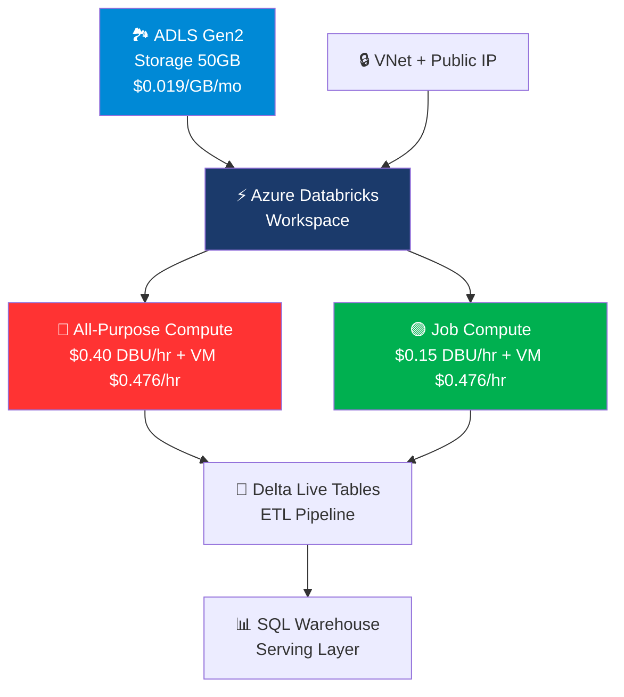
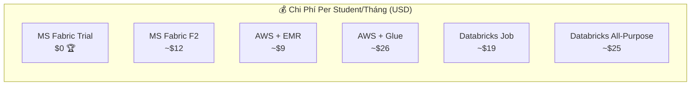
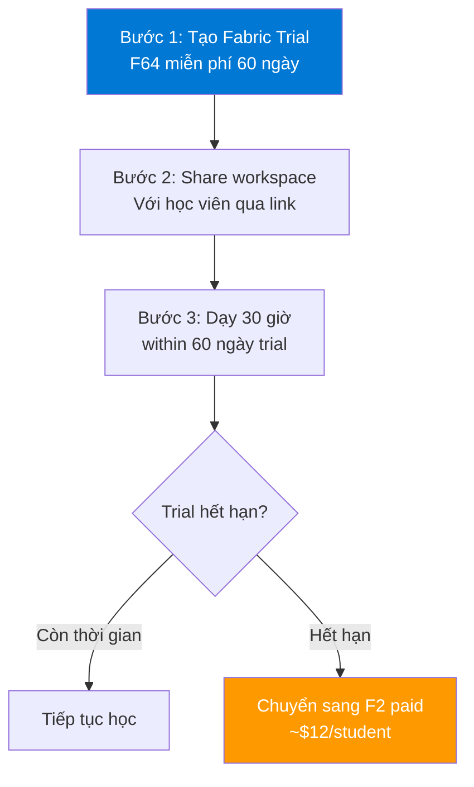
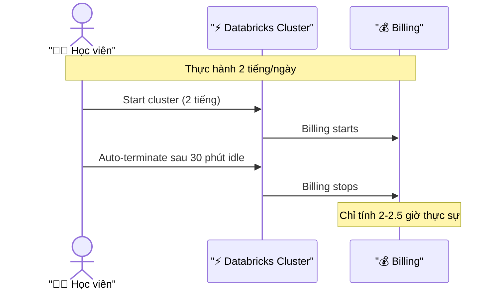
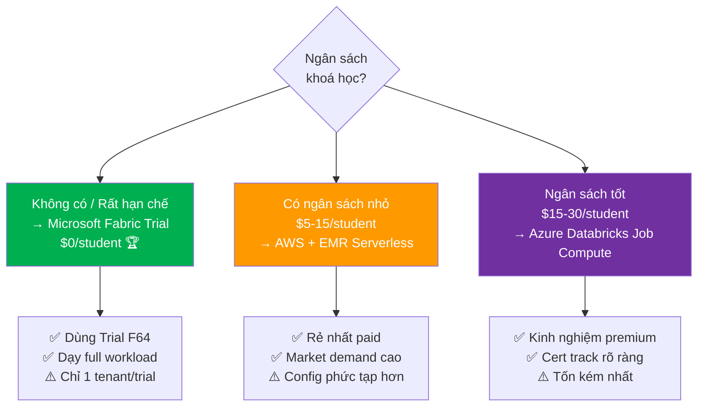
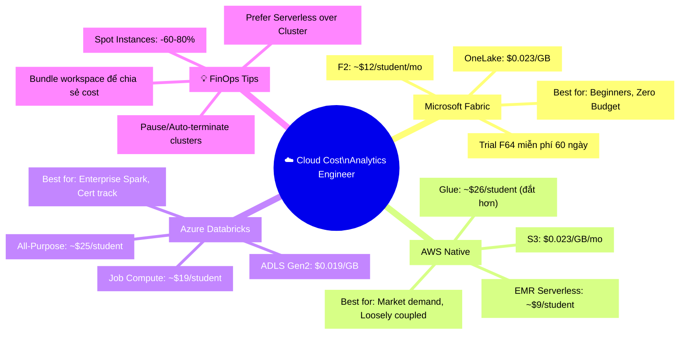

# FinOps cho Khoá Học: Chọn Nền Tảng Cloud Nào Để Dạy Analytics Engineer?

> **Bài toán thực tế:** Bạn đang xây dựng khoá học _"Analytics Engineer Fundamentals on Cloud"_. Học viên sẽ thực hành 30 giờ với dataset 50GB. Ngân sách per-student là bao nhiêu? Và nền tảng nào **cost-effective** nhất?

Hãy cùng tôi "mổ xẻ" bài toán này như một Cloud Solutions Architect thực thụ. 🔍

{/* truncate */}

---

## 🏗️ Kiến Trúc Bài Toán

Trước khi tính tiền, hãy hình dung workload của học viên:



**Assumption cho tính toán:**
- ⏱️ **30 giờ thực hành** trải dài trong 1 tháng (~1-2 giờ/ngày)
- 💾 **50GB dataset** (raw + staged + serving tables)
- 🎯 **Workload**: Batch ETL Jobs, không phải real-time streaming
- 🌍 **Region**: US East (N. Virginia) / US West 2 để có giá tốt nhất

---

## 🟦 Nền Tảng 1: Microsoft Fabric

### Kiến Trúc "All-in-One"

Ẩn dụ dễ hiểu: Microsoft Fabric giống như **"căn hộ all-inclusive"** — bạn trả một mức giá, bao gồm tất cả: phòng gym (Spark), bể bơi (Power BI), và nhà bếp (Data Factory). Không cần "order" từng món riêng lẻ.



### Tính Chi Phí Chi Tiết

**Compute — Pay-as-you-go (F2 SKU):**

| Hạng mục | Đơn giá | Tính toán | Chi phí |
|----------|---------|-----------|---------|
| F2 SKU (2 CU) | $0.18/CU/hr | 2 CU × $0.18 × 30 giờ | **$10.80** |
| Storage OneLake | $0.023/GB/mo | 50 GB × $0.023 | **$1.15** |
| Networking egress | ~$0.087/GB | ≈ 5GB transfer nội bộ | **~$0.44** |
| **TỔNG** | | | **~$12.39** |

> 💡 **Nếu dùng F4 SKU** (nhiều capacity hơn, chạy job nhanh hơn): $0.72/hr × 30h = $21.60 compute — tổng khoảng **$23.19/student**.

**⭐ Fabric Trial — Lựa Chọn Vàng Cho Khoá Học!**

| Thông tin Trial | Chi tiết |
|-----------------|---------|
| Thời gian | 60 ngày miễn phí |
| Capacity | F64 (64 CUs!) — tương đương $691 nếu mua! |
| Storage | Lên đến 1TB OneLake |
| Giới hạn | Không có Copilot AI, Private Link |
| Phù hợp khoá học? | ✅ **Hoàn toàn!** (30h thực hành trong 60 ngày) |

**⚠️ Chi phí ẩn cần lưu ý:**
- Power BI Pro License: $10/user/month nếu muốn chia sẻ reports (không bắt buộc trong trial)
- SQL Storage: $0.25/GB/mo nếu dùng Warehouse (khác với Lakehouse)
- Azure Blob/Networking egress khi data transfer ra ngoài Azure region

---

## 🟠 Nền Tảng 2: AWS Native Services

### Kiến Trúc "Lego Blocks"

AWS giống như **"mua đồ Lego rời"** — bạn mua từng tập riêng (S3, Glue, Athena) rồi tự lắp ghép. Có điểm tốt là linh hoạt, nhưng cũng cần "thợ giỏi" để lắp đúng cách.



### Tính Chi Phí Chi Tiết

**Giả định workload 30 giờ:**
- ~20 giờ chạy ETL Jobs (Glue Spark với 4 DPU)
- ~10 giờ query với Athena (scan ~15GB mỗi session)

| Hạng mục | Đơn giá | Tính toán | Chi phí |
|----------|---------|-----------|---------|
| S3 Standard Storage | $0.023/GB/mo | 50GB × $0.023 | **$1.15** |
| AWS Glue ETL (Flexible) | $0.29/DPU-hr | 4 DPU × 20h × $0.29 | **$23.20** |
| Amazon Athena queries | $5.00/TB | ~150GB scanned × $5/1000GB | **$0.75** |
| Glue Data Catalog | $1/100K requests | ~50K requests | **$0.50** |
| S3 Request costs | $0.0004/1K PUT | ~500K requests | **$0.20** |
| Data Transfer | $0.09/GB | ~2GB egress | **$0.18** |
| **TỔNG (với Glue)** | | | **~$25.98** |

**Thay Glue bằng EMR Serverless (Spark thuần):**

| Hạng mục | Đơn giá | Tính toán | Chi phí |
|----------|---------|-----------|---------|
| EMR Serverless vCPU | $0.052624/vCPU-hr | 4 vCPU × 20h | **$4.21** |
| EMR Serverless RAM | $0.0057785/GB-hr | 16GB × 20h | **$1.85** |
| S3 + Athena + Catalog | (như trên) | | **$2.58** |
| **TỔNG (với EMR)** | | | **~$8.64** |

**🎁 AWS Free Tier giúp tiết kiệm:**

| Dịch vụ | Free Tier | Tiết kiệm ước tính |
|---------|-----------|-------------------|
| S3 | 5GB storage (12 tháng) | ~$0.12/month |
| Athena | Không có Free Tier | $0 |
| Glue | 1 triệu DPU-seconds/tháng | Khoảng $0.12 |
| EMR Serverless | Không có Free Tier chính thức | $0 |

> ⚠️ **Lưu ý quan trọng:** AWS Free Tier gần như **không đủ đáng kể** cho workload 30 giờ của khoá học. Đừng trông chờ nhiều vào đây!

---

## 🟣 Nền Tảng 3: Azure Databricks

### Kiến Trúc "Ferrari của Data Engineering"

Azure Databricks như **"thuê Ferrari để học lái xe"** — mạnh nhất thị trường, nhưng chi phí cao hơn hẳn. Phù hợp nếu học viên muốn làm việc với doanh nghiệp lớn sau này.



### Tính Chi Phí Chi Tiết

**VM: Standard_DS3_v2** (4 vCPU, 14 GiB RAM)

**Scenario A — All-Purpose Compute (Interactive Notebooks):**

| Hạng mục | Đơn giá | Tính toán | Chi phí |
|----------|---------|-----------|---------|
| VM (DS3_v2) | $0.476/hr | 30 giờ × 1 node | **$14.28** |
| DBU (All-Purpose, Standard) | $0.40/DBU-hr | 0.75 DBU × 30h × $0.40 | **$9.00** |
| ADLS Gen2 Storage | $0.019/GB/mo | 50GB × $0.019 | **$0.95** |
| VNet + Public IP | ~$0.015/hr | 30h (có thể bỏ qua) | **$0.45** |
| **TỔNG (All-Purpose)** | | | **~$24.68** |

**Scenario B — Job Compute (Scheduled Jobs, rẻ hơn ~64%):**

| Hạng mục | Đơn giá | Tính toán | Chi phí |
|----------|---------|-----------|---------|
| VM (DS3_v2) | $0.476/hr | 30 giờ × 1 node | **$14.28** |
| DBU (Job Compute, Standard) | $0.15/DBU-hr | 0.75 DBU × 30h × $0.15 | **$3.38** |
| ADLS Gen2 Storage | $0.019/GB/mo | 50GB × $0.019 | **$0.95** |
| VNet + Public IP | ~$0.015/hr | 30h | **$0.45** |
| **TỔNG (Job Compute)** | | | **~$19.06** |

> ⚠️ **Lưu ý 2026:** Standard Tier **sẽ bị retired vào Oct 1, 2026**. Sau April 2026 không thể tạo workspace Standard mới. Premium tier sẽ có giá DBU cao hơn (~$0.55 All-Purpose).

**🤔 Databricks Community Edition — Có Phù Hợp Không?**

| Tiêu chí | Community Edition | Paid (Azure) |
|----------|------------------|--------------|
| Giá | Miễn phí | ~$19-25/student/tháng |
| Cluster type | Serverless nhỏ | Tùy chỉnh |
| Thời gian timeout | ~2 giờ không hoạt động | Có thể cấu hình |
| Unity Catalog | ❌ Không có | ✅ Có |
| Delta Live Tables | ❌ Không có | ✅ Có |
| MLflow đầy đủ | ⚠️ Hạn chế | ✅ Đầy đủ |
| Clusters tùy chỉnh | ❌ | ✅ |
| R/Scala notebook | ❌ | ✅ |
| Phù hợp khoá học chuyên nghiệp? | ⚠️ Hạn chế nhiều | ✅ Nên dùng |

> 💡 **Kết luận:** Community Edition phù hợp cho **buổi demo đơn giản**, nhưng nếu muốn dạy Delta Live Tables, Unity Catalog, hoặc MLflow thực sự — cần dùng paid tier.

---

## 📊 Bảng So Sánh Tổng Hợp

### Chi Phí Ước Tính Per Student / Tháng

| Nền tảng | Compute | Storage | Phụ phí | **TỔNG** | Ghi chú |
|----------|---------|---------|---------|----------|---------|
| **MS Fabric (Trial)** | $0 | $0 | $0 | **$0 🏆** | Trial F64, 60 ngày |
| **MS Fabric (Paid F2)** | $10.80 | $1.15 | $0.44 | **~$12.39** | Pause khi không dùng |
| **AWS (EMR Serverless)** | $6.06 | $1.15 | $1.43 | **~$8.64 🥈** | Free Tier hạn chế |
| **AWS (Glue Standard)** | $23.20 | $1.15 | $1.63 | **~$25.98** | Đắt nhất nếu dùng Glue |
| **Azure Databricks Job** | $17.66 | $0.95 | $0.45 | **~$19.06** | Job Compute |
| **Azure Databricks All-Purpose** | $23.28 | $0.95 | $0.45 | **~$24.68** | Interactive notebook |

### Biểu Đồ So Sánh Tổng Quan



---

## ⚖️ Phân Tích Ưu / Nhược Điểm

### 🟦 Microsoft Fabric

**✅ Ưu điểm:**
- **Trial F64 miễn phí 60 ngày** — đủ cho cả khoá học 1 tháng
- Giao diện thân thiện, low learning curve cho người mới
- Power BI tích hợp sẵn — không cần license riêng
- OneLake unify data — không phức tạp về networking

**❌ Nhược điểm:**
- Ecosystem khóa chặt với Microsoft (vendor lock-in cao)
- Fabric Trial chỉ **1 lần** per tenant — khó dùng cho nhiều batch học viên
- Không phổ biến bằng Databricks/AWS trong doanh nghiệp lớn
- Learning curve ngược: sau khoá học, ít cơ hội áp dụng tại thị trường VN

---

### 🟠 AWS Native Services

**✅ Ưu điểm:**
- **Kiến trúc loosely coupled** — học viên hiểu rõ từng service
- EMR Serverless: chi phí thấp, không cần quản lý cluster
- Athena: query trực tiếp từ S3, serverless hoàn toàn
- Market demand cao — AWS phổ biến nhất VN & APAC

**❌ Nhược điểm:**
- **Steep learning curve** — phải hiểu ~5 services cùng lúc
- Nhiều "gotcha" (IAM permissions, VPC configs, bucket policies)
- Glue đắt hơn EMR đáng kể — cần chọn đúng service
- Không có Free Tier đủ dùng cho workload thực tế

---

### 🟣 Azure Databricks

**✅ Ưu điểm:**
- **Best-in-class Spark experience** — công nghệ Delta Lake, DLT
- Job Compute rẻ hơn All-Purpose ~64%
- Unity Catalog, MLflow, Feature Store — ecosystem hoàn chỉnh
- Certification giá trị cao (Databricks Certified)

**❌ Nhược điểm:**
- **Chi phí cao nhất** trong paid scenarios
- Standard Tier sắp bị sunset (Oct 2026) — cần tính đến premium
- VM cost chiếm phần lớn (60-70%) kể cả khi cluster idle nhẹ
- Community Edition quá hạn chế cho professional course

---

## 💡 Best Practice: Chiến Lược Tối Ưu Chi Phí

### Chiến Lược 1: "Trial First" với Microsoft Fabric



**→ Chi phí lý tưởng: $0 (với trial) hoặc ~$12 nếu overrun**

---

### Chiến Lược 2: "Serverless Maximalist" trên AWS

| Tối ưu | Hành động cụ thể | Tiết kiệm |
|--------|-----------------|-----------|
| Dùng EMR Serverless thay Glue | Chuyển jobs sang EMR | ~$17/student |
| Parquet + Partitioning | Giảm data scan của Athena | ~30-70% Athena cost |
| S3 Intelligent-Tiering | Tự động cold data | ~20% storage |
| Lifecycle Policy | Xóa staging data sau 30 ngày | ~$0.50/student |

---

### Chiến Lược 3: "Pause Everything" cho Azure Databricks



**Policy cụ thể:**
```python
# ✅ Cấu hình Auto-termination trong Databricks
cluster_config = {
    "auto_terminate": True,
    "auto_terminate_minutes": 30,  # Terminate sau 30 phút idle
    "cluster_type": "job_compute",  # Không dùng all-purpose!
    "spot_instances": True,         # Tiết kiệm thêm 60-80%!
}
```

> 💡 **Spot Instances (AWS Spot / Azure Spot VM):** Có thể tiết kiệm 60-80% chi phí VM. Nhược điểm duy nhất: cluster có thể bị terminate đột ngột. Phù hợp cho learning, không phải production!

---

## 🏆 Đề Xuất Cuối Cùng: Roadmap Theo Ngân Sách



---

## 🧩 Mindmap Tổng Hợp



---

## 🎯 Kết Luận

**Tl;dr cho người bận:**

| Nếu bạn... | Chọn... |
|-----------|--------|
| Budget $0 và khoá học ≤ 60 ngày | **Microsoft Fabric Trial** |
| Muốn học viên hiểu kiến trúc cloud thực tế | **AWS + EMR Serverless** |
| Dạy enterprise data engineering / Spark thuần | **Azure Databricks Job Compute** |
| Cần scale nhiều học viên cùng lúc | **MS Fabric Shared Workspace** |

> 🚀 **Pro Tip cuối:** Với khoá học Analytics Engineer thực chiến, tôi suggest kết hợp: **dùng Fabric Trial cho phần foundation** (ingestion, storage, power BI), sau đó **chuyển sang AWS EMR** cho phần Spark/dbt transformation — tận dụng ưu điểm của cả hai mà không tốn quá nhiều.

---

*Made by Anh Tu - Share to be share* 🌟

> 💬 **Bạn đang xây khoá học analytics engineer?** Hãy để lại comment phía dưới về stack bạn đang chọn và lý do tại sao — tôi rất muốn nghe kinh nghiệm thực tế từ cộng đồng!
