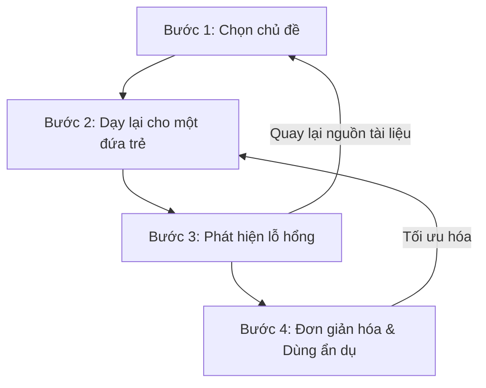
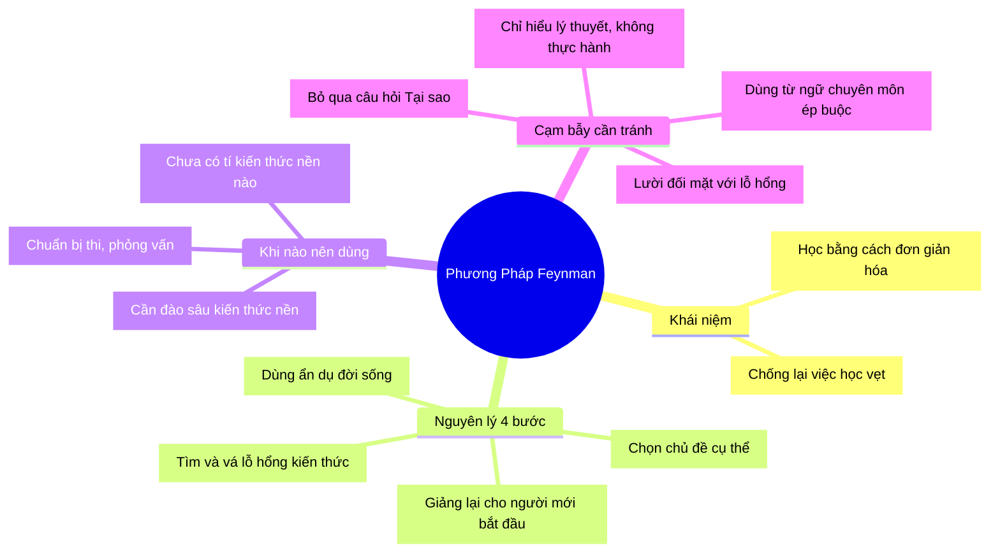

Đã bao giờ bạn gặp tình trạng: Đọc xong một cuốn sách thấy rất hay, nghe giảng trên lớp gật gù tâm đắc, nhưng vài ngày sau ai hỏi tới thì lại ú ớ không thể giải thích rõ ràng? 

Đó là dấu hiệu điển hình của việc **học vẹt** (ảo tưởng sức mạnh) và tiếp thu kiến thức một cách thụ động. Bài viết này sẽ giúp bạn giải quyết triệt để vấn đề đó bằng **Phương pháp Feynman** — bí quyết học tập chủ động từ nhà vật lý học đoạt giải Nobel, Richard Feynman.

<!--truncate-->

## 1. Ẩn dụ: Chiếc tủ quần áo lộn xộn 👕

Hãy tưởng tượng bộ não của bạn giống như một chiếc tủ quần áo. Mỗi khi bạn đọc sách hay nghe giảng, bạn đang ném thêm một món đồ vào tủ một cách vội vã. 

Trông thì có vẻ tủ ngày càng đầy (có vẻ như bạn đang học được nhiều), nhưng khi bạn thực sự cần tìm một chiếc áo phông cụ thể (khi đi thi, phỏng vấn, hoặc làm việc), bạn phải bới tung cả tủ lên mà vẫn không tìm thấy. 

💡 **Phương pháp Feynman** không phải là cách nhét thêm đồ vào tủ. Nó là **quy trình dọn tủ**: Bạn lôi hết đồ ra, gấp gọn gàng, chia loại (áo sơ mi, quần dài, tất), và dán nhãn cho từng ngăn. Khi cần, bạn chỉ mất đúng 1 giây để lấy đúng thứ mình muốn. Đó chính là bản chất của việc "hiểu sâu" (Deep Understanding).

## 2. Deep Dive: 4 bước cốt lõi của phương pháp Feynman 🔬

Cách tiếp cận của Feynman xoay quanh một nguyên lý duy nhất: **"Nếu bạn không thể giải thích một điều gì đó một cách đơn giản, nghĩa là bạn chưa thực sự hiểu nó."**

### Bước 1: Chọn chủ đề
Lấy một tờ giấy trắng và viết tên chủ đề bạn muốn học lên trên cùng. Đừng chỉ chọn những khái niệm chung chung, hãy đi vào cụ thể. Ví dụ: thay vì "Ngôn ngữ lập trình", hãy chọn "Vòng đời của React Component".

### Bước 2: Dạy lại cho một đứa trẻ (Đơn giản hóa)
Bên dưới tiêu đề, hãy viết ra mọi thứ bạn biết về chủ đề đó. Nhưng có một điều kiện: **Phải giải thích như thể bạn đang dạy lại cho một sinh viên năm nhất hoặc một đứa trẻ 12 tuổi.**

Loại bỏ hoàn toàn các thuật ngữ chuyên môn phức tạp (jargon). Nếu bắt buộc phải dùng, hãy định nghĩa nó ngay lập tức. Quá trình này ép bạn phải lấy kiến thức ra khỏi đầu (active recall) và tự xâu chuỗi chúng lại với nhau.

### Bước 3: Phát hiện lỗ hổng
Khi đang viết giải thích, bạn sẽ khựng lại ở một số điểm. Bạn nhận ra: *"Chết mồ, chỗ này mình quên mất tại sao nó lại hoạt động như vậy rồi"* hoặc *"Đoạn này mình chỉ biết nói là nó thế, không biết nguyên lý căn bản"*. 

Chúc mừng! Bạn vượt qua được "ảo tưởng hiểu biết". Hãy đánh dấu những lỗ hổng này lại, mở sách, đọc tài liệu gốc và lấp đầy chúng.

### Bước 4: Đơn giản hóa và dùng ẩn dụ
Sau khi đã vá các lỗ hổng, hãy xem lại toàn bộ bài giải thích của bạn. Bạn có thể làm nó ngắn gọn hơn không? Bạn có thể so sánh nó với thứ gì quen thuộc trong đời sống không? (Giống như câu chuyện chiếc tủ quần áo ở đầu bài). Càng dùng nhiều ẩn dụ, bộ não càng tạo ra nhiều liên kết nơ-ron chắc chắn.

## 3. Thực hành (Practice) 💻

Giả sử bạn cần hiểu khái niệm **API** (Application Programming Interface) trong lập trình.

❌ **Cách học thụ động:** Ghi nhớ định nghĩa "API là giao diện lập trình ứng dụng, cho phép các phần mềm giao tiếp với nhau bằng cách gửi request và nhận response qua HTTP." (Rất khô khan và máy móc).

✅ **Áp dụng Feynman:**
- **Giải thích đơn giản:** API là một người trung gian đi lấy thông tin giúp bạn.
- **Dùng ẩn dụ:** Tưởng tượng bạn vào nhà hàng (Client). Bạn xem menu và gọi món, nhưng bạn không thể tự đi vào bếp (Server/Database) để tự nấu. Bếp cũng không biết bạn muốn ăn gì.
- **Kết nối:** Lúc này, bạn cần người bồi bàn (API). Người bồi bàn sẽ ghi order của bạn (Request), mang vào bếp, sau đó lấy thức ăn đã chín (Response) mang ra bàn cho bạn. Bạn không cần biết trong bếp nấu như thế nào, chỉ cần đưa đúng yêu cầu cho bồi bàn.

## 4. Những cạm bẫy thường gặp (Pitfalls) ⚠️

Dù rất tuyệt vời, Feynman Technique vẫn có những cạm bẫy mà người mới học hay mắc phải:

- ❌ **Ảo tưởng sức mạnh (The Illusion of Competence):** Nghĩ rằng mình đã hiểu nên chỉ giải thích rất hời hợt, qua loa cho xong bước 2. Hãy ép bản thân hỏi *"Tại sao?"* liên tục ở mỗi bước giải thích.
- ❌ **Áp dụng sai thời điểm:** Dùng Feynman khi bạn **chưa có bất kỳ một chút kiến thức nền tảng nào** về chủ đề đó. Phương pháp này dùng để *đào sâu* và *sắp xếp* kiến thức, chứ không phải để khai phá từ con số không. Bạn vẫn cần đọc tài liệu và nghe giảng trước tiên!
- ❌ **Thay thế hoàn toàn cho thực hành:** Feynman giúp bạn hiểu *Concept* (Khái niệm), nhưng không thể thay thế việc thao tác thực tế. Bạn hiểu nguyên lý API, nhưng bạn vẫn phải bật máy tính lên và code thì mới thành thạo được.

## 5. Tổng kết (MECE Mindmap) 🧩

Dưới đây là Mindmap tổng kết toàn bộ phương pháp Feynman để bạn lưu lại ôn tập:

**🚀 Action Item cho bạn:** Ngay bây giờ, hãy đóng bài viết này lại, lấy một tờ giấy trắng và thử dùng phương pháp Feynman để giải thích lại chính... Phương pháp Feynman cho một người bạn của bạn xem nhé!

---
> *Made by Anh Tu - Share to be share*
