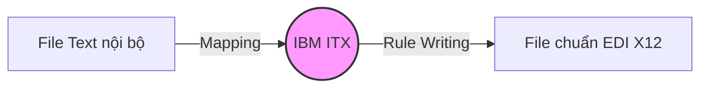
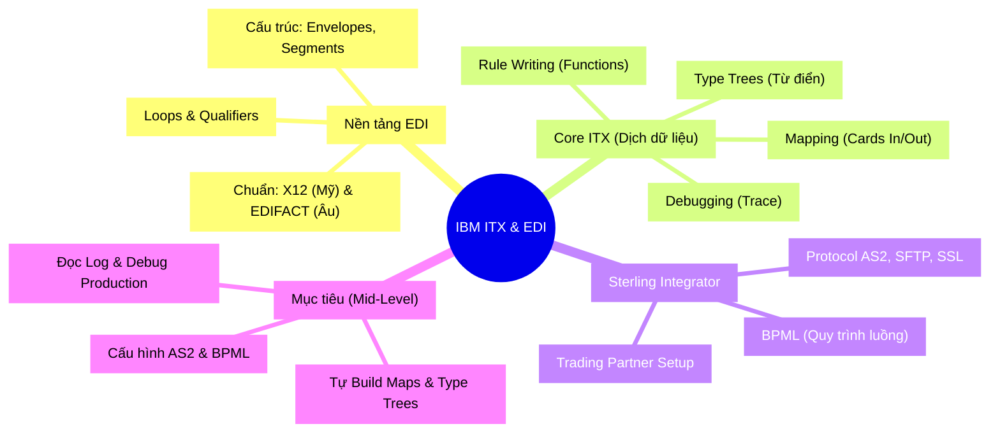

Bạn từng thắc mắc: Khi Tiki đặt hàng từ nhà cung cấp Unilever với số lượng hàng vạn sản phẩm, họ làm thế nào? Chắc chắn không có ai ngồi gửi email hay gõ tay từng dòng Excel cả. 

Các doanh nghiệp "nói chuyện" với nhau tự động qua những định dạng dữ liệu khổng lồ. Tuy nhiên, vấn đề là **Mỗi công ty lại dùng một "ngôn ngữ" (phần mềm) khác nhau**. 

Đó là lúc chúng ta cần đến **EDI** (Tiêu chuẩn ngôn ngữ chung) và **IBM ITX** (Người phiên dịch dữ liệu). Bài viết này sẽ vạch ra lộ trình chi tiết để bạn làm chủ bộ công cụ này, đáp ứng hoàn hảo các Job Description (JD) trên thị trường.

<!-- truncate -->

---

## 🎣 Ẩn dụ cốt lõi: Hệ thống Bưu điện Dữ liệu

Hãy tưởng tượng bạn (Công ty A) cần viết một bức thư quan trọng cho đối tác ở nước ngoài (Công ty B). 

1. **Chuẩn dữ liệu (EDI X12 / EDIFACT):** Giống như ngữ pháp Tiếng Anh thương mại. Thay vì viết lộn xộn, bạn phải viết đúng biểu mẫu thư quốc tế để bên kia đọc hiểu.
2. **IBM ITX (Dịch thuật):** Bạn chỉ biết Tiếng Việt, đối tác chỉ hiểu Tiếng Anh. Hệ thống ITX chính là **"Người phiên dịch"**, cầm bản nháp Tiếng Việt của bạn ra và viết lại thành Tiếng Anh chuẩn.
3. **Sterling Integrator - SI (Bưu điện & Shipper):** Viết thư xong chưa đủ, bạn cần đem ra bưu điện. SI sẽ nhận thư, dán tem, bỏ vào hòm, chọn phương tiện (máy bay hay tàu thủy) và đảm bảo thư đến đúng tay người nhận an toàn.

Bây giờ, hãy đi sâu vào từng phần của hệ thống này nhé!

---

## 1. Nền tảng EDI & Nghiệp vụ Logistics (Cần học đầu tiên!)

⚠️ **Lời khuyên xương máu:** *Đừng bao giờ cắm đầu vào code tool ngay lập tức.* Nếu không hiểu cấu trúc dữ liệu, bạn sẽ không biết mình đang "phiên dịch" cái gì. Nắm chắc EDI là kỹ năng "Non-Negotiable" (bắt buộc phải có).

### Hai chuẩn "ngoại ngữ" phổ biến
- **ANSI X12:** Tiêu chuẩn phổ biến nhất ở Bắc Mỹ (Mỹ, Canada). Ví dụ: Đơn mua hàng gọi là chuẩn `850`, hóa đơn gọi là `810`.
- **EDIFACT:** Chuẩn do Liên Hợp Quốc phát triển, dùng phổ biến ở Châu Âu và toàn cầu. Tên file thường là chữ, ví dụ Đơn hàng là `ORDERS`.

### Mổ xẻ bức thư EDI (Cấu trúc file)

Một file EDI không phải là một file text bình thường, nó có cấu trúc các lớp như một củ hành tây:

- **Envelopes (Lớp phong bì - ISA/GS/ST):** Chứa thông tin "Ai gửi cho ai?". `ISA` là vỏ ngoài cùng, `GS` bọc các loại chứng từ giống nhau, `ST` bọc một chứng từ cụ thể.
- **Segments (Phân đoạn):** Là từng dòng thông tin (VD: Dòng chỉ chứa địa chỉ, dòng chỉ chứa số lượng).
- **Loops (Vòng lặp):** Khi bạn mua 10 sản phẩm, cấu trúc sẽ tự động lặp lại 10 lần dòng ghi chi tiết hàng hóa. 
- **Qualifiers (Biến điều kiện):** Một mẹo cực hay của EDI. Thay vì ghi "Mã số thuế", họ ghi thẻ Qualifier="TX". Thay vì ghi "Số điện thoại", ghi Qualifier="TE". Việc đọc các biến này giúp phần mềm biết dòng số tiếp theo có ý nghĩa gì.

---

## 2. IBM ITX: Trang bị cho "Người Phiên Dịch" (Kỹ năng lõi)

Đây là nơi bạn sẽ dành 80% thời gian (Hands-on skills) với công cụ Design Studio của ITX.

### Type Trees (Cây dữ liệu - Bộ Từ điển)
Khi gặp một ngôn ngữ lạ, điều đầu tiên cần có là từ điển. Type Trees chính là bộ khung giúp ITX "nhận diện" được file đầu vào là kiểu gì (X12, XML, Database hay File CSV Excel thông thường).

### Mapping (Tạo bản đồ chuyển đổi)
Nhiệm vụ của bạn là kéo-thả và quy định: *"Lấy giá trị Cột A của file Input (đầu vào), nhét vào Trường B của file Output (đầu ra)"*. ITX sử dụng cơ chế Input Cards và Output Cards cực trực quan.

### Rule Writing (Viết quy tắc)
Đôi khi ngôn ngữ đầu vào không khớp hoàn toàn 1:1 với đầu ra. Bạn phải viết các logic (Quy tắc):
- **String Manipulation:** Cắt bỏ khoảng trắng thừa, ghép chuỗi.
- **Date Formatting:** Chuyển `DD/MM/YYYY` thành `YYYYMMDD`.
- **If/Else Logic:** *Nếu sản phẩm là "Rượu" thì thêm mã thuế tiêu thụ đặc biệt.*

💡 **Tip:** ITX hỗ trợ hàng loạt hàm có sẵn cực kỳ mạnh mẽ như `LOOKUP()`, `SEARCHUP()`.

### Debugging (Sửa lỗi với Trace)
Khi file biên dịch ra bị lỗi (bên kia không đọc được), bạn phải dùng chức năng **Trace**. Nó giống như xem lại "băng ghi hình chậm" để biết quá trình chế bản bị tắc hoặc gãy ở quy tắc (Rule) nào.

---

## 3. Sterling Integrator (SI): Kỹ năng điều phối luồng Bưu điện

Nếu ITX là khâu Dịch thuật, SI là cơ sở hạ tầng mạng lưới điều phối luồng dữ liệu.

### BPML (Business Process Modeling Language) 
Bạn sẽ phải thiết lập quy trình làm việc giống như vẽ sơ đồ bằng ngôn ngữ BPML (thực chất là cấu trúc XML lớn) hoặc qua giao diện đồ họa.
**Ví dụ luồng:**
> 📥 Nhận file -> 🔍 Kiểm tra bảo mật -> 🔄 Gọi module ITX để dịch -> 💾 Lưu Database -> 📤 Phản hồi thành công.

### Communication Protocols & Trading Partner Setup
Khi bưu điện mang thư đi giao, họ cần thống nhất cách đi:
- **AS2 (Applicability Statement 2):** Giao thức kết nối bảo mật nhất qua Internet, dùng mã hóa (Encryption) và chữ ký số (Digital Certificates).
- **Trading Partner:** Cấu hình thông tin của công ty đối tác (ID, chứng chỉ SSL, thư mục nhận file) vào hệ thống SI để "hai bên kết bạn" và bắt đầu giao tiếp tự động.

---

## 4. Mục tiêu cày ải (Action Items)

Dựa trên yêu cầu thị trường, để tự tin đạt **Mid-Level** (độc lập tác chiến), bạn cần nhắm tới các cột mốc sau:

- [ ] Tự xây dựng (build) được các bản đồ (Maps) hoàn chỉnh từ con số Không.
- [ ] Tự thiết kế và tinh chỉnh cấu trúc Type Trees.
- [ ] Tự thiết kế luồng Business Process (BPML) cơ bản đi từ Inbound tới Outbound.
- [ ] Tự cấu hình được một cổng kết nối AS2 với đối tác test.
- [ ] ⚠️ Đọc log và Debug các lỗi cấu trúc hóc búa (Kỹ năng cứu cánh trong quá trình Production Support).

---

## 🧩 Tổng hợp kiến thức (MECE Mindmap)

Dưới đây là sơ đồ tư duy tóm lược toàn bộ Lộ trình học IBM ITX & EDI cho bạn:

> **Tóm lại**, hệ thống này nghe có vẻ cũ kỹ (Legacy) nhưng nó đang âm thầm gánh vác hàng tỷ USD giao dịch toàn cầu mỗi ngày. Hãy học cách "Dữ liệu nói chuyện" và mức lương của bạn cũng sẽ trở nên rất biết nói đấy!

---
*Made by Anh Tu - Share to be share*
