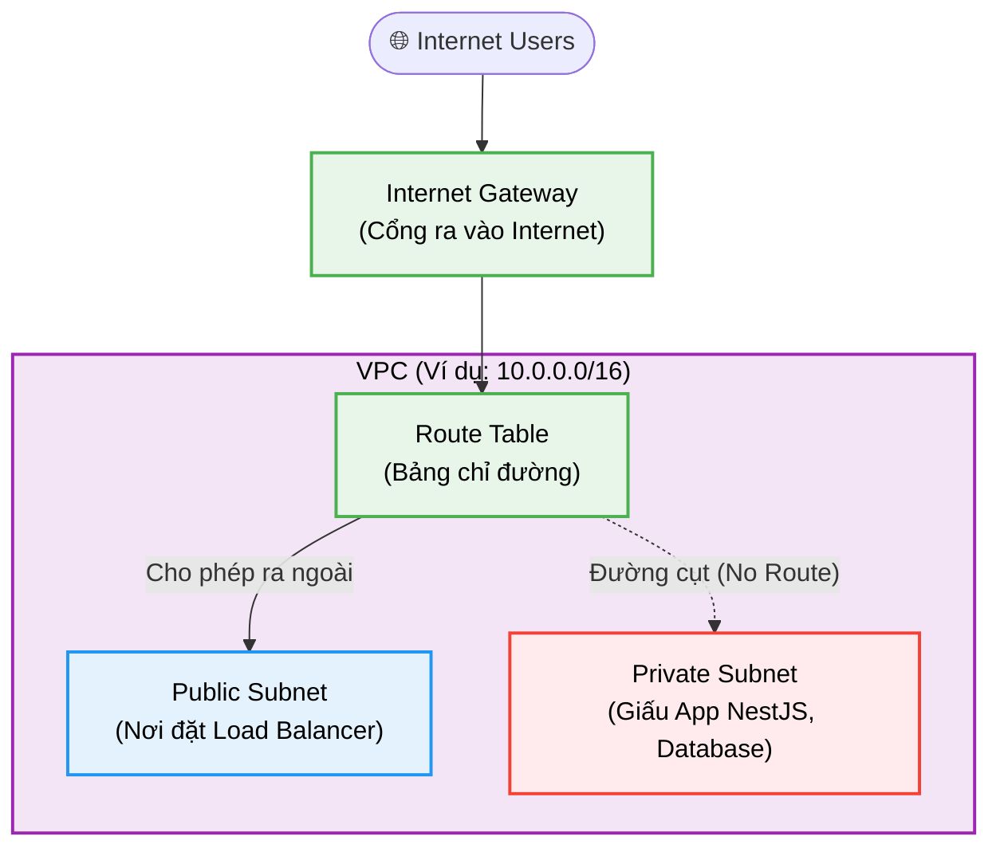
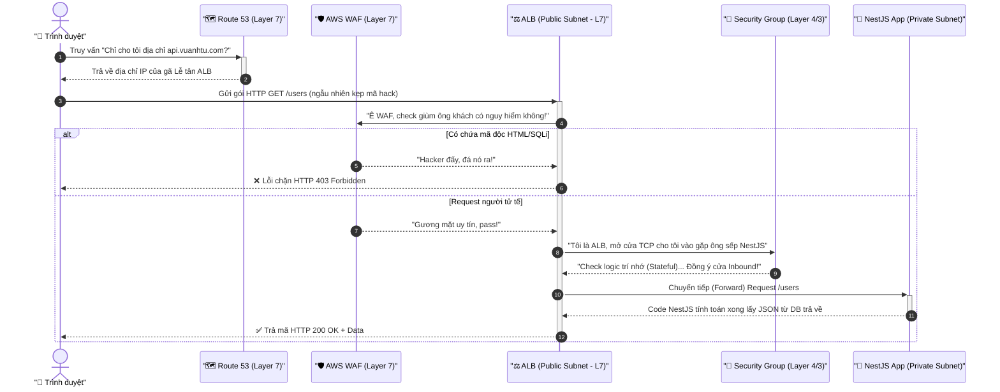
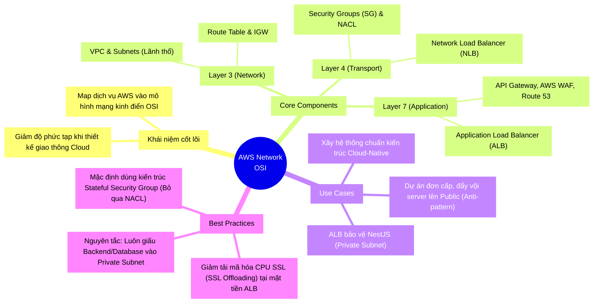

# AWS Network & OSI Model: Bản Đồ "Nhập Ngũ" Cloud Cho Lập Trình Viên

<!--truncate-->

## 🎣 Hook: Khi Coder bị ép làm "Thợ Ống Nước" Cloud

Bạn đang code Next.js, NestJS ngon lành, API trả về 200 xanh mướt, life is good! Chợt một chiều mưa, sếp đập tay lên vai: *"Em ơi, quăng cái app này lên AWS cho anh. Tiện tay setup VPC, Subnets, gắn cái ALB và WAF bảo mật xíu nhé!"*

Mở AWS Console lên và... BOOM! 💥 Một rừng thuật ngữ networking ùa ra cắn xé bạn. Đừng hoảng! Nếu bạn đã từng học môn "Mạng Máy Tính" ở đại học và còn nhớ mang máng về **Mô hình OSI (Open Systems Interconnection)**, bạn sẽ thấy AWS Network thực ra chỉ là trò "lắp lego" nâng cao mà thôi.

Hôm nay, hãy rũ bỏ chiếc áo Coder, khoác thêm áo Cloud Architect để cùng "bình dân học vụ" hệ thống mạng AWS thông qua lăng kính OSI quen thuộc nhé!

---

## 🔄 Analogy: Hạ Tầng Giao Thông Của Thành Phố Thông Minh

Trước khi đắm chìm vào ma trận thuật ngữ kỹ thuật, hãy tưởng tượng AWS Network như **hạ tầng giao thông của một thành phố thông minh**:

- **Mảnh đất Thành Phố (VPC):** Là lãnh địa quy hoạch riêng của bạn trên không gian mạng, bao quanh bởi bức tường rào vô hình.
- **Layer 3 - Cơ Quan Quy Hoạch Mạng Lưới (Network Layer):** Quản lý sổ đỏ (quy hoạch IP), vẽ đường rải nhựa, cắm biển báo rẽ trái quẹo phải (Route Table).
- **Layer 4 - Trạm Điều Phối Vòng Ngoài (Transport Layer):** Cảnh sát giao thông chia làn đường siêu tốc (xe tải đi làn này, xe máy đi làn kia). Cảnh sát vòng này không cần biết xe chở hàng gì bên trong, chỉ quan tâm phân luồng tốc độ cao (TCP/UDP).
- **Layer 7 - Lễ Tân Tòa Nhà Thông Minh (Application Layer):** Bảo vệ tòa nhà sờ tận tay giấy tờ. "Anh đi gặp tầng nào?" (đọc URL Path), "Trong cặp có súng không?" (WAF). Lễ tân am hiểu đường đi nước bước để điều phối lượng khách tới sảnh.

Giờ thì, hãy cùng đi phân tích từng Layer xem AWS bán những món đồ nghề gì nhé! 🚀

---

## 🔬 Deep Dive & Visual: Bóc Tách Theo Layer

### 🏗️ Layer 3: Network Layer - Quyền Lực Phân Lô Bán Nền

Trong OSI, Layer 3 quản lý địa chỉ IP và định tuyến (Routing). Trên AWS, "sân nhà" của Layer 3 chính là **VPC (Virtual Private Cloud)**.

#### 1. VPC và Subnets (Khu Phố & Phường Xã)
- **VPC**: Mảnh đất (CIDR block quy hoạch IP) trên Cloud của riêng bạn. Mặc định nó cách ly hoàn toàn với bên ngoài. 
- **Subnet (Mạng con)**: Bạn phải băm nhỏ VPC thành nhiều cụm dân cư. Ta có **Public Subnet** (mặt tiền phố lớn - khách đến thoải mái) và **Private Subnet** (Nội khu kín cổng cao tường - chỉ nhận người nhà).

#### 2. Cánh Cổng & Bản Đồ (IGW và Route Tables)
- **Internet Gateway (IGW):** Cổng siêu tốc duy nhất thông từ lãnh địa VPC của bạn đi ra biển lớn Internet.
- **Route Table (Bảng định tuyến):** Bản đồ chỉ dẫn đường đi. Nếu một Subnet có Route Table cắm ghép với IGW, nó chính thức trở thành "Public Subnet". Đi đường cụt? Nó là "Private Subnet".

> 💡 **Best Practice:** Đừng bao giờ quăng cái app web của bạn thẳng ra Public Subnet bắt gió nằm sương! Hãy giấu kỹ vào Private Subnet, và chỉ cho phép "Lễ tân" (Load Balancer) ở Public Subnet chuyển lời vào thôi.

### 🛡️ Layer 3/4 Security: Lính Canh Cước Bộ (SG) vs (NACL)

AWS cung cấp 2 lớp lá chắn hoạt động ở Layer 3 và Layer 4 (kiểm tra rào IP và Port), nhưng cách ứng xử cực kỳ khác biệt:

1. **Security Group (SG - Vòng trong):** Bảo vệ ở ngay cửa nhà (Instance ECS/EC2).
   - **Đặc tính:** Có trí nhớ (*Stateful*). Nếu nó lỡ đồng ý cho ông A bước vào nhà (Inbound rule), thì khi ông A ăn bánh uống nước xong đi ra ngoài (Outbound), nó không thèm kiểm tra ID lại nữa.
2. **Network ACL (NACL - Vòng ngoài):** Canh gác ngay đầu ngõ Subnet (Subnet-level).
   - **Đặc tính:** Cá vàng mất trí (*Stateless*). Thanh niên canh ngõ làm việc rập khuôn: ông A xin vào ngõ? Khám xét! Ông A chui ra khỏi ngõ? Khám xét! (Kiểm tra chặn chẽ cả Inbound và Outbound).

> ⚠️ **Nỗi đau đánh đổi (Trade-off):** Tổ hợp càng nhiều Security Group càng dễ chẩn đoán và quản trị rủi ro. Tuy NACL bảo vệ sâu, nhưng dev web thông thường rất ít đụng vào nó. Trừ khi là ngân hàng, các công ty thường dùng NACL chuẩn "Accept All" và đẩy 100% trách nhiệm phòng ngự cho Security Group ở từng app cụ thể!

---

### ⚡ Layer 4: Transport Layer - Trạm Điều Phối Vận Tốc Ánh Sáng

Layer 4 quản lý giao thức vận chuyển: TCP và UDP (bỏ qua nội dung HTTP Body/Headers).

Đại diện tiêu biểu trên AWS: **Network Load Balancer (NLB)**.

- **Nhiệm vụ:** Cỗ máy chia bài cân tải cực đoan với tốc độ tính bằng phần nghìn giây (siêu độ trễ - Ultra Low Latency).
- **Đặc tính:** NLB hoàn toàn mù tịt việc bạn đang truyền JSON hay HTML. Nó chỉ thấy: "Gói TCP Port 80 bay tới hả? Tăng tốc sang server X ngay!". "Thấy UDP Port 443? Đẩy dạt sang máy chủ Y".

---

### 🎩 Layer 7: Application Layer - Mảnh Đất Dành Cho Dev Cứng

Đây là sân nhà đích thực của Developer! Layer 7 là nơi phần cứng thấu hiểu phần mềm. Nó hiểu vạch trần HTTP Method (GET, POST), Headers, URL queries, Cookies một cách tinh tường.

#### 1. Application Load Balancer (ALB) - Lễ Tân 5 Sao
Là ngôi sao sáng của kiến trúc Microservices.
- **Path-based routing:** Lễ tân thông minh chia tuyến. Ai gõ `/api/users`, lễ tân xách đi cửa A gõ đầu NestJS. Ai gọi `/blog`, đá thẳng qua cửa sân sau gặp Next.js SSR.
- **Cởi áo khoác SSL (SSL Termination):** Đích thân ALB ra ứng tiếp, chìa ra Chứng chỉ SSL (HTTPS) cho user, sau đó gỡ lớp mã hóa cồng kềnh để nội bộ Backend chỉ cần nói chuyện bằng HTTP (port 80) bớt gánh nặng CPU server!

#### 2. API Gateway - Người Kiểm Soát Vé Rạp Phim
Phiên bản nâng cấp ma thuật của ALB nếu bạn chơi hệ **Serverless (Lambda)**. Ngoài điều hướng, anh chàng có quyền cấm spam (Throttling/Rate Limit), tự chọc Cognito/Auth0 móc JWT xé vé, và "chế biến" payload JSON trước khi thẩy cho Database.

#### 3. AWS WAF (Web Application Firewall) - Đặc Nhiệm Bắt Hack
Chuyên trị bọn phá hoại ở chuỗi Query hay Request Body. Gắn WAF vào ngay chiếc ALB đang đứng ngoài nắng, nó sẽ lăm le lọc XSS, SQL Injection (SQLi) từ những kẻ ác ý. Định gõ `DROP TABLE` bay vào server hả? Mã `403 Forbidden` đập thẳng vào mặt!

#### 4. Amazon Route 53 (Hệ thống DNS)
Cuốn danh bạ Internet toàn cầu siêu xịn. Nhiệm vụ biến dãy số IP xấu xí, vô hồn thành URL xịn mịn `vuanhtu.com` thân thương để các bà mẹ ở Cà Mau cũng có thể nhập dễ dàng.

---

## 🚀 Usecase: Khách Xông Đất App NestJS

Hãy cùng xâu chuỗi mọi lý thuyết kỹ thuật lại để xem điều gì lướt qua khi trình duyệt gõ nhẹ thanh tìm kiếm vào ứng dụng của bạn:

Nhờ thiết kế chốt chặn Layer 7 cộp mác Public (WAF + ALB), lõi server NestJS yêu dấu nằm hoàn toàn che giấu trong bóng tối của tầng Private Subnet, bất khả xâm phạm trước mọi đợt tấn công bạo lực mạng!

---

## 🧩 MECE Mindmap: Trạm Dừng Nạp Kiến Thức

Nhìn lại bức tranh toàn diện 4 nhánh theo phương pháp MECE để không đánh rơi kiến thức OSI Mapping bạn vừa học được nhé:

## 🏁 Lời Khuyên 

Sự khác biệt giữa Coder chạy Server-less mù quáng và Cloud Engineer nằm ở kiến thức Network căn bản. Nếu bạn nhìn AWS bằng đôi mắt "Network OSI": việc chia IP subnet, mở khoá cổng SG, hay rẽ nhánh ALB... thì mớ hỗn loạn AWS khổng lồ kia bỗng chốc rành mạch, có kịch bản và tuân theo mọi quy luật thông thường.

Hãy thử xắn tay áo, thả 1 quả VPC trên Cloud và cảm nhận sức mạnh quy hoạch của kiến trúc sư lần nữa xem sao nha! 😎

---

*Made by Anh Tu - Share to be share*
