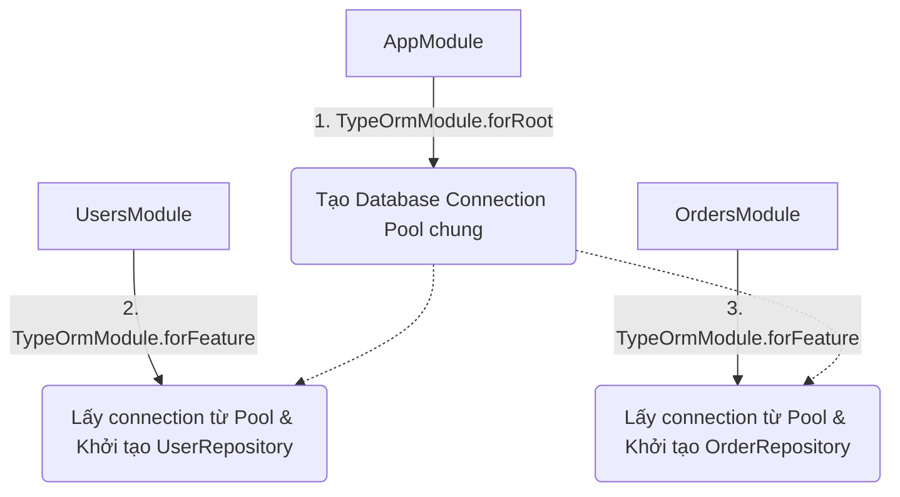
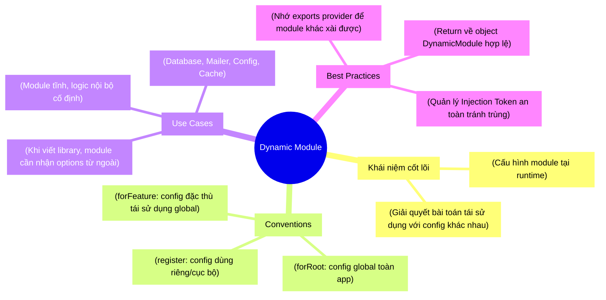

# [NestJS] Hiểu Sâu Về Dynamic Modules: Phân biệt `register`, `forRoot` và `forFeature`

Bạn đã bao giờ thắc mắc tại sao khi sử dụng TypeORM trong NestJS, chúng ta lại phải gọi `TypeOrmModule.forRoot(...)` ở `AppModule`, sau đó lại gọi `TypeOrmModule.forFeature([User])` ở `UserModule` chưa? Vì sao không import thẳng là xong như các module thông thường? 

Đó chính là lúc khái niệm **Dynamic Module** (Module Động) xuất hiện. Hôm nay, chúng ta sẽ cùng bóc tách kỹ thuật này một cách đơn giản nhất nhé!

<!-- truncate -->

---

## 1. Ẩn dụ: Mua Macbook vs Build PC Custom 💻

Để hiểu sự khác biệt giữa **Static Module** (Module tĩnh - cách import thông thường) và **Dynamic Module**, hãy tưởng tượng bạn đi mua máy tính:

- **Static Module (Mua Macbook):** Bạn ra store, mua một chiếc Macbook đã đóng gói sẵn cấu hình. Cứ mở hộp là dùng, không thể hoặc rất khó thay đổi phần cứng bên trong (RAM, Ổ cứng hàn chết). Trong code, đây là cách bạn `imports: [UserModule]`. Mọi config bên trong `UserModule` là cố định.
- **Dynamic Module (Build PC Custom):** Bạn ra tiệm linh kiện, chọn một vỏ case (đại diện cho Module). Sau đó bạn đưa cho nhân viên danh sách linh kiện yêu cầu: "Lắp cho anh con card RTX 4090, 64GB RAM". Nhân viên sẽ dựa vào **yêu cầu (configuration)** của bạn để ráp thành một cỗ máy hoàn chỉnh mang về. Trong code, đây là lúc bạn gọi `ConfigModule.register({ folder: './config' })`. 

> **💡 Tóm lại:** Dynamic Module cho phép chúng ta thay đổi hành vi, cấu hình của một module **NGAY TẠI THỜI ĐIỂM IMPORT** nó, thay vì code cứng từ trước.

---

## 2. Deep Dive: 3 Cấp độ Customization 🔬

Trong thế giới của NestJS, quy chuẩn thường sử dụng 3 static method để tạo Dynamic Module. Chúng không phải là từ khóa bắt buộc của framework, nhưng là **Convention (Quy ước)** mà toàn cộng đồng tuân theo.

### 2.1. `register()` - Cấu hình dùng riêng

Sử dụng khi bạn muốn cung cấp một cấu hình cụ thể cho module đó, và cấu hình này chỉ phục vụ cho module đang gọi (caller module).

**Ví dụ:** Bạn có một `HttpModule` và muốn gọi API tới các service khác nhau với timeout khác nhau.

```typescript
// filename: src/orders/orders.module.ts
import { Module } from '@nestjs/common';
import { HttpModule } from '@nestjs/axios';

@Module({
  imports: [
    // Mỗi lần gọi register sẽ tạo ra một instance HttpService riêng biệt
    HttpModule.register({
      timeout: 5000,
      baseURL: 'https://payment-gateway.example.com',
    }),
  ],
})
export class OrdersModule {}
```

### 2.2. `forRoot()` - Cấu hình Global (Khởi tạo nền tảng)

Được sử dụng để **cấu hình một lần duy nhất** cho toàn bộ project (thường gọi ở `AppModule`). Mục đích là khởi tạo các kết nối nặng, các biến môi trường chung (Database Connection, Redis, Config Variables).

```typescript
// filename: src/app.module.ts
import { Module } from '@nestjs/common';
import { TypeOrmModule } from '@nestjs/typeorm';

@Module({
  imports: [
    // Chỉ gọi forRoot 1 lần ở gốc ứng dụng để tạo connection pool
    TypeOrmModule.forRoot({
      type: 'postgres',
      host: 'localhost',
      port: 5432,
      username: 'admin',
      password: 'password',
      database: 'my_db',
      autoLoadEntities: true,
      synchronize: true,
    }),
  ],
})
export class AppModule {}
```

### 2.3. `forFeature()` - Cấu hình đặc thù (Sử dụng nền tảng)

Được gọi ở các module con (Feature Modules). Hàm này không tạo lại kết nối từ đầu, mà nó **tái sử dụng cấu hình từ `forRoot()`** và bổ sung thêm các tùy chỉnh đặc thù cho chức năng hiện tại.

```typescript
// filename: src/users/users.module.ts
import { Module } from '@nestjs/common';
import { TypeOrmModule } from '@nestjs/typeorm';
import { User } from './entities/user.entity';

@Module({
  imports: [
    // Không cần cấu hình lại kết nối database
    // Chỉ cần báo cho TypeORM biết: "Inject cho tôi repository của User"
    TypeOrmModule.forFeature([User]),
  ],
})
export class UsersModule {}
```

### Tóm tắt luồng hoạt động bằng Mermaid:



---

## 3. Thực hành: Tự build một Dynamic Module đơn giản 🛠️

Hãy giả sử chúng ta muốn tạo một `ApiLoggerModule`, nhận vào một tiền tố (prefix) cho các log message.

```typescript
// filename: src/logger/api-logger.module.ts
import { DynamicModule, Module } from '@nestjs/common';
import { ApiLoggerService } from './api-logger.service';

@Module({})
export class ApiLoggerModule {
  // Trả về kiểu DynamicModule
  static register(prefix: string): DynamicModule {
    return {
      module: ApiLoggerModule, // Bắt buộc: chỉ định tên class module
      providers: [
        {
          provide: 'LOGGER_PREFIX', // Dùng string token để inject
          useValue: prefix,         // Giá trị truyền từ ngoài vào
        },
        ApiLoggerService,
      ],
      exports: [ApiLoggerService],
    };
  }
}
```

Service bên trong sẽ nhận giá trị `prefix` đó:

```typescript
// filename: src/logger/api-logger.service.ts
import { Injectable, Inject } from '@nestjs/common';

@Injectable()
export class ApiLoggerService {
  constructor(
    @Inject('LOGGER_PREFIX') private readonly prefix: string
  ) {}

  log(message: string) {
    console.log(`[${this.prefix}] ${message}`);
  }
}
```

Và cách sử dụng ở module khác:

```typescript
// filename: src/users/users.module.ts
import { Module } from '@nestjs/common';
import { ApiLoggerModule } from '../logger/api-logger.module';

@Module({
  imports: [
    // Tùy biến prefix cho module User
    ApiLoggerModule.register('USER-SERVICE')
  ]
})
export class UsersModule {}
```

---

## 4. Pitfalls (Những lỗi thường gặp) ⚠️

❌ **1. Quên `exports` Service trong Dynamic Module**
Rất nhiều bạn return providers nhưng quên đưa nó vào mảng `exports` trong object trả về của phương thức `register/forRoot`. Nếu thiếu, các module khác sẽ không thể dùng được service đó bằng Dependency Injection.

❌ **2. Lạm dụng Dynamic Module**
Không phải cái gì cũng nên viết thành Dynamic Module. Nếu module của bạn không có cấu hình gì thay đổi từ bên ngoài, hãy cứ dùng Static Module (import bình thường) cho đơn giản và dễ bảo trì.

❌ **3. Bị Singleton Trap với config**
Cần nhớ toàn bộ module trong NestJS mặc định là Singleton. Khởi tạo `register` với một config, trừ khi bạn xử lý scope tỉ mỉ, nó sẽ ảnh hưởng đến việc chia sẻ instance giữa các module nếu lỡ tay dùng trùng token tên cấu hình. Luôn dùng các Token duy nhất bằng `Symbol` hoặc hằng số.

---

## 5. Tổng kết Mindmap (MECE) 🧩



---
*Made by Anh Tu - Share to be share*
