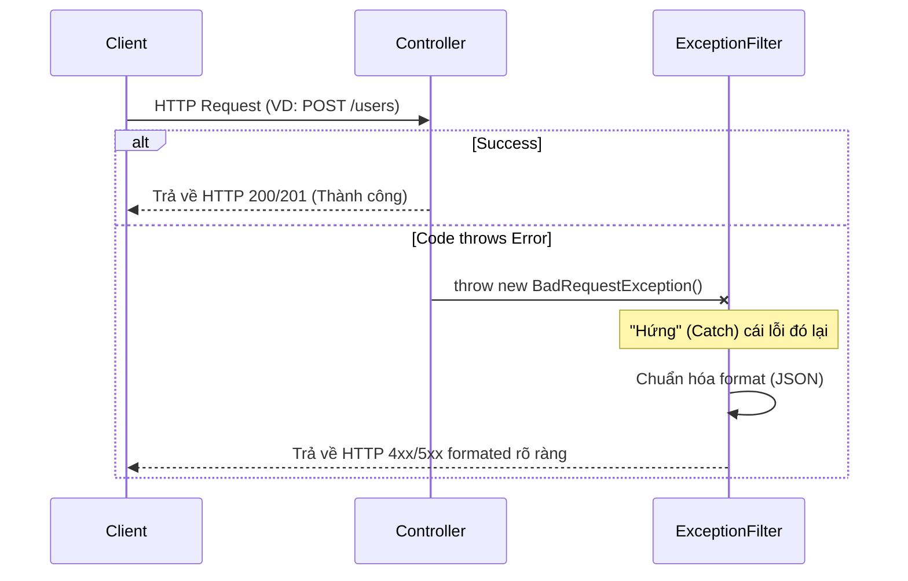
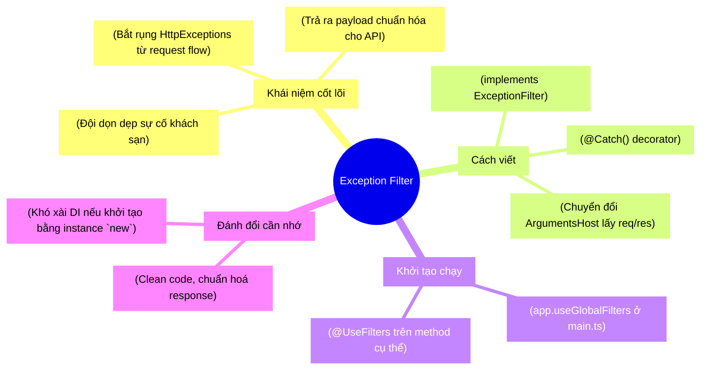

# [NestJS] Xử lý lỗi tập trung với Exception Filters: Chuẩn hóa API Response

Khi xây dựng API, việc xử lý lỗi (Error Handling) cực kỳ quan trọng. Nếu không cẩn thận, application của bạn có thể trả về một object lỗi "lõng chõng" rất khó đọc, hoặc tệ hơn là làm sập NodeJS process. Hôm nay, chúng ta sẽ cùng tìm hiểu cách NestJS giải quyết triệt để bài toán này thông qua khái niệm **Exception Filter**.

<!-- truncate -->

---

## 1. Ẩn dụ: Đội ngũ dọn dẹp và viết báo cáo sự cố 👷‍♂️

Hãy tưởng tượng bạn đang điều hành một khách sạn (Application):

- Đôi khi, một nhân viên phòng bếp vô tình làm đổ đồ ăn (Code throw ra lỗi `HttpException`). 
- **Cách truyền thống (Try/Catch ở mọi nơi):** Mỗi nhân viên phải tự chuẩn bị một cái chổi, tự dọn dẹp và tự viết giải trình gửi cho Giám đốc mỗi khi có lỗi (Phải bọc hàm bằng `try/catch` cồng kềnh trong mỗi Controller).
- **Cách dùng Exception Filter:** Khách sạn thuê hẳn một **"Đội ngũ dọn dẹp và xử lý sự cố chuyên nghiệp"**. Khi có bất cứ lỗi gì xảy ra, nhân viên chỉ việc hô to (throw lỗi). Đội ngũ này lập tức xuất hiện, dọn dẹp sạch sẽ và điền một biểu mẫu báo cáo cực kỳ chuẩn mực theo đúng format của khách sạn đưa cho khách hàng (App Mobile/Web).

> **💡 Tại sao (Why)?** \
> Exception Filter đứng ra "hứng" lỗi, và dịch nó ra ngôn ngữ thân thiện, định dạng *giống hệt* như chuẩn format của một request thành công (đều có cấu trúc rõ ràng: statusCode, message). Áp dụng cách này, chúng ta không cần dùng `try/catch` thủ công cồng kềnh trong mỗi hàm nữa.

---

## 2. Luồng hoạt động của Exception Filter 🔄

Dưới đây là sơ đồ luồng đi của một Request và cách Filter can thiệp khi có lỗi:



---

## 3. Cài đặt `GlobalExceptionFilter` trong thực tế 🛠️

Để tạo đội phản ứng nhanh này, chúng ta cần khai báo một class implements interface `ExceptionFilter`. Dưới đây là đoạn code chuẩn bạn có thể áp dụng ngay vào dự án:

```typescript
// filename: src/common/filters/global-exception.filter.ts
import { ExceptionFilter, Catch, ArgumentsHost, HttpException } from '@nestjs/common';
import { Request, Response } from 'express';

@Catch(HttpException)
export class GlobalExceptionFilter implements ExceptionFilter {
  catch(exception: HttpException, host: ArgumentsHost) {
    // 1. Chuyển đổi HTTP Context để lấy Request và Response của Express
    const ctx = host.switchToHttp();
    const response = ctx.getResponse<Response>();
    const request = ctx.getRequest<Request>();
    
    // 2. Lấy HTTP Status Code từ lỗi ném ra
    const status = exception.getStatus();

    // 3. Phân tích message lỗi tuỳ theo nó là chuỗi hay object
    const exceptionResponse = exception.getResponse();
    const message = typeof exceptionResponse === 'string'
      ? exceptionResponse
      : (exceptionResponse as any).message || exception.message;

    // 4. Định dạng lại chuẩn Response đầu ra
    response
      .status(status)
      .json({
        statusCode: status,
        // Nếu ValidationPipe trả về mảng các chuỗi lỗi, chúng ta nối chúng lại tạo thành 1 chuỗi dễ đọc
        message: Array.isArray(message) ? message.join('; ') : message,
        data: null, // Khi có lỗi đương nhiên data trống
        timestamp: new Date().toISOString(),
        path: request.url,
      });
  }
}
```

### Cách sử dụng ở quy mô toàn cục (Global)

Tại `main.ts`, bạn đăng ký filter này với ứng dụng:

```typescript
// filename: src/main.ts
import { NestFactory } from '@nestjs/core';
import { AppModule } from './app.module';
import { GlobalExceptionFilter } from './common/filters/global-exception.filter';

async function bootstrap() {
  const app = await NestFactory.create(AppModule);
  
  // Áp dụng Filter cho toàn bộ ứng dụng
  app.useGlobalFilters(new GlobalExceptionFilter());

  await app.listen(3000);
}
bootstrap();
```

---

## 4. Tư duy phản biện (Critical Thinking): Đánh đổi là gì? ⚖️

Mọi kĩ thuật hay Design Pattern đều mang trong mình những sự đánh đổi (Trade-off). Bạn cần cân nhắc kỹ trước khi sử dụng:

1. **Ưu điểm (Pros):**
   - **Code cực "sạch":** Controller giờ đây chỉ tập trung xử lý Happy Path (luồng thành công) và không bị làm rác bởi các khối khối lệnh try/catch lồng nhau tầng tầng lớp lớp.
   - **Giao tiếp đồng nhất:** Mọi đối tác Frontend (Mobile hay Web) luôn nhận được định dạng quen thuộc `{ statusCode, message, data, ... }` dù phía đầu Backend xảy ra lỗi gì đi nữa.

2. **Nhược điểm (Cons & Pitfalls):**
   - **Làm ẩn luồng thực thi:** Việc ném thẳng HTTP Exception ở tầng Data Access hoặc Service sẽ mang hơi hướng giống như lệnh `goto`, che giấu một phần flow code và làm ứng dụng khó debug luồng nghiệp vụ phức tạp.
   - **Giới hạn về Dependency Injection:** Khi bạn đăng ký filter bằng `app.useGlobalFilters(new GlobalExceptionFilter())`, bạn khởi tạo instance bằng toán tử `new` thông thường ngoài context của NestJS. Nghĩa là bạn **KHÔNG THỂ** Inject các Provider khác (VD: `LoggerService`, kết nối tới Database...) vào class `GlobalExceptionFilter` một cách tự động.
   - 👉 *Cách giải quyết Trade-off 2:* Thay vì dùng `app.useGlobalFilters`, bạn thiết lập filter trực tiếp tại mảng `providers` của `AppModule` thông qua token đặc biệt là `APP_FILTER`. Khi đó NestJS container sẽ lo toàn bộ quá trình Dependency Injection cho filter đó.

---

## 5. Tổng kết 🎯



Sử dụng **Exception Filter** đúng cách giúp bạn rũ bỏ được gánh nặng `try/catch` lặp lại dư thừa, tạo ra mã nguồn sạch sẽ và hệ sinh thái API thân thiện nhất cho các dev Frontend.

---

*Made by Anh Tu - Share to be share*
