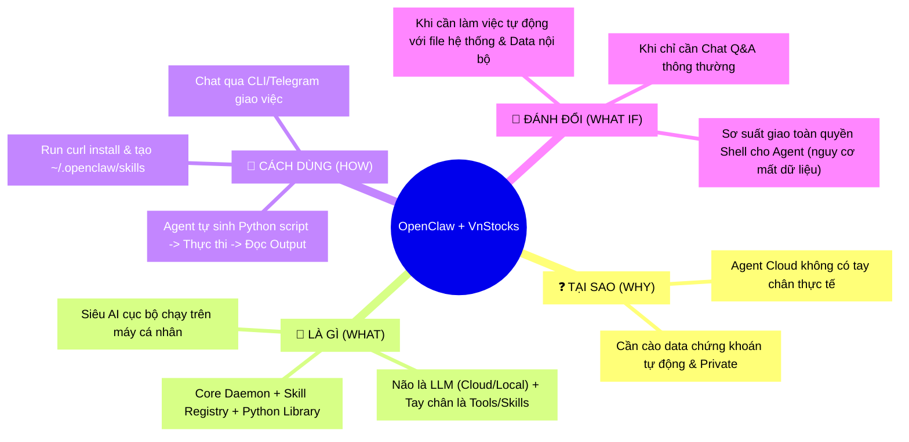

## 📋 Agenda

**Thời gian đọc ước tính:** ~10 phút

### Sau bài này, bạn sẽ:
- ✅ **Hiểu** bản chất AI Agent Local (OpenClaw) khác gì so với Chatbot thông thường.
- ✅ **Tự tay** cài đặt thành công OpenClaw chạy nền trên Mac Mini hoặc MacBook.
- ✅ **Áp dụng** việc tạo "Skill" (Kỹ năng) cho OpenClaw giúp tự động hóa việc lấy dữ liệu từ `vnstock`.
- ✅ **Phân biệt** được lúc nào nên dùng Local AI Agent, lúc nào nên dùng Cloud.

### Yêu cầu đầu vào (Prerequisites):
- 🔹 Có kiến thức cơ bản về Terminal (macOS).
- 🔹 Máy tính đã cài đặt môi trường Node.js (phiên bản `>= 22`).
- 🔹 Máy tính đã có sẵn Python `> 3.10`.

<!-- truncate -->

---

## ❓ Tại sao lại là OpenClaw chạy trên Mac Mini?

Bạn đã bao giờ ao ước có một thực tập sinh "chạy việc vặt", làm việc 24/7 mà không cần trả lương? Một người có thể:
- Liên tục mở file Excel trên máy bạn.
- Cứ đến 15:00 là tự động chạy script tải báo cáo dữ liệu chứng khoán mới nhất.
- Đọc kết quả và chủ động gửi Telegram báo hiệu "Sếp ơi SSI hôm nay thủng nền rồi!"

Nếu bạn dùng ChatGPT hay Claude bảng Web (Cloud), bạn sẽ vấp phải rào cản: **Chúng không có tay chân**. Chúng chỉ chat với bạn. Bạn phải tự copy code, tự mở file, tự chạy script.

Nhưng **OpenClaw** sinh ra để làm tay chân cho não bộ AI đó. Bằng cách thiết lập OpenClaw chạy ngầm (daemon) liên tục trên một chiếc máy tính Mac Mini (luôn cắm điện 24/24), bạn vừa giải quyết bài toán tự động hóa mạnh mẽ, vừa đảm bảo **dữ liệu tài chính cá nhân hoàn toàn bảo mật** không bị đưa lên các máy chủ trung gian không đáng tin cậy. 

---

## 📖 OpenClaw là gì? Mối liên hệ với VnStocks

**Hãy tưởng tượng** OpenClaw như một con Robot hút bụi thông minh. Thay vì quét nhà, nó có "kim bài miễn tử" (Permission) để chạy mọi phần mềm trên hệ điều hành macOS của bạn. Bộ não điều khiển con robot này vẫn là LLM (ví dụ GPT-4o, Claude 3.5 Sonnet, hoặc model chạy bằng Ollama cục bộ), nhưng đôi bàn tay thực thi phím chuột là của cấu trúc OpenClaw.

Điều thú vị nhất của OpenClaw nằm ở **Hệ thống Skill (kỹ năng)**. Mặc định nó không biết lấy dữ liệu chứng khoán ở đâu, nhưng chúng ta có thể "dạy" nó qua một tệp `.md`.

Kết hợp với **VnStock** — một thư viện Python mã nguồn mở xuất sắc chuyên trị việc cào dữ liệu từ thị trường chứng khoán Việt Nam — chúng ta sẽ có một tổ hợp sức mạnh: *Chỉ cần nhắn tin qua Telegram "Lấy cho tôi báo cáo tài chính SSI quý này", máy Mac Mini ở nhà sẽ tự động dùng vnstock tải dữ liệu và gửi lại cho bạn.*

---

## 🔨 Cài đặt OpenClaw và Tích hợp VnStocks

### Bước 1: Setup OpenClaw trên Mac

OpenClaw có hỗ trợ app UI cho macOS, nhưng với dân kỹ thuật, cách gọn gàng nhất là dùng CLI. Bật Terminal trên Mac Mini của bạn và dùng script siêu tốc sau:

```bash
# filename: terminal
curl -s https://install.openclaw.ai | bash
```

Sau khi cài đặt xong, công cụ tiếp đón (Onboarding Wizard) sẽ xuất hiện để hỏi bạn một số thông tin cấu hình cơ bản như:
1. Bạn dùng Model nào làm não bộ? (Nhập API keys của OpenAI/Anthropic).
2. Tích hợp app nhắn tin nào? (Bạn có thể bỏ qua hoặc chọn Telegram).

> **💡 Mẹo nhỏ (Pro-tip):**
> Đừng bao giờ chạy OpenClaw với quyền `sudo`. Nó là một AI Agent tự hành có thể xóa file, hãy để nó chạy dưới quyền User thông thường nhằm giới hạn thiệt hại lỡ như nó "ảo giác" (hallucinate) làm bậy.

Sau đó khởi động Gateway ở chế độ chạy ngầm:
```bash
# filename: terminal
openclaw onboard --install-daemon
```

### Bước 2: Chuẩn bị môi trường Python & Vnstocks

Agent sẽ cần môi trường Python vững chắc. Hãy cài đặt `vnstock` global hoặc tạo virtual environment tùy thiết lập của bạn:

```bash
# filename: terminal
pip3 install -U vnstock pandas requests
```

### Bước 3: Dạy Skill "Phân tích VnStock" cho OpenClaw

Trọng tâm là ở đây. Để AI biết cách dùng vnstock, ta phải định nghĩa một **Skill**.
Trong thư mục làm việc mặc định của OpenClaw (`~/.openclaw/workspace/skills/`), hãy tạo thư mục mới:

```bash
mkdir -p ~/.openclaw/workspace/skills/vnstocks-analyst
```

Tiếp theo, hãy tạo file `SKILL.md` bên trong thư mục vừa tạo:

```markdown
# filename: ~/.openclaw/workspace/skills/vnstocks-analyst/SKILL.md

---
name: vnstocks-analyst
description: Kỹ năng giúp truy vấn dữ liệu giá, báo cáo tài chính của các công ty chứng khoán Việt Nam qua thư viện vnstock.
---

# Kỹ năng phân tích chứng khoán Việt Nam

Bạn là một chuyên gia phân tích tài chính. Khi người dùng yêu cầu xem dữ liệu cổ phiếu Việt Nam (HOSE, HNX, UPCOM), hãy viết một script python ngẫu nhiên để lấy dữ liệu.

## Công cụ (Tools) bạn được dùng:
1. Sử dụng lệnh shell `python3 -c "YOUR_CODE"` để chạy mã.
2. Thư viện bạn phải import là: `from vnstock import *`
3. Một số hàm kinh điển bạn có thể chèn vào python script:
    - Lấy giá lịch sử: `stock_historical_data("MÃ_CP", "YYYY-MM-DD", "YYYY-MM-DD", "1D")`
    - Lấy báo cáo tài chính: `financial_report("MÃ_CP", "BalanceSheet", "quarter")`

Hãy chạy code, in kết quả ra STDOUT (bằng hàm print), đọc kết quả đó và phản hồi lại cho người dùng bằng văn xuôi súc tích nhất. Bỏ qua các chi tiết thừa thãi.
```

Sau khi file này được lưu, OpenClaw sẽ tự động nạp Skill mới (hot-reload).

### Bước 4: Kiếm tra thành quả!

Bây giờ bạn có thể mở session chat với OpenClaw (hoặc nhắn vào Telegram mà bạn đã liên kết với nó ở bước 1) và gõ lệnh:

> *"Dùng tính năng vnstocks-analyst, hãy in ra cho tôi lịch sử giá mở cửa của FPT trong 3 ngày qua nhé."*

OpenClaw sẽ tự suy luận 👉 Tạo script chuẩn vnstock 👉 Thực thi cục bộ trên con Mac Mini 👉 Có kết quả CSV/Dataframe 👉 Trích xuất đúng 3 ngày 👉 Nhắn tin lại cho bạn. Wow! 🎉

---

## 🚀 OpenClaw — Lựa chọn và Đánh đổi (WHAT IF)

Tuy mạnh mẽ, OpenClaw không phải là chiếc đũa thần phù hợp cho mọi hoàn cảnh. Bạn nên cân nhắc trade-off (sự đánh đổi) như bảng phân tích dưới đây:

| ✅ Trường hợp NÊN dùng | ❌ Trường hợp KHÔNG NÊN dùng |
|-------------|------------------|
| Có file tài chính bảo mật tuyệt mật, cần xử lý bằng AI ngay tại máy (Local-first). | Chỉ muốn hỏi các kiến thức y khoa, lịch sử linh tinh trên đời. |
| Muốn tự động hóa việc nhấn phím, click chuột hay lấy dữ liệu qua Terminal cục bộ. | Thiết bị máy tính yêu, cấu hình thấp hoặc không liên tục nối mạng. |
| Người rành công nghệ, thích tọc vạch API keys và quản trị lỗi. | Đội ngũ thuần Non-IT, sợ màn hình dòng lệnh. |

### ⚠️ Common Pitfalls (Bẫy thường gặp)

**1. Cho Agent chạy lệnh xóa (rm) mà không kiểm duyệt**  
Đây là sai lầm chết người. Ai Agent đôi khi sẽ tự viết lệnh `rm -rf tmp/` nhưng lại nhầm sang thư mục tải xuống cá nhân của bạn. Ở các task nguy hiểm, hãy thiết lập **Human-in-the-loop** (Cấu hình OpenClaw hỏi bạn trước khi thực thi shell command mang tính phá hủy).

**2. Quán xuyến Rate-Limit của VnStock**  
Bản miễn phí của VnStock bị giới hạn số lần gọi một phút. Nếu cấu hình vòng lặp Agent bị lỗi khiến nó gọi liên tục (Ví dụ: vòng lặp while True chờ cổ phiếu SSI rớt xuống mức giá mua), IP máy nhà bạn có thể bị khóa (banned) trên Server VnStocks!

---

## 🧠 Tổng Kết Nhanh Mindmap



---
*Made by Anh Tu - Share to be share*
