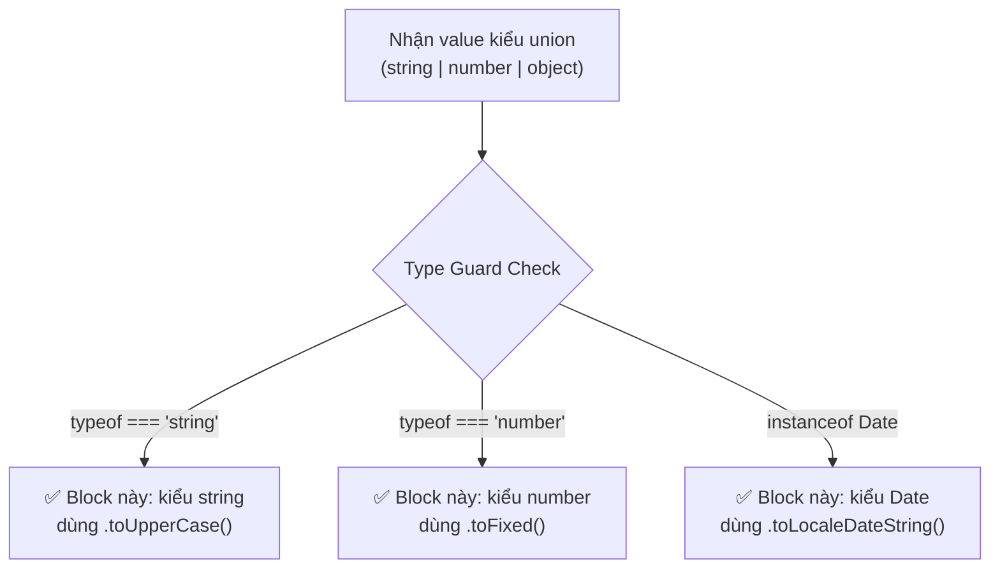
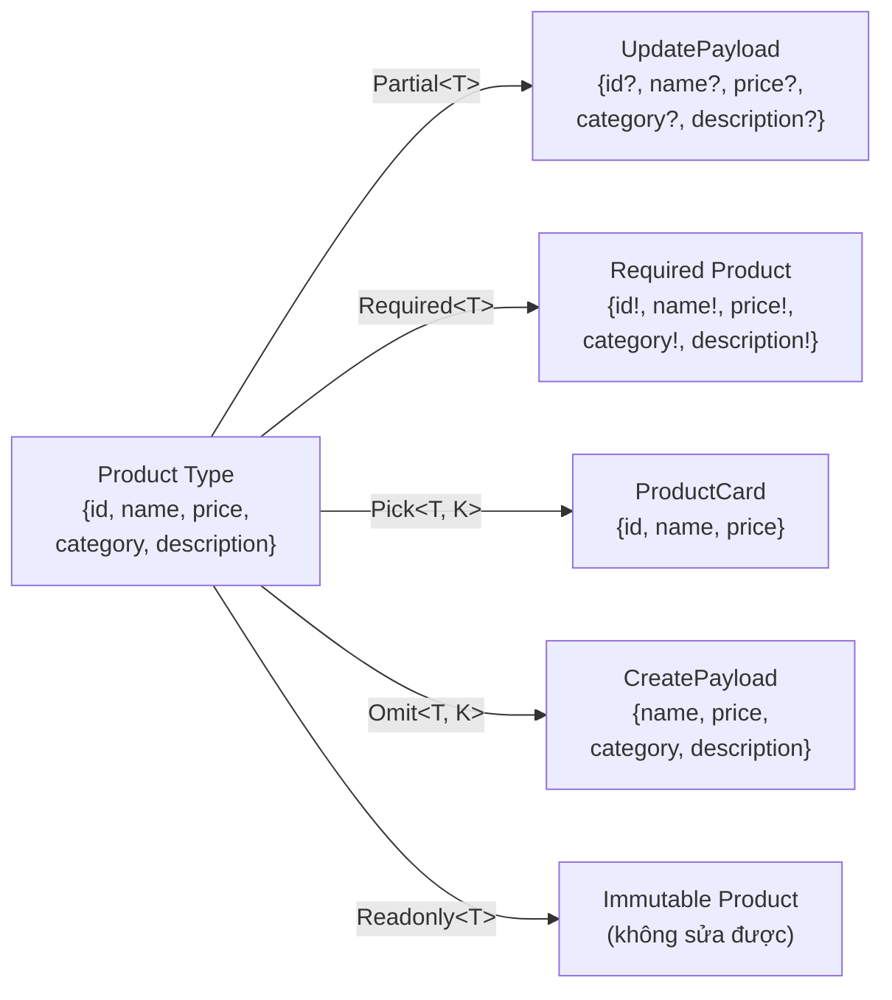
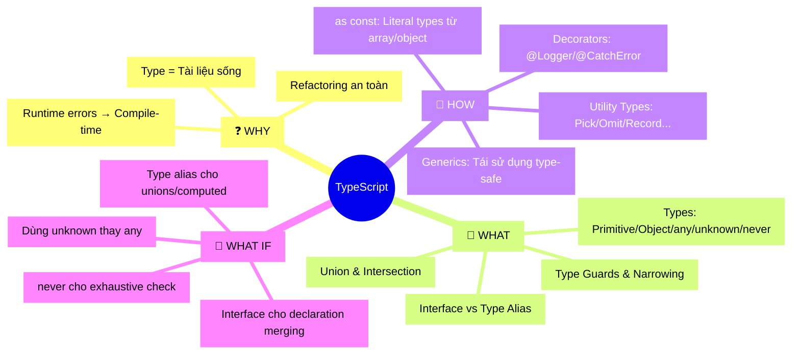

> **Đây là tài liệu Reference Guide / Cheat Sheet cho đội ngũ lập trình viên.** Bài viết được cấu trúc như một cuốn sổ tay tra cứu nhanh, mỗi phần đều có: Khái niệm cốt lõi → Vấn đề giải quyết → Code thực chiến → Best practices.

<!-- truncate -->

## 📋 Agenda

**Thời gian đọc ước tính:** ~35 phút

### Sau bài này, bạn sẽ:
- ✅ **Nắm vững** toàn bộ hệ thống type của TypeScript (Primitive, Object, Top/Bottom Types)
- ✅ **Tự tin** viết Generic Functions, Decorators và dùng Utility Types như `Pick`, `Omit`, `Record`
- ✅ **Áp dụng** Type Guards để viết code an toàn và không bị runtime error
- ✅ **Phân biệt** được khi nào dùng `interface` vs `type alias`, `any` vs `unknown`

### Prerequisites:
- 🔹 Biết JavaScript cơ bản (ES6+)
- 🔹 Đã dùng TypeScript ít nhất một lần trong dự án

---

## Mục lục

1. [TypeScript Types](#1-typescript-types)
   - [Primitive Types](#11-primitive-types)
   - [Object Types](#12-object-types)
   - [Top Types: `any` vs `unknown`](#13-top-types-any-vs-unknown)
   - [Bottom Type: `never`](#14-bottom-type-never)
   - [Type Assertion](#15-type-assertion)
2. [Combining Types](#2-combining-types)
   - [Union Types](#21-union-types)
   - [Intersection Types](#22-intersection-types)
3. [Type Guards / Narrowing](#3-type-guards--narrowing)
4. [Interface](#4-interface)
5. [Function Generics](#5-function-generics)
6. [Decorators](#6-decorators)
7. [Utility Types](#7-utility-types)

---

## ❓ Tại sao cần TypeScript?

**Vấn đề với JavaScript thuần:**
- Lỗi kiểu dữ liệu chỉ xuất hiện ở **runtime** — khi user đang dùng app thật
- Refactoring lớn cực kỳ rủi ro: đổi tên một property → toàn bộ code có thể vỡ mà không biết
- IDE không thể gợi ý chính xác vì không biết shape của object

**TypeScript giải quyết bằng:**
- **Static Type Checking:** Bắt lỗi ngay khi gõ code, không phải lúc chạy
- **Self-documenting Code:** Type chính là tài liệu, không cần comment thừa
- **Refactoring an toàn:** Đổi tên một field → compiler chỉ ra toàn bộ điểm bị ảnh hưởng ngay lập tức

---

## 1. TypeScript Types

### 1.1 Primitive Types

**Khái niệm:** TypeScript map 1-1 với các kiểu nguyên thủy của JavaScript, thêm `null` và `undefined` như các type riêng biệt.

```typescript
// filename: types/primitives.ts

const productName: string = "iPhone 16 Pro";
const price: number = 29_990_000; // _ làm dấu phân cách số cho dễ đọc
const inStock: boolean = true;

// null và undefined là hai type khác nhau
let discountCode: string | null = null;   // có thể có hoặc không có giảm giá
let expiryDate: Date | undefined;         // chưa được set

// ⚠️ Bật strictNullChecks trong tsconfig.json để compiler bắt lỗi null/undefined
```

> **Best practice:** Bật `"strictNullChecks": true` trong `tsconfig.json`. Không bật = mất đi 50% sức mạnh của TypeScript.

---

### 1.2 Object Types

**Cách định nghĩa chuẩn** — dùng `type alias` hoặc `interface` (chi tiết ở phần 4).

```typescript
// filename: types/product.ts

// Cách 1: Inline (chỉ dùng cho type 1-lần, nhỏ gọn)
function displayProduct(product: { id: string; name: string; price: number }) {
  console.log(`${product.name}: ${product.price.toLocaleString("vi-VN")} VND`);
}

// Cách 2: Type alias (tái sử dụng được — RECOMMENDED cho production code)
type Product = {
  id: string;
  name: string;
  price: number;
  category: string;
  imageUrl?: string; // ? = optional property — không bắt buộc phải có
  readonly sku: string; // readonly = chỉ đọc, không được gán lại sau khi tạo
};

// ✅ Đúng: readonly property chỉ được set khi khởi tạo
const laptop: Product = {
  id: "p-001",
  name: "MacBook Pro M4",
  price: 49_990_000,
  category: "Laptop",
  sku: "MBP-M4-512"
};

// ❌ Lỗi compile: Cannot assign to 'sku' because it is a read-only property.
// laptop.sku = "MBP-M4-1TB";
```

---

### 1.3 Top Types: `any` vs `unknown`

**Đây là một trong những phân biệt QUAN TRỌNG NHẤT trong TypeScript.**

| | `any` | `unknown` |
|---|---|---|
| **Nhận giá trị gì?** | Bất kỳ | Bất kỳ |
| **Dùng giá trị trực tiếp?** | ✅ Được | ❌ KHÔNG — phải kiểm tra type trước |
| **Type safety** | ❌ Tắt hoàn toàn | ✅ Được bảo vệ |
| **Khi nào dùng?** | Cực kỳ hiếm | Khi nhận data từ bên ngoài (API, user input) |

```typescript
// filename: services/api.service.ts

// ❌ Antipattern: dùng any — compiler "mù" hoàn toàn, không bắt được lỗi
async function fetchUserDataDangerous(userId: string): Promise<any> {
  const response = await fetch(`/api/users/${userId}`);
  const data = await response.json();
  return data;
}

// Sau đó gọi một property không tồn tại → KHÔNG bị lỗi compile nhưng crash lúc runtime
// const name = data.fullname.toUpperCase(); // 💣 runtime error

// ✅ Đúng: dùng unknown — buộc dev phải kiểm tra trước khi dùng
async function fetchUserData(userId: string): Promise<unknown> {
  const response = await fetch(`/api/users/${userId}`);
  return response.json();
}

// Muốn dùng phải narrow down type trước (xem phần Type Guards)
const rawData = await fetchUserData("usr-123");

if (typeof rawData === "object" && rawData !== null && "name" in rawData) {
  // ✅ Bây giờ TypeScript mới cho phép dùng
  console.log((rawData as { name: string }).name);
}
```

> **Rule of thumb:** Thấy mình muốn gõ `any` → hỏi bản thân "tại sao data này lại không có type?". Câu trả lời gần như luôn là `unknown`, `generic`, hoặc một `interface` cụ thể.

---

### 1.4 Bottom Type: `never`

**Khái niệm:** `never` là kiểu "không bao giờ xảy ra". Một function trả về `never` có nghĩa là nó không bao giờ hoàn thành bình thường (throw error hoặc loop vô tận).

**Ứng dụng thực chiến quan trọng nhất: Exhaustive Check trong `switch-case`.**

```typescript
// filename: services/order.service.ts

type OrderStatus = "pending" | "processing" | "shipped" | "delivered";

function getStatusMessage(status: OrderStatus): string {
  switch (status) {
    case "pending":
      return "Đơn hàng đang chờ xác nhận";
    case "processing":
      return "Đang đóng gói và chuẩn bị giao";
    case "shipped":
      return "Đơn hàng đang trên đường vận chuyển";
    case "delivered":
      return "Đã giao thành công";
    default:
      // Trick: gán vào _exhaustiveCheck kiểu never
      // Nếu bạn thêm "cancelled" vào OrderStatus mà quên xử lý ở switch,
      // dòng này sẽ báo lỗi compile ngay lập tức!
      const _exhaustiveCheck: never = status;
      throw new Error(`Unhandled order status: ${_exhaustiveCheck}`);
  }
}

// Kết quả: Khi team thêm status mới vào OrderStatus,
// compiler sẽ chỉ ra NGAY tất cả switch-case chưa xử lý → không bao giờ bỏ sót case.
```

---

### 1.5 Type Assertion

**Khái niệm:** Nói với compiler "tôi biết type của giá trị này hơn bạn". Dùng khi bạn có thông tin mà compiler không có.

```typescript
// filename: utils/dom.utils.ts

// Cú pháp 1: as Type (RECOMMENDED — hoạt động trong cả .tsx)
const emailInput = document.getElementById("email-input") as HTMLInputElement;
emailInput.value = "user@example.com"; // ✅ compiler biết đây là input, có property .value

// Cú pháp 2: <Type> (tránh dùng trong file .tsx vì xung đột với JSX syntax)
const usernameInput = <HTMLInputElement>document.getElementById("username-input");

// ⚠️ Double assertion — chỉ dùng khi thực sự cần, đây là "escape hatch"
const weirdCase = someValue as unknown as SpecificType;
```

**`as const` — Công cụ mạnh mẽ trong thực tế:**

```typescript
// filename: config/routes.ts

// Không có as const: TypeScript infer type là string[] → mất thông tin cụ thể
const PAYMENT_METHODS_MUTABLE = ["credit_card", "bank_transfer", "momo"];
// Type: string[]

// Với as const: freeze array thành readonly tuple với literal types
const PAYMENT_METHODS = ["credit_card", "bank_transfer", "momo"] as const;
// Type: readonly ["credit_card", "bank_transfer", "momo"]

// Ứng dụng: Tạo union type từ array tự động → không cần khai báo 2 lần
type PaymentMethod = typeof PAYMENT_METHODS[number];
// Type: "credit_card" | "bank_transfer" | "momo"

function processPayment(method: PaymentMethod) {
  // Compiler sẽ báo lỗi nếu truyền "paypal" vào đây → an toàn tuyệt đối
  console.log(`Processing payment via ${method}`);
}

// Ứng dụng với object — giữ nguyên literal value thay vì widen thành string/number
const HTTP_STATUS = {
  OK: 200,
  NOT_FOUND: 404,
  INTERNAL_ERROR: 500,
} as const;

type HttpStatusCode = typeof HTTP_STATUS[keyof typeof HTTP_STATUS];
// Type: 200 | 404 | 500
```

---

## 2. Combining Types

### 2.1 Union Types (`|`)

**Khái niệm:** "Giá trị này thuộc HOẶC type A, HOẶC type B."

```typescript
// filename: types/notification.ts

type NotificationChannel = "email" | "sms" | "push";

type ApiResponse<T> =
  | { success: true; data: T }
  | { success: false; error: string; errorCode: number };

// Ứng dụng thực tế: handle cả 2 nhánh success/failure
function handleUserResponse(response: ApiResponse<User>) {
  if (response.success) {
    // ✅ TypeScript biết chắc response.data tồn tại ở đây
    displayUserProfile(response.data);
  } else {
    // ✅ TypeScript biết chắc response.error tồn tại ở đây
    showErrorToast(`${response.error} (Code: ${response.errorCode})`);
  }
}
```

---

### 2.2 Intersection Types (`&`)

**Khái niệm:** "Giá trị này phải thỏa mãn ĐỒNG THỜI type A VÀ type B." Dùng để gộp nhiều type lại thành một type phức tạp hơn.

```typescript
// filename: types/user.ts

type BaseEntity = {
  id: string;
  createdAt: Date;
  updatedAt: Date;
};

type UserProfile = {
  fullName: string;
  email: string;
  avatarUrl?: string;
};

type AdminCapabilities = {
  permissions: string[];
  canDeleteContent: boolean;
  managedDepartments: string[];
};

// Gộp UserProfile + BaseEntity: User cơ bản trong database
type User = UserProfile & BaseEntity;

// Gộp thêm AdminCapabilities: User có quyền quản trị
type AdminUser = User & AdminCapabilities;

// ✅ adminUser phải có ĐẦY ĐỦ properties từ cả 3 type
const adminUser: AdminUser = {
  id: "usr-admin-001",
  createdAt: new Date(),
  updatedAt: new Date(),
  fullName: "Nguyễn Quản Trị",
  email: "admin@company.com",
  permissions: ["user:read", "user:write", "content:delete"],
  canDeleteContent: true,
  managedDepartments: ["Engineering", "Product"],
};
```

---

## 3. Type Guards / Narrowing

**Khái niệm:** Kỹ thuật giúp TypeScript "thu hẹp" từ một type rộng xuống một type cụ thể hơn bên trong một block code.



### `typeof` và `instanceof`

```typescript
// filename: utils/formatter.ts

type RawValue = string | number | Date;

function formatDisplayValue(value: RawValue): string {
  // typeof hoạt động với primitive types
  if (typeof value === "string") {
    return value.trim().toUpperCase(); // ✅ compiler biết value là string
  }

  if (typeof value === "number") {
    return value.toLocaleString("vi-VN"); // ✅ compiler biết value là number
  }

  // instanceof hoạt động với class instances
  if (value instanceof Date) {
    return value.toLocaleDateString("vi-VN"); // ✅ compiler biết value là Date
  }

  // Sau 3 check trên, TypeScript biết các case đã được xử lý hết
  return String(value);
}
```

### Toán tử `in`

```typescript
// filename: types/payment.ts

type CreditCardPayment = {
  method: "credit_card";
  cardNumber: string;
  cvv: string;
};

type BankTransferPayment = {
  method: "bank_transfer";
  bankAccount: string;
  bankCode: string;
};

type Payment = CreditCardPayment | BankTransferPayment;

function processPaymentDetails(payment: Payment) {
  // Dùng 'in' để check property tồn tại
  if ("cardNumber" in payment) {
    // ✅ TypeScript narrow xuống CreditCardPayment
    console.log(`Charging card ending in ${payment.cardNumber.slice(-4)}`);
  } else {
    // ✅ TypeScript narrow xuống BankTransferPayment
    console.log(`Transferring to account ${payment.bankAccount}`);
  }
}
```

### User-defined Type Guards (Predicate `is`)

**Dùng khi:** `typeof` và `instanceof` không đủ — bạn cần kiểm tra structure của object.

```typescript
// filename: types/api-response.ts

type SuccessResponse = {
  status: "success";
  data: {
    userId: string;
    accessToken: string;
  };
};

type ErrorResponse = {
  status: "error";
  message: string;
  code: number;
};

type AuthResponse = SuccessResponse | ErrorResponse;

// Hàm type guard: return type "response is SuccessResponse" là predicate
// Khi hàm này return true → TypeScript hiểu: bên trong if block, response là SuccessResponse
function isSuccessResponse(response: AuthResponse): response is SuccessResponse {
  return response.status === "success";
}

async function handleLogin(credentials: { email: string; password: string }) {
  const response: AuthResponse = await loginApi(credentials);

  if (isSuccessResponse(response)) {
    // ✅ TypeScript biết chắc đây là SuccessResponse
    localStorage.setItem("token", response.data.accessToken);
    redirectToDashboard(response.data.userId);
  } else {
    // ✅ TypeScript biết chắc đây là ErrorResponse
    showAlert(`Login failed: ${response.message} (${response.code})`);
  }
}
```

---

## 4. Interface

### Khai báo và `extends`

```typescript
// filename: types/catalog.ts

interface BaseProduct {
  id: string;
  name: string;
  price: number;
}

// extends để kế thừa và mở rộng
interface PhysicalProduct extends BaseProduct {
  weight: number;     // kg
  dimensions: { width: number; height: number; depth: number };
  shippingClass: "standard" | "express" | "bulky";
}

interface DigitalProduct extends BaseProduct {
  downloadUrl: string;
  licenseKey?: string;
  maxDownloads: number;
}

// Extends nhiều interface cùng lúc
interface BundleProduct extends PhysicalProduct, DigitalProduct {
  bundledItems: string[]; // danh sách id các sản phẩm trong bundle
}
```

### `implements` với Class

```typescript
// filename: services/payment.service.ts

interface PaymentGateway {
  charge(amount: number, currency: string): Promise<{ transactionId: string }>;
  refund(transactionId: string, amount: number): Promise<boolean>;
}

// Class PHẢI implement đầy đủ tất cả methods của interface
class StripeGateway implements PaymentGateway {
  async charge(amount: number, currency: string) {
    // Stripe-specific implementation
    const result = await stripe.charges.create({ amount, currency });
    return { transactionId: result.id };
  }

  async refund(transactionId: string, amount: number) {
    await stripe.refunds.create({ charge: transactionId, amount });
    return true;
  }
}

class VNPayGateway implements PaymentGateway {
  async charge(amount: number, currency: string) {
    // VNPay-specific implementation
    const result = await vnpayClient.createPayment(amount);
    return { transactionId: result.orderId };
  }

  async refund(transactionId: string, amount: number) {
    await vnpayClient.refund(transactionId, amount);
    return true;
  }
}

// ✅ Cả 2 class đều đáp ứng contract PaymentGateway → có thể dùng hoán đổi nhau
function processOrder(gateway: PaymentGateway, amount: number) {
  return gateway.charge(amount, "VND");
}
```

### Interface vs Type Alias — Khi nào dùng cái nào?

| | `interface` | `type alias` |
|---|---|---|
| **Declaration merging** | ✅ Có thể merge | ❌ Không thể |
| **`extends`** | ✅ Native syntax | ✅ Dùng `&` |
| **Union / Intersection** | ❌ Không trực tiếp | ✅ Tự nhiên |
| **Primitive / Tuple** | ❌ Không | ✅ Có |
| **Class `implements`** | ✅ Rất phù hợp | ✅ Cũng được |

**Quyết định trong dự án thực tế:**

```typescript
// ✅ Dùng interface: định nghĩa "hợp đồng" cho class hoặc object domain
interface UserRepository {
  findById(id: string): Promise<User | null>;
  save(user: User): Promise<void>;
  delete(id: string): Promise<void>;
}

// ✅ Dùng type alias: union types, computed types, utility types
type UserId = string;
type UserOrAdmin = User | AdminUser;
type CreateUserPayload = Omit<User, "id" | "createdAt" | "updatedAt">;

// ✅ Dùng interface: có thể bị extend lại bởi library consumer (declaration merging)
// Ví dụ: Express Request có thể extend để thêm property 'currentUser'
declare global {
  namespace Express {
    interface Request {
      currentUser?: User; // extend Request của Express để có currentUser
    }
  }
}
```

> **Rule of thumb:** Dùng `interface` cho object shapes và class contracts. Dùng `type` cho union types, computed types, và mọi thứ còn lại.

---

## 5. Function Generics

### Khái niệm

**Generic** là "type parameter" — cho phép viết một function/class/interface hoạt động với NHIỀU kiểu dữ liệu khác nhau mà không mất type safety.

**Ẩn dụ:** Generic như một cái khuôn bánh (hình dạng giống nhau) nhưng phần nhân (`T`) thay đổi tùy theo cần bánh gì.

### Generic Functions

```typescript
// filename: utils/api.utils.ts

// Hàm WITHOUT generic: phải return 'any' → mất type safety
async function fetchDataUnsafe(url: string): Promise<any> {
  const response = await fetch(url);
  return response.json();
}

// Hàm WITH generic: caller tự quyết định kiểu trả về → vừa linh hoạt vừa type-safe
async function fetchData<TResponse>(url: string): Promise<TResponse> {
  const response = await fetch(url);

  if (!response.ok) {
    throw new Error(`HTTP Error: ${response.status}`);
  }

  return response.json() as TResponse;
}

// ✅ Cách dùng — TypeScript biết chính xác kiểu trả về
type Product = { id: string; name: string; price: number };
type UserProfile = { id: string; email: string; fullName: string };

const product = await fetchData<Product>("/api/products/p-001");
// product.name ✅ — compiler biết product có property name

const user = await fetchData<UserProfile>("/api/users/u-001");
// user.email ✅ — compiler biết user có property email
```

### Generic Constraints (`extends`)

**Dùng khi:** Cần giới hạn Generic T, chỉ cho phép những type có đặc điểm cụ thể.

```typescript
// filename: utils/entity.utils.ts

// Constraint: T phải có ít nhất property 'id: string'
function findById<T extends { id: string }>(items: T[], targetId: string): T | undefined {
  // ✅ Compiler biết items[i].id tồn tại vì T extend { id: string }
  return items.find(item => item.id === targetId);
}

// Hoạt động với bất kỳ array nào có items có id
const products: Product[] = await fetchData<Product[]>("/api/products");
const foundProduct = findById(products, "p-001"); // Type: Product | undefined

const users: User[] = await fetchData<User[]>("/api/users");
const foundUser = findById(users, "usr-001"); // Type: User | undefined
```

### Multiple Generics

```typescript
// filename: utils/cache.utils.ts

// 2 type parameters: K là kiểu key, V là kiểu value
class TypeSafeCache<K, V> {
  private store = new Map<K, V>();

  set(key: K, value: V): void {
    this.store.set(key, value);
  }

  get(key: K): V | undefined {
    return this.store.get(key);
  }
}

// Ví dụ thực tế: Cache sản phẩm theo SKU
const productCache = new TypeSafeCache<string, Product>();
productCache.set("MBP-M4-512", { id: "p-001", name: "MacBook Pro M4", price: 49_990_000 });

const cached = productCache.get("MBP-M4-512"); // Type: Product | undefined

// Ví dụ thực tế: Generic cho HTTP request với cả request body và response body
async function post<TBody, TResponse>(url: string, body: TBody): Promise<TResponse> {
  const response = await fetch(url, {
    method: "POST",
    headers: { "Content-Type": "application/json" },
    body: JSON.stringify(body),
  });
  return response.json() as TResponse;
}

type CreateOrderPayload = { productId: string; quantity: number; userId: string };
type OrderConfirmation = { orderId: string; estimatedDelivery: string };

// ✅ Compiler biết chính xác type của cả input và output
const confirmation = await post<CreateOrderPayload, OrderConfirmation>(
  "/api/orders",
  { productId: "p-001", quantity: 2, userId: "usr-123" }
);
console.log(confirmation.orderId); // ✅ type-safe
```

---

## 6. Decorators

### Khái niệm

**Decorator** là một syntax đặc biệt (dùng `@`) để "gắn" thêm hành vi vào class, method, property, hoặc parameter mà không cần sửa trực tiếp code gốc. Bản chất là một **Higher-Order Function**.

**Kích hoạt trong `tsconfig.json`:**

```json
{
  "compilerOptions": {
    "experimentalDecorators": true,
    "emitDecoratorMetadata": true
  }
}
```

> **Lưu ý:** TypeScript 5.0+ đã có Stage 3 Decorators (cú pháp mới theo TC39 proposal). `experimentalDecorators` vẫn được hỗ trợ nhưng là implementation cũ. Bài này dùng `experimentalDecorators` vì các framework phổ biến (NestJS, TypeORM) vẫn dùng.

### Class Decorator

```typescript
// filename: decorators/logger.decorator.ts

// Class Decorator nhận vào constructor của class làm tham số
function Logger(prefix: string) {
  return function <T extends { new (...args: unknown[]): object }>(constructor: T) {
    return class extends constructor {
      constructor(...args: unknown[]) {
        super(...args);
        console.log(`[${prefix}] Instance created: ${constructor.name}`);
      }
    };
  };
}

// filename: services/order.service.ts
@Logger("ORDER-SERVICE")
class OrderService {
  constructor(private readonly orderId: string) {}

  processOrder() {
    console.log(`Processing order: ${this.orderId}`);
  }
}

// Khi new OrderService("ORD-001") được gọi, log tự động xuất hiện:
// [ORDER-SERVICE] Instance created: OrderService
const service = new OrderService("ORD-001");
```

### Method Decorator

**Ứng dụng thực chiến nhất: `@CatchError` — tự động bắt và xử lý lỗi cho bất kỳ method nào.**

```typescript
// filename: decorators/catch-error.decorator.ts

// Method Decorator nhận 3 tham số: target, propertyKey, descriptor
function CatchError(errorMessage: string) {
  return function (
    _target: object,
    _propertyKey: string,
    descriptor: PropertyDescriptor
  ) {
    const originalMethod = descriptor.value;

    // Wrap method gốc bằng try-catch
    descriptor.value = async function (...args: unknown[]) {
      try {
        return await originalMethod.apply(this, args);
      } catch (error) {
        // Ghi log lỗi chi tiết (có thể gửi lên Sentry, DataDog...)
        console.error(`[CatchError] ${errorMessage}:`, error);
        // Ném lại lỗi đã được wrap với message rõ ràng hơn
        throw new Error(`${errorMessage}: ${error instanceof Error ? error.message : "Unknown error"}`);
      }
    };

    return descriptor;
  };
}

// filename: services/inventory.service.ts
class InventoryService {
  @CatchError("Failed to update stock")
  async updateStock(productId: string, quantity: number): Promise<void> {
    // Nếu method này throw bất kỳ lỗi gì → @CatchError tự động bắt và log
    await db.query(
      "UPDATE products SET stock = stock + $1 WHERE id = $2",
      [quantity, productId]
    );
  }

  @CatchError("Failed to check availability")
  async checkAvailability(productId: string): Promise<boolean> {
    const result = await db.query(
      "SELECT stock FROM products WHERE id = $1",
      [productId]
    );
    return result.rows[0]?.stock > 0;
  }
}

// ✅ Cả 2 method đều được bảo vệ bởi error handling tự động
// → Code trong method sạch hơn, không cần lặp lại try-catch
```

---

## 7. Utility Types

**Utility Types** là bộ công cụ built-in của TypeScript giúp biến đổi type hiện có thành type mới mà không cần viết lại từ đầu.

### Sơ đồ tổng quan



### `Partial<T>` và `Required<T>`

```typescript
// filename: services/product.service.ts

type Product = {
  id: string;
  name: string;
  price: number;
  category: string;
  description?: string; // optional
};

// Partial<T>: Biến TẤT CẢ properties thành optional
// Ứng dụng: Payload cho PATCH request (chỉ update một phần)
type UpdateProductPayload = Partial<Product>;
// Tương đương: { id?: string; name?: string; price?: number; ... }

async function updateProduct(id: string, payload: UpdateProductPayload) {
  // payload chỉ cần chứa fields muốn update
  await db.products.update({ where: { id }, data: payload });
}

// Chỉ update price, không cần truyền các fields khác
await updateProduct("p-001", { price: 44_990_000 });

// Required<T>: Biến TẤT CẢ properties thành bắt buộc (ngược với Partial)
type StrictProduct = Required<Product>;
// description không còn optional — phải cung cấp đầy đủ
```

### `Pick<T, K>` và `Omit<T, K>`

```typescript
// filename: types/product-views.ts

// Pick<T, K>: Chỉ lấy một số properties cụ thể
// Ứng dụng: Tạo DTO/view model chỉ chứa những gì cần thiết
type ProductCard = Pick<Product, "id" | "name" | "price">;
// { id: string; name: string; price: number }

// Omit<T, K>: Loại bỏ một số properties
// Ứng dụng: Tạo payload cho POST request (không có id, timestamps)
type CreateProductPayload = Omit<Product, "id">;
// { name: string; price: number; category: string; description?: string }

// Ứng dụng nâng cao: Omit nhiều fields do server tự generate
type BaseEntity = {
  id: string;
  createdAt: Date;
  updatedAt: Date;
};

type CreateUserPayload = Omit<User, keyof BaseEntity>;
// Loại bỏ toàn bộ fields của BaseEntity → chỉ còn fields do user cung cấp
```

### `Record<K, V>`

```typescript
// filename: config/permissions.ts

type UserRole = "admin" | "editor" | "viewer";
type Permission = "read" | "write" | "delete";

// Record<K, V>: Tạo object type với key K và value V
// Ứng dụng: Permission matrix, lookup table, dictionary
const rolePermissions: Record<UserRole, Permission[]> = {
  admin: ["read", "write", "delete"],
  editor: ["read", "write"],
  viewer: ["read"],
};

// ✅ Compiler đảm bảo tất cả role đều được định nghĩa (không bỏ sót)
function hasPermission(role: UserRole, action: Permission): boolean {
  return rolePermissions[role].includes(action);
}

// Ứng dụng khác: Cache/Map với runtime-defined keys
const productCache: Record<string, Product> = {};
productCache["p-001"] = { id: "p-001", name: "MacBook Pro", price: 49_990_000, category: "Laptop" };
```

### `Readonly<T>`

```typescript
// filename: config/app.config.ts

type AppConfig = {
  apiBaseUrl: string;
  maxRetries: number;
  featureFlags: Record<string, boolean>;
};

// Readonly<T>: Tất cả properties không thể reassign sau khi tạo
const CONFIG: Readonly<AppConfig> = {
  apiBaseUrl: "https://api.example.com/v2",
  maxRetries: 3,
  featureFlags: { darkMode: true, betaCheckout: false },
};

// ❌ Lỗi compile: Cannot assign to 'apiBaseUrl' because it is a read-only property.
// CONFIG.apiBaseUrl = "https://api.staging.example.com";

// ⚠️ Lưu ý: Readonly là SHALLOW — object lồng nhau vẫn có thể mutate
CONFIG.featureFlags["betaCheckout"] = true; // ✅ Không bị lỗi!
// Để deep readonly, cần dùng thư viện như 'type-fest' hoặc tự viết recursive type
```

### `Exclude<T, U>` và `Extract<T, U>`

```typescript
// filename: types/events.ts

type SystemEvent =
  | "user.created"
  | "user.deleted"
  | "order.placed"
  | "order.cancelled"
  | "payment.success"
  | "payment.failed";

// Exclude<T, U>: Loại bỏ khỏi T những type thuộc U
type NonUserEvent = Exclude<SystemEvent, "user.created" | "user.deleted">;
// "order.placed" | "order.cancelled" | "payment.success" | "payment.failed"

// Extract<T, U>: Giữ lại trong T những type thuộc U
type PaymentEvent = Extract<SystemEvent, `payment.${string}`>;
// "payment.success" | "payment.failed"

// Ứng dụng: Định nghĩa các handler chỉ nhận event type phù hợp
function registerPaymentHandler(
  event: PaymentEvent,
  handler: (data: unknown) => void
) {
  eventBus.on(event, handler);
}

registerPaymentHandler("payment.success", (data) => console.log("Payment done!"));
// ❌ Lỗi compile nếu truyền "user.created" vào đây
```

### `ReturnType<T>`

```typescript
// filename: services/auth.service.ts

async function getCurrentUser(sessionToken: string) {
  // ... logic lấy user từ session
  return {
    id: "usr-001",
    email: "user@example.com",
    role: "admin" as const,
    lastLoginAt: new Date(),
  };
}

// ReturnType<T>: Lấy type của giá trị mà function trả về
// → Synchronizes type tự động khi function thay đổi, không cần cập nhật thủ công
type CurrentUser = Awaited<ReturnType<typeof getCurrentUser>>;
// { id: string; email: string; role: "admin"; lastLoginAt: Date }

// Ứng dụng: Component nhận đúng type không cần định nghĩa lại
function renderUserHeader(user: CurrentUser) {
  return `Welcome, ${user.email}! Role: ${user.role}`;
}
```

---

## 🧠 MECE Mindmap Tổng Kết



---

## 🚀 Quick Reference Cheat Sheet

| Utility Type | Công dụng | Use case |
|---|---|---|
| `Partial<T>` | Mọi field → optional | PATCH request payload |
| `Required<T>` | Mọi field → bắt buộc | Validation đầu vào |
| `Pick<T, K>` | Chỉ lấy K fields | View model / DTO |
| `Omit<T, K>` | Loại bỏ K fields | POST payload (bỏ id) |
| `Record<K, V>` | Dictionary/Map type-safe | Permission matrix |
| `Readonly<T>` | Không cho phép mutate | Config, constants |
| `Exclude<T, U>` | Loại bỏ khỏi Union | Filter event types |
| `Extract<T, U>` | Giữ lại trong Union | Narrow event types |
| `ReturnType<T>` | Type của return value | Sync type với function |

---

*Made by Anh Tu - Share to be share*
