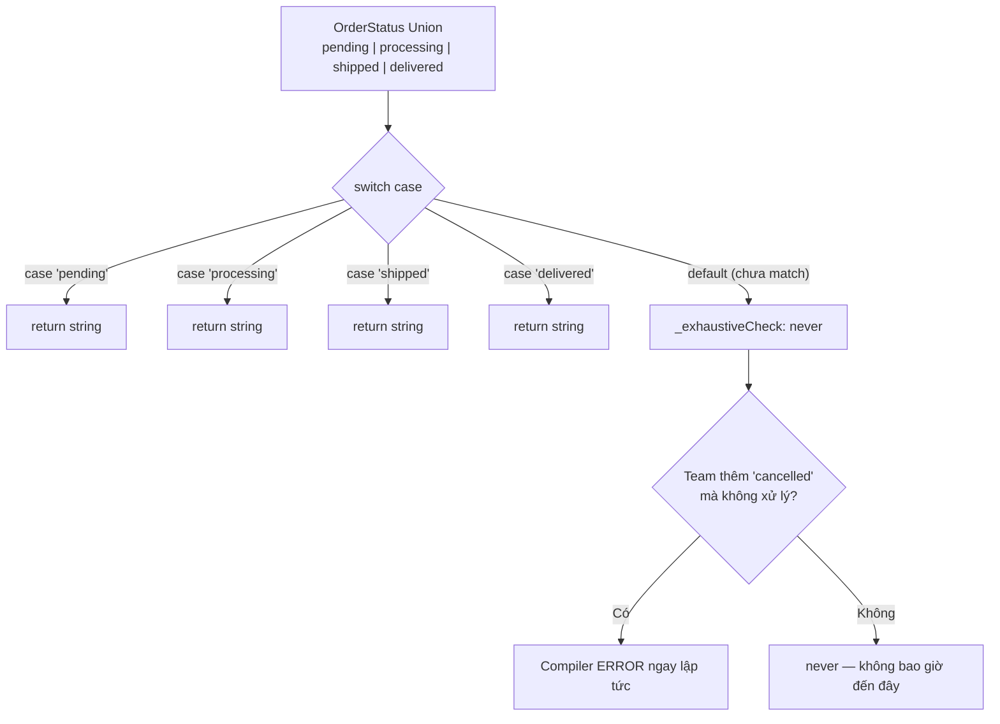
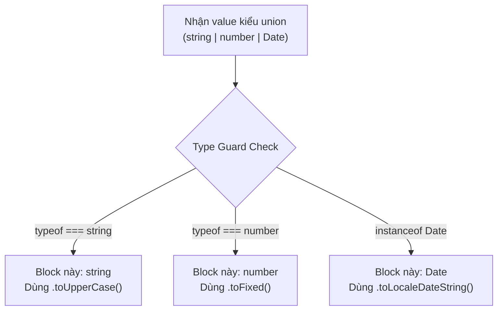
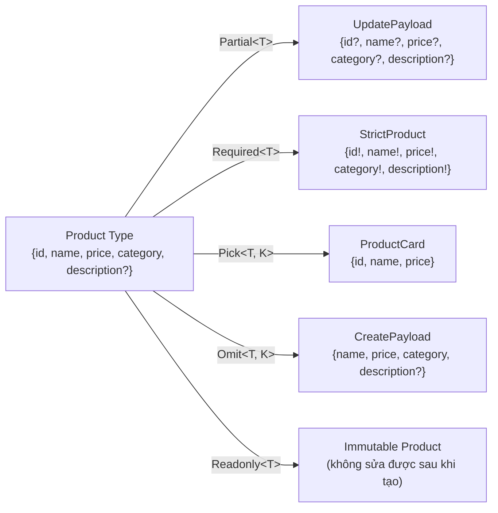
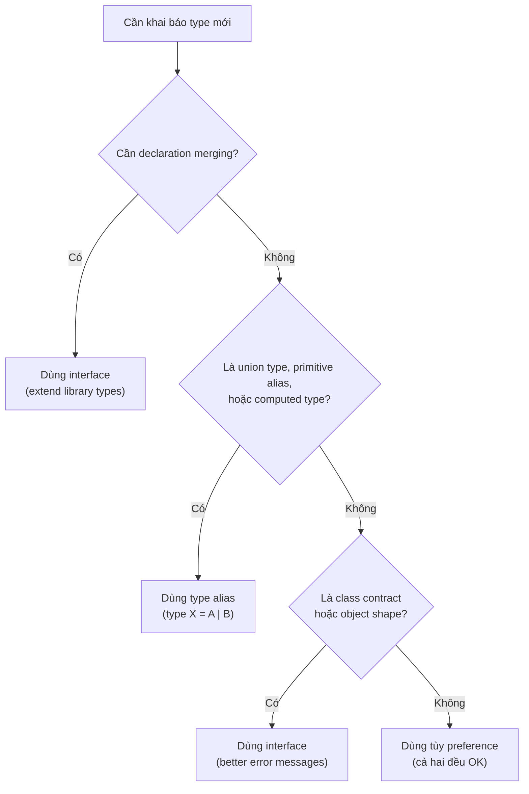

> **Đây là tài liệu Reference Guide / Cheat Sheet.** Bài viết được cấu trúc để tra cứu nhanh: mỗi mục gồm Định nghĩa → Vấn đề giải quyết → Code thực chiến → Trade-offs. Mọi nội dung kỹ thuật đã được đối chiếu với tài liệu gốc tại [typescriptlang.org](https://www.typescriptlang.org/docs/handbook/).

<!-- truncate -->

## Agenda

**Thời gian đọc ước tính:** ~40 phút

### Learning Outcomes

Sau khi đọc xong bài này, bạn có thể:

- **Giải thích** được sự khác biệt cốt lõi giữa `any`, `unknown`, và `never` — và biết khi nào nên dùng loại nào
- **Áp dụng** đúng các kỹ thuật Type Narrowing (`typeof`, `instanceof`, `in`, type predicates) để viết code an toàn
- **Phân biệt** được khi nào dùng `interface` và khi nào dùng `type alias` dựa trên hành vi thực tế của compiler
- **Tự viết** Generic Functions với Constraints để tái sử dụng logic mà không mất type safety
- **Chọn đúng** Utility Type (`Partial`, `Omit`, `Pick`, `Record`, `ReturnType`...) cho từng bài toán API cụ thể

### Prerequisites

- Biết JavaScript ES6+ (arrow functions, destructuring, async/await)
- Đã dùng TypeScript ít nhất một lần trong dự án

---

## Glossary & Vocabulary

**1. Technical Terms (Thuật ngữ kỹ thuật):**

| Term | Vietnamese Meaning & Quick Explain |
| :--- | :--- |
| **Static Type Checking** | Kiểm tra kiểu dữ liệu lúc biên dịch (trước khi chạy). Đối lập với Dynamic Typing của JavaScript thuần. |
| **Type Inference** | Trình biên dịch tự suy luận ra kiểu dữ liệu dựa trên giá trị được gán, không cần khai báo tường minh. |
| **Narrowing** | Quá trình thu hẹp type từ loại rộng (union type) xuống loại cụ thể hơn trong một block code. |
| **Type Predicate** | Return type dạng `param is Type` trong user-defined type guards, báo cho compiler biết kết quả narrowing. |
| **Declaration Merging** | Khả năng của `interface` cho phép khai báo cùng tên nhiều lần, compiler tự động gộp lại. |
| **Generic Constraint** | Giới hạn tập hợp kiểu mà type parameter `T` có thể nhận, dùng cú pháp `T extends SomeType`. |
| **Utility Type** | Các type transformation built-in của TypeScript (`Partial<T>`, `Pick<T, K>`...) để biến đổi type có sẵn. |
| **Discriminated Union** | Union type có một property chung (discriminant) với literal type, giúp compiler narrow chính xác. |
| **Exhaustive Check** | Kỹ thuật dùng `never` để đảm bảo mọi nhánh của switch/if đều được xử lý. |
| **Decorator** | Syntax `@expression` để gắn thêm hành vi vào class, method, property, parameter — bản chất là Higher-Order Function. |
| **Structural Typing** | TypeScript kiểm tra type dựa trên hình dạng (shape/structure) của object, không phải tên type. |

**2. Vocabulary Support (Từ vựng học thuật):**

| Word | Meaning in Context |
| :--- | :--- |
| **Assignable (adj)** | Có thể được gán vào — ví dụ: `string` is assignable to `string \| number`. |
| **Coercion (n)** | Ép kiểu tự động (implicit type conversion) như JavaScript ép `0` thành `false`. |
| **Ambient (adj)** | Môi trường khai báo type-only, không có implementation — thường dùng trong `.d.ts`. |
| **Constraint (n)** | Ràng buộc — điều kiện mà type parameter phải thỏa mãn. |
| **Infer (v)** | Suy luận — compiler tự động xác định type từ context mà không cần khai báo tường minh. |

---

## 1. Vấn đề kỹ thuật mà TypeScript giải quyết

Các dự án JavaScript ở quy mô lớn gặp phải các vấn đề có tính hệ thống:

1. **Lỗi kiểu dữ liệu xuất hiện ở runtime:** Gọi `.toUpperCase()` trên một giá trị `null` → crash ở môi trường production, không bị bắt lúc development.
2. **Refactoring rủi ro cao:** Đổi tên một property → toàn bộ nơi sử dụng có thể vỡ mà không có cách phát hiện tự động.
3. **IDE không đủ thông tin:** Autocompletion không chính xác vì không biết shape của object nhận từ API.
4. **Onboarding khó:** Code không self-documenting — người mới phải đọc implementation mới biết function nhận/trả về gì.

**TypeScript giải quyết bằng Static Type Checking** (*kiểm tra kiểu tĩnh*): compiler phân tích code trước khi chạy và báo lỗi ngay tại thời điểm viết code.

> **Quan trọng từ docs chính thống:** TypeScript là một *structural type system* — compiler quan tâm đến **shape (hình dạng)** của type, không phải tên của nó. Nếu hai type có cùng structure, chúng tương thích nhau. ([source](https://www.typescriptlang.org/docs/handbook/2/everyday-types.html#interfaces))

---

## 2. TypeScript Types

### 2.1 Primitive Types (Kiểu nguyên thủy)

TypeScript map 1-1 với các primitive của JavaScript. Theo tài liệu chính thống, luôn dùng chữ thường (`string`, `number`, `boolean`) — không dùng `String`, `Number`, `Boolean` (chữ hoa) vì đây là built-in types đặc biệt ít khi cần dùng.

```typescript
// filename: types/primitives.ts

const productName: string = "iPhone 16 Pro";
const price: number = 29_990_000; // Dấu _ làm separator cho dễ đọc — valid JavaScript/TypeScript
const inStock: boolean = true;

// null và undefined: hành vi phụ thuộc vào strictNullChecks trong tsconfig
let discountCode: string | null = null;
let expiryDate: Date | undefined;
```

**Trade-off khi bật `strictNullChecks`:**

- Bật: Compiler bắt mọi trường hợp có thể null/undefined → code an toàn hơn nhưng phải xử lý thêm
- Tắt: `null` và `undefined` có thể gán vào bất kỳ type nào → dễ bị runtime error

> **Từ docs:** "We always recommend people turn [`strictNullChecks`](https://www.typescriptlang.org/tsconfig#strictNullChecks) on if it's practical to do so." — TypeScript Handbook, Everyday Types

---

### 2.2 Object Types (Kiểu đối tượng)

```typescript
// filename: types/product.ts

// Cách 1: Inline object type — dùng cho parameter nhỏ, không tái sử dụng
function displayProduct(product: { id: string; name: string; price: number }) {
  console.log(`${product.name}: ${product.price.toLocaleString("vi-VN")} VND`);
}

// Cách 2: Type alias — RECOMMENDED cho production code vì tái sử dụng được
type Product = {
  id: string;
  name: string;
  price: number;
  category: string;
  imageUrl?: string;   // ? = optional property — không bắt buộc phải có
  readonly sku: string; // readonly = không được gán lại sau khi khởi tạo
};

const laptop: Product = {
  id: "p-001",
  name: "MacBook Pro M4",
  price: 49_990_000,
  category: "Laptop",
  sku: "MBP-M4-512"
};

// Compiler bắt lỗi: Cannot assign to 'sku' because it is a read-only property.
// laptop.sku = "MBP-M4-1TB";
```

**Lưu ý về Type Inference:** Trong hầu hết trường hợp, TypeScript tự suy luận type từ giá trị được gán. Bạn **không cần** khai báo tường minh nếu giá trị đủ rõ ràng:

```typescript
// TypeScript tự infer: myName: string
let myName = "Alice";

// Tương đương với
let myName: string = "Alice"; // Thừa — không cần thiết
```

---

### 2.3 Top Types: `any` vs `unknown`

Đây là phân biệt quan trọng nhất mà phần lớn lập trình viên mới dùng TypeScript hiểu sai.

**Definition Anatomy — `unknown` type:**

Định nghĩa từ docs: *"The unknown type represents any value. This is similar to the any type, but is safer because it's not legal to do anything with an unknown value."*

Giải phẫu:
- **any value** (*bất kỳ giá trị nào*): `unknown` nhận tất cả — giống `any`
- **safer** (*an toàn hơn*): không thể dùng trực tiếp — phải kiểm tra type trước
- **not legal to do anything** (*không được phép làm gì*): compiler từ chối mọi thao tác trừ khi đã narrow down

| | `any` | `unknown` |
|---|---|---|
| **Nhận giá trị gì?** | Bất kỳ | Bất kỳ |
| **Dùng trực tiếp không cần check?** | Được | KHÔNG — phải narrow trước |
| **Type safety** | Tắt hoàn toàn | Được bảo vệ |
| **Khi nào dùng?** | Cực kỳ hiếm (legacy migration) | Data từ bên ngoài (API, user input) |

```typescript
// filename: services/api.service.ts

// Antipattern: any — compiler "mù" hoàn toàn
async function fetchUserDataDangerous(userId: string): Promise<any> {
  const response = await fetch(`/api/users/${userId}`);
  return response.json();
}
// data.fullname.toUpperCase() → không có lỗi compile nhưng crash lúc runtime

// Đúng: unknown — buộc phải kiểm tra trước khi dùng
async function fetchUserData(userId: string): Promise<unknown> {
  const response = await fetch(`/api/users/${userId}`);
  return response.json();
}

// Muốn dùng phải narrow down (xem phần 4 — Type Narrowing)
const rawData = await fetchUserData("usr-123");

if (typeof rawData === "object" && rawData !== null && "name" in rawData) {
  // Bây giờ TypeScript mới cho phép dùng
  console.log((rawData as { name: string }).name);
}
```

**Từ docs:** Compiler flag [`noImplicitAny`](https://www.typescriptlang.org/tsconfig#noImplicitAny) sẽ báo lỗi khi TypeScript không thể infer type và phải fallback về `any`. Nên bật flag này trong mọi dự án production.

---

### 2.4 Bottom Type: `never`

**Definition Anatomy:**

Định nghĩa từ docs: *"When narrowing, you can reduce the options of a union to a point where you have removed all possibilities and have nothing left. In those cases, TypeScript will use a `never` type to represent a state which shouldn't exist."*

- **removed all possibilities** (*đã loại bỏ tất cả khả năng*): không còn nhánh nào có thể xảy ra
- **state which shouldn't exist** (*trạng thái không nên tồn tại*): code đến đây là bất khả thi về mặt logic

**Tính chất quan trọng từ docs:**
- `never` là assignable to (*có thể gán vào*) mọi type
- Nhưng **không có type nào** assignable to `never` (ngoại trừ `never` chính nó)

**Ứng dụng thực chiến: Exhaustive Check trong switch-case**

```typescript
// filename: services/order.service.ts

type OrderStatus = "pending" | "processing" | "shipped" | "delivered";

function getStatusMessage(status: OrderStatus): string {
  switch (status) {
    case "pending":
      return "Đơn hàng đang chờ xác nhận";
    case "processing":
      return "Đang đóng gói và chuẩn bị giao";
    case "shipped":
      return "Đơn hàng đang trên đường vận chuyển";
    case "delivered":
      return "Đã giao thành công";
    default:
      // Gán vào never: nếu TypeScript chưa xử lý hết case, dòng này báo lỗi compile
      // Khi team thêm "cancelled" vào OrderStatus mà quên xử lý switch, compiler chỉ ra ngay
      const _exhaustiveCheck: never = status;
      throw new Error(`Unhandled order status: ${_exhaustiveCheck}`);
  }
}
```

Sơ đồ minh họa cơ chế Exhaustive Check:



---

### 2.5 Type Assertion (Khẳng định kiểu)

**Khi nào dùng:** Khi bạn có thông tin về type mà compiler không có — ví dụ khi làm việc với DOM API trả về generic `HTMLElement`.

```typescript
// filename: utils/dom.utils.ts

// Cú pháp as Type — RECOMMENDED, hoạt động trong cả file .tsx
const emailInput = document.getElementById("email-input") as HTMLInputElement;
emailInput.value = "user@example.com"; // Compiler biết đây là input, có property .value

// Cú pháp <Type> — KHÔNG dùng trong .tsx vì xung đột với JSX syntax
const usernameInput = <HTMLInputElement>document.getElementById("username-input");
```

**Lưu ý quan trọng từ docs:** Type assertions bị xóa khi biên dịch — không có runtime checking. Nếu assertion sai, KHÔNG có exception hay null được throw. TypeScript chỉ cho phép assertion khi type "chồng lấn" nhau (ví dụ `string` không thể assert sang `number`).

```typescript
// Compiler từ chối: string và number không overlap đủ
// const x = "hello" as number; // Error

// Khi cần double assertion — dùng unknown làm trung gian
const weirdCase = someValue as unknown as SpecificType;
```

**`as const` — Kỹ thuật tạo Literal Types từ Array/Object:**

```typescript
// filename: config/payment.ts

// KHÔNG có as const: TypeScript infer type là string[] — mất literal type
const METHODS_MUTABLE = ["credit_card", "bank_transfer", "momo"];
// type: string[]

// Với as const: freeze thành readonly tuple với literal types
const PAYMENT_METHODS = ["credit_card", "bank_transfer", "momo"] as const;
// type: readonly ["credit_card", "bank_transfer", "momo"]

// Tạo union type từ array tự động — single source of truth
type PaymentMethod = typeof PAYMENT_METHODS[number];
// type: "credit_card" | "bank_transfer" | "momo"

// Với object — giữ nguyên literal value thay vì widen thành number
const HTTP_STATUS = {
  OK: 200,
  NOT_FOUND: 404,
  INTERNAL_ERROR: 500,
} as const;

type HttpStatusCode = typeof HTTP_STATUS[keyof typeof HTTP_STATUS];
// type: 200 | 404 | 500
```

> **Từ docs:** *"The `as const` suffix acts like `const` but for the type system, ensuring that all properties are assigned the literal type instead of a more general version like `string` or `number`."* — Everyday Types

---

## 3. Combining Types (Kết hợp kiểu)

### 3.1 Union Types (`|`)

**Definition:** *"A union type is a type formed from two or more other types, representing values that may be any one of those types."* — TypeScript Handbook

```typescript
// filename: types/notification.ts

type NotificationChannel = "email" | "sms" | "push";

// Union types thực chiến: Discriminated Union pattern
type ApiResponse<T> =
  | { success: true; data: T }
  | { success: false; error: string; errorCode: number };

// TypeScript narrow tự động dựa vào property "success"
function handleUserResponse(response: ApiResponse<User>) {
  if (response.success) {
    // Compiler biết chắc response.data tồn tại ở đây (Discriminated Union)
    displayUserProfile(response.data);
  } else {
    // Compiler biết chắc response.error và response.errorCode tồn tại
    showErrorToast(`${response.error} (Code: ${response.errorCode})`);
  }
}
```

**Lưu ý từ docs:** Khi làm việc với union type, TypeScript chỉ cho phép thao tác nếu thao tác đó hợp lệ với **mọi** member của union. Ví dụ `string | number` không cho phép gọi `.toUpperCase()` trực tiếp vì `number` không có method này.

---

### 3.2 Intersection Types (`&`)

**Definition:** Gộp nhiều type lại thành một type phức tạp hơn. Giá trị phải thỏa mãn **đồng thời** tất cả các type được gộp.

```typescript
// filename: types/user.ts

type BaseEntity = {
  id: string;
  createdAt: Date;
  updatedAt: Date;
};

type UserProfile = {
  fullName: string;
  email: string;
  avatarUrl?: string;
};

type AdminCapabilities = {
  permissions: string[];
  canDeleteContent: boolean;
};

// Intersection: User phải có đầy đủ properties từ cả 2 type
type User = UserProfile & BaseEntity;

// Thêm tầng nữa
type AdminUser = User & AdminCapabilities;

// adminUser PHẢI có tất cả fields từ cả 3 type
const adminUser: AdminUser = {
  id: "usr-admin-001",
  createdAt: new Date(),
  updatedAt: new Date(),
  fullName: "Nguyễn Quản Trị",
  email: "admin@company.com",
  permissions: ["user:read", "user:write"],
  canDeleteContent: true,
};
```

---

## 4. Type Guards & Narrowing (Thu hẹp kiểu)

**Definition Anatomy:**

Định nghĩa từ docs: *"TypeScript follows possible paths of execution that our programs can take to analyze the most specific possible type of a value at a given position."*

- **paths of execution** (*đường thực thi*): các nhánh if/else, switch, loop mà code có thể đi qua
- **most specific possible type** (*kiểu cụ thể nhất có thể*): sau khi đã loại bỏ các type không phù hợp
- **at a given position** (*tại một vị trí cụ thể*): trong một block code cụ thể



### 4.1 `typeof` Guards

Theo docs, `typeof` trả về một trong các chuỗi: `"string"`, `"number"`, `"bigint"`, `"boolean"`, `"symbol"`, `"undefined"`, `"object"`, `"function"`.

**Gotcha quan trọng từ docs:** `typeof null === "object"` — đây là một quirk lịch sử của JavaScript. Khi check object, phải xử lý thêm null case:

```typescript
// filename: utils/formatter.ts

type RawValue = string | number | Date;

function formatDisplayValue(value: RawValue): string {
  if (typeof value === "string") {
    return value.trim().toUpperCase(); // Compiler biết value là string
  }

  if (typeof value === "number") {
    return value.toLocaleString("vi-VN"); // Compiler biết value là number
  }

  // Sau 2 check trên, TypeScript dùng Control Flow Analysis biết đây chỉ có thể là Date
  return value.toLocaleDateString("vi-VN");
}
```

### 4.2 `instanceof` Guards

`instanceof` hoạt động dựa trên prototype chain — phù hợp với class instances.

```typescript
function logValue(x: Date | string) {
  if (x instanceof Date) {
    console.log(x.toUTCString()); // x: Date
  } else {
    console.log(x.toUpperCase()); // x: string
  }
}
```

### 4.3 `in` Operator Narrowing

Theo docs: *"JavaScript has an operator for determining if an object or its prototype chain has a property with a name."* TypeScript dùng `in` để narrow union types.

```typescript
// filename: types/payment.ts

type CreditCardPayment = {
  method: "credit_card";
  cardNumber: string;
  cvv: string;
};

type BankTransferPayment = {
  method: "bank_transfer";
  bankAccount: string;
  bankCode: string;
};

type Payment = CreditCardPayment | BankTransferPayment;

function processPaymentDetails(payment: Payment) {
  if ("cardNumber" in payment) {
    // TypeScript narrow xuống CreditCardPayment
    console.log(`Charging card ending in ${payment.cardNumber.slice(-4)}`);
  } else {
    // TypeScript narrow xuống BankTransferPayment
    console.log(`Transferring to account ${payment.bankAccount}`);
  }
}
```

**Lưu ý từ docs:** Optional properties sẽ xuất hiện ở **cả hai phía** của `in` check. Ví dụ: nếu `Human` có `swim?: () => void`, thì `"swim" in human` vẫn có thể true hoặc false.

### 4.4 Discriminated Unions (Union có discriminant)

Đây là pattern mạnh mẽ nhất được docs đề xuất cho union types phức tạp. Mỗi type trong union có một property chung với **literal type** riêng biệt.

```typescript
// filename: types/shape.ts

// Thiết kế ĐÚNG: mỗi type có discriminant property riêng
interface Circle {
  kind: "circle";
  radius: number;
}

interface Square {
  kind: "square";
  sideLength: number;
}

type Shape = Circle | Square;

// Khi check kind, TypeScript narrow chính xác
function getArea(shape: Shape): number {
  switch (shape.kind) {
    case "circle":
      return Math.PI * shape.radius ** 2; // shape: Circle
    case "square":
      return shape.sideLength ** 2;       // shape: Square
    default:
      // Exhaustive check với never
      const _exhaustiveCheck: never = shape;
      return _exhaustiveCheck;
  }
}
```

### 4.5 User-defined Type Guards (Type Predicate `is`)

Dùng khi `typeof` và `instanceof` không đủ — cần kiểm tra structure của object.

```typescript
// filename: types/api-response.ts

type SuccessResponse = {
  status: "success";
  data: { userId: string; accessToken: string };
};

type ErrorResponse = {
  status: "error";
  message: string;
  code: number;
};

type AuthResponse = SuccessResponse | ErrorResponse;

// Return type "response is SuccessResponse" là type predicate
// Khi hàm này return true → bên trong if block, compiler hiểu response là SuccessResponse
function isSuccessResponse(response: AuthResponse): response is SuccessResponse {
  return response.status === "success";
}

async function handleLogin(credentials: { email: string; password: string }) {
  const response: AuthResponse = await loginApi(credentials);

  if (isSuccessResponse(response)) {
    // TypeScript biết chắc đây là SuccessResponse
    localStorage.setItem("token", response.data.accessToken);
  } else {
    // TypeScript biết chắc đây là ErrorResponse
    showAlert(`Login failed: ${response.message} (${response.code})`);
  }
}
```

**Bonus từ docs:** Type guards cũng có thể dùng để filter array:

```typescript
const zoo: (Fish | Bird)[] = [getSmallPet(), getSmallPet()];
const underwater: Fish[] = zoo.filter(isFish); // Compiler biết kết quả là Fish[]
```

---

## 5. Interface

### 5.1 Khai báo và `extends`

```typescript
// filename: types/catalog.ts

interface BaseProduct {
  id: string;
  name: string;
  price: number;
}

// extends: kế thừa và mở rộng — không làm mất type gốc
interface PhysicalProduct extends BaseProduct {
  weight: number;
  dimensions: { width: number; height: number; depth: number };
  shippingClass: "standard" | "express" | "bulky";
}

// Extends nhiều interface cùng lúc (không thể làm với type alias)
interface BundleProduct extends PhysicalProduct, DigitalProduct {
  bundledItems: string[];
}
```

### 5.2 `implements` với Class

```typescript
// filename: services/payment.service.ts

interface PaymentGateway {
  charge(amount: number, currency: string): Promise<{ transactionId: string }>;
  refund(transactionId: string, amount: number): Promise<boolean>;
}

// Class PHẢI implement đầy đủ tất cả methods — compiler báo lỗi nếu thiếu
class StripeGateway implements PaymentGateway {
  async charge(amount: number, currency: string) {
    const result = await stripe.charges.create({ amount, currency });
    return { transactionId: result.id };
  }

  async refund(transactionId: string, amount: number) {
    await stripe.refunds.create({ charge: transactionId, amount });
    return true;
  }
}

// Cả hai gateway đáp ứng cùng contract → dùng hoán đổi nhau được
function processOrder(gateway: PaymentGateway, amount: number) {
  return gateway.charge(amount, "VND");
}
```

### 5.3 Interface vs Type Alias — Phân biệt thực tế

Theo tài liệu chính thống TypeScript, đây là bảng so sánh chính xác:

| Hành vi | `interface` | `type alias` |
|---|---|---|
| **Declaration Merging** | Có — khai báo cùng tên, compiler gộp lại | KHÔNG — lỗi "Duplicate identifier" |
| **Extends** | `interface B extends A` | `type B = A & {...}` |
| **Union / Intersection** | KHÔNG trực tiếp | Tự nhiên với `\|` và `&` |
| **Primitive / Tuple / Union** | KHÔNG | Có |
| **Hiển thị trong error** | Luôn hiển thị tên gốc | Có thể bị expand thành anonymous type |
| **Performance** | Compiler dùng caching tốt hơn | Intersection types phải được expand |

**Khi nào dùng gì (theo docs):**

```typescript
// Dùng interface: định nghĩa "hợp đồng" cho class hoặc object domain
interface UserRepository {
  findById(id: string): Promise<User | null>;
  save(user: User): Promise<void>;
}

// Dùng type alias: union types, computed types, primitive aliases
type UserId = string;
type UserOrAdmin = User | AdminUser;
type CreateUserPayload = Omit<User, "id" | "createdAt" | "updatedAt">;

// Declaration merging — chỉ interface mới làm được
// Ứng dụng thực tế: Extend Express Request để thêm currentUser
declare global {
  namespace Express {
    interface Request {
      currentUser?: User;
    }
  }
}
```

> **Rule của docs:** *"For the most part, you can choose based on personal preference. If you would like a heuristic, use `interface` until you need to use features from `type`."*

---

## 6. Generics (Kiểu tham số)

### 6.1 Khái niệm và cơ chế hoạt động

**Definition Anatomy:**

Định nghĩa từ docs: *"Generics — being able to create a component that can work over a variety of types rather than a single one."*

- **component** (*thành phần*): có thể là function, class, interface
- **work over a variety of types** (*hoạt động với nhiều kiểu dữ liệu*): không hardcode kiểu cụ thể
- **rather than a single one** (*thay vì chỉ một kiểu*): đây là điểm khác biệt với `any`

**Khác biệt then chốt giữa `any` và Generic:**

```typescript
// any: mất hoàn toàn thông tin type
function identity_bad(arg: any): any {
  return arg;
}
const result1 = identity_bad("hello"); // type: any — không biết gì

// Generic: giữ nguyên thông tin type
function identity<Type>(arg: Type): Type {
  return arg;
}
const result2 = identity("hello"); // type: string — compiler infer được
const result3 = identity(42);      // type: number — compiler infer được
```

### 6.2 Generic Functions thực chiến

```typescript
// filename: utils/api.utils.ts

// Caller tự quyết định kiểu trả về → vừa linh hoạt vừa type-safe
async function fetchData<TResponse>(url: string): Promise<TResponse> {
  const response = await fetch(url);

  if (!response.ok) {
    throw new Error(`HTTP Error: ${response.status}`);
  }

  return response.json() as TResponse;
}

// TypeScript biết chính xác kiểu trả về khi gọi
type Product = { id: string; name: string; price: number };

const product = await fetchData<Product>("/api/products/p-001");
// product.name — OK, compiler biết product là Product

const products = await fetchData<Product[]>("/api/products");
// products.map(p => p.price) — OK
```

### 6.3 Generic Constraints (`extends`)

**Từ docs:** Dùng khi cần giới hạn Generic T, chỉ chấp nhận type có đặc điểm cụ thể. Dùng interface để mô tả constraint:

```typescript
// filename: utils/entity.utils.ts

// Constraint: T phải có ít nhất property 'id: string'
// Kỹ thuật này từ docs: declare interface mô tả constraint, rồi dùng extends
function findById<T extends { id: string }>(items: T[], targetId: string): T | undefined {
  return items.find(item => item.id === targetId);
}

// Hoạt động với bất kỳ array nào có object có id
const foundProduct = findById(products, "p-001"); // type: Product | undefined
const foundUser = findById(users, "usr-001");     // type: User | undefined

// Compiler từ chối: number không có property 'id'
// findById([1, 2, 3], "1"); // Error
```

**Sử dụng Type Parameters trong Generic Constraints:**

```typescript
// Từ docs: constrain bằng một type parameter khác
function getProperty<Type, Key extends keyof Type>(obj: Type, key: Key) {
  return obj[key];
}

let x = { a: 1, b: 2, c: 3 };
getProperty(x, "a"); // OK
// getProperty(x, "z"); // Error: "z" không là key của x
```

### 6.4 Multiple Generics

```typescript
// filename: utils/cache.utils.ts

class TypeSafeCache<K, V> {
  private store = new Map<K, V>();

  set(key: K, value: V): void {
    this.store.set(key, value);
  }

  get(key: K): V | undefined {
    return this.store.get(key);
  }
}

const productCache = new TypeSafeCache<string, Product>();
productCache.set("MBP-M4-512", { id: "p-001", name: "MacBook Pro M4", price: 49_990_000 });

const cached = productCache.get("MBP-M4-512"); // type: Product | undefined

// Generic cho cả request body và response body
async function post<TBody, TResponse>(url: string, body: TBody): Promise<TResponse> {
  const response = await fetch(url, {
    method: "POST",
    headers: { "Content-Type": "application/json" },
    body: JSON.stringify(body),
  });
  return response.json() as TResponse;
}
```

---

## 7. Decorators

### 7.1 Hai phiên bản Decorator — Phân biệt quan trọng

Theo tài liệu chính thống, có **hai implementation** khác nhau:

1. **Stage 2 Decorators (Legacy):** Kích hoạt bằng `"experimentalDecorators": true`. Đây là implementation cũ, không theo TC39 proposal.
2. **Stage 3 Decorators (TS 5.0+):** Không cần flag — đây là standard mới theo TC39 proposal, được release từ TypeScript 5.0.

```json
// tsconfig.json cho Stage 2 (legacy — NestJS, TypeORM vẫn dùng)
{
  "compilerOptions": {
    "experimentalDecorators": true,
    "emitDecoratorMetadata": true
  }
}
```

> **Lưu ý từ docs:** *"NOTE: This document refers to an experimental stage 2 decorators implementation."* Nếu dùng NestJS hoặc TypeORM, vẫn cần `experimentalDecorators: true` vì các framework này chưa migrate sang Stage 3.

### 7.2 Decorator Evaluation Order (Thứ tự thực thi)

Theo docs, thứ tự evaluation là xác định và không thay đổi:

1. Parameter Decorators, Method/Accessor/Property Decorators cho **instance members**
2. Parameter Decorators, Method/Accessor/Property Decorators cho **static members**
3. Parameter Decorators cho **constructor**
4. Class Decorator cho **class**

Khi nhiều decorator áp dụng trên cùng một declaration: **evaluation top-to-bottom, nhưng call bottom-to-top** (giống function composition trong toán học).

### 7.3 Class Decorator

Class Decorator nhận constructor của class làm tham số. Từ docs, nếu trả về một constructor mới, phải đảm bảo giữ nguyên prototype gốc:

```typescript
// filename: decorators/logger.decorator.ts

// Decorator Factory: trả về decorator function thực sự
function Logger(prefix: string) {
  return function <T extends { new (...args: any[]): {} }>(constructor: T) {
    return class extends constructor {
      constructor(...args: any[]) {
        super(...args);
        console.log(`[${prefix}] Instance created: ${constructor.name}`);
      }
    };
  };
}

@Logger("ORDER-SERVICE")
class OrderService {
  constructor(private readonly orderId: string) {}

  processOrder() {
    console.log(`Processing order: ${this.orderId}`);
  }
}

// Khi new OrderService("ORD-001"), tự động log:
// [ORDER-SERVICE] Instance created: OrderService
```

### 7.4 Method Decorator

Method Decorator nhận 3 tham số:
1. Constructor (static member) hoặc prototype (instance member)
2. Tên method
3. PropertyDescriptor — mô tả method trong object

```typescript
// filename: decorators/catch-error.decorator.ts

function CatchError(errorMessage: string) {
  return function (
    _target: object,
    _propertyKey: string,
    descriptor: PropertyDescriptor
  ) {
    const originalMethod = descriptor.value;

    // Wrap method gốc bằng try-catch — không thay đổi signature của method
    descriptor.value = async function (...args: unknown[]) {
      try {
        return await originalMethod.apply(this, args);
      } catch (error) {
        console.error(`[CatchError] ${errorMessage}:`, error);
        throw new Error(
          `${errorMessage}: ${error instanceof Error ? error.message : "Unknown error"}`
        );
      }
    };

    return descriptor;
  };
}

// Sử dụng — code trong method sạch, không lặp lại try-catch
class InventoryService {
  @CatchError("Failed to update stock")
  async updateStock(productId: string, quantity: number): Promise<void> {
    await db.query(
      "UPDATE products SET stock = stock + $1 WHERE id = $2",
      [quantity, productId]
    );
  }
}
```

**Trade-off của Decorators:**
- Tăng tính tái sử dụng, giảm boilerplate
- Nhưng ẩn logic — người đọc code phải tìm implementation của decorator
- Khó debug hơn vì call stack thêm một layer
- Dependency vào framework (NestJS decorators không dùng được trong Express thuần)

---

## 8. Utility Types (Kiểu biến đổi)

**Definition:** *"TypeScript provides several utility types to facilitate common type transformations. These utilities are available globally."* — TypeScript Handbook

Sơ đồ tổng quan quan hệ giữa các Utility Types:



### 8.1 `Partial<T>` và `Required<T>`

```typescript
// filename: services/product.service.ts

type Product = {
  id: string;
  name: string;
  price: number;
  category: string;
  description?: string;
};

// Partial<T>: Biến TẤT CẢ properties thành optional
// Released: TypeScript 2.1
// Ứng dụng: Payload cho PATCH request
type UpdateProductPayload = Partial<Product>;
// { id?: string; name?: string; price?: number; category?: string; description?: string }

async function updateProduct(id: string, payload: UpdateProductPayload) {
  await db.products.update({ where: { id }, data: payload });
}

// Chỉ update price, không cần truyền các fields khác
await updateProduct("p-001", { price: 44_990_000 });

// Required<T>: Biến TẤT CẢ properties thành bắt buộc (ngược với Partial)
// Released: TypeScript 2.8
type StrictProduct = Required<Product>;
// description không còn optional
```

### 8.2 `Readonly<T>`

```typescript
// filename: config/app.config.ts

type AppConfig = {
  apiBaseUrl: string;
  maxRetries: number;
  featureFlags: Record<string, boolean>;
};

const CONFIG: Readonly<AppConfig> = {
  apiBaseUrl: "https://api.example.com/v2",
  maxRetries: 3,
  featureFlags: { darkMode: true, betaCheckout: false },
};

// Compiler từ chối: Cannot assign to 'apiBaseUrl' because it is a read-only property.
// CONFIG.apiBaseUrl = "https://api.staging.example.com";

// Quan trọng: Readonly là SHALLOW (một lớp)
// Object lồng nhau vẫn có thể mutate!
CONFIG.featureFlags["betaCheckout"] = true; // Không bị lỗi!
// Để deep readonly, cần dùng thư viện như 'type-fest' hoặc recursive utility type
```

### 8.3 `Record<Keys, Type>`

```typescript
// filename: config/permissions.ts

type UserRole = "admin" | "editor" | "viewer";
type Permission = "read" | "write" | "delete";

// Record<K, V>: Tạo object type với key K và value V
// Compiler đảm bảo tất cả keys trong Union đều được định nghĩa (không bỏ sót)
const rolePermissions: Record<UserRole, Permission[]> = {
  admin: ["read", "write", "delete"],
  editor: ["read", "write"],
  viewer: ["read"],
};

function hasPermission(role: UserRole, action: Permission): boolean {
  return rolePermissions[role].includes(action);
}
```

### 8.4 `Pick<T, K>` và `Omit<T, K>`

```typescript
// filename: types/product-views.ts

// Pick<T, K>: Chỉ lấy một số properties cụ thể
// Released: TypeScript 2.1
type ProductCard = Pick<Product, "id" | "name" | "price">;
// { id: string; name: string; price: number }

// Omit<T, K>: Loại bỏ một số properties
// Released: TypeScript 3.5 (chú ý: muộn hơn Pick)
type CreateProductPayload = Omit<Product, "id">;
// { name: string; price: number; category: string; description?: string }

// Kết hợp với keyof để loại bỏ động
type BaseEntity = { id: string; createdAt: Date; updatedAt: Date };
type CreateUserPayload = Omit<User, keyof BaseEntity>;
// Loại bỏ tất cả fields của BaseEntity
```

### 8.5 `Exclude<T, U>` và `Extract<T, U>`

```typescript
// filename: types/events.ts

type SystemEvent =
  | "user.created"
  | "user.deleted"
  | "order.placed"
  | "order.cancelled"
  | "payment.success"
  | "payment.failed";

// Exclude<T, U>: Loại bỏ khỏi T những type thuộc U
// Released: TypeScript 2.8
type NonUserEvent = Exclude<SystemEvent, "user.created" | "user.deleted">;
// "order.placed" | "order.cancelled" | "payment.success" | "payment.failed"

// Extract<T, U>: Giữ lại trong T những type thuộc U
type PaymentEvent = Extract<SystemEvent, `payment.${string}`>;
// "payment.success" | "payment.failed"

function registerPaymentHandler(
  event: PaymentEvent,
  handler: (data: unknown) => void
) {
  eventBus.on(event, handler);
}
// Compiler báo lỗi nếu truyền "user.created" vào đây
```

### 8.6 `ReturnType<T>` và `Awaited<T>`

```typescript
// filename: services/auth.service.ts

async function getCurrentUser(sessionToken: string) {
  return {
    id: "usr-001",
    email: "user@example.com",
    role: "admin" as const,
    lastLoginAt: new Date(),
  };
}

// ReturnType<T>: Lấy type của return value
// Released: TypeScript 2.8
// Awaited<T>: Unwrap Promise — Released: TypeScript 4.5
type CurrentUser = Awaited<ReturnType<typeof getCurrentUser>>;
// { id: string; email: string; role: "admin"; lastLoginAt: Date }

// Ưu điểm: Khi getCurrentUser thay đổi, CurrentUser tự động cập nhật
// Không cần maintain 2 type definitions song song
function renderUserHeader(user: CurrentUser) {
  return `Welcome, ${user.email}! Role: ${user.role}`;
}
```

---

## 9. Quick Reference Cheat Sheet

### 9.1 Utility Types

| Utility Type | Công dụng | Use case thực tế |
|---|---|---|
| `Partial<T>` | Mọi field → optional | PATCH request payload |
| `Required<T>` | Mọi field → bắt buộc | Validation đầu vào |
| `Readonly<T>` | Không cho phép mutate | Config, constants |
| `Pick<T, K>` | Chỉ lấy K fields | View model / DTO |
| `Omit<T, K>` | Loại bỏ K fields | POST payload (bỏ id, timestamps) |
| `Record<K, V>` | Dictionary/Map type-safe | Permission matrix, lookup table |
| `Exclude<T, U>` | Loại bỏ khỏi Union | Filter event types |
| `Extract<T, U>` | Giữ lại trong Union | Narrow event types |
| `NonNullable<T>` | Loại bỏ null và undefined | Sau khi đã check null |
| `ReturnType<T>` | Type của return value | Sync type với function |
| `Awaited<T>` | Unwrap Promise type | Kết hợp với ReturnType cho async |
| `Parameters<T>` | Tuple type của parameters | Reuse function signature |

### 9.2 Narrowing Techniques

| Kỹ thuật | Dùng khi | Ví dụ |
|---|---|---|
| `typeof` | Primitive types | `typeof x === "string"` |
| `instanceof` | Class instances | `x instanceof Date` |
| `in` | Property existence check | `"cardNumber" in payment` |
| Discriminated Union | Objects có discriminant | `shape.kind === "circle"` |
| Type Predicate | Custom logic phức tạp | `function isFish(pet): pet is Fish` |
| Equality (`===`) | Literal types | `x === "success"` |

### 9.3 Interface vs Type Alias — Decision Tree



---

## 10. Câu hỏi thảo luận

1. **Trade-off của `Readonly<T>`:** Tại sao `Readonly<T>` chỉ là shallow immutability? Trong trường hợp nào bạn cần deep readonly, và cách implement recursive `DeepReadonly<T>` là gì?

2. **Generic vs Overloading:** Khi nào bạn nên dùng Generic thay vì Function Overloading? Điểm breakeven là gì?

3. **Structural Typing vs Nominal Typing:** TypeScript dùng structural typing — điều này có thể gây ra vấn đề gì trong một số trường hợp? Ví dụ: `type UserId = string` và `type ProductId = string` có tương thích với nhau không? Cách giải quyết?

4. **Stage 2 vs Stage 3 Decorators:** Bạn đang dùng NestJS — khi nào nên cân nhắc migration sang Stage 3 Decorators? Các breaking changes là gì?

5. **`unknown` trong API layer:** Một số codebase dùng `zod` hoặc `io-ts` thay vì manually narrow `unknown`. Trade-off giữa runtime validation và compile-time narrowing là gì?

---

## References

- [TypeScript Handbook — Everyday Types](https://www.typescriptlang.org/docs/handbook/2/everyday-types.html)
- [TypeScript Handbook — Narrowing](https://www.typescriptlang.org/docs/handbook/2/narrowing.html)
- [TypeScript Handbook — Generics](https://www.typescriptlang.org/docs/handbook/2/generics.html)
- [TypeScript Handbook — Utility Types](https://www.typescriptlang.org/docs/handbook/utility-types.html)
- [TypeScript Handbook — Decorators (Stage 2)](https://www.typescriptlang.org/docs/handbook/decorators.html)
- [TypeScript 5.0 — Stage 3 Decorators](https://devblogs.microsoft.com/typescript/announcing-typescript-5-0/#decorators)
- [TypeScript Handbook — Object Types](https://www.typescriptlang.org/docs/handbook/2/objects.html)

---

*Made by Anh Tu - Share to be share*
