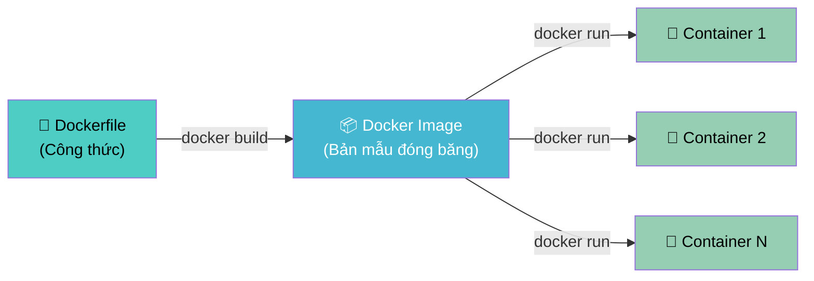
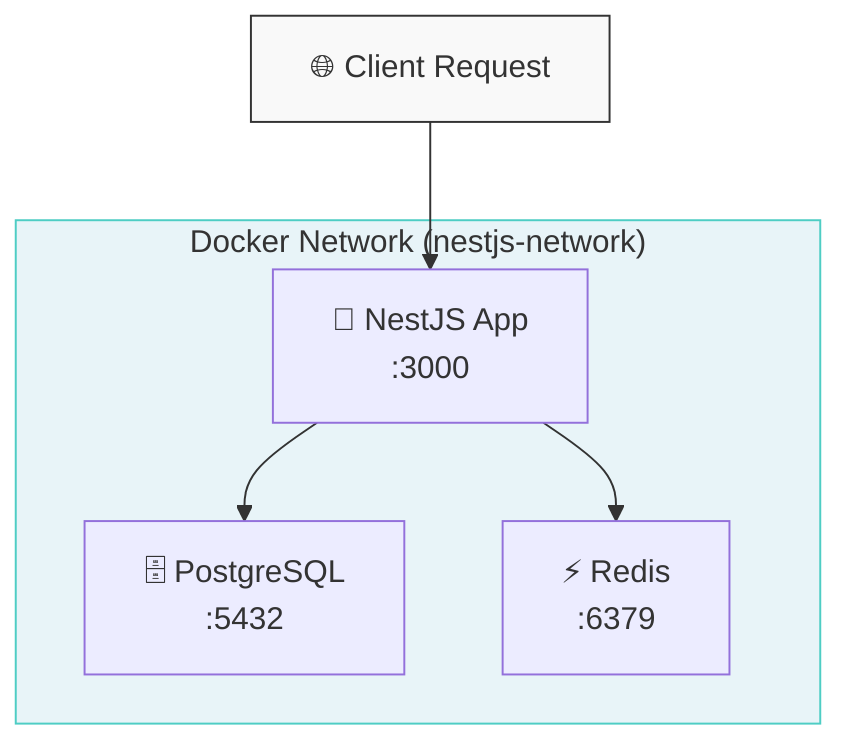
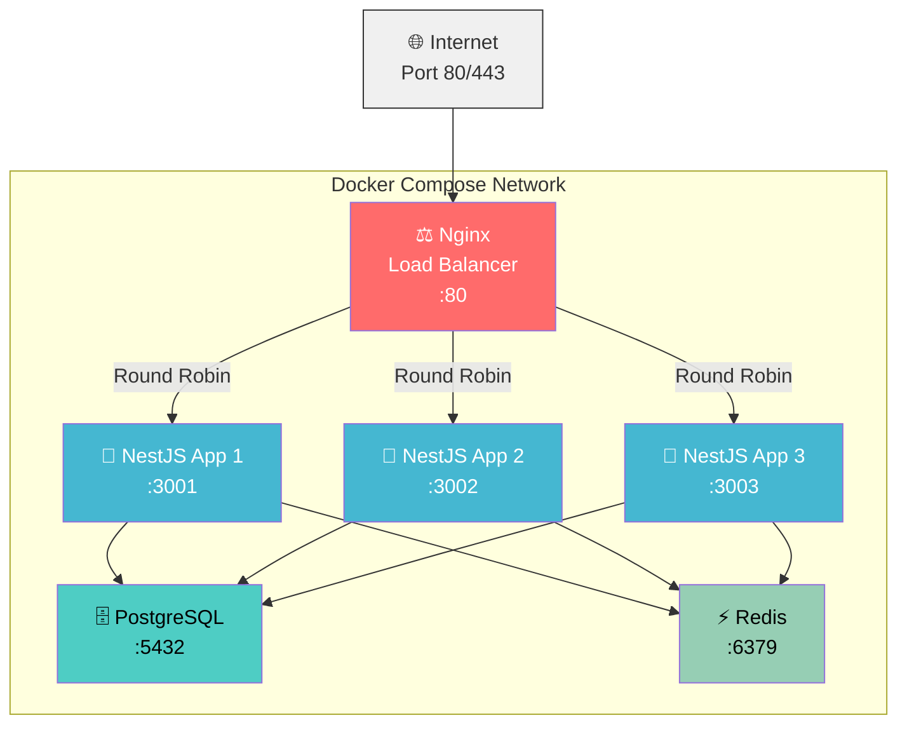
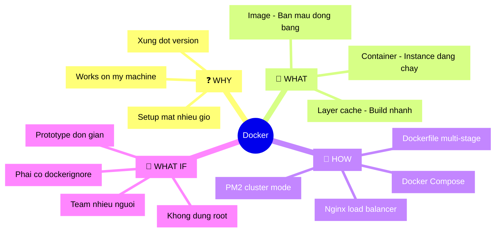

## 📋 Agenda

**Thời gian đọc ước tính:** ~20 phút

### Sau bài này, bạn sẽ:
- ✅ **Hiểu** được tại sao Docker ra đời và vấn đề nó giải quyết
- ✅ **Viết** được Dockerfile tối ưu cho NestJS với multi-stage build
- ✅ **Cấu hình** được Docker Compose cho môi trường dev và production
- ✅ **Triển khai** được hệ thống production với Nginx Load Balancer + PM2

### Yêu cầu đầu vào (Prerequisites):
- 🔹 Biết cơ bản về Node.js và NestJS
- 🔹 Đã cài Docker Desktop trên máy
- 🔹 Hiểu khái niệm cơ bản về HTTP và server

<!-- truncate -->

---

## ❓ Vấn đề & Giải pháp của Docker

**Vấn đề (Problem Statement):**
- Code chạy ngon trên máy Dev → lên server Production lại báo lỗi ("It works on my machine!")
- Xung đột version Node.js/thư viện khi chạy nhiều project trên cùng một server
- Setup môi trường mới mất hàng giờ, dễ bỏ sót bước cấu hình

**Giải pháp (Solution):**
Docker đóng gói toàn bộ ứng dụng — code, runtime, dependencies, config — vào một **Container** (đơn vị cô lập). Container chạy giống hệt nhau trên mọi máy, từ laptop của Dev đến server Production.

---

## 📖 Docker hoạt động như thế nào?

**Định nghĩa:** Docker là nền tảng **containerization** giúp tạo, chạy và quản lý ứng dụng bên trong các Container dựa trên nhân Linux (Linux namespaces + cgroups).

**Kiến trúc cốt lõi:**



- **Image:** Template bất biến chứa OS layer, runtime (Node.js), và application code
- **Container:** Instance đang chạy được sinh ra từ Image — nhẹ, cô lập, có thể nhân bản

**So sánh nhanh VM vs Container:**

| | Virtual Machine | Container |
|---|---|---|
| Khởi động | ~1-2 phút | ~1-2 giây |
| Kích thước | Vài GB | Vài MB - vài trăm MB |
| Cô lập | Full OS (nặng) | Process-level (nhẹ) |
| Chia sẻ tài nguyên | Khó | Dễ |

---

## 🔨 Phần 1: Dockerfile cho NestJS

### Dockerfile cơ bản (KHÔNG nên dùng production)

```dockerfile
# filename: Dockerfile.simple (CHỈ để học - KHÔNG dùng production)

FROM node:20

WORKDIR /app

COPY . .

RUN npm install

RUN npm run build

EXPOSE 3000

CMD ["node", "dist/main.js"]
```

❌ **Vấn đề:** Image nặng (~1.5GB), chứa devDependencies, source TS thừa, chạy với quyền root.

---

### ✅ Dockerfile production với Multi-stage Build

**Multi-stage build** = dùng nhiều `FROM` trong một Dockerfile. Stage trước build xong → stage sau chỉ copy artifact cần thiết. Image cuối cùng không chứa build tools.

```dockerfile
# filename: Dockerfile

# ============================================================
# STAGE 1: Builder — Cài đủ deps, compile TypeScript
# ============================================================
FROM node:20-alpine AS builder

WORKDIR /app

# Copy package files TRƯỚC source code
# → Docker cache layer: chỉ rebuild khi package.json thay đổi
COPY package*.json ./

# Cài toàn bộ deps (bao gồm devDependencies để build TS)
RUN npm ci

COPY . .

# Build TypeScript → JavaScript (output vào /app/dist)
RUN npm run build

# ============================================================
# STAGE 2: Production — Chỉ chứa những gì cần để chạy
# ============================================================
FROM node:20-alpine AS production

# Thêm metadata để tracking image
LABEL maintainer="anhtus <anhtus@example.com>"
LABEL version="1.0"

WORKDIR /app

# Tạo user không có quyền root để tăng bảo mật
# → Nếu container bị tấn công, attacker không có quyền root hệ thống
RUN addgroup -g 1001 -S nodejs && \
    adduser -S nestjs -u 1001

# Set production mode — NestJS tắt debug logs, tối ưu performance
ENV NODE_ENV=production
ENV PORT=3000

# Copy package files để cài production deps
COPY package*.json ./

# Chỉ cài production dependencies (loại bỏ typescript, @types/*, jest...)
RUN npm ci --omit=dev && npm cache clean --force

# Copy compiled code từ stage builder
COPY --from=builder /app/dist ./dist

# Chuyển sang user không-root trước khi chạy app
USER nestjs

EXPOSE 3000

# Kiểm tra health của container
HEALTHCHECK --interval=30s --timeout=10s --start-period=30s --retries=3 \
    CMD wget --no-verbose --tries=1 --spider http://localhost:3000/health || exit 1

CMD ["node", "dist/main.js"]
```

**.dockerignore** — bắt buộc có để tránh copy rác vào image:

```
# filename: .dockerignore

node_modules
dist
.git
.gitignore
*.md
.env
.env.*
coverage
.nyc_output
logs
*.log
Dockerfile*
docker-compose*
.dockerignore
```

**Kết quả:** Image giảm từ ~1.5GB xuống còn ~180MB 🎉

---

### Health Check Endpoint trong NestJS

```typescript
// filename: src/health/health.controller.ts

import { Controller, Get } from '@nestjs/common';

@Controller('health')
export class HealthController {
  @Get()
  check() {
    // Docker HEALTHCHECK sẽ gọi endpoint này mỗi 30s
    // Trả về 200 → container "healthy", tiếp nhận traffic
    return { status: 'ok', timestamp: new Date().toISOString() };
  }
}
```

---

## 🔨 Phần 2: Docker Compose

### Docker Compose là gì?

Docker Compose = công cụ định nghĩa và chạy **multi-container** applications bằng file YAML. Thay vì chạy hàng loạt lệnh `docker run`, ta chỉ cần:

```bash
docker compose up -d
```

**Kiến trúc hệ thống với Docker Compose:**



---

### docker-compose.yml cho Development

```yaml
# filename: docker-compose.dev.yml
# Dùng cho môi trường phát triển local

services:
  # ---- PostgreSQL Database ----
  postgres:
    image: postgres:16-alpine
    container_name: nestjs_postgres_dev
    environment:
      POSTGRES_DB: nestjs_db
      POSTGRES_USER: postgres
      POSTGRES_PASSWORD: postgres123
    ports:
      # Expose ra ngoài để dùng với DB client (DBeaver, TablePlus)
      - "5432:5432"
    volumes:
      # Persist data khi container restart
      - postgres_data:/var/lib/postgresql/data
    healthcheck:
      test: ["CMD-SHELL", "pg_isready -U postgres"]
      interval: 10s
      timeout: 5s
      retries: 5

  # ---- Redis Cache ----
  redis:
    image: redis:7-alpine
    container_name: nestjs_redis_dev
    ports:
      - "6379:6379"
    command: redis-server --appendonly yes
    volumes:
      - redis_data:/data

  # ---- NestJS Application ----
  app:
    build:
      context: .
      # Dùng target builder (stage 1) để có hot-reload
      target: builder
    container_name: nestjs_app_dev
    env_file:
      - .env.development
    ports:
      - "3000:3000"
    volumes:
      # Mount source code để hot-reload khi code thay đổi
      - .:/app
      # Tránh override node_modules trong container bằng node_modules local
      - /app/node_modules
    command: npm run start:dev
    depends_on:
      postgres:
        condition: service_healthy
      redis:
        condition: service_started

volumes:
  postgres_data:
  redis_data:
```

---

### Environment file

```bash
# filename: .env.development

# Database
DATABASE_HOST=postgres
DATABASE_PORT=5432
DATABASE_NAME=nestjs_db
DATABASE_USER=postgres
DATABASE_PASSWORD=postgres123

# Redis
REDIS_HOST=redis
REDIS_PORT=6379

# App
PORT=3000
NODE_ENV=development
JWT_SECRET=dev_secret_change_in_production
```

> ⚠️ **Lưu ý quan trọng:** `DATABASE_HOST=postgres` — đây là **service name** trong docker-compose, không phải `localhost`. Docker Compose tự tạo internal DNS giữa các services.

---

## 🚀 Phần 3: Triển khai Production

### Kiến trúc Production



---

### PM2 trong Container

**PM2** = Process Manager cho Node.js. Trong Docker, PM2 giúp:
- Tận dụng **toàn bộ CPU cores** qua Cluster Mode
- **Tự khởi động lại** khi process crash
- **Graceful reload** khi deploy version mới (zero-downtime)

```javascript
// filename: ecosystem.config.js
// Cấu hình PM2 — chạy bên trong container

module.exports = {
  apps: [
    {
      name: 'nestjs-app',
      script: 'dist/main.js',

      // Cluster mode: PM2 tạo N workers = N CPU cores
      // → Tận dụng tối đa CPU, không bị block bởi Event Loop
      instances: 'max',
      exec_mode: 'cluster',

      // QUAN TRỌNG: log ra stdout/stderr thay vì file
      // → Docker log driver mới capture được
      out_file: '/dev/stdout',
      error_file: '/dev/stderr',
      log_date_format: 'YYYY-MM-DD HH:mm:ss',

      // Graceful shutdown: đợi request đang xử lý xong
      // trước khi kill process (tránh 502 khi deploy)
      kill_timeout: 5000,
      listen_timeout: 10000,

      // Restart policy
      max_restarts: 10,
      min_uptime: '10s',

      env: {
        NODE_ENV: 'production',
      },
    },
  ],
};
```

**Dockerfile production với PM2:**

```dockerfile
# filename: Dockerfile.production

# Stage 1: Builder
FROM node:20-alpine AS builder
WORKDIR /app
COPY package*.json ./
RUN npm ci
COPY . .
RUN npm run build

# Stage 2: Production với PM2
FROM node:20-alpine AS production

# Cài PM2 globally — process manager cho production
RUN npm install -g pm2

WORKDIR /app

RUN addgroup -g 1001 -S nodejs && \
    adduser -S nestjs -u 1001

ENV NODE_ENV=production

COPY package*.json ./
RUN npm ci --omit=dev && npm cache clean --force

# Copy compiled code
COPY --from=builder /app/dist ./dist

# Copy PM2 config
COPY ecosystem.config.js .

USER nestjs

EXPOSE 3000

HEALTHCHECK --interval=30s --timeout=10s --start-period=40s --retries=3 \
    CMD wget --no-verbose --tries=1 --spider http://localhost:3000/health || exit 1

# Chạy qua PM2 thay vì node trực tiếp
CMD ["pm2-runtime", "ecosystem.config.js"]
```

> 💡 `pm2-runtime` = PM2 dạng foreground (không daemon) — phù hợp trong Docker vì container cần 1 process foreground để tồn tại.

---

### Nginx Load Balancer Config

```nginx
# filename: nginx/nginx.conf

upstream nestjs_backends {
    # Round-robin (mặc định): phân phối đều request cho các backend
    server app_1:3000;
    server app_2:3000;
    server app_3:3000;

    # Keepalive: giữ connection pool với backends
    # → Giảm overhead TCP handshake, tăng throughput
    keepalive 32;
}

server {
    listen 80;
    server_name _;

    # Security headers
    add_header X-Frame-Options DENY;
    add_header X-Content-Type-Options nosniff;
    add_header X-XSS-Protection "1; mode=block";

    # Giới hạn request body (bảo vệ khỏi large payload attack)
    client_max_body_size 10m;

    location / {
        proxy_pass http://nestjs_backends;

        # Truyền thông tin client thật cho NestJS
        proxy_set_header Host $host;
        proxy_set_header X-Real-IP $remote_addr;
        proxy_set_header X-Forwarded-For $proxy_add_x_forwarded_for;
        proxy_set_header X-Forwarded-Proto $scheme;

        # HTTP/1.1 bắt buộc cho keepalive connection
        proxy_http_version 1.1;
        proxy_set_header Connection "";

        # Timeout settings
        proxy_connect_timeout 30s;
        proxy_send_timeout 30s;
        proxy_read_timeout 30s;
    }

    # Health check endpoint cho load balancer
    location /health {
        proxy_pass http://nestjs_backends;
        proxy_set_header Host $host;
    }

    # Nginx status (chỉ cho phép local access)
    location /nginx_status {
        stub_status on;
        allow 127.0.0.1;
        deny all;
    }
}
```

---

### docker-compose.production.yml

```yaml
# filename: docker-compose.production.yml

services:
  # ---- Nginx Load Balancer ----
  nginx:
    image: nginx:alpine
    container_name: nginx_lb
    ports:
      - "80:80"
      # - "443:443"  # Uncomment khi có SSL cert
    volumes:
      - ./nginx/nginx.conf:/etc/nginx/conf.d/default.conf:ro
      # - ./nginx/ssl:/etc/nginx/ssl:ro  # SSL certificates
    depends_on:
      - app_1
      - app_2
      - app_3
    restart: always
    networks:
      - app_network

  # ---- NestJS Instance 1 ----
  app_1:
    build:
      context: .
      dockerfile: Dockerfile.production
      target: production
    container_name: nestjs_app_1
    env_file:
      - .env.production
    environment:
      # Override port để distinguish nhau trong logs
      PORT: 3000
    restart: always
    networks:
      - app_network
    depends_on:
      postgres:
        condition: service_healthy
      redis:
        condition: service_started
    # Giới hạn tài nguyên — tránh 1 container ăn hết RAM/CPU
    deploy:
      resources:
        limits:
          cpus: '1.0'
          memory: 512M
        reservations:
          cpus: '0.25'
          memory: 128M

  # ---- NestJS Instance 2 ----
  app_2:
    build:
      context: .
      dockerfile: Dockerfile.production
      target: production
    container_name: nestjs_app_2
    env_file:
      - .env.production
    environment:
      PORT: 3000
    restart: always
    networks:
      - app_network
    depends_on:
      postgres:
        condition: service_healthy
      redis:
        condition: service_started
    deploy:
      resources:
        limits:
          cpus: '1.0'
          memory: 512M
        reservations:
          cpus: '0.25'
          memory: 128M

  # ---- NestJS Instance 3 ----
  app_3:
    build:
      context: .
      dockerfile: Dockerfile.production
      target: production
    container_name: nestjs_app_3
    env_file:
      - .env.production
    environment:
      PORT: 3000
    restart: always
    networks:
      - app_network
    depends_on:
      postgres:
        condition: service_healthy
      redis:
        condition: service_started
    deploy:
      resources:
        limits:
          cpus: '1.0'
          memory: 512M
        reservations:
          cpus: '0.25'
          memory: 128M

  # ---- PostgreSQL Database ----
  postgres:
    image: postgres:16-alpine
    container_name: nestjs_postgres_prod
    env_file:
      - .env.production
    environment:
      POSTGRES_DB: ${DATABASE_NAME}
      POSTGRES_USER: ${DATABASE_USER}
      POSTGRES_PASSWORD: ${DATABASE_PASSWORD}
    volumes:
      - postgres_prod_data:/var/lib/postgresql/data
    # KHÔNG expose port ra ngoài — chỉ accessible trong network nội bộ
    expose:
      - "5432"
    healthcheck:
      test: ["CMD-SHELL", "pg_isready -U ${DATABASE_USER} -d ${DATABASE_NAME}"]
      interval: 10s
      timeout: 5s
      retries: 5
      start_period: 30s
    restart: always
    networks:
      - app_network
    deploy:
      resources:
        limits:
          cpus: '1.0'
          memory: 1G

  # ---- Redis Cache ----
  redis:
    image: redis:7-alpine
    container_name: nestjs_redis_prod
    command: redis-server --appendonly yes --requirepass ${REDIS_PASSWORD}
    volumes:
      - redis_prod_data:/data
    expose:
      - "6379"
    restart: always
    networks:
      - app_network
    deploy:
      resources:
        limits:
          cpus: '0.5'
          memory: 256M

volumes:
  postgres_prod_data:
    driver: local
  redis_prod_data:
    driver: local

networks:
  app_network:
    driver: bridge
```

---

### NestJS: Cấu hình Graceful Shutdown

```typescript
// filename: src/main.ts

import { NestFactory } from '@nestjs/core';
import { AppModule } from './app.module';

async function bootstrap() {
  const app = await NestFactory.create(AppModule);

  // BẮT BUỘC: Enable shutdown hooks cho Docker/PM2
  // → Khi container nhận SIGTERM, NestJS đóng kết nối DB
  //   và xử lý xong request đang pending trước khi thoát
  app.enableShutdownHooks();

  const port = process.env.PORT || 3000;
  await app.listen(port);
  console.log(`Application running on port ${port}`);
}

bootstrap();
```

---

### Script triển khai production

```bash
# filename: scripts/deploy.sh

#!/bin/bash

set -e  # Dừng ngay nếu có lỗi

echo "🚀 Starting production deployment..."

# Pull latest code
git pull origin main

# Build images mới
docker compose -f docker-compose.production.yml build --no-cache

# Zero-downtime deployment: restart từng service một
echo "🔄 Rolling restart with zero downtime..."
docker compose -f docker-compose.production.yml up -d --no-deps app_1
sleep 10  # Đợi app_1 healthy

docker compose -f docker-compose.production.yml up -d --no-deps app_2
sleep 10

docker compose -f docker-compose.production.yml up -d --no-deps app_3

# Restart nginx để pickup config mới (nếu có thay đổi)
docker compose -f docker-compose.production.yml restart nginx

echo "✅ Deployment completed!"
docker compose -f docker-compose.production.yml ps
```

---

## 🚀 Khi nào dùng, khi nào không?

| ✅ NÊN dùng Docker | ❌ KHÔNG nên dùng |
|---|---|
| Team > 2 người, cần môi trường nhất quán | Script chạy một lần, không cần isolate |
| Microservices nhiều services phụ thuộc nhau | Ứng dụng cần access trực tiếp phần cứng (GPU, USB) |
| CI/CD pipeline cần môi trường sạch | Prototype cá nhân đơn giản, chỉ 1 service |
| Production deployment cần scale horizontal | Team chưa đủ kiến thức Docker sẽ tăng ops burden |

---

### ⚠️ Common Pitfalls (Bẫy hay gặp)

**1. Chạy process với quyền root trong container**
```dockerfile
# ❌ Mặc định container chạy root — lỗ hổng bảo mật
FROM node:20-alpine
CMD ["node", "dist/main.js"]

# ✅ Tạo user riêng
RUN adduser -S nestjs -u 1001
USER nestjs
CMD ["node", "dist/main.js"]
```

**2. Không dùng `.dockerignore`**
- `node_modules` có thể nặng hàng GB
- Copy vào image context → docker build cực chậm

**3. Dùng `localhost` thay vì service name**
```bash
# ❌ Sai — localhost trong container chỉ là chính container đó
DATABASE_HOST=localhost

# ✅ Đúng — dùng service name trong docker-compose
DATABASE_HOST=postgres
```

**4. Không set resource limits**
Một container hết bộ nhớ sẽ kéo chết toàn bộ server. Luôn set `memory: 512M` cho mỗi service.

**5. Commit `.env` lên Git**
File `.env.production` chứa secrets → KHÔNG BAO GIỜ commit lên repo. Dùng `.gitignore`.

---

## 🗺️ Tổng kết — MECE Mindmap



---

> **Made by Anh Tu - Share to be share**
