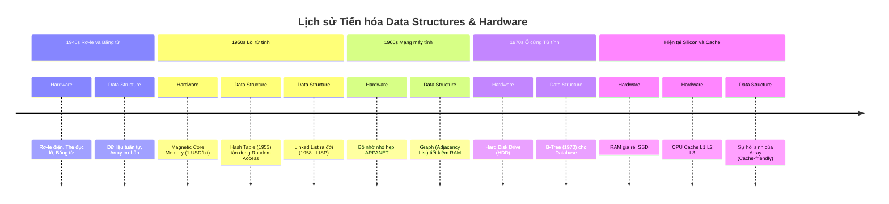

# Lịch sử Cấu trúc Dữ liệu: Từ Rơ-le điện đến CPU Cache

Bạn đã bao giờ tự hỏi: *"Tại sao chúng ta phải học Linked List trong khi Array xài vừa dễ vừa nhanh?"* hay *"B-Tree sinh ra để làm gì khi đã có Binary Search Tree?"*

Các sinh viên CNTT thường được dạy Cấu trúc dữ liệu (Data Structures) như những khái niệm toán học khô khan. Nhưng sự thật là: **Không có cấu trúc dữ liệu nào tự nhiên sinh ra. Chúng được sinh ra trong máu, mồ hôi và nước mắt của các kỹ sư thời sơ khai để "thích nghi" với sự thiếu thốn và đắt đỏ kinh khủng của bộ nhớ phần cứng.**

Bài viết này sẽ đưa bạn cỗ máy thời gian, quay về những năm 1950, để thấy rằng Khoa học máy tính thực chất là cuộc chạy đua giữa **Sự thông minh của Thuật toán** và **Sự giới hạn của Phần cứng**.

<!--truncate-->

## 🕰️ Timeline: Cuộc chạy đua Phần cứng & Thuật toán

Trước khi đi vào chi tiết, hãy cùng nhìn lướt qua dòng thời gian tiến hóa vĩ đại này:

---

## Kỷ nguyên 1: Rơ-le điện và Sự gò bó của Dữ liệu Tuần tự (1940s)

Hãy tưởng tượng bạn đang lập trình cho ENIAC hay Harvard Mark I. Không có màn hình, không có bàn phím. Bộ nhớ của máy tính là những chiếc **Thẻ đục lỗ (Punch cards)** hoặc **Băng từ (Magnetic Tape)**.

### Giới hạn phần cứng:
Băng từ hoạt động giống hệt cuộn băng cassette của ông bà chúng ta. Để nghe bài hát thứ 5, bạn bắt buộc phải tua qua 4 bài đầu tiên. Đây gọi là **Truy cập Tuần tự (Sequential Access)**.
Bạn không thể "nhảy" một phát đến vị trí mình muốn. 

### Cấu trúc dữ liệu tương ứng: Mảng (Array)
Vì tính chất vật lý của Băng từ là một dải dài liên tục, cấu trúc dữ liệu duy nhất có ý nghĩa lúc này là **Array (Mảng)** hoặc List tuần tự. Dữ liệu bắt buộc phải được xếp sát cạnh nhau. Nếu bạn muốn chèn một dữ liệu mới vào giữa băng từ? Bạn phải copy toàn bộ nửa sau của cuộn băng sang một cuộn băng khác để chừa chỗ trống. Một cơn ác mộng thực sự!

---

## Kỷ nguyên 2: Lõi Từ Tính đắt đỏ và "Kẻ cứu rỗi" Linked List (1950s)

Đến giữa những năm 1950, nhân loại đón nhận một phát minh mang tính cách mạng: **Magnetic Core Memory (Bộ nhớ Lõi từ tính)**.
Lần đầu tiên trong lịch sử, máy tính có thể "chỉ tay" vào một vị trí bất kỳ trong bộ nhớ và lấy dữ liệu ra ngay lập tức mà không cần tua băng. Đây là khởi thủy của **RAM (Random Access Memory)**.

Nhưng có một cái giá phải trả: **Nó đắt một cách vô lý.**
Mỗi bit nhớ (chứa số 0 hoặc 1) là một vòng khuyên kim loại nhỏ xíu, được các nữ công nhân **đan bằng tay** qua kính hiển vi. Giá của bộ nhớ lõi từ tính thời điểm đó lên tới **1 USD cho MỖI BIT** (Tương đương với việc thanh RAM 8GB hiện tại của bạn sẽ có giá khoảng... 64 tỷ USD!).

### Vấn đề: Sự phân mảnh (Fragmentation)
Vì bộ nhớ quá đắt, mọi byte đều là vàng. Nếu bạn dùng **Array**, bạn bắt buộc phải xin Hệ điều hành một vùng nhớ **Liên tục (Contiguous)**. Nhưng nếu RAM đang bị phân mảnh (chỗ này trống 2 byte, chỗ kia trống 3 byte) thì Hệ điều hành bó tay, không thể tạo ra mảng 5 byte được dù tổng dung lượng vẫn còn!

### Giải pháp: Sự ra đời của Linked List (Danh sách liên kết)
Năm 1958, **John McCarthy** (Cha đẻ của Trí tuệ nhân tạo) đang thiết kế ngôn ngữ **LISP** trên siêu máy tính **IBM 704**. Ông tuyệt vọng trước việc quản lý bộ nhớ đắt đỏ.

Ông phát hiện ra một tính năng thú vị của phần cứng IBM 704: Mỗi thanh ghi (Word) của nó dài 36-bit, được chia làm 2 thanh ghi con: **Address (15-bit)** và **Decrement (15-bit)**.
Ý tưởng lóe sáng: *Tại sao không dùng một nửa chứa Dữ liệu, nửa kia chứa ĐỊA CHỈ TRỎ TỚI vùng nhớ tiếp theo?*

Thuật ngữ kinh điển của LISP ra đời:
- **`car`** (Contents of the Address part of Register): Chứa Dữ liệu.
- **`cdr`** (Contents of the Decrement part of Register): Chứa Con trỏ (Pointer).

Bùm! **Linked List** chính thức ra đời. Nhờ con trỏ `cdr`, dữ liệu không cần nằm liên tiếp nhau nữa. Chúng có thể nằm rải rác ở bất kỳ đâu trong RAM, "tận thu" từng byte trống lẻ tẻ cuối cùng, giải cứu các máy tính khỏi thảm họa phân mảnh bộ nhớ.

---

## Sự ma thuật của Random Access và Hash Table (1953)

Cũng trong chính kỷ nguyên Lõi từ tính đắt đỏ này, một đặc tính cực kỳ quan trọng của bộ nhớ mới đã thay đổi hoàn toàn cách chúng ta tìm kiếm: **Random Access (Truy cập ngẫu nhiên)**. Khác với Băng từ phải tua đi tua lại, lõi từ tính cho phép máy tính lấy dữ liệu ở bất kỳ địa chỉ nào với cùng một tốc độ $O(1)$.

Năm 1953, **Hans Peter Luhn** (nhà nghiên cứu tại IBM) đã nảy ra một ý tưởng điên rồ: Thay vì phải chạy vòng lặp tìm kiếm trên một mảng dài ngoẵng (rất tốn CPU), tại sao không lấy "từ khóa" đem băm (Hash) ra thành một con số toán học, và dùng con số đó làm ĐỊA CHỈ TRỰC TIẾP trong RAM? 

Ý tưởng này khai sinh ra **Hash Table (Bảng băm)** — cấu trúc dữ liệu sinh ra để vắt kiệt tối đa sức mạnh "Random Access" của phần cứng, biến việc tìm kiếm từ $O(N)$ xuống còn $O(1)$ thần tốc.

---

## Mạng máy tính và Sự chật vật của Đồ thị (1960s)

Khoa học máy tính tiến đến cuối những năm 1960, sự ra đời của mạng ARPANET (tiền thân của Internet) mang đến một bài toán mới: Làm sao để biểu diễn các điểm kết nối (Nodes) và đường đi (Edges)? Toán học đã có sẵn khái niệm **Graph (Đồ thị)** từ hàng trăm năm trước nhờ Leonhard Euler. Nhưng đem Graph vào RAM lại là một câu chuyện khác.

Cách ngây ngô nhất để biểu diễn Graph là dùng **Adjacency Matrix (Ma trận kề)** — một mảng 2 chiều có kích thước $V \times V$ (V là số lượng điểm). Nhưng nếu mạng ARPANET có 1000 máy tính, bạn cần một mảng $1000 \times 1000 = 1,000,000$ ô nhớ. Với cái giá cắt cổ của RAM thời bấy giờ, việc dùng Matrix là điều bất khả thi, chưa kể phần lớn ma trận chứa số 0 (không có kết nối), gây lãng phí bộ nhớ thảm hại.

**Giải pháp?** Các kỹ sư đã phải vay mượn lại phát minh Linked List của John McCarthy để tạo ra **Adjacency List (Danh sách kề)**. Thay vì cấp phát một ma trận khổng lồ, mỗi điểm máy tính chỉ lưu một mảng nhỏ (hoặc Linked List) trỏ đến các máy mà nó thực sự kết nối. Sự chật vật này đã tiết kiệm được hàng megabyte RAM quý giá, cho phép các thuật toán như tìm đường ngắn nhất (Dijkstra) có thể chạy mượt mà trên phần cứng hạn hẹp.

---

## Kỷ nguyên 3: Đĩa cứng cơ học và Sự thống trị của B-Tree (1970s)

Tiến vào thập niên 70, dữ liệu bùng nổ. Người ta không thể ném mọi thứ lên RAM được nữa (vì tắt máy là mất). Họ phải lưu vào **Hard Disk Drive (Ổ đĩa cứng HDD)**.

### Giới hạn phần cứng:
Khác với RAM truy cập bằng điện, HDD truy cập bằng **Đầu từ cơ học (Mechanical Arm)**. Để đọc 1 file, ổ đĩa phải quay (Spin) và đầu từ phải di chuyển vật lý đến đúng Sector. Tốc độ này chậm hơn RAM hàng vạn lần!
Nếu bạn dùng Binary Search Tree (Cây nhị phân) để tìm kiếm trên ổ đĩa, với 1 triệu bản ghi, cây nhị phân sẽ có độ sâu 20 tầng. Đầu từ cơ học sẽ phải "chạy tới chạy lui" đọc ổ đĩa 20 lần. Quá chậm!

### Giải pháp: B-Tree
Năm 1970, Rudolf Bayer và Edward M. McCreight phát minh ra **B-Tree**. 
Thay vì cây nhị phân gầy gò (mỗi Node chứa 1 dữ liệu và 2 con), B-Tree là một cái cây "Mập mạp". Mỗi Node của B-Tree được thiết kế to đúng bằng **1 Page (Block)** của ổ đĩa (thường là 4KB), chứa hàng trăm con số và hàng trăm nhánh con bên trong nó.

Kết quả? Thay vì phải đọc ổ cứng 20 lần, B-Tree ép độ sâu của cây xuống cực thấp. Nó chỉ cần đọc đĩa đúng **3 đến 4 lần** là tìm ra bản ghi trong hàng triệu tỷ dòng dữ liệu. 
Cho đến tận giây phút bạn đọc bài viết này, mọi Database Relational (MySQL, PostgreSQL) vẫn đang chạy trên xương sống của B-Tree.

---

## Kỷ nguyên Hiện đại: Kẻ bị hắt hủi và Sự báo thù của Array

Chào mừng đến thế kỷ 21. Chúng ta đang sống trong kỷ nguyên ngập ngụa RAM. DDR4, DDR5 rẻ như bèo. Không ai còn sợ phân mảnh bộ nhớ nữa.

Nhưng một rào cản vật lý mới lại xuất hiện: **Độ trễ của RAM**.
CPU hiện đại xử lý hàng tỷ phép tính mỗi giây, trong khi RAM lại đưa dữ liệu lên quá chậm. Để CPU không phải "chờ đợi", các kỹ sư tạo ra **CPU Cache (L1, L2, L3)** — một bộ nhớ siêu nhỏ nhưng tốc độ ngang ngửa ánh sáng nằm ngay trong CPU.

### Sự suy tàn của Linked List
CPU Cache có một quy tắc: Nó không load từng byte, nó load **từng Block (Cache Line)** khoảng 64 Bytes mỗi lần. Nó giả định rằng: *"Nếu anh vừa đọc Byte số 1, khả năng cao anh sẽ đọc luôn Byte số 2, số 3. Tôi gom hết lên Cache cho nhanh"*.

Đây là lúc Linked List nhận trái đắng. Các Node của Linked List nằm rải rác khắp nơi trong RAM. CPU load Node A lên Cache, nhưng Node B lại nằm tuốt ở góc khác. Hiện tượng **Cache Miss** xảy ra liên tục, CPU lại phải lọ mọ xuống RAM tìm dữ liệu.

### Sự báo thù của Array
Đột nhiên, gã nhà quê **Array (Mảng)** từ những năm 1940 trở lại ngai vàng. Vì Array lưu dữ liệu sát vách nhau (Contiguous), khi CPU load phần tử `A[0]`, nó tự động bê luôn `A[1], A[2]` lên Cache L1. 
Kết quả thực tế phũ phàng: Mặc dù Insert vào giữa Linked List trên lý thuyết là `O(1)`, nhưng chạy thực tế trên phần cứng hiện đại, Insert vào **Array** đôi khi còn nhanh hơn do sức mạnh của CPU Cache!

---

## Lời kết

Học Cấu trúc Dữ liệu không phải là học thuộc lòng những đoạn code khô khan để thi qua môn.
Đằng sau mỗi thuật toán là những rào cản vật lý, những giới hạn về kỹ thuật mà các thế hệ kỹ sư đi trước đã dùng bộ não của mình để phá vỡ.

- Array sinh ra vì sự tuần tự của băng từ.
- Linked List sinh ra vì cái giá cắt cổ 1 USD/bit của RAM lõi từ.
- B-Tree sinh ra vì sự chậm chạp cơ học của đĩa cứng quay.

Máy tính đang tiếp tục tiến hóa (với Quantum Computing, Neural Engines). Và chắc chắn, những giới hạn phần cứng mới sẽ lại sinh ra những Cấu trúc dữ liệu mới trong tương lai.

---
*Made by Anh Tu - Share to be share*
