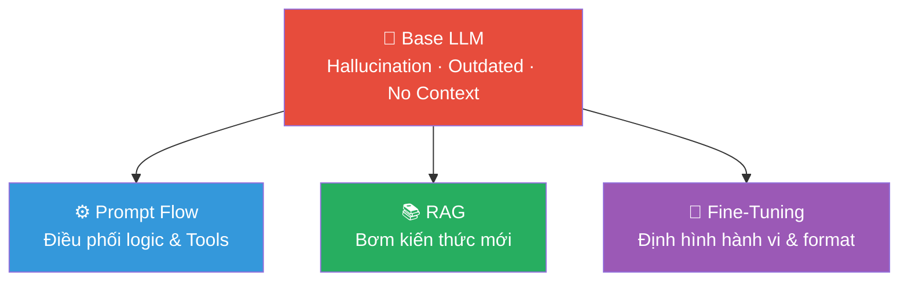
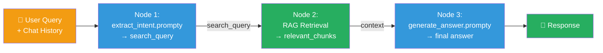
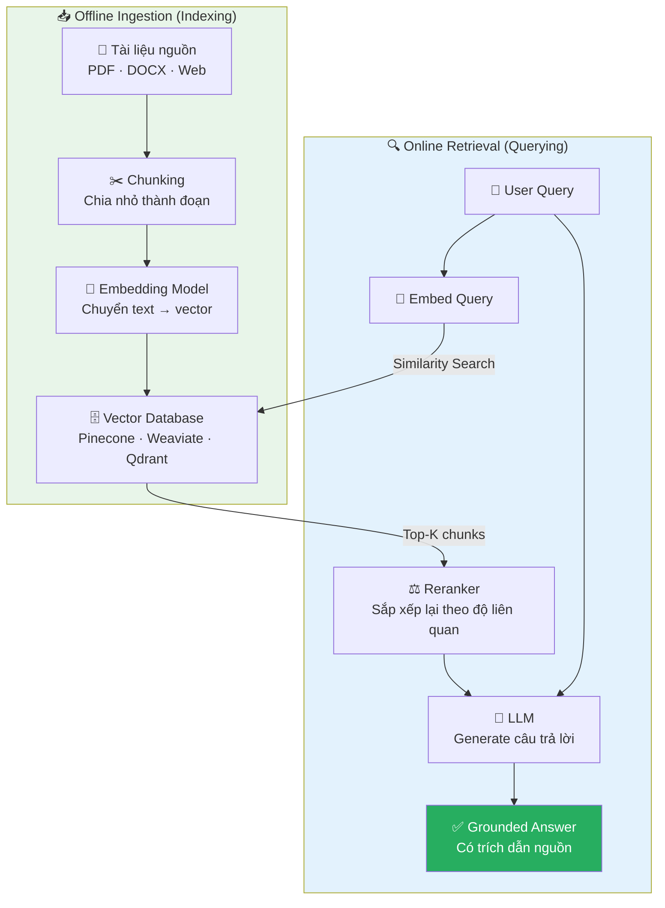
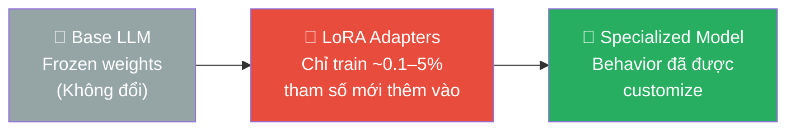

import Tabs from '@theme/Tabs';
import TabItem from '@theme/TabItem';

## Agenda

**Thời gian đọc ước tính:** ~20 phút

### Sau bài này, bạn sẽ:
- **Nắm vững** các kỹ thuật Prompt Engineering cốt lõi: Zero-shot, Few-shot, Chain-of-Thought, ReAct
- **Giải thích** được sự khác biệt cốt lõi giữa Prompt Flow, RAG và Fine-tuning
- **Thiết kế** được kiến trúc RAG pipeline cơ bản cho một dự án thực tế
- **Phân biệt** được khi nào dùng phương pháp nào — và **tại sao** không phải lúc nào cũng cần Fine-tuning
- **Áp dụng** được Decision Tree để ra quyết định kỹ thuật trong dự án thực
---

<!-- truncate -->

## Vấn đề & Tại sao cần 3 phương pháp này?

### Nỗi đau của doanh nghiệp khi dùng Base LLM

Khi một công ty triển khai ChatGPT hay Gemini vào sản phẩm, họ gặp ngay 3 vấn đề không thể bỏ qua:

- **Hallucination (Ảo giác):** Model tự tin bịa đặt thông tin — nguy hiểm với bài toán pháp lý, y tế, tài chính.
- **Knowledge Cutoff (Kiến thức lỗi thời):** Model mù tịt về sự kiện xảy ra sau ngày training. Hỏi giá cổ phiếu hôm nay? Không biết.
- **Lack of Context (Thiếu ngữ cảnh nội bộ):** Model không biết quy trình, văn hóa, dữ liệu bảo mật của riêng doanh nghiệp bạn.

### Giải pháp — Bộ ba công cụ can thiệp

:::tip Tưởng tượng
LLM giống như một **Thực tập sinh siêu thông minh nhưng mới ra trường**:
- Cần quy trình làm việc rõ ràng từng bước → **Prompt Flow**
- Cần quyền truy cập vào Wiki/Tài liệu nội bộ để tra cứu → **RAG**
- Cần "Đào tạo" nghiệp vụ & Văn hóa doanh nghiệp 3 tháng → **Fine-Tuning**
:::



---

## Phần 1: Kỹ Thuật Prompt Engineering — Tầng Nền Tảng

### Định nghĩa kỹ thuật

**Prompt Engineering** là nghệ thuật thiết kế đầu vào (input) cho LLM — bao gồm cấu trúc câu hỏi, ví dụ minh họa, và hướng dẫn định dạng — nhằm bộc lộ tối đa năng lực tiềm ẩn của mô hình mà không thay đổi bất kỳ trọng số (weight) nào.

:::note Nguyên lý cốt lõi
LLM không thay đổi — **cách hỏi** thay đổi chất lượng output hoàn toàn. Đây là lớp can thiệp chi phí thấp nhất, triển khai nhanh nhất, và là điểm khởi đầu **bắt buộc** trước khi cân nhắc các kỹ thuật nâng cao (RAG, Fine-tuning).
:::

### Các kỹ thuật cơ bản

#### 1. Zero-shot Prompting

**Concept:** You ask the AI to do a task without giving any examples. The AI relies entirely on its pre-trained knowledge.

**Best Practice Use Case:** Simple classification, summarization, or translation where the rules are universal.

// Ví dụ câu hỏi thường sử dụng zero-shot mà không cần sử dụng prompt nâng cao hơn  


```
Prompt:
Classify the following bug report into one of these categories: [UI, Database, API, Performance].

Bug report: "When I click the submit button, the loading spinner freezes for 10 seconds before the data is saved."

Category:
```

#### 2. Few-shot Prompting

**Concept:** You give the AI a few examples to show the expected output format or pattern (khuôn mẫu/quy luật).
**Best Practice Use Case:** Formatting data (like converting text to JSON) or tasks where the rules are hard to explain but easy to show.
```
Prompt:
Extract the user information from the text and format it as JSON.

Text: John is 28 years old and lives in New York.
JSON: {"name": "John", "age": 28, "location": "New York"}

Text: Mary works in London. She turned 32 last month.
JSON: {"name": "Mary", "age": 32, "location": "London"}

Text: Peter is from Tokyo and he is 45.
JSON:
```

#### 3. Chain-of-Thought (CoT) Prompting

**Concept:** You force the AI to write down its reasoning (quá trình suy luận logic) step-by-step before giving the final answer.

**Best Practice Use Case:** Math problems, complex algorithms, or data analysis where jumping straight to the answer causes mistakes.

```
Prompt:
We have a server that costs $5 per day. Every API call costs $0.01. Yesterday, the server ran all day and processed 1,000 API calls. Today, the server ran half the day and processed 500 API calls. What is the total cost for both days?

Let's think step-by-step.

* Why this is CoT: Adding "Let's think step-by-step" prevents the AI from just guessing a number. It forces the AI to calculate:
1. Yesterday's server cost + API cost.
2. Today's server cost + API cost.
3. Total sum.
```

:::note Nguồn gốc học thuật
CoT được giới thiệu trong paper *"Chain-of-Thought Prompting Elicits Reasoning in Large Language Models"* (Wei et al., Google Brain, 2022). Kỹ thuật chỉ hiệu quả với model đủ lớn — Small LLM (&lt;7B) không có đủ capacity để "giải thích".
:::

## Phần 2: Prompt Flow

**Định nghĩa:** Prompt Flow là một chu trình phát triển (Development Workflow) được thiết kế để đơn giản hóa toàn bộ vòng đời của các ứng dụng dựa trên LLM — từ khâu thiết kế chỉ dẫn (Prompt), điều phối logic (Orchestration), cho đến đánh giá chất lượng (Evaluation) và triển khai (Deployment).

### Tầng 1: Prompt Template

Trước khi xâu chuỗi, cần hiểu đơn vị cơ bản nhất: **Prompt Template**. Đây là cấu trúc định nghĩa **một lần gọi LLM** với đầy đủ: model config, system message, few-shot examples, và biến đầu vào.

File `.prompty` (chuẩn của Microsoft Azure AI Foundry) là ví dụ điển hình:

```yaml
# filename: extract_intent.prompty
---
name: Extract Search Intent
description: Phân tích lịch sử hội thoại → trích xuất search query
model:
  api: chat
  configuration:
    azure_deployment: gpt-4o
inputs:
  conversation:
    type: array  # Nhận vào mảng các lượt hội thoại
---
system:
# Nhiệm vụ của bạn
- Đọc conversation history và câu hỏi hiện tại của user.
- Suy luận intent (ý định) của user từ ngữ cảnh hội thoại.
- Trả về search_query dạng JSON để dùng cho bước Retrieval phía sau.

# Few-shot Examples (xem Phần 1 — kỹ thuật Few-shot)
Ví dụ: user hỏi "how much does it cost?" sau khi đã đề cập "trailwalker shoes"
→ {"intent": "giá TrailWalker Shoes", "search_query": "price of TrailWalker Hiking Shoes"}

user:
{{#conversation}}
- {{role}}: {{content}}
{{/conversation}}
```

:::tip Nhận xét
File `.prompty` trên là **1 node đơn** trong Prompt Flow — nó đảm nhiệm đúng 1 việc: trích xuất intent. Output của nó (`search_query`) sẽ là input của node RAG Retrieval ở tầng tiếp theo.
:::

### Tầng 2: Prompt Flow / Chaining — Xâu chuỗi nhiều Template

**Prompt Flow (Chaining)** là kỹ thuật kết nối nhiều Prompt Template, công cụ (Tools/APIs), và logic lập trình thành một pipeline. Đầu ra của node này là đầu vào của node kia.



Đây chính là kiến trúc của chatbot RAG đầy đủ — 3 node kết nối nhau, mỗi node là 1 Prompt Template hoặc Tool riêng biệt.

---

## Phần 3: RAG — Cấp cho LLM một thư viện để tra cứu

### Định nghĩa kỹ thuật

**RAG (Retrieval-Augmented Generation)** là kiến trúc kết hợp hai giai đoạn: (1) truy xuất tài liệu liên quan từ knowledge base và (2) đưa tài liệu đó vào context của LLM để generate câu trả lời có cơ sở thực tế.

Giải phẫu từng từ trong tên:
- **R (Retrieval):** Tìm kiếm — user hỏi → hệ thống tìm trong tài liệu nội bộ lấy các đoạn liên quan nhất
- **A (Augmented):** Tăng cường — nhét các đoạn tài liệu đó vào chung với câu hỏi của user
- **G (Generation):** Sinh ra — đưa toàn bộ cho LLM để nó tóm tắt và trả lời dựa trên tài liệu

### Kiến trúc Pipeline RAG đầy đủ



### Đo lường hiệu quả RAG: Framework RAGAS

- **Faithfulness (Độ trung thực):** Câu trả lời có bám sát (căn cứ) vào tài liệu được cung cấp không?
- **Context Precision (Độ chính xác ngữ cảnh):** Các đoạn văn được chọn để truy xuất có thực sự liên quan đến câu hỏi không?
- **Context Recall (Độ bao phủ ngữ cảnh):** Hệ thống có tìm thấy đủ thông tin cần thiết từ toàn bộ tài liệu để trả lời câu hỏi không?
---

## Phần 4: Fine-Tuning — Thay Đổi hành vi LLM

### Định nghĩa kỹ thuật

**Fine-tuning** là quá trình cung cấp cho LLM hàng ngàn cặp ví dụ mẫu (Input/Output pairs) để cập nhật trọng số (weights) của mô hình — khiến nó học một hành vi, phong cách, hoặc định dạng cụ thể.

:::danger Hiểu lầm phổ biến nhất
Fine-tuning **KHÔNG** hiệu quả để nhồi nhét "kiến thức mới". Nó dùng để thay đổi **"hành vi"**, **"giọng văn"**, hoặc **"cấu trúc đầu ra"** (output format).

Muốn AI biết thêm kiến thức → Dùng **RAG**.  
Muốn AI thay đổi phong cách và định dạng → Dùng **Fine-Tuning**.
:::

### Kiến trúc PEFT/LoRA — Cách Fine-tune tiết kiệm chi phí



**LoRA (Low-Rank Adaptation):** Thay vì train toàn bộ model (100% parameters), LoRA freeze base model và chỉ train một lớp adapter nhỏ (0.1–5% parameters). Kết quả: tiết kiệm 90–95% chi phí compute.

**So sánh Full Fine-tuning vs PEFT/LoRA:**

| Tiêu chí | Full Fine-Tuning | PEFT / LoRA |
|----------|-----------------|-------------|
| **Parameters trained** | 100% | 0.1% – 5% |
| **GPU yêu cầu** | Multi A100/H100 (data center) | RTX 4090 / single GPU |
| **Chi phí train** | $1,000 – $10,000+ | < $100 – $500 |
| **Risk of Forgetting** | Cao (Catastrophic Forgetting) | Thấp (base model frozen) |
| **Phù hợp cho** | Thay đổi core behavior | Style transfer, format output |

### Ví dụ thực tế

**Use case 1: Chuẩn hóa JSON output**
```json
// Mục tiêu: AI luôn trả ra JSON chuẩn để phần mềm khác đọc được
// Training data (1000+ cặp):
{
  "input": "Đơn hàng của tôi #12345 giao ngày nào?",
  "output": {"intent": "ORDER_STATUS", "order_id": "12345", "action": "check_delivery"}
}
```

**Use case 2: Tone & Voice của brand**
```
// Training data: hàng ngàn cặp email mẫu theo đúng phong cách brand
// Input: "Viết email xin lỗi khách hàng về sự cố hệ thống"
// Output: Email với đúng giọng văn, cấu trúc, call-to-action của brand
```

**Khi nào áp dụng:** Cần định dạng output khắt khe, cần giọng điệu độc bản của brand, hoặc Prompt Engineering đã đạt giới hạn nhưng AI vẫn làm sai.

> Câu hỏi thảo luận: Chi phí lớn nhất trong fine-tuning nằm ở đâu?

---

## Phần 5: Đánh Giá Tổng Quan

| Tiêu chí | Prompt Flow / Agents | RAG | Fine-Tuning |
|:---------|:--------------------:|:---:|:-----------:|
| **Mục tiêu cốt lõi** | Điều phối logic & Gọi Tool | Cung cấp **Kiến thức mới** | Định hình **Hành vi & Format** |
| **Xử lý Hallucination** | Giảm nhẹ | ✅ Tốt nhất | ❌ Rất kém |
| **Tài nguyên tốn kém** | Chất xám thiết kế luồng | Kỹ thuật làm sạch & Vector hóa data | Data Preparation (con người) |
| **Độ khó bảo trì** | ✅ Rất dễ (sửa code/prompt) | ✅ Dễ (thêm/xóa tài liệu) | ❌ Khó (phải train lại) |
| **Cập nhật kiến thức** | Không áp dụng | ✅ Real-time | ❌ Cần train lại |
| **Chi phí vận hành** | Thấp nhất | Trung bình (embedding + DB) | Thấp dài hạn (prompt ngắn) |
| **Evaluation Framework** | Test case logic, User Feedback | RAGAS (Faithfulness, Precision, Recall) | Benchmark chuyên ngành |
| **Time to Market** | ✅ Nhanh nhất | Vừa phải | ❌ Chậm nhất |

---
## Câu Hỏi Thảo Luận

Sau khi đọc xong bài này, hãy thử suy nghĩ:

1. **Câu hỏi thảo luận 1:** Bạn được giao xây chatbot hỗ trợ khách hàng cho một ngân hàng. Chatbot cần trả lời về lãi suất vay (thay đổi hàng tuần) và luôn output theo JSON chuẩn. Bạn sẽ kết hợp 3 kỹ thuật như thế nào?

2. **Câu hỏi thảo luận 2:** Tại sao Fine-tuning lại **không** giải quyết được Hallucination, dù nó "train" model với dữ liệu thực?

3. **Câu hỏi thảo luận 3:** Nếu chi phí Data Preparation cho Fine-tuning là 100 triệu VNĐ (thuê chuyên gia 3 tháng), và RAG pipeline tốn 10 triệu/tháng infrastructure — khi nào ROI của Fine-tuning sẽ vượt RAG?

---

*Made by Anh Tu - Share to be share*
