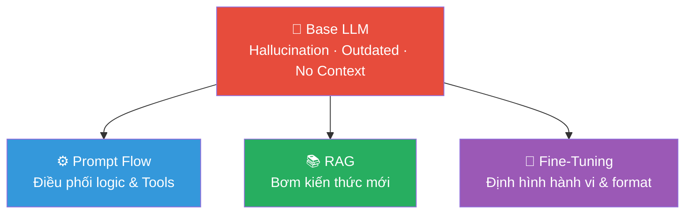
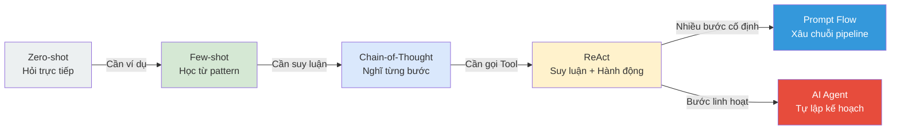
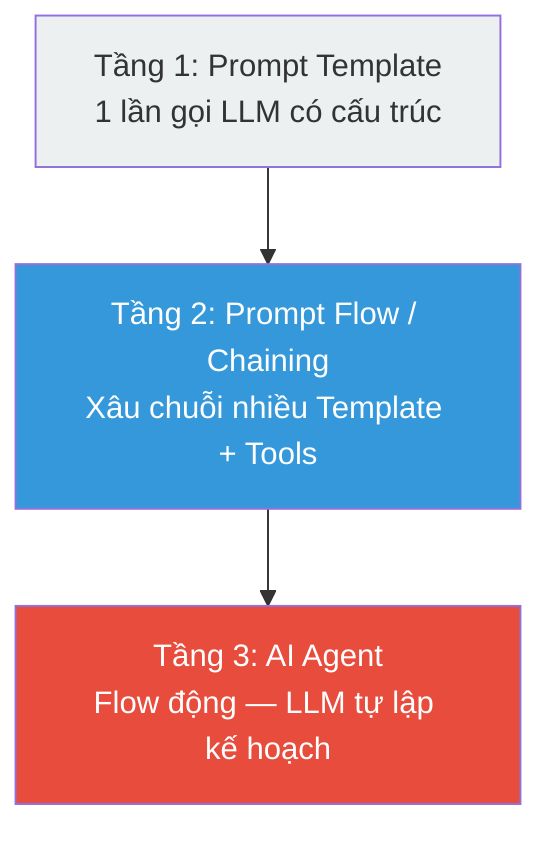
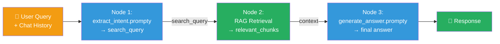
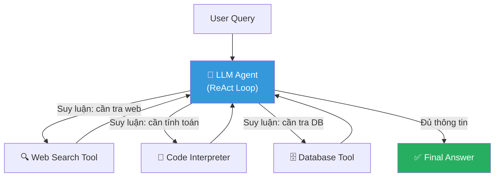
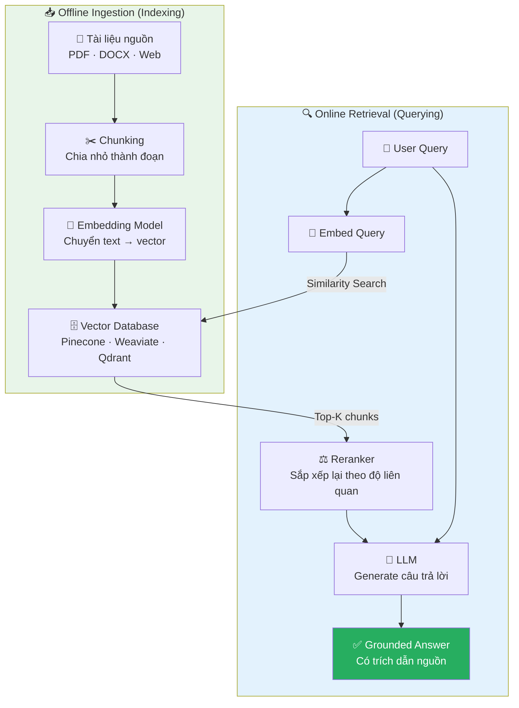
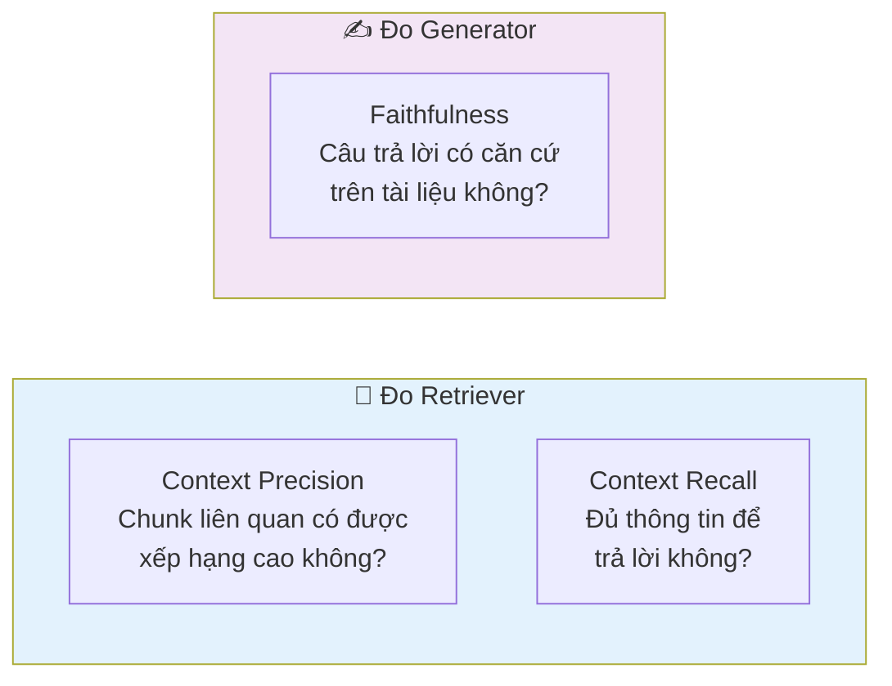
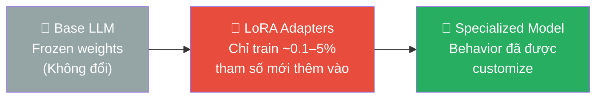
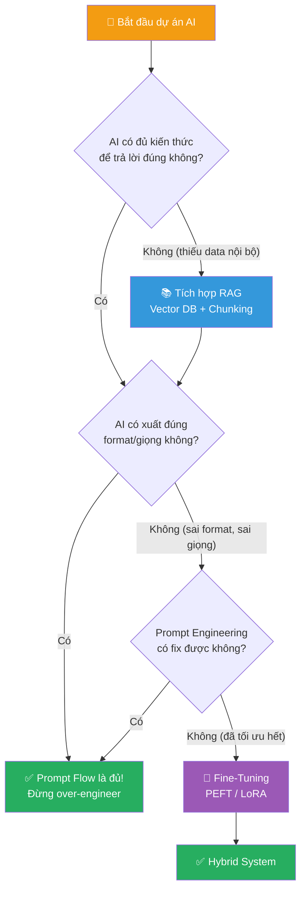
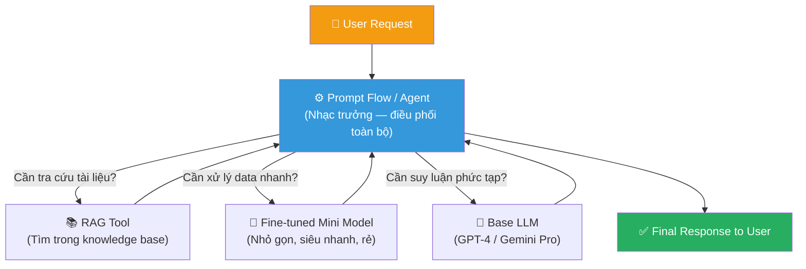

import Tabs from '@theme/Tabs';
import TabItem from '@theme/TabItem';

## Agenda

**Thời gian đọc ước tính:** ~20 phút

### Sau bài này, bạn sẽ:
- **Nắm vững** các kỹ thuật Prompt Engineering cốt lõi: Zero-shot, Few-shot, Chain-of-Thought, ReAct
- **Giải thích** được sự khác biệt cốt lõi giữa Prompt Flow, RAG và Fine-tuning
- **Thiết kế** được kiến trúc RAG pipeline cơ bản cho một dự án thực tế
- **Phân biệt** được khi nào dùng phương pháp nào — và **tại sao** không phải lúc nào cũng cần Fine-tuning
- **Áp dụng** được Decision Tree để ra quyết định kỹ thuật trong dự án thực

### Yêu cầu đầu vào (Prerequisites):
- Biết LLM (Large Language Model) là gì ở mức khái niệm cơ bản
- Đã từng dùng ChatGPT hoặc API của OpenAI/Gemini ít nhất một lần

---

<!-- truncate -->

## Vấn đề & Tại sao cần 3 phương pháp này?

### Nỗi đau của doanh nghiệp khi dùng Base LLM

Khi một công ty triển khai ChatGPT hay Gemini vào sản phẩm, họ gặp ngay 3 vấn đề không thể bỏ qua:

- **Hallucination (Ảo giác):** Model tự tin bịa đặt thông tin — nguy hiểm với bài toán pháp lý, y tế, tài chính.
- **Knowledge Cutoff (Kiến thức lỗi thời):** Model mù tịt về sự kiện xảy ra sau ngày training. Hỏi giá cổ phiếu hôm nay? Không biết.
- **Lack of Context (Thiếu ngữ cảnh nội bộ):** Model không biết quy trình, văn hóa, dữ liệu bảo mật của riêng doanh nghiệp bạn.

### Giải pháp — Bộ ba công cụ can thiệp

:::tip Tưởng tượng
LLM giống như một **Thực tập sinh siêu thông minh nhưng mới ra trường**:
- Cần quy trình làm việc rõ ràng từng bước → **Prompt Flow**
- Cần quyền truy cập vào Wiki/Tài liệu nội bộ để tra cứu → **RAG**
- Cần "Đào tạo" nghiệp vụ & Văn hóa doanh nghiệp 3 tháng → **Fine-Tuning**
:::



---

## Phần 1: Kỹ Thuật Prompt Engineering — Tầng Nền Tảng

### Định nghĩa kỹ thuật

**Prompt Engineering** là nghệ thuật thiết kế đầu vào (input) cho LLM — bao gồm cấu trúc câu hỏi, ví dụ minh họa, và hướng dẫn định dạng — nhằm bộc lộ tối đa năng lực tiềm ẩn của mô hình mà không thay đổi bất kỳ trọng số (weight) nào.

:::note Nguyên lý cốt lõi
LLM không thay đổi — **cách hỏi** thay đổi chất lượng output hoàn toàn. Đây là lớp can thiệp chi phí thấp nhất, triển khai nhanh nhất, và là điểm khởi đầu **bắt buộc** trước khi cân nhắc RAG hay Fine-tuning.
:::

### Các kỹ thuật cốt lõi

#### 1. Zero-shot Prompting

Hỏi thẳng mà không cung cấp ví dụ mẫu. Phù hợp với tác vụ phổ quát mà LLM đã được huấn luyện đủ dữ liệu từ pre-training.

```
Prompt: "Phân loại cảm xúc: Positive, Negative, hay Neutral?
Câu: 'Sản phẩm giao đúng hẹn nhưng đóng gói bị móp.'"

Output: Negative
```

**Giới hạn:** Với tác vụ đặc thù (output JSON theo schema riêng, phân loại theo tiêu chí nội bộ), LLM dễ tự diễn giải sai yêu cầu do thiếu ngữ cảnh.

#### 2. Few-shot Prompting

Cung cấp 3–5 cặp ví dụ (Input → Output) trước câu hỏi thực. LLM học nhận diện pattern từ ví dụ thay vì từ mô tả trừu tượng.

```
Prompt:
"Câu 1: 'Giao hàng nhanh, đúng mô tả.' → Positive
Câu 2: 'Hàng bị lỗi, hỗ trợ phản hồi chậm.' → Negative
Câu 3: 'Giao đúng hẹn nhưng đóng gói bị móp.' → ?"

Output: Negative (với độ chính xác cao hơn đáng kể)
```

:::tip Trade-off với Fine-tuning
Few-shot dùng ví dụ trong context window — hiệu quả tức thì nhưng tốn token mỗi lần gọi API. Fine-tuning "đốt" ví dụ vào trọng số model — chi phí ban đầu cao nhưng prompt về sau ngắn hơn. Đây là trade-off cốt lõi giữa hai kỹ thuật.
:::

#### 3. Chain-of-Thought (CoT) Prompting

Yêu cầu LLM "nghĩ to" từng bước trước khi đưa ra kết luận. Kỹ thuật này khai thác khả năng suy luận (reasoning) tiềm ẩn trong các LLM đủ lớn (≥70B parameters).

```
// Prompt thông thường — dễ sai
"Roger có 5 quả bóng. Mua thêm 2 hộp, mỗi hộp 3 quả. Tổng là?"
→ Output: "5 quả"  ✗

// Prompt CoT — hướng dẫn suy luận từng bước
"Roger có 5 quả bóng. Mua thêm 2 hộp, mỗi hộp 3 quả.
Hãy suy nghĩ từng bước trước khi trả lời. Tổng là?"
→ "2 hộp × 3 = 6 quả mới. 5 + 6 = 11 quả."  ✓
```

:::note Nguồn gốc học thuật
CoT được giới thiệu trong paper *"Chain-of-Thought Prompting Elicits Reasoning in Large Language Models"* (Wei et al., Google Brain, 2022). Kỹ thuật chỉ hiệu quả với model đủ lớn — Small LLM (&lt;7B) không có đủ capacity để "nghĩ to".
:::

#### 4. ReAct (Reason + Act)

ReAct là kỹ thuật kết hợp suy luận (Reasoning) và hành động (Acting) theo vòng lặp: LLM suy nghĩ → gọi tool → quan sát kết quả → suy nghĩ tiếp.

```
Thought:  Tôi cần tỷ giá USD/VND hôm nay để tính.
Action:   search("tỷ giá USD VND 05/05/2026")
Observation: 1 USD = 25,450 VND (nguồn: SBV)

Thought:  Đã có dữ liệu. Tính toán được rồi.
Action:   calculate(1500 * 25450)
Observation: 38,175,000

Answer:   1,500 USD = 38,175,000 VND
```

**ReAct là nền tảng kỹ thuật của AI Agent.** Vòng lặp Thought → Action → Observation chính là cơ chế mà Agent dùng để tự điều hướng qua bài toán phức tạp, không cần pipeline cứng.

### Lộ trình tiến hóa: Từ Prompt đơn đến Hệ thống



### Phân tích Trade-off

| Kỹ thuật | Chi phí Token | Hiệu quả tác vụ phức tạp | Yêu cầu model |
|---|---|---|---|
| **Zero-shot** | Thấp nhất | Thấp | Bất kỳ |
| **Few-shot** | Trung bình | Trung bình–Cao | Bất kỳ |
| **Chain-of-Thought** | Cao (output dài) | Cao | ≥70B params |
| **ReAct** | Cao nhất | Rất cao (đa bước) | ≥70B params |

**Nguyên tắc áp dụng:** Luôn thử Zero-shot trước. Nếu output không đạt, leo thang lên Few-shot → CoT → ReAct theo thứ tự tăng dần độ phức tạp và chi phí.

---

## Phần 2: Prompt Flow

### Làm rõ thuật ngữ: 3 tầng kiến trúc

:::note Điểm nhầm lẫn phổ biến
"Prompt Flow" trong bài không phải là sản phẩm Microsoft Prompt Flow, mà là **khái niệm kỹ thuật** chỉ cách xây dựng pipeline LLM theo 3 tầng. Sản phẩm Microsoft Prompt Flow (Azure AI Foundry) là một **implementation** của khái niệm này.
:::



### Tầng 1: Prompt Template — Đơn vị nguyên tử

Trước khi xâu chuỗi, cần hiểu đơn vị cơ bản nhất: **Prompt Template**. Đây là cấu trúc định nghĩa **một lần gọi LLM** với đầy đủ: model config, system message, few-shot examples, và biến đầu vào.

File `.prompty` (chuẩn của Microsoft Azure AI Foundry) là ví dụ điển hình:

```yaml
# filename: extract_intent.prompty
---
name: Extract Search Intent
description: Phân tích lịch sử hội thoại → trích xuất search query
model:
  api: chat
  configuration:
    azure_deployment: gpt-4o
inputs:
  conversation:
    type: array  # Nhận vào mảng các lượt hội thoại
---
system:
# Nhiệm vụ của bạn
- Đọc conversation history và câu hỏi hiện tại của user.
- Suy luận intent (ý định) của user từ ngữ cảnh hội thoại.
- Trả về search_query dạng JSON để dùng cho bước Retrieval phía sau.

# Few-shot Examples (xem Phần 1 — kỹ thuật Few-shot)
Ví dụ: user hỏi "how much does it cost?" sau khi đã đề cập "trailwalker shoes"
→ {"intent": "giá TrailWalker Shoes", "search_query": "price of TrailWalker Hiking Shoes"}

user:
{{#conversation}}
- {{role}}: {{content}}
{{/conversation}}
```

Giải phẫu file `.prompty`:

| Thành phần | Vai trò | Kỹ thuật Prompt tương ứng |
|---|---|---|
| `model.configuration` | Chọn model & deployment | — (Infrastructure) |
| `inputs` | Khai báo biến đầu vào có type | — (Schema) |
| `system` message | Hướng dẫn hành vi + few-shot | **Few-shot Prompting** (Phần 1) |
| `{{#conversation}}...{{/conversation}}` | Jinja2 template — inject biến động | — (Templating) |

:::tip Nhận xét
File `.prompty` trên là **1 node đơn** trong Prompt Flow — nó đảm nhiệm đúng 1 việc: trích xuất intent. Output của nó (`search_query`) sẽ là input của node RAG Retrieval ở tầng tiếp theo.
:::

### Tầng 2: Prompt Flow / Chaining — Xâu chuỗi nhiều Template

**Prompt Flow (Chaining)** là kỹ thuật kết nối nhiều Prompt Template, công cụ (Tools/APIs), và logic lập trình thành một pipeline. Đầu ra của node này là đầu vào của node kia.



Đây chính là kiến trúc của chatbot RAG đầy đủ — 3 node kết nối nhau, mỗi node là 1 Prompt Template hoặc Tool riêng biệt.

### Tầng 3: AI Agent — Flow động

Như đã trình bày ở **Phần 1**, kỹ thuật **ReAct (Reason + Act)** là nền tảng kỹ thuật của AI Agent. Thay vì bị lập trình viên "ép" theo pipeline cố định (A → B → C), Agent tự suy luận xem bước tiếp theo cần gọi Tool nào — lặp lại vòng Thought → Action → Observation cho đến khi có đủ thông tin để trả lời.

**Sự khác biệt cốt lõi:**
- **Prompt Flow (Static):** Luồng cố định, lập trình viên kiểm soát số bước
- **AI Agent (Dynamic):** LLM tự quyết định số bước và tool sử dụng



**Tools phổ biến trong hệ sinh thái 2025:**
- **LangChain:** Bộ công cụ (component toolkit) — retrievers, document loaders, prompt templates
- **LangGraph:** Orchestration layer có trạng thái (stateful) — hỗ trợ vòng lặp, human-in-the-loop
- **Microsoft Prompt Flow:** Visual flow editor + `.prompty` standard — tích hợp sẵn với Azure AI Foundry

### Phân tích Trade-off

| Tầng | Ưu điểm | Nhược điểm |
|------|---------|------------|
| **Prompt Template** | Đơn giản, dễ test, dễ version control | Chỉ xử lý được 1 tác vụ đơn |
| **Prompt Flow** | Giải quyết bài toán phức tạp có cấu trúc rõ ràng | Cứng nhắc — phải biết trước số bước |
| **AI Agent** | Linh hoạt với bài toán mở | Khó debug, chi phí token cao, khó kiểm soát |

**Khi nào áp dụng:** Bài toán có SOP (quy trình chuẩn) rõ ràng → dùng Prompt Flow. Bài toán mở, không biết trước số bước → dùng Agent.

---

## Phần 3: RAG — Cấp Cho AI Một "Thư Viện" Để Tra Cứu Sự Thật

### Định nghĩa kỹ thuật

**RAG (Retrieval-Augmented Generation)** là kiến trúc kết hợp hai giai đoạn: (1) truy xuất tài liệu liên quan từ knowledge base và (2) đưa tài liệu đó vào context của LLM để generate câu trả lời có cơ sở thực tế.

Giải phẫu từng từ trong tên:
- **R (Retrieval):** Tìm kiếm — user hỏi → hệ thống tìm trong tài liệu nội bộ lấy các đoạn liên quan nhất
- **A (Augmented):** Tăng cường — nhét các đoạn tài liệu đó vào chung với câu hỏi của user
- **G (Generation):** Sinh ra — đưa toàn bộ cho LLM để nó tóm tắt và trả lời dựa trên tài liệu

### Kiến trúc Pipeline RAG đầy đủ



### Ví dụ thực tế: Chatbot HR

**Bài toán:** Xây dựng chatbot cho nhân viên hỏi chính sách công ty (thai sản, phép năm, lương thưởng).

```
User: "Chính sách thai sản của công ty mình là bao nhiêu tuần?"

[Hệ thống RAG]
1. Embed câu hỏi → tìm trong Vector DB
2. Retrieve: ["...nhân viên nữ được nghỉ thai sản 6 tháng theo quy định..."]
3. Augment prompt: "Dựa trên tài liệu sau: [đoạn trích], hãy trả lời..."
4. LLM Generate → trả lời CHÍNH XÁC từ "Sổ tay nhân sự"
```

### Thách thức thực chiến: Bài toán Chunking

:::warning Garbage In, Garbage Out
Kỹ thuật chia nhỏ tài liệu (Chunking) và chất lượng Vector Database **quyết định 80% sự thành bại** của toàn hệ thống RAG.
:::

**Các chiến lược Chunking phổ biến:**

| Chiến lược | Mô tả | Khi nào dùng |
|-----------|-------|-------------|
| **Recursive Character Splitting** | Chia theo ranh giới tự nhiên: đoạn → câu → từ | Starting point tốt cho mọi dự án |
| **Semantic Chunking** | Dùng embedding để phát hiện điểm chuyển chủ đề | Tài liệu dài, đa chủ đề |
| **Document-Specific** | Splitter riêng cho Markdown, HTML, Code | Tài liệu có cấu trúc rõ ràng |

**Thông số tối ưu:**
- **Chunk Size:** 200–500 tokens cho truy vấn thông thường; 500–1000+ cho phân tích phức tạp
- **Overlap:** 10–20% giữa các chunk để tránh mất ngữ cảnh ở ranh giới

### Đo lường hiệu quả RAG: Framework RAGAS



| Metric | Đo gì | Công thức |
|--------|-------|-----------|
| **Faithfulness** | Claim trong response có được context hỗ trợ? | Claims được support / Tổng claims |
| **Context Precision** | Chunk liên quan có xếp hạng cao hơn không liên quan? | Mean Precision at Rank |
| **Context Recall** | Đủ thông tin để trả lời đúng chưa? | Ground-truth claims trong context / Tổng claims |

### ✅ Trade-off

| Điểm mạnh | Điểm yếu |
|-----------|----------|
| Khắc phục Hallucination tốt nhất | GIGO: PDF lộn xộn → AI tìm sai → Trả lời sai |
| Dữ liệu cập nhật real-time (chỉ đổi file) | Latency tăng do bước retrieval |
| Phân quyền bảo mật tốt | Chi phí infrastructure: Vector DB, Embedding model |

**Khi nào áp dụng:** Cần hỏi đáp trên dữ liệu nội bộ khổng lồ, dữ liệu thay đổi liên tục, yêu cầu Fact 100% chính xác và có trích dẫn nguồn.

---

## Phần 4: Fine-Tuning — Thay Đổi "Hành Vi" Tận Gốc

### Định nghĩa kỹ thuật

**Fine-tuning** là quá trình cung cấp cho LLM hàng ngàn cặp ví dụ mẫu (Input/Output pairs) để cập nhật trọng số (weights) của mô hình — khiến nó học một hành vi, phong cách, hoặc định dạng cụ thể.

:::danger Hiểu lầm phổ biến nhất
Fine-tuning **KHÔNG** hiệu quả để nhồi nhét "kiến thức mới". Nó dùng để thay đổi **"hành vi"**, **"giọng văn"**, hoặc **"cấu trúc đầu ra"** (output format).

Muốn AI biết thêm kiến thức → Dùng **RAG**.  
Muốn AI luôn xuất JSON chuẩn → Dùng **Fine-Tuning**.
:::

### Kiến trúc PEFT/LoRA — Cách Fine-tune rẻ tiền hiện nay



**LoRA (Low-Rank Adaptation):** Thay vì train toàn bộ model (100% parameters), LoRA freeze base model và chỉ train một lớp adapter nhỏ (0.1–5% parameters). Kết quả: tiết kiệm 90–95% chi phí compute.

**So sánh Full Fine-tuning vs PEFT/LoRA:**

| Tiêu chí | Full Fine-Tuning | PEFT / LoRA |
|----------|-----------------|-------------|
| **Parameters trained** | 100% | 0.1% – 5% |
| **GPU yêu cầu** | Multi A100/H100 (data center) | RTX 4090 / single GPU |
| **Chi phí train** | $1,000 – $10,000+ | < $100 – $500 |
| **Risk of Forgetting** | Cao (Catastrophic Forgetting) | Thấp (base model frozen) |
| **Phù hợp cho** | Thay đổi core behavior | Style transfer, format output |

### Ví dụ thực tế

**Use case 1: Chuẩn hóa JSON output**
```json
// Mục tiêu: AI luôn trả ra JSON chuẩn để phần mềm khác đọc được
// Training data (1000+ cặp):
{
  "input": "Đơn hàng của tôi #12345 giao ngày nào?",
  "output": {"intent": "ORDER_STATUS", "order_id": "12345", "action": "check_delivery"}
}
```

**Use case 2: Tone & Voice của brand**
```
// Training data: hàng ngàn cặp email mẫu theo đúng phong cách brand
// Input: "Viết email xin lỗi khách hàng về sự cố hệ thống"
// Output: Email với đúng giọng văn, cấu trúc, call-to-action của brand
```

### Chi phí thực sự ở đâu?

:::important Chi phí thực sự không phải Compute
Nhờ PEFT/LoRA, chi phí thuê máy chủ để train hiện nay **rất rẻ**.  
Chi phí khổng lồ thực sự nằm ở **Data Preparation**: thuê chuyên gia domain ngồi tạo, dán nhãn, và kiểm soát chất lượng hàng nghìn cặp dữ liệu mẫu.
:::

### ✅ Trade-off

| Điểm mạnh | Điểm yếu |
|-----------|----------|
| Tối ưu hóa hành vi hoàn hảo | Data Prep tốn kém (con người review) |
| Prompt ngắn → ít token → nhanh & rẻ khi deploy | Phải train lại khi muốn cập nhật behavior |
| Consistent behavior ở quy mô lớn | Không giải quyết được Hallucination |

**Khi nào áp dụng:** Cần định dạng output khắt khe, cần giọng điệu độc bản của brand, hoặc Prompt Engineering đã đạt giới hạn nhưng AI vẫn làm sai.

---

## Phần 5: Ma Trận So Sánh & Đánh Giá Tổng Quan

| Tiêu chí | Prompt Flow / Agents | RAG | Fine-Tuning |
|:---------|:--------------------:|:---:|:-----------:|
| **Mục tiêu cốt lõi** | Điều phối logic & Gọi Tool | Cung cấp **Kiến thức mới** | Định hình **Hành vi & Format** |
| **Xử lý Hallucination** | Giảm nhẹ | ✅ Tốt nhất | ❌ Rất kém |
| **Tài nguyên tốn kém** | Chất xám thiết kế luồng | Kỹ thuật làm sạch & Vector hóa data | Data Preparation (con người) |
| **Độ khó bảo trì** | ✅ Rất dễ (sửa code/prompt) | ✅ Dễ (thêm/xóa tài liệu) | ❌ Khó (phải train lại) |
| **Cập nhật kiến thức** | Không áp dụng | ✅ Real-time | ❌ Cần train lại |
| **Chi phí vận hành** | Thấp nhất | Trung bình (embedding + DB) | Thấp dài hạn (prompt ngắn) |
| **Evaluation Framework** | Test case logic, User Feedback | RAGAS (Faithfulness, Precision, Recall) | Benchmark chuyên ngành |
| **Time to Market** | ✅ Nhanh nhất | Vừa phải | ❌ Chậm nhất |

---

## Phần 6: Cây Ra Quyết Định & Kiến Trúc Thực Chiến

### Decision Tree dành cho kỹ sư



**3 nguyên tắc vàng:**

1. **Luôn bắt đầu với Prompt Flow** để xây MVP nhanh nhất. Đừng làm gì phức tạp nếu prompt giải quyết được.
2. **Tích hợp RAG** khi AI trả lời sai do thiếu thông tin nội bộ hoặc kiến thức outdated.
3. **Cân nhắc Fine-tuning** chỉ khi AI đã có đủ thông tin, nhưng vẫn sai format/giọng điệu, và prompt quá dài gây tốn kém.

### Kiến trúc Hybrid — Enterprise AI thực chiến

Hệ thống AI doanh nghiệp mạnh nhất hiện nay không dùng đơn lẻ một phương pháp. Đó là **sự hội tụ (Hybrid)**:



Trong kiến trúc này:
- **Prompt Flow/Agent** đóng vai **nhạc trưởng** — điều phối toàn bộ flow
- **RAG** được gọi khi cần tra cứu tài liệu nội bộ
- **Fine-tuned model nhỏ** (SLM) được gọi cho các task lặp đi lặp lại (phân loại intent, extract entity) với chi phí rẻ và tốc độ cao

---

## Câu Hỏi Thảo Luận

Sau khi đọc xong bài này, hãy thử suy nghĩ:

1. **Bài toán thực tế:** Bạn được giao xây chatbot hỗ trợ khách hàng cho một ngân hàng. Chatbot cần trả lời về lãi suất vay (thay đổi hàng tuần) và luôn output theo JSON chuẩn. Bạn sẽ kết hợp 3 kỹ thuật như thế nào?

2. **Trade-off phân tích:** Tại sao Fine-tuning lại **không** giải quyết được Hallucination, dù nó "train" model với dữ liệu thực?

3. **Thực chiến:** Nếu chi phí Data Preparation cho Fine-tuning là 100 triệu VNĐ (thuê chuyên gia 3 tháng), và RAG pipeline tốn 10 triệu/tháng infrastructure — khi nào ROI của Fine-tuning sẽ vượt RAG?

---

*Made by Anh Tu - Share to be shared*
