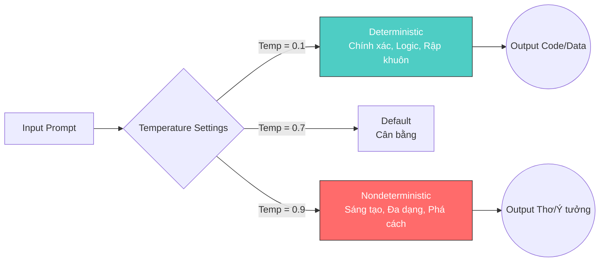

import Term from '@site/src/components/Term';

## 1. Agenda

**Thời gian đọc ước tính:** ~12 phút

### Learning outcome:
- ✅ **Hiểu** được bản chất 7 kỹ thuật Prompt nâng cao (Zero-shot, Few-shot, Chain-of-thought, Generated knowledge, Least-to-most, Self-refine, Maieutic).
- ✅ **Áp dụng** được các kỹ thuật này để giải quyết các bài toán logic hoặc lập trình.
- ✅ **Phân biệt** được khi nào nên sử dụng Self-refine và khi nào dùng Maieutic prompting.
- ✅ **Làm chủ** được tham số Temperature để kiểm soát tính ngẫu nhiên (nondeterministic) của mô hình.

<!-- truncate -->

[](https://youtu.be/BAjzkaCdRok?si=NmUIyRf7-cDgbjtt)

## 2. Glossary & Vocabulary

**2.1. Technical Terms (Thuật ngữ kỹ thuật):**
| Term | Vietnamese Meaning & Quick Explain |
| :--- | :--- |
| **Chain-of-thought** | Chuỗi suy luận: Kỹ thuật hướng dẫn AI giải quyết vấn đề bằng cách bóc tách thành nhiều bước lập luận logic trung gian. |
| **Generated knowledge** | Kiến thức sinh ra/bổ trợ: Kỹ thuật cung cấp thêm dữ kiện thực tế từ nguồn ngoài vào câu lệnh để mô hình có cơ sở trả lời chính xác. |
| **Self-refine** | Tự tinh chỉnh: Yêu cầu mô hình tự đánh giá kết quả của chính nó và đề xuất cách cải thiện. |
| **Maieutic prompting** | Phương pháp Socratic: Đặt câu hỏi đào sâu vào từng phần của câu trả lời để kiểm tra tính nhất quán (consistency) và phát hiện mâu thuẫn. |
| **Temperature** | Nhiệt độ: Tham số điều khiển độ sáng tạo. Giá trị thấp (tiệm cận 0) cho kết quả chính xác, rập khuôn. Giá trị cao (tiệm cận 1) cho kết quả ngẫu nhiên, sáng tạo. |

**2.2. Vocabulary Support (Từ vựng học thuật/B1+):**
| Word | Meaning in Context (Nghĩa trong ngữ cảnh) |
| :--- | :--- |
| **Deterministic (adj)** | Tính chất định trước, luôn cho ra cùng một kết quả với cùng một đầu vào. |
| **Nondeterministic (adj)** | Tính chất phi định trước, có thể ra nhiều kết quả khác nhau với cùng một đầu vào. |
| **Critique (v)** | Phê bình, đánh giá chi tiết (cả điểm tốt và điểm chưa tốt). |
| **Mitigate (v)** | Giảm nhẹ, làm dịu bớt (mức độ nghiêm trọng của vấn đề). |
| **Inconsistencies (n)** | Sự mâu thuẫn, thiếu nhất quán trước sau. |

## 3. Tại sao Prompt đơn giản là chưa đủ? (WHY)

**Vấn đề (Problem Statement):**
1. **Quá rộng và mơ hồ:** Khi yêu cầu mô hình "Tạo 10 câu hỏi địa lý", kết quả trả về có thể không đúng trọng tâm (quốc gia, sông ngòi hay thủ đô?).
2. **Sai lệch logic:** Với các bài toán tính toán hoặc suy luận nhiều bước, mô hình thường trả về kết quả sai nếu chỉ được hỏi đáp án cuối cùng.
3. **Mâu thuẫn thông tin:** Mô hình có thể đưa ra các bước giải pháp trông có vẻ hợp lý nhưng thực chất lại mâu thuẫn với nhau ở các chi tiết nhỏ.

**Giải pháp (Solution):**
Thay vì viết một câu lệnh duy nhất, chúng ta cần sử dụng các kỹ thuật Advanced Prompting. Việc này giống như trang bị thêm các công cụ định hướng, giúp bẻ gãy các vấn đề phức tạp, cung cấp dữ kiện bổ trợ và yêu cầu AI tự kiểm chứng chéo trước khi đưa ra kết quả cuối cùng.

## 4. Các kỹ thuật Advanced Prompting (WHAT & HOW)

### 4.1. Chain-of-thought (Chuỗi suy luận)
Kỹ thuật này hướng dẫn mô hình cách tư duy từng bước thay vì ép nó đoán mò đáp án ngay lập tức.

```text
# filename: chain_of_thought.txt

[Ví dụ mẫu cách giải]
Lisa có 7 quả táo, ném đi 1 quả, cho Bart 4 quả và Bart trả lại 1 quả: 
7 - 1 = 6; 6 - 4 = 2; 2 + 1 = 3.

[Câu hỏi thực tế]
Alice có 5 quả táo, ném đi 3 quả, cho Bob 2 quả và Bob trả lại 1 quả. Alice còn bao nhiêu quả?
```
*Ghi chú (WHY):* Bằng cách trình bày cụ thể quá trình tính toán ở ví dụ mẫu, AI sẽ bắt chước cách suy luận đó để áp dụng vào câu hỏi thực tế, đảm bảo độ chính xác của logic toán học.

### 4.2. Generated knowledge (Kiến thức bổ trợ)
Cung cấp dữ liệu thực tế (thường qua API nội bộ của doanh nghiệp) vào thẳng prompt thông qua các `{{biến}}` (Template).

```text
# filename: generated_knowledge.txt

Công quy bảo hiểm: ACME Insurance
Sản phẩm (chi phí mỗi tháng):
- type: Ô tô, rẻ, cost: 500 USD
- type: Nhà, đắt, cost: 1200 USD

Dựa trên ngân sách và yêu cầu sau, hãy gợi ý sản phẩm phù hợp:
Ngân sách: $1000. Giới hạn loại: Ô tô.
```
*Ghi chú (WHY):* Việc bổ sung các trường thông tin cụ thể (type, cost) giúp mô hình không bị "ảo giác" (hallucinate) ra các gói bảo hiểm không có thực hoặc sai giá.

### 4.3. Least-to-most (Từ nhỏ đến lớn)
Chia nhỏ một bài toán lớn thành nhiều bài toán con và giải quyết theo thứ tự.

```text
# filename: least_to_most.txt

Câu hỏi lớn: "Làm thế nào để thực hiện Data Science trong 5 bước?"
AI trả lời các bước con:
1. Thu thập dữ liệu
2. Làm sạch dữ liệu
3. Phân tích dữ liệu...
```

### 4.4. Self-refine (Tự tinh chỉnh)
Sau khi LLM đưa ra kết quả đầu tiên, bạn yêu cầu nó đóng vai người đánh giá (*critique*) để tìm lỗi và tự viết lại.

```text
# filename: self_refine.txt

Prompt 1: "Viết API bằng Python Flask có route /products."
(AI sinh ra Code V1)

Prompt 2: "Hãy đề xuất 3 điểm có thể cải thiện ở đoạn code trên (về bảo mật, hiệu suất)."
(AI chỉ ra lỗi và viết lại Code V2 tốt hơn).
```
*Ghi chú (WHY):* Mô hình thường sinh ra thứ "có khả năng xuất hiện tiếp theo cao nhất" chứ không hẳn là "chính xác nhất". Self-refine ép mô hình chạy qua một bước kiểm duyệt chất lượng nội bộ.

### 4.5. Maieutic prompting (Phương pháp Socratic)
Đặt câu hỏi truy vấn sâu vào từng phần của câu trả lời để tìm ra mâu thuẫn (Inconsistencies).

```text
# filename: maieutic.txt

AI trả lời: 5 rủi ro của đại dịch là [A, B, C, D, E].
Bạn hỏi tiếp: "Hãy giải thích chi tiết rủi ro A."
(AI giải thích A).
Bạn hỏi chéo: "Trong 5 rủi ro trên, rủi ro nào lớn nhất và tại sao?"
```
*Ghi chú (WHY):* Nếu AI trả lời rủi ro B là lớn nhất (mâu thuẫn với việc ban đầu nó liệt kê A đầu tiên hoặc giải thích A nghiêm trọng hơn), bạn có thể bắt nó sửa lại logic. Kỹ thuật này rất hữu ích cho các chiến lược kinh doanh hoặc lên kế hoạch phức tạp.

## 5. Kiểm soát tính ngẫu nhiên với Temperature

Bản chất của các LLM là *Nondeterministic* (phi định trước). Cùng một câu lệnh có thể sinh ra các đoạn code hoặc văn bản khác nhau.

**Kiến trúc cấu hình Output:**


- **Khi nào dùng Temperature thấp (0.1 - 0.3):** Khi bạn cần sinh mã nguồn (Code), trích xuất dữ liệu JSON, hoặc giải toán. Bạn cần tính chính xác tuyệt đối.
- **Khi nào dùng Temperature cao (0.8 - 1.0):** Khi bạn cần AI viết email marketing, sáng tác thơ, hoặc lên ý tưởng brainstorm (Ideation).

## 6. Câu hỏi thảo luận

1. So sánh sự khác nhau giữa **Self-refine** và **Maieutic prompting**. Trong trường hợp bạn yêu cầu AI viết một bài báo cáo tài chính, bạn sẽ ưu tiên kỹ thuật nào hơn? Tại sao?
2. Kỹ thuật **Generated knowledge** giúp giảm thiểu hiện tượng Fabrication, nhưng điều gì sẽ xảy ra nếu dữ liệu từ API nội bộ (Template) mà bạn cung cấp cho AI đã bị sai lệch từ đầu?
3. Với một hệ thống AI tạo kịch bản phim, bạn sẽ thiết lập tham số **Temperature** là bao nhiêu và tại sao? Việc thiết lập thông số này quá cao có thể dẫn đến hệ lụy gì?

## 7. References
- Dựa trên [Generative AI for Beginners - Microsoft](https://github.com/microsoft/generative-ai-for-beginners/blob/main/05-advanced-prompts/README.md).

---
*Made by Anh Tu - Share to be share*
