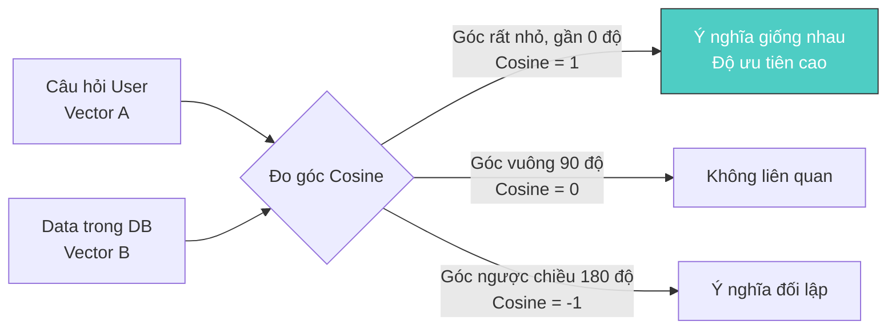

import Term from '@site/src/components/Term';

## 1. Agenda

**Thời gian đọc ước tính:** ~10 phút

### Learning outcome:
- ✅ **Phân biệt** được sự khác nhau giữa Semantic Search (Tìm kiếm ngữ nghĩa) và Keyword Search (Tìm kiếm từ khóa).
- ✅ **Hiểu** được bản chất của Text Embeddings, Vectors và không gian đa chiều (Multidimensional space).
- ✅ **Giải thích** được cơ chế hoạt động của Cosine Similarity trong việc đo lường độ tương đồng ngữ nghĩa.
- ✅ **Nắm bắt** quy trình tạo Embedding Index và lưu trữ bằng Vector Databases.

<!-- truncate -->

[](https://youtu.be/W0-nzXjOjr0?si=GcsqiTTvd7RKbo7V)

## 2. Glossary & Vocabulary

**2.1. Technical Terms (Thuật ngữ kỹ thuật):**
| Term | Vietnamese Meaning & Quick Explain |
| :--- | :--- |
| **Embeddings** | Nhúng dữ liệu: Quá trình chuyển đổi dữ liệu (văn bản, hình ảnh) thành các mảng số thực (vector) để máy tính xử lý. |
| **Vector** | Mảng đa chiều: Một dãy các số thực đại diện cho các đặc trưng (features) của dữ liệu trong không gian toán học. |
| **Semantic Search** | Tìm kiếm ngữ nghĩa: Tìm kiếm dựa trên ý nghĩa thực sự của câu truy vấn thay vì chỉ so khớp từng chữ cái. |
| **Keyword Search** | Tìm kiếm từ khóa: Phương pháp tìm kiếm truyền thống, so khớp trực tiếp chuỗi ký tự. |
| **Cosine Similarity** | Độ tương đồng Cosine: Thuật toán đo lường độ giống nhau giữa hai vector dựa trên góc tạo bởi chúng trong không gian. |
| **Vector Database** | Cơ sở dữ liệu Vector: Hệ quản trị cơ sở dữ liệu chuyên dụng để lưu trữ và truy vấn siêu tốc các vector đặc trưng (Pinecone, Redis, Weaviate...). |

**2.2. Vocabulary Support (Từ vựng học thuật/B1+):**
| Word | Meaning in Context (Nghĩa trong ngữ cảnh) |
| :--- | :--- |
| **Brevity (n)** | Sự ngắn gọn, súc tích (để biểu diễn dữ liệu dễ đọc hơn). |
| **Chunked (v)** | Cắt nhỏ (dữ liệu văn bản lớn thành các đoạn nhỏ). |
| **Overlapping (adj)** | Sự gối đầu, chồng lấn (giữa các đoạn text để giữ ngữ cảnh). |
| **Euclidean distance (n)** | Khoảng cách đường thẳng vật lý giữa 2 điểm. |

## 3. Vấn đề của tìm kiếm truyền thống (WHY)

**Vấn đề (Problem Statement):**
1. **Thiếu khả năng thấu hiểu ngữ cảnh:** Với Keyword Search, nếu bạn tìm từ khóa "xe hơi mơ ước", hệ thống sẽ tìm các bài viết chứa đúng chữ "mơ ước" và "xe hơi", có thể trả về một bài viết về giấc mơ đêm qua thay vì các dòng xe hạng sang bạn muốn mua.
2. **Hạn chế về từ vựng (Synonym problem):** Nếu người dùng tìm "máy tính xách tay" nhưng cơ sở dữ liệu chỉ lưu chữ "laptop", Keyword Search sẽ trả về 0 kết quả.

**Giải pháp (Solution):**
**Semantic Search** kết hợp với **Text Embeddings** giải quyết vấn đề này bằng cách không nhìn vào mặt chữ, mà nhìn vào ý nghĩa. AI sẽ mã hóa câu hỏi của bạn thành các con số (vector) và tìm những tài liệu có bộ con số mang ý nghĩa gần giống nhất, cho dù chúng không có chung bất kỳ từ vựng nào.

## 4. Text Embeddings và Semantic Search (WHAT)

**Định nghĩa Text Embeddings:** Là kỹ thuật trong Xử lý ngôn ngữ tự nhiên (NLP) dùng để chuyển đổi văn bản thành các vector số thực đại diện cho ý nghĩa ngữ nghĩa của đoạn văn bản đó.

**Giải phẫu định nghĩa (Definition Anatomy):**
- **Đại diện ý nghĩa (Semantic representation):** Máy tính không hiểu chữ "Vui", nhưng nó hiểu mảng `[0.9, 0.1, ...]`. Chữ "Hạnh phúc" cũng sẽ có mảng tương tự `[0.85, 0.15, ...]`. Chúng sẽ nằm gần nhau.
- **Không gian đa chiều (Multidimensional space):** Một vector do OpenAI sinh ra thường có 1536 chiều (dimension), mỗi chiều đại diện cho một thuộc tính ngữ nghĩa rất nhỏ mà con người không thể gọi tên cụ thể.

```text
# Trích xuất một đoạn vector rút gọn
"Hôm nay chúng ta học về Azure Machine Learning."
=> [-0.00665, 0.00261, 0.00879, -0.02446, -0.00854, ...]
```

**Sự khác biệt thực tế khi truy vấn (Query):**
[](https://github.com/microsoft/generative-ai-for-beginners/blob/main/08-building-search-applications/images/query-results.png)
*Semantic Search có thể tìm được chính xác đoạn video trả lời câu hỏi "can you use rstudio with azure ml" mà không cần phải so khớp chính xác từng từ.*

**Cơ chế đo lường Cosine Similarity:**


*Lý do dùng Cosine thay vì Euclidean Distance (khoảng cách vật lý):* Cosine đo góc giữa hai vector. Dù đoạn văn A rất dài và đoạn B rất ngắn (khoảng cách Euclidean xa nhau), nhưng nếu chúng đi cùng một hướng ý nghĩa (góc nhỏ), Cosine Similarity vẫn sẽ đánh giá chúng cực kỳ tương đồng.

## 5. Quy trình xây dựng Ứng dụng Tìm kiếm (HOW)

Để tạo ra một hệ thống Semantic Search, chúng ta phải đi qua quy trình tạo **Embedding Index**.

### Bước 1: Chuẩn bị dữ liệu và Chunking
Không thể nhét toàn bộ 1 tiếng video vào 1 vector. Bạn cần chia nhỏ (Chunking).

```python
# filename: chunking_logic.py

def create_chunks(transcript, chunk_size_minutes=3, overlap_words=20):
    # Chia video thành các đoạn 3 phút.
    # Lấy lùi lại 20 từ (overlap) từ đoạn tiếp theo để giữ ngữ cảnh, 
    # tránh việc câu nói bị cắt làm đôi một cách vô nghĩa.
    pass
```
*Ghi chú (WHY):* Chunking giúp giới hạn ngữ cảnh để vector sinh ra tập trung vào một ý chính duy nhất, giúp kết quả tìm kiếm chính xác và sát nghĩa hơn. Overlap giúp các câu nói nằm ở ranh giới cắt không bị mất đi ý nghĩa.

### Bước 2: Sinh Embeddings và lưu trữ
Gửi các đoạn chunk lên API của OpenAI (ví dụ model `text-embedding-ada-002`) để lấy vector.

```json
// filename: embedding_index_3m.json
{
  "speaker": "Seth Juarez",
  "summary": "Giới thiệu về cách sử dụng Azure ML với RStudio...",
  "text_segment": "So today we are going to look at RStudio...",
  "vector": [-0.0123, 0.0456, -0.0789, ...] // 1536 chiều
}
```
*Ghi chú (WHY):* Lưu lại cả Text ban đầu, Summary và Vector. Vector để máy tính thực hiện so khớp toán học (Cosine Similarity). Text ban đầu để hiển thị cho người dùng đọc khi tìm thấy kết quả.

Trong thực tế Production, bạn sẽ không lưu file JSON mà đẩy các vector này vào **Vector Database** (như Azure Cognitive Search, Pinecone, Redis) để hỗ trợ tìm kiếm siêu tốc trên hàng triệu bản ghi.

### Bước 3: Truy vấn (Query)

Khi người dùng đặt câu hỏi, ví dụ: "RStudio có dùng chung với Azure được không?", bạn sẽ:
1. Đem câu hỏi đó đi tạo Vector C.
2. Dùng Cosine Similarity tính góc giữa Vector C và hàng nghìn Vector có trong Vector DB.
3. Lấy Top 3 Vector có góc Cosine nhỏ nhất (độ tương đồng gần bằng 1 nhất).
4. Trả về Text tương ứng với 3 Vector đó.

[](https://github.com/microsoft/generative-ai-for-beginners/blob/main/08-building-search-applications/images/notebook-search.png)

## 6. Câu hỏi thảo luận

1. **Trade-offs:** Mặc dù Semantic Search rất thông minh, nhưng trong trường hợp nào bạn vẫn muốn sử dụng Keyword Search thay vì Semantic Search? (Gợi ý: Tìm kiếm mã đơn hàng, ID người dùng).
2. Tại sao chúng ta lại cần kỹ thuật **Overlapping** khi thực hiện Chunking dữ liệu? Nếu bỏ qua bước Overlap, hệ lụy lớn nhất đối với hệ thống tìm kiếm là gì?
3. Nếu ứng dụng của bạn phải tìm kiếm trên 10 triệu tài liệu, việc dùng Python duyệt qua một file JSON và tính toán Cosine Similarity sẽ gặp vấn đề gì? Tại sao **Vector Database** lại ra đời để giải bài toán này?

## 7. References
- Dựa trên [Generative AI for Beginners - Microsoft](https://github.com/microsoft/generative-ai-for-beginners/blob/main/08-building-search-applications/README.md).

---
*Made by Anh Tu - Share to be share*
