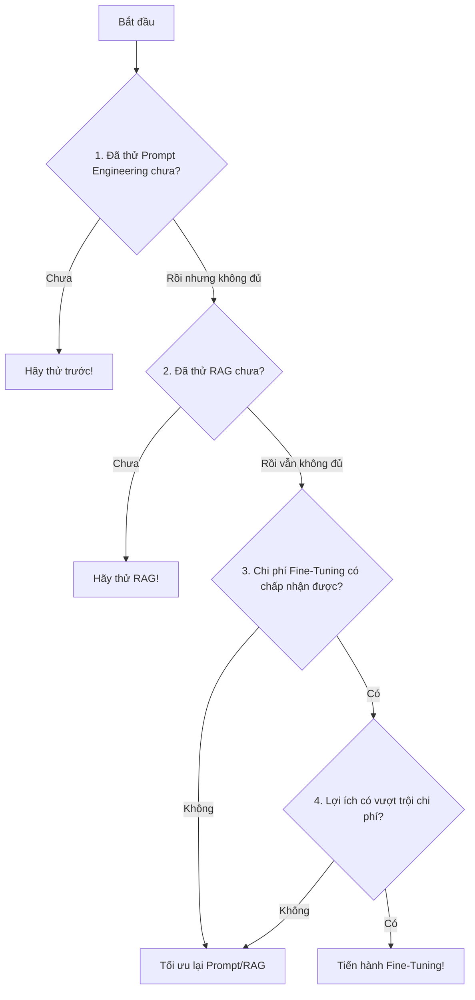

import Term from '@site/src/components/Term';

## 1. Agenda

**Thời gian đọc ước tính:** ~12 phút

### Learning outcome:
- ✅ **Phân biệt** được Fine-Tuning với Prompt Engineering và RAG — biết khi nào dùng cái nào.
- ✅ **Giải thích** được Fine-Tuning hoạt động ra sao dưới góc độ học máy (Supervised vs. Unsupervised).
- ✅ **Áp dụng** được bộ câu hỏi framework để tự ra quyết định "có nên Fine-Tune không?" trước khi tốn tiền.
- ✅ **Biết đến** các công cụ/nền tảng thực hành Fine-Tuning phổ biến nhất hiện nay.

<!-- truncate -->

[](https://youtu.be/6UAwhL9Q-TQ?si=5jJd8yeQsCfJ97em)

## 2. Glossary & Vocabulary

**2.1. Technical Terms (Thuật ngữ kỹ thuật):**
| Term | Vietnamese Meaning & Quick Explain |
| :--- | :--- |
| **Fine-Tuning** | Tinh chỉnh mô hình: Quá trình lấy một LLM đã được huấn luyện sẵn (Pre-trained) và huấn luyện thêm nó bằng một tập dữ liệu nhỏ, chuyên biệt để nó giỏi hơn ở một lĩnh vực cụ thể. |
| **Pre-trained Model** | Mô hình tiền huấn luyện: LLM đã được học trên hàng trăm tỷ từ từ Internet, sẵn sàng được dùng ngay hoặc được Fine-Tune thêm. |
| **Supervised Fine-Tuning** | Tinh chỉnh có giám sát: Fine-Tuning bằng dữ liệu được gán nhãn (cặp Câu hỏi - Câu trả lời mẫu). Đây là phương pháp phổ biến nhất. |
| **Hyperparameters** | Siêu tham số: Các thông số cấu hình thủ công trước khi huấn luyện (ví dụ: learning rate, batch size). |
| **Baseline** | Điểm chuẩn: Kết quả hiệu suất của mô hình gốc (chưa Fine-Tune) dùng để so sánh sau khi tinh chỉnh. |
| **Inference** | Suy luận/Dự đoán: Giai đoạn mô hình đã học xong được đưa vào production để xử lý dữ liệu thực tế. |

**2.2. Vocabulary Support (Từ vựng học thuật/B1+):**
| Word | Meaning in Context (Nghĩa trong ngữ cảnh) |
| :--- | :--- |
| **Curated (adj)** | Được tuyển chọn kỹ lưỡng, chất lượng cao (Dữ liệu Fine-Tuning phải được curated, không dùng dữ liệu rác). |
| **Degrade (v)** | Làm giảm sút hiệu suất (Fine-Tuning sai cách có thể degrade hiệu năng mô hình). |
| **Outweigh (v)** | Vượt trội hơn về mặt giá trị khi so sánh. |
| **Tunability (n)** | Khả năng cho phép người dùng tinh chỉnh — không phải mô hình nào cũng cho phép Fine-Tune. |

## 3. Ba kỹ thuật nâng chất AI — và Fine-Tuning ở đâu? (WHY)

Trong series này, chúng ta đã học 3 cách chính để nâng chất lượng LLM:

| Kỹ thuật | Cơ chế tác động | Tốn kém | Khi nào dùng? |
|---|---|---|---|
| **Prompt Engineering** | Điều chỉnh "lời nói" (input) gửi cho mô hình | Thấp | Thử nghiệm nhanh, không cần dữ liệu |
| **RAG** | Cung cấp thêm "tài liệu tham khảo" khi dùng mô hình | Trung bình | Cần dữ liệu thời gian thực hoặc nội bộ công ty |
| **Fine-Tuning** | **Dạy lại** (re-train) bên trong mô hình bằng dữ liệu mới | Cao | Cần thay đổi phong cách, hành vi hoặc chuyên môn sâu |

**Vấn đề (Problem Statement):**
Prompt Engineering và RAG đều hoạt động bằng cách *thay đổi đầu vào* (Input). Chúng có giới hạn:
- **Token Limits:** Bạn không thể nhét hàng ngàn ví dụ vào một cái Prompt.
- **Chi phí lặp đi lặp lại:** Mỗi lần gọi API bạn đều phải trả tiền cho cả đống ví dụ trong Prompt.

**Giải pháp (Solution):**
Fine-Tuning giải quyết tận gốc bằng cách **dạy kiến thức mới trực tiếp vào trọng số (weights) của mô hình**. Sau khi Fine-Tune, mô hình "thuộc làu" kiến thức chuyên ngành đó mà không cần nhắc nhở thêm trong Prompt nữa.

[](https://github.com/microsoft/generative-ai-for-beginners/blob/main/18-fine-tuning/img/18-fine-tuning-sketchnote.png)
*Infographic tổng quan về vòng đời của Fine-Tuning từ ý tưởng đến triển khai.*

## 4. Fine-Tuning hoạt động như thế nào? (WHAT)

Bài học này tập trung vào **Supervised Fine-Tuning** — phương pháp phổ biến nhất:

```
[Pre-trained Model GPT-4]
         +
[Tập dữ liệu chuyên biệt đã được gán nhãn]
    (Ví dụ: 1000 cặp Câu hỏi pháp lý → Câu trả lời chuẩn)
         ↓
    [Quá trình Fine-Tuning]
         ↓
[Custom Model: GPT-4-LegalExpert]
    → Trả lời pháp lý chính xác hơn
    → Không cần Prompt dài dòng
    → Tiết kiệm chi phí Token
```

*Phân biệt Supervised vs. Unsupervised Fine-Tuning:*
- **Supervised:** Dùng dữ liệu mới, có cặp đánh nhãn (Input → Output mong muốn). Đây là phương pháp phổ biến nhất.
- **Unsupervised:** Huấn luyện lại trên dữ liệu gốc nhưng điều chỉnh hyperparameters. Ít phổ biến hơn.

## 5. Framework ra quyết định: "Có nên Fine-Tune không?" (HOW)

Fine-Tuning là **kỹ thuật nâng cao** và **tốn kém**. Hãy luôn đặt 4 câu hỏi sau trước khi quyết định:



**Chi tiết 4 câu hỏi cần cân nhắc:**

**Câu 1 — Use Case:** Bạn muốn cải thiện điều gì cụ thể? Phong cách viết? Kiến thức chuyên ngành? Định dạng output?

**Câu 2 — Alternatives:** Bạn đã tạo Baseline bằng Prompt Engineering và RAG chưa? Nếu chưa, hãy làm điều đó trước. Fine-Tuning chỉ có ý nghĩa khi bạn đã có con số cụ thể để so sánh.

**Câu 3 — Costs (4 chiều chi phí):**
| Chi phí | Ý nghĩa |
|---|---|
| **Tunability** | Mô hình bạn dùng có cho phép Fine-Tune không? |
| **Effort** | Mất bao lâu để chuẩn bị và gán nhãn dữ liệu chất lượng? |
| **Compute** | Tiền GPU/Cloud để chạy job Fine-Tuning là bao nhiêu? |
| **Data** | Bạn có đủ dữ liệu chất lượng cao không? (Thường cần ít nhất vài trăm đến vài nghìn mẫu) |

**Câu 4 — Benefits (3 chiều lợi ích):**
| Lợi ích | Cách đo lường |
|---|---|
| **Quality** | Mô hình Fine-Tuned có vượt Baseline không? |
| **Cost** | Prompt có ngắn hơn không? Token ít hơn không? |
| **Extensibility** | Mô hình đã Fine-Tune có thể tái sử dụng cho domain khác không? |

## 6. Bản đồ công cụ Fine-Tuning thực chiến

Bất kể bạn dùng Cloud hay Local, đều có công cụ phù hợp:

| Nền tảng | Công cụ | Phù hợp với |
|---|---|---|
| **OpenAI** | [Fine-tune Chat Models](https://github.com/openai/openai-cookbook/blob/main/examples/How_to_finetune_chat_models.ipynb) | Fine-tune `gpt-3.5-turbo` trực tiếp qua API |
| **Azure OpenAI** | [GPT-3.5 Turbo Tutorial](https://learn.microsoft.com/azure/ai-services/openai/tutorials/fine-tune) | Enterprise, bảo mật dữ liệu nội bộ |
| **Hugging Face** | [Fine-tune với TRL](https://www.philschmid.de/fine-tune-llms-in-2024-with-trl) | Open-source model (CodeLlama, Mistral...) |
| **🤗 AutoTrain** | [AutoTrain Advanced](https://github.com/huggingface/autotrain-advanced/) | **No-code**: Không cần viết code, kéo thả trực tiếp |
| **🦥 Unsloth** | [Unsloth](https://github.com/unslothai/unsloth) | Fine-Tuning **cực nhanh, cực ít RAM** — lý tưởng cho máy local |

*Gợi ý cho người mới bắt đầu:* Hãy thử **Unsloth** + Google Colab (miễn phí GPU) để thực hành Fine-Tuning lần đầu mà không mất đồng nào.

## 7. Câu hỏi thảo luận

1. Một startup EdTech muốn AI Chatbot của họ trả lời bằng ngôn ngữ gần gũi, vui vẻ như đang nói chuyện với học sinh cấp 2. Họ nên dùng **Prompt Engineering, RAG, hay Fine-Tuning** cho nhu cầu này? Tại sao?
2. Fine-Tuning không chỉ có lợi mà còn có thể **làm giảm hiệu suất (degrade)** nếu làm sai. Theo bạn, sai lầm phổ biến nhất khi Fine-Tuning là gì? (Gợi ý: Nghĩ đến chất lượng dữ liệu và hiện tượng Catastrophic Forgetting).
3. Giả sử bạn Fine-Tuned thành công GPT-3.5 để trở thành chuyên gia Luật Dân sự Việt Nam, và 1 năm sau Quốc hội ra bộ luật mới hoàn toàn. Bạn sẽ cập nhật kiến thức cho AI theo cách nào? Fine-Tune lại hay dùng RAG? Tại sao?

## 8. References
- Dựa trên [Generative AI for Beginners - Microsoft](https://github.com/microsoft/generative-ai-for-beginners/blob/main/18-fine-tuning/README.md).

---
*Made by Anh Tu - Share to be share*
