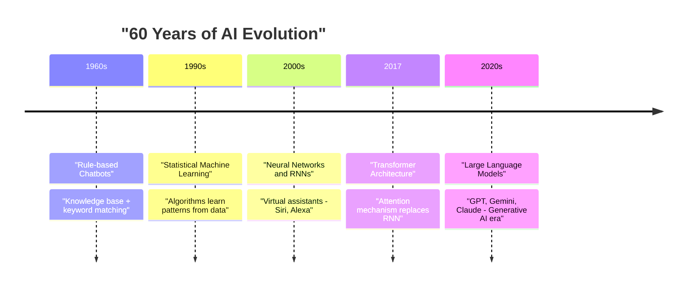
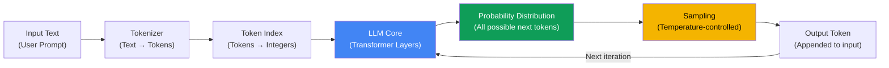
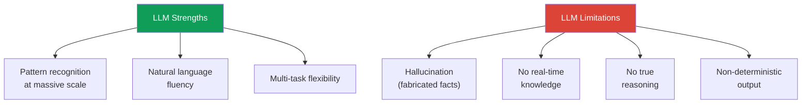

import Term from '@site/src/components/Term';

> **Synthesized from:** [Introduction to Generative AI and Large Language Models](https://github.com/microsoft/generative-ai-for-beginners/blob/main/01-introduction-to-genai/README.md) — Microsoft Generative AI for Beginners (GitHub)
>
> Bài viết được tổng hợp và tái cấu trúc học thuật từ nguồn aha-mind:blog.

<!-- truncate -->

## Agenda

**Estimated reading time:** ~15 minutes

### Learning Outcomes:

- Giải thích được Generative AI là gì và tại sao nó xuất hiện như một tất yếu lịch sử sau 60 năm nghiên cứu AI
- Phân biệt được 4 mốc tiến hóa: Rule-based → Machine Learning → Neural Networks → Generative AI
- Mô tả được cơ chế hoạt động nội tại của LLM: Tokenizer → Token Index → Probability Distribution → Temperature
- Nhận diện được các khả năng thực tế và giới hạn cốt lõi của LLM, đặc biệt là vấn đề hallucination

---

## 1. Glossary and Vocabulary

**1.1. Technical Terms:**

| Term | Vietnamese Meaning and Quick Explain |
| :--- | :--- |
| **Generative AI** | AI tạo sinh — Nhánh AI có khả năng tạo ra nội dung mới (text, ảnh, code) thay vì chỉ phân loại hoặc dự đoán dữ liệu có sẵn. |
| **Large Language Model (LLM)** | Mô hình ngôn ngữ lớn — Mô hình AI được huấn luyện trên lượng dữ liệu văn bản khổng lồ, có khả năng hiểu và tạo ra ngôn ngữ tự nhiên. |
| **Transformer** | Kiến trúc mạng nơ-ron ra đời 2017, thay thế RNN, xử lý toàn bộ chuỗi văn bản song song thay vì tuần tự. Nền tảng của GPT, BERT, Gemini. |
| **Attention Mechanism** | Cơ chế chú ý — Cho phép model tập trung vào các phần quan trọng nhất của input, bất kể vị trí trong chuỗi. |
| **Tokenizer** | Bộ tách token — Chuyển đổi văn bản thành các đơn vị nhỏ (token) rồi ánh xạ thành số để model xử lý. |
| **Temperature** | Tham số điều chỉnh độ ngẫu nhiên của output: thấp = deterministic/nhất quán, cao = creative/đa dạng hơn. |
| **Hallucination** | Hiện tượng LLM tạo ra thông tin sai lệch nhưng trình bày tự tin và trôi chảy như thể đó là sự thật. |
| **Prompt** | Đoạn văn bản đầu vào người dùng cung cấp để hướng dẫn LLM thực hiện một nhiệm vụ. |
| **Completion** | Đoạn văn bản LLM tạo ra để "hoàn thành" prompt — cơ chế cốt lõi của mọi tương tác với LLM. |

**1.2. Vocabulary Support (B1+):**

| Word | Meaning in Context |
| :--- | :--- |
| **Democratize (v)** | Làm cho một công nghệ/dịch vụ trở nên dễ tiếp cận với mọi người, không chỉ chuyên gia. |
| **Leverage (v)** | Tận dụng sức mạnh của một công cụ để đạt kết quả vượt trội. |
| **Non-deterministic (adj)** | Không xác định — cùng input nhưng mỗi lần chạy có thể cho output khác nhau. |
| **Fabrication (n)** | Thông tin giả mạo/bịa đặt được AI tạo ra và trình bày như sự thật. |
| **Equitable (adj)** | Công bằng theo nghĩa phân phối dựa trên nhu cầu, không phải chia đều. |

---

## 2. Problem Statement

### 2.1. Giới hạn của AI trước Generative AI

Trước khi Generative AI xuất hiện, các hệ thống AI truyền thống gặp phải 3 bottleneck nghiêm trọng:

1. **Dependency on expert knowledge bases** — Chatbot thế hệ đầu (1960s-1980s) dựa trên knowledge base được xây dựng thủ công bởi chuyên gia. Không thể scale vì mỗi domain đòi hỏi một team chuyên gia riêng biệt.
2. **Keyword-matching brittleness** — Hệ thống rule-based chỉ trigger khi đúng từ khóa. Câu hỏi tương đương nhưng dùng từ khác là fail hoàn toàn.
3. **Inability to generate novel content** — AI có thể classify, predict, nhưng không thể tạo ra nội dung mới có ý nghĩa. Khoảng cách giữa "AI hiểu ngôn ngữ" và "AI tạo ngôn ngữ" vẫn còn rất lớn.

### 2.2. Generative AI Giải Quyết Gì

Generative AI, đặc biệt là LLMs, giải quyết trực tiếp cả 3 bottleneck trên:

- **Không cần expert curation** — Model học từ dữ liệu raw (books, articles, code) thay vì knowledge base thủ công
- **Hiểu ngữ nghĩa, không phụ thuộc từ khóa** — Attention mechanism giúp model hiểu intent bất kể cách diễn đạt
- **Generate nội dung mới** — Không chỉ classify mà tạo ra text, code, analysis chưa từng xuất hiện trong training data

---

## 3. The 60-Year Evolution: Từ Chatbot đến LLM

[](https://github.com/microsoft/generative-ai-for-beginners/blob/main/01-introduction-to-genai/images/AI-diagram.png)

Generative AI không xuất hiện đột ngột. Đây là kết quả tích lũy của 60+ năm nghiên cứu:



### 3.1. Phase 1 — Rule-based (1960s)

Chatbot đầu tiên (ví dụ ELIZA, 1966) hoạt động theo cơ chế: người dùng gõ input → hệ thống tìm keyword → trả về câu trả lời được hardcode sẵn trong knowledge base.

**Limitation:** Không scale. Mỗi câu hỏi mới đòi hỏi một rule mới được viết thủ công bởi domain expert.

### 3.2. Phase 2 — Machine Learning (1990s)

Thay vì viết rule, engineer cung cấp dữ liệu (text-label pairs) và để algorithm tự học pattern. Model thống kê có thể classify intent của câu hỏi vào các nhóm được định nghĩa trước.

**Limitation:** Vẫn cần labeled data. Output chỉ là classification, không phải text generation.

### 3.3. Phase 3 — Neural Networks và Deep Learning (2000s-2010s)

Neural networks (đặc biệt là Recurrent Neural Networks — RNNs) nâng cao khả năng xử lý ngôn ngữ tự nhiên. RNN có khả năng "nhớ" context của từ trước đó trong câu, đủ để cung cấp năng lượng cho Siri, Alexa, Google Assistant.

**Limitation của RNN:** Vanishing gradient problem — càng xử lý chuỗi dài, model càng "quên" thông tin từ đầu chuỗi.

### 3.4. Phase 4 — Transformer và LLMs (2017 đến nay)

Kiến trúc Transformer (paper "Attention Is All You Need", 2017) phá vỡ giới hạn của RNN bằng cơ chế **attention mechanism**:

> Thay vì xử lý từng token tuần tự, Transformer xử lý toàn bộ chuỗi đồng thời (*in parallel*), và học cách "chú ý" tới những token có liên quan nhất bất kể khoảng cách trong chuỗi.

---

## 4. How LLMs Work: Cơ Chế Nội Tại



### 4.1. Tokenizer — Text thành Số

LLMs là statistical models — chúng không hiểu text trực tiếp, chỉ hiểu số. Tokenizer là cầu nối:

```
Input:  "Generative AI democratizes technology"
Tokens: ["Generative", " AI", " democrat", "izes", " technology"]
Index:  [12345,         23,    45678,        9012,   34567]
```

[](https://github.com/microsoft/generative-ai-for-beginners/blob/main/01-introduction-to-genai/images/tokenizer-example.png)

**Quan trọng:** Token không phải từ. "democratizes" có thể bị tách thành 2 tokens: "democrat" + "izes". Đây là lý do tại sao LLMs đôi khi xử lý sai chính tả — model hoạt động ở cấp độ token, không phải từ ngữ.

### 4.2. Predicting Next Token — Cơ Chế Sinh Văn Bản

LLM không "nghĩ ra" cả đoạn văn cùng lúc. Nó hoạt động theo mô hình **autoregressive**:

1. Nhận n tokens đầu vào
2. Tính **probability distribution** cho tất cả token có thể xuất hiện tiếp theo
3. Chọn 1 token theo distribution đó (có kiểm soát bởi temperature)
4. Append token đó vào input, lặp lại từ bước 1

Đây là lý do ChatGPT đôi khi "dừng giữa câu" — context window bị đầy, hoặc model đánh giá câu đã đủ nghĩa để kết thúc.

### 4.3. Temperature — Điều Chỉnh Sáng Tạo vs. Nhất Quán

| Temperature | Hành vi | Use case |
| :--- | :--- | :--- |
| **0.0 - 0.3** | Gần deterministic, luôn chọn token xác suất cao nhất | Fact extraction, code generation, structured data |
| **0.5 - 0.7** | Cân bằng giữa nhất quán và đa dạng | General-purpose chatbot, summarization |
| **0.8 - 1.5** | Highly creative, unpredictable | Creative writing, brainstorming |

> LLM không hoạt động theo logic deterministic. Cùng một prompt, cùng một model, nhưng temperature khác nhau sẽ cho kết quả hoàn toàn khác nhau.

---

## 5. Practical Capabilities: LLMs Làm Được Gì

Dựa trên cơ chế prompt → completion, LLMs thực hiện được 4 loại task chính:

### 5.1. Summarization và Information Extraction

[](https://github.com/microsoft/generative-ai-for-beginners/blob/main/01-introduction-to-genai/images/summarization-example.png)

Tóm tắt bài báo, báo cáo tài chính, product reviews. Trích xuất thông tin có cấu trúc từ dữ liệu phi cấu trúc.

### 5.2. Creative Generation

[](https://github.com/microsoft/generative-ai-for-beginners/blob/main/01-introduction-to-genai/images/creative-writing-example.png)

Viết bài luận, thiết kế curriculum, tạo case studies cho giáo dục.

### 5.3. Conversational Q&A

[](https://github.com/microsoft/generative-ai-for-beginners/blob/main/01-introduction-to-genai/images/conversation-example.png)

Virtual tutor 24/7 — trả lời câu hỏi của sinh viên theo ngữ cảnh conversation.

### 5.4. Code Generation và Explanation

[](https://github.com/microsoft/generative-ai-for-beginners/blob/main/01-introduction-to-genai/images/coding-example.png)

Generate code từ natural language description, explain existing code, debug support.

---

## 6. Limitations and Trade-offs

Generative AI không phải silver bullet. Đây là các giới hạn cốt lõi cần nhận thức rõ:

### 6.1. Hallucination — Giới Hạn Nghiêm Trọng Nhất

LLM tạo ra thông tin bằng cách tính xác suất token tiếp theo — không phải bằng cách "tra cứu sự thật". Kết quả: model có thể tạo ra:

- References không tồn tại (cite bài báo giả)
- Số liệu sai nhưng trình bày tự tin
- Statements mâu thuẫn nhau trong cùng đoạn text

**Trade-off:** Độ sáng tạo (temperature cao) tỉ lệ thuận với nguy cơ hallucination. Đây không phải bug — đây là cơ chế cốt lõi của model.

### 6.2. Non-determinism

LLM là non-deterministic — không bao giờ trả về cùng output cho cùng input (trừ khi temperature = 0). Đây là vấn đề nghiêm trọng trong các use case yêu cầu tính nhất quán (compliance, legal, financial reporting).

### 6.3. Không Có Critical Reasoning

LLM không có khả năng:
- Kiểm chứng thông tin nó tạo ra
- Nhận biết khi nào nó không biết điều gì
- Áp dụng common sense reasoning trong các tình huống mới hoàn toàn

### 6.4. Knowledge Cutoff

LLM được huấn luyện đến một thời điểm cố định (training cutoff). Không có thông tin nào sau thời điểm đó trừ khi có Retrieval Augmented Generation (RAG) hoặc tool use.



---

## 7. Discussion Questions

1. **Hallucination vs. Creativity** — Temperature cao làm tăng sáng tạo nhưng cũng tăng hallucination. Trong bối cảnh giáo dục (virtual tutor), bạn sẽ set temperature như thế nào? Đánh đổi gì giữa creativity và trustworthiness?

2. **Non-determinism trong Enterprise** — Nếu một công ty muốn dùng LLM để tạo báo cáo tài chính tự động, vấn đề non-deterministic ảnh hưởng như thế nào? Có cách nào giảm thiểu không?

3. **Democratization — Hai Mặt** — Generative AI giúp "dân chủ hóa AI" (ai cũng dùng được). Nhưng khi mọi người đều có thể tạo content tự động, những vấn đề xã hội nào có thể phát sinh? Cân bằng giữa accessibility và accountability như thế nào?

---

## 8. References

| Source | Type | URL |
| :--- | :--- | :--- |
| Microsoft — Generative AI for Beginners, Lesson 01 | Tier 1 (Official Curriculum) | [github.com/microsoft](https://github.com/microsoft/generative-ai-for-beginners/blob/main/01-introduction-to-genai/README.md) |
| Vaswani et al. — "Attention Is All You Need" (2017) | Tier 1 (Research Paper) | [arxiv.org/abs/1706.03762](https://arxiv.org/abs/1706.03762) |
| Wikipedia — Generative Artificial Intelligence | Tier 2 (Reference) | [en.wikipedia.org](https://en.wikipedia.org/wiki/Generative_artificial_intelligence) |

---
*Made by Anh Tu - Share to be share*
