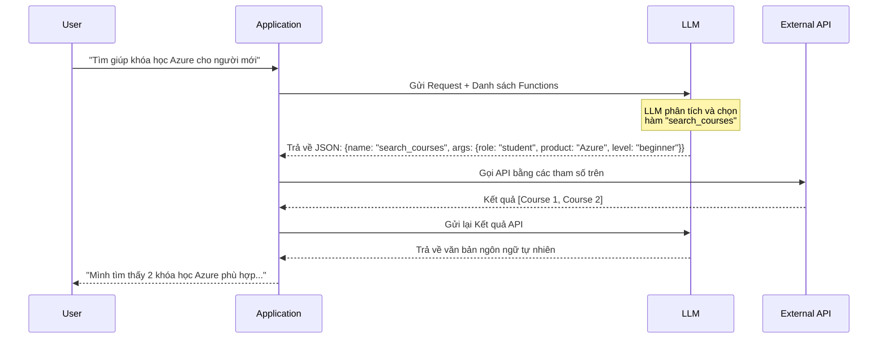

import Term from '@site/src/components/Term';

## 1. Agenda

**Thời gian đọc ước tính:** ~12 phút

### Learning outcome:
- ✅ **Hiểu** được tại sao LLM lại gặp khó khăn trong việc trả về dữ liệu có cấu trúc ổn định.
- ✅ **Giải thích** được cơ chế hoạt động của Function Calling (Luồng tương tác 3 bước).
- ✅ **Áp dụng** được Function Calling bằng thư viện OpenAI để định nghĩa hàm và nhận về JSON chuẩn xác.
- ✅ **Tích hợp** được Function Calling vào hệ thống phần mềm (Gọi API thực tế dựa trên kết quả của LLM).

<!-- truncate -->

[](https://youtu.be/DgUdCLX8qYQ?si=f1ouQU5HQx6F8Gl2)

## 2. Glossary & Vocabulary

**2.1. Technical Terms (Thuật ngữ kỹ thuật):**
| Term | Vietnamese Meaning & Quick Explain |
| :--- | :--- |
| **Function Calling** | Tính năng cho phép LLM tự động nhận diện và mô tả một hàm cần gọi cùng các tham số của nó dựa trên yêu cầu của người dùng, thay vì tự chạy code. |
| **Downstream** | Hệ thống hạ nguồn: Các thành phần hoặc ứng dụng nhận dữ liệu đầu ra từ LLM để xử lý tiếp (ví dụ: Database, API hệ thống). |
| **Tokens** | Đơn vị cơ bản mà LLM sử dụng để xử lý văn bản. Khi định nghĩa Function Calling, phần mô tả hàm cũng tiêu tốn tokens. |
| **Parameters / Arguments** | Tham số (định nghĩa) / Đối số (giá trị thực tế truyền vào hàm). |

**2.2. Vocabulary Support (Từ vựng học thuật/B1+):**
| Word | Meaning in Context (Nghĩa trong ngữ cảnh) |
| :--- | :--- |
| **Unstructured (adj)** | Dữ liệu phi cấu trúc (như đoạn văn bản tự do), rất khó để máy tính xử lý tự động. |
| **Validation (n)** | Xác thực dữ liệu đầu vào. |
| **Enrich (v)** | Làm phong phú dữ liệu (thường bằng cách gọi API bên ngoài để lấy thêm thông tin mới nhất). |
| **Mimic (v)** | Bắt chước, giả lập lại hành vi (ví dụ: giả lập tin nhắn của người dùng trong mảng messages). |

## 3. Tại sao lại cần Function Calling? (WHY)

**Vấn đề (Problem Statement):**
1. **Dữ liệu phi cấu trúc (Unstructured Data):** LLM mặc định sinh ra văn bản tự do. Dù bạn dùng Prompt ép nó sinh JSON, đôi khi nó vẫn trả về định dạng sai hoặc dư thừa (Ví dụ: `"3.7"` vs `"3.7 GPA"`). Điều này khiến hệ thống *downstream* bị crash khi cố gắng `JSON.parse()`.
2. **Thiếu thông tin thực tế (Real-time Data):** LLM bị giới hạn kiến thức tại thời điểm được huấn luyện. Nếu người dùng hỏi "Thời tiết hôm nay thế nào?", nó không thể trả lời nếu không có khả năng kết nối ra ngoài.

**Giải pháp (Solution):**
**Function Calling** ra đời để giải quyết cả hai vấn đề. Bằng cách định nghĩa trước cấu trúc của một hàm số (Function), LLM sẽ không cố gắng viết câu trả lời dài dòng nữa, mà nó sẽ **trả về chính xác các tham số (Arguments) dưới dạng JSON chuẩn** để hệ thống của bạn mang đi chạy thực tế.

[](https://github.com/microsoft/generative-ai-for-beginners/blob/main/11-integrating-with-function-calling/images/Function-Flow.png)

## 4. Cơ chế hoạt động của Function Calling (WHAT)

Function Calling không có nghĩa là LLM tự động chạy Code của bạn. Nó đóng vai trò như một **"Người phiên dịch"**:
- Bạn đưa cho nó câu hỏi của User.
- Bạn đưa cho nó danh sách các Công cụ (Tools/Functions) mà ứng dụng của bạn đang có.
- LLM phân tích câu hỏi, nhận thấy cần phải dùng Công cụ A, nó sẽ trả về thông tin: *"Hãy chạy Công cụ A với Tham số X, Y cho tôi"*.
- Ứng dụng của bạn sẽ tự chạy Công cụ A, lấy kết quả, và gửi lại cho LLM để nó tổng hợp thành câu trả lời cuối cùng.

[](https://github.com/microsoft/generative-ai-for-beginners/blob/main/11-integrating-with-function-calling/images/LLM-Flow.png)

### Sơ đồ luồng xử lý (Flowchart)



## 5. Các bước triển khai Function Calling (HOW)

### Bước 1: Định nghĩa Function (Tạo khuôn mẫu)
Bạn cần khai báo danh sách các hàm để LLM biết ứng dụng của bạn có khả năng làm gì. Mỗi hàm cần mô tả cực kỳ chi tiết.

```python
# Cấu trúc JSON Schema định nghĩa hàm
functions = [
    {
        "name": "search_courses",
        "description": "Tìm kiếm khóa học dựa trên yêu cầu của học viên",
        "parameters": {
            "type": "object",
            "properties": {
                "role": {
                    "type": "string",
                    "description": "Vai trò (vd: student, developer, data scientist)"
                },
                "product": {
                    "type": "string",
                    "description": "Sản phẩm công nghệ (vd: Azure, Power BI)"
                },
                "level": {
                    "type": "string",
                    "description": "Cấp độ (vd: beginner, intermediate, advanced)"
                }
            },
            "required": ["role"]
        }
    }
]
```
*Ghi chú (WHY):* Mô tả (`description`) càng chi tiết, LLM càng dễ dàng trích xuất chính xác tham số từ câu nói lộn xộn của User.

### Bước 2: Gọi LLM lần 1 (Nhận về Arguments)
Gửi mảng `functions` vào hàm gọi LLM. Đặt `function_call="auto"` để LLM tự quyết định có cần gọi hàm hay không.

```python
messages = [{"role": "user", "content": "Tìm khóa học Azure cho người mới bắt đầu (student)."}]

response = client.chat.completions.create(
    model=deployment,
    messages=messages,
    functions=functions,
    function_call="auto"
)

# LLM sẽ trả về đối tượng có chứa function_call
print(response.choices[0].message.function_call)
# Kết quả:
# {
#   "name": "search_courses",
#   "arguments": "{\"role\": \"student\", \"product\": \"Azure\", \"level\": \"beginner\"}"
# }
```

### Bước 3: Thực thi Logic Application
Sau khi LLM trả về JSON, Hệ thống (Application) của bạn sẽ đảm nhiệm việc parse JSON và chạy hàm Python tương ứng.

```python
import json

# Nếu LLM yêu cầu gọi hàm
if response_message.function_call:
    function_name = response_message.function_call.name
    function_args = json.loads(response_message.function_call.arguments)
    
    # Chạy hàm thực tế trong app của bạn
    if function_name == "search_courses":
        # function_args sẽ có: role="student", product="Azure", level="beginner"
        function_response = python_search_courses(**function_args)
```

### Bước 4: Gọi LLM lần 2 (Tổng hợp câu trả lời)
Bạn gán kết quả thực thi của hàm vào mảng `messages` với `role="function"` và gửi lại cho LLM. Lần này LLM sẽ dùng kết quả đó để trả lời mượt mà cho User.

```python
messages.append(
    {
        "role": "function",
        "name": function_name,
        "content": str(function_response) # Dữ liệu API trả về
    }
)

final_response = client.chat.completions.create(
    model=deployment,
    messages=messages
)
```

## 6. Câu hỏi thảo luận

1. Theo bạn, điều gì sẽ xảy ra nếu người dùng hỏi: "Thời tiết hôm nay thế nào?" nhưng trong danh sách `functions` bạn chỉ truyền vào mỗi hàm `search_courses`? LLM sẽ hành xử ra sao khi đặt `function_call="auto"`?
2. Việc thiết kế phần `description` của tham số (Parameters) quan trọng như thế nào đối với độ chính xác của Function Calling? Cho một ví dụ về description tồi và description tốt.
3. Nếu external API trả về một mảng JSON quá lớn (hàng ngàn kết quả), việc nhét toàn bộ nó vào `role="function"` để gửi cho LLM lần 2 sẽ gặp phải vấn đề gì? Cách khắc phục (Error Handling)?

## 7. References
- Dựa trên [Generative AI for Beginners - Microsoft](https://github.com/microsoft/generative-ai-for-beginners/blob/main/11-integrating-with-function-calling/README.md).

---
*Made by Anh Tu - Share to be share*
