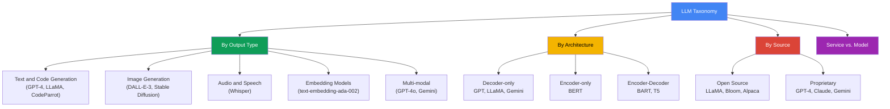
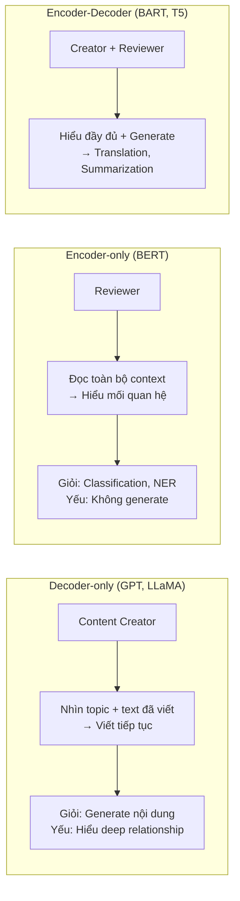
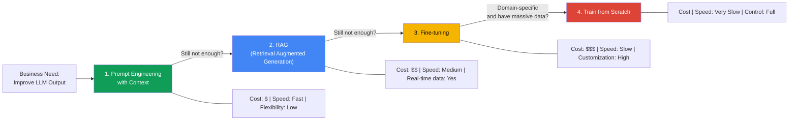
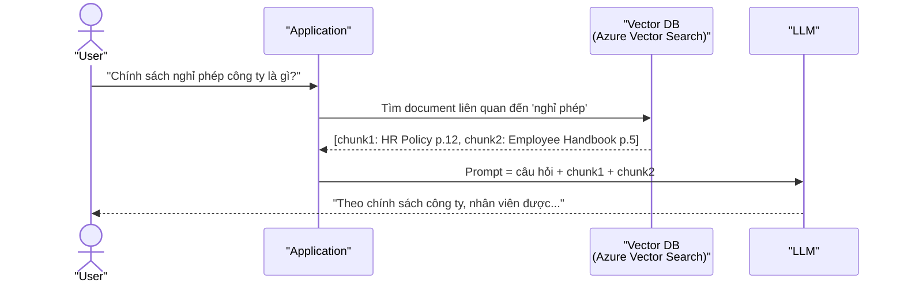

import Term from '@site/src/components/Term';

> **Synthesized from:** [Exploring and Comparing Different LLMs — Microsoft Generative AI for Beginners, Lesson 02](https://github.com/microsoft/generative-ai-for-beginners/blob/main/02-exploring-and-comparing-different-llms/README.md)
>
> Bài viết được tổng hợp và tái cấu trúc học thuật từ nguồn aha-mind:blog.

<!-- truncate -->

## Agenda

**Estimated reading time:** ~18 minutes

### Learning Outcomes:

- Phân loại được LLMs theo 4 chiều: output type, kiến trúc, nguồn gốc, và service vs. model
- Phân biệt được Foundation Model và LLM — khái niệm thường bị dùng lẫn lộn
- Áp dụng được Decision Framework để chọn đúng chiến lược cải thiện LLM: Prompt Engineering, RAG, Fine-tuning, hay Train from scratch
- Đánh giá được trade-offs về chi phí, độ trễ (latency), và chất lượng của từng chiến lược

---

## 1. Glossary and Vocabulary

**1.1. Technical Terms:**

| Term | Vietnamese Meaning and Quick Explain |
| :--- | :--- |
| **Foundation Model** | Mô hình nền tảng — Model được huấn luyện trên dữ liệu khổng lồ, đa phương thức, đóng vai trò "bộ não gốc" để phát triển các ứng dụng chuyên biệt. |
| **Fine-tuning** | Tinh chỉnh — Lấy một model pre-trained rồi huấn luyện thêm với dữ liệu nhỏ, chuyên biệt để model giỏi một tác vụ cụ thể. |
| **Embedding** | Biểu diễn vector — Chuyển văn bản thành dãy số sao cho các khái niệm gần nhau về ngữ nghĩa sẽ có vector gần nhau trong không gian số. |
| **RAG (Retrieval Augmented Generation)** | Kỹ thuật bổ sung dữ liệu ngoài vào prompt của LLM tại thời điểm inference — giải quyết vấn đề knowledge cutoff mà không cần fine-tuning. |
| **Encoder-Decoder** | Kiến trúc 2 thành phần: Encoder nén input thành representation, Decoder giải mã ra output. Phù hợp với translation, summarization. |
| **Decoder-only** | Kiến trúc chỉ có Decoder — tự hồi quy, sinh token tiếp theo dựa trên context. Nền tảng của GPT, LLaMA, Gemini. |
| **Inference** | Giai đoạn model thực sự hoạt động để dự đoán/trả lời sau khi đã được huấn luyện xong. |
| **Latency** | Độ trễ phản hồi — Thời gian từ lúc gửi request đến khi nhận được response đầu tiên. |
| **Ground Truth** | Dữ liệu chuẩn xác tuyệt đối, dùng làm thước đo để đánh giá mô hình dự đoán đúng hay sai. |

**1.2. Vocabulary Support (B1+):**

| Word | Meaning in Context |
| :--- | :--- |
| **Proprietary (adj)** | Độc quyền — thuộc quyền sở hữu của một công ty, không công khai mã nguồn. |
| **Downstream task (n)** | Tác vụ ứng dụng cụ thể (dịch thuật, phân loại...) được xây dựng trên nền Foundation Model. |
| **Surrogate task (n)** | Tác vụ trung gian được dùng để pre-train model trước khi áp dụng vào tác vụ thực sự. |
| **Inpainting (n)** | Kỹ thuật AI vẽ bù/tái tạo vùng bị xóa trên ảnh một cách tự nhiên. |

---

## 2. Problem Statement

### 2.1. Vấn đề: LLM landscape quá rộng, không có one-size-fits-all

Khi triển khai AI cho một ứng dụng thực tế, engineers gặp phải 3 loại quyết định cần đưa ra đồng thời:

1. **Chọn model loại nào?** — Text generation vs. Image generation vs. Embedding vs. Multi-modal? Open-source vs. Proprietary?
2. **Kiến trúc nào phù hợp?** — Encoder-Decoder cho translation, hay Decoder-only cho chatbot?
3. **Cải thiện performance như thế nào?** — Prompt engineering đủ chưa, hay cần RAG, hay phải fine-tune, hay phải train from scratch?

Mỗi quyết định sai đều dẫn đến cost overrun hoặc kết quả kém chất lượng.

### 2.2. Framework Giải Quyết

Bài này cung cấp một taxonomy đầy đủ để phân loại LLMs và một decision framework rõ ràng để chọn chiến lược cải thiện phù hợp với từng use case.

---

## 3. LLM Taxonomy: 4 Chiều Phân Loại

### 3.1. Phân loại theo Output Type

| Output Type | Models tiêu biểu | Use case chính |
| :--- | :--- | :--- |
| **Text and Code** | GPT-4, LLaMA, CodeParrot | Chatbot, summarization, code generation |
| **Image Generation** | DALL-E-3, Stable Diffusion | Thiết kế, content creation |
| **Audio/Speech** | Whisper | Speech-to-text, multilingual transcription |
| **Embedding** | text-embedding-ada-002 | Semantic search, RAG, clustering |
| **Multi-modal** | GPT-4o, Gemini | Kết hợp text + image + audio input/output |

### 3.2. Foundation Model vs. LLM — Không Phải Cùng Khái Niệm

Đây là điểm nhầm lẫn phổ biến nhất trong cộng đồng:

**Foundation Model** (thuật ngữ do Stanford đặt ra, 2021) phải thỏa mãn 3 tiêu chí:

- Được huấn luyện bằng **unsupervised/self-supervised learning** trên dữ liệu đa phương thức, không cần label thủ công
- Kích thước **cực lớn** — hàng tỷ parameters
- Được thiết kế để làm **nền tảng** — các model chuyên biệt được fine-tune từ đây

> **Mối quan hệ:** LLM là một *loại* Foundation Model được tối ưu cho ngôn ngữ. Nhưng Foundation Model rộng hơn — nó bao gồm cả DALL-E (ảnh), Whisper (audio).

**Ví dụ thực tế:** GPT-3.5 là Foundation Model. OpenAI fine-tune GPT-3.5 với dữ liệu hội thoại → tạo ra ChatGPT. ChatGPT là downstream application của Foundation Model GPT-3.5.

### 3.3. Encoder-Decoder vs. Decoder-only — Chọn Kiến Trúc Nào?

**Phép ẩn dụ từ bài gốc:** Hãy tưởng tượng bạn có 2 đồng nghiệp:

| Kiến trúc | Đại diện | Phù hợp với |
| :--- | :--- | :--- |
| **Decoder-only** | GPT-3/4, LLaMA, Gemini | Chatbot, code gen, creative writing |
| **Encoder-only** | BERT, RoBERTa | Text classification, NER, sentiment analysis |
| **Encoder-Decoder** | BART, T5, mT5 | Translation, summarization, question answering |

### 3.4. Open Source vs. Proprietary — Trade-offs Thực Tế

| Tiêu chí | Open Source (LLaMA, Bloom) | Proprietary (GPT-4, Claude) |
| :--- | :--- | :--- |
| **Chi phí ban đầu** | Miễn phí license | Subscription / pay-per-token |
| **Infrastructure** | Tự mua/vận hành GPU | Cloud provider quản lý |
| **Customization** | Full control — inspect, modify, fine-tune | Hạn chế — chỉ qua API |
| **Data Privacy** | Dữ liệu ở local | Phụ thuộc ToS của provider |
| **Performance** | Thường kém hơn SOTA | Thường SOTA, tối ưu production |
| **Long-term support** | Không đảm bảo | SLA có hợp đồng |

### 3.5. Service vs. Model — Không Phải Cùng Thứ

| | Model | Service |
| :--- | :--- | :--- |
| **Là gì?** | Neural network: weights, biases, architecture | Sản phẩm hoàn chỉnh = Model + Infrastructure + API |
| **Ví dụ** | LLaMA weights trên HuggingFace | Azure OpenAI Service |
| **Vận hành** | Tự mua GPU, setup, scale | Cloud provider lo tất cả |
| **Chi phí model** | Miễn phí (nếu open source) | Pay-as-you-go |
| **Chi phí infra** | Tốn kém và phức tạp | Tính vào giá service |

---

## 4. 4 Chiến Lược Cải Thiện LLM Performance

Đây là decision framework quan trọng nhất trong bài. Bốn chiến lược được sắp xếp theo thứ tự **tăng dần về complexity và cost**:

### 4.1. Prompt Engineering with Context — Bắt Đầu Ở Đây

Pre-trained LLMs hoạt động tốt với prompt ngắn (zero-shot). Nhưng càng cung cấp context cụ thể, output càng chính xác:

| Kỹ thuật | Mô tả | Khi nào dùng |
| :--- | :--- | :--- |
| **Zero-shot** | Chỉ câu hỏi, không ví dụ | Tác vụ đơn giản, general knowledge |
| **One-shot** | 1 ví dụ trong prompt | Cần format cụ thể |
| **Few-shot** | 2-5 ví dụ trong prompt | Cần style hoặc format nhất quán |

**Ưu điểm:** Rẻ nhất, nhanh nhất, không cần training.
**Giới hạn:** Bị ràng buộc bởi context window. Không inject được domain knowledge sâu.

### 4.2. RAG (Retrieval Augmented Generation) — Khi Cần Dữ Liệu Ngoài

LLMs có **knowledge cutoff** — không biết gì về sự kiện sau ngày training kết thúc, và không có access vào dữ liệu nội bộ của công ty. RAG giải quyết bằng cách:

**Khi nào dùng RAG:**
- Dữ liệu thay đổi thường xuyên (news, internal docs, product catalog)
- Không đủ tài nguyên/thời gian để fine-tune
- Cần giảm hallucination về dữ liệu nội bộ

**Giới hạn của RAG:** Chất lượng phụ thuộc vào retrieval — nếu vector search trả về chunk sai, LLM sẽ trả lời sai.

### 4.3. Fine-tuning — Khi RAG Chưa Đủ

Fine-tuning tạo ra **model mới** với updated weights. Khác với Prompt Engineering và RAG (không thay đổi model), fine-tuning thực sự thay đổi tham số nội tại của model.

**Dùng fine-tuning khi:**
- Cần latency thấp — model nhỏ đã fine-tune có thể nhanh hơn model lớn với prompt dài
- Có nhiều high-quality labeled data và ground truth labels
- Muốn giảm prompt length (đã inject knowledge vào weights, không cần nhắc lại mỗi lần)
- Muốn thay đổi "style" phản hồi của model (formal, technical, etc.)

**Chi phí:** Cao hơn RAG đáng kể — cần tính toán GPU, thời gian training, và maintain dataset.

### 4.4. Train from Scratch — Chỉ Khi Thực Sự Cần

Huấn luyện LLM từ đầu đòi hỏi:
- Hàng tỷ tokens dữ liệu domain-specific
- Đội ngũ ML Engineers chuyên biệt
- Infrastructure GPU cluster quy mô lớn (nghìn GPU)
- Chi phí từ vài triệu đến hàng trăm triệu USD

> Không có startup hay SME nào nên xem xét option này. Đây là chiến lược dành riêng cho Big Tech (Meta, Google, Microsoft) hoặc các tổ chức có domain cực kỳ đặc thù (y tế, pháp lý, quốc phòng) với nguồn lực tương xứng.

---

## 5. Decision Matrix: Chọn Chiến Lược Nào?

| Tiêu chí | Prompt Eng. | RAG | Fine-tuning | Train from Scratch |
| :--- | :---: | :---: | :---: | :---: |
| **Chi phí** | $ | $$ | $$$ | $$$$ |
| **Thời gian triển khai** | Giờ | Ngày | Tuần | Tháng |
| **Cần labeled data?** | Không | Không | Có | Có (rất nhiều) |
| **Real-time data?** | Không | Có | Không | Không |
| **Thay đổi model weights?** | Không | Không | Có | Có |
| **Phù hợp SME/Startup** | Luôn luôn | Thường | Khi có data | Không |
| **Phù hợp Big Tech** | Baseline | Phổ biến | Phổ biến | Đặc thù |

**Nguyên tắc vàng:** Luôn bắt đầu từ Prompt Engineering → nếu không đủ, thêm RAG → nếu vẫn không đủ, xem xét Fine-tuning. Train from scratch là phương án cuối cùng.

---

## 6. Testing và Iteration — Azure AI Studio Model Catalog

Sau khi xác định được chiến lược, bước tiếp theo là test và iterate. Azure AI Studio cung cấp workflow:

1. **Browse Model Catalog** — Filter theo task, license, provider (Azure OpenAI, HuggingFace...)
2. **Review Model Card** — Training data, intended use, limitations, code samples
3. **Compare Benchmarks** — So sánh metrics trên industry-standard datasets
4. **Fine-tune on Azure** — Upload custom data, track experiments
5. **Deploy** — Managed compute (dedicated) hoặc Serverless API (pay-as-you-go)

> **Lưu ý:** Không phải mọi model trong catalog đều hỗ trợ fine-tuning và pay-as-you-go deployment. Kiểm tra Model Card trước.

---

## 7. Limitations and Trade-offs

1. **Vendor lock-in với Proprietary models** — Phụ thuộc vào pricing policy và roadmap của provider. GPT-3.5 đã bị deprecated, buộc migration.
2. **RAG complexity** — RAG không phải silver bullet. Chất lượng retrieval quyết định chất lượng response. Chunking strategy, embedding model, vector similarity threshold đều ảnh hưởng kết quả.
3. **Fine-tuning data quality** — "Garbage in, garbage out." Fine-tuning với data kém chất lượng tạo ra model kém hơn base model.
4. **Cost of Fine-tuning không chỉ là training** — Phải maintain dataset, retrain định kỳ khi data thay đổi, và manage model versions.
5. **Benchmark ≠ Production performance** — Model score cao trên benchmark chưa chắc hoạt động tốt với dữ liệu thực tế của bạn. Always test trên production-like data.

---

## 8. Discussion Questions

1. **RAG vs. Fine-tuning Decision** — Một công ty fintech muốn LLM có thể trả lời câu hỏi về sản phẩm tài chính của họ (thay đổi mỗi quý). Họ nên chọn RAG hay Fine-tuning? Yếu tố nào là quyết định?

2. **Open Source Trade-offs** — Meta phát hành LLaMA miễn phí. Một startup có thể fine-tune LLaMA cho use case của mình mà không phụ thuộc OpenAI. Nhưng khi mô hình LLaMA bị phát hiện có bias nghiêm trọng, ai chịu trách nhiệm? Provider hay startup đã fine-tune?

3. **Benchmark Inflation** — Nhiều model providers công bố benchmark ấn tượng trên các dataset chuẩn. Tuy nhiên, benchmark này thường được đo trên "public test sets" mà model có thể đã "thấy" trong training data. Điều này ảnh hưởng như thế nào đến quyết định chọn model?

---

## 9. References

| Source | Type | URL |
| :--- | :--- | :--- |
| Microsoft — Generative AI for Beginners, Lesson 02 | Tier 1 (Official Curriculum) | [github.com/microsoft](https://github.com/microsoft/generative-ai-for-beginners/blob/main/02-exploring-and-comparing-different-llms/README.md) |
| Bommasani et al. — "On the Opportunities and Risks of Foundation Models" (Stanford, 2021) | Tier 1 (Research Paper) | [arxiv.org/abs/2108.07258](https://arxiv.org/abs/2108.07258) |
| Fiddler AI — "Four Ways that Enterprises Deploy LLMs" | Tier 2 (Industry Blog) | [fiddler.ai](https://www.fiddler.ai/blog/four-ways-that-enterprises-deploy-llms) |
| Babar M Bhatti — "Essential Guide to Foundation Models and LLMs" | Tier 2 (Technical Blog) | [thebabar.medium.com](https://thebabar.medium.com/essential-guide-to-foundation-models-and-large-language-models-27dab58f7404) |
| Azure AI Studio Model Catalog | Tier 1 (Official Docs) | [learn.microsoft.com](https://learn.microsoft.com/azure/ai-studio/how-to/model-catalog-overview) |

---
*Made by Anh Tu - Share to be share*
